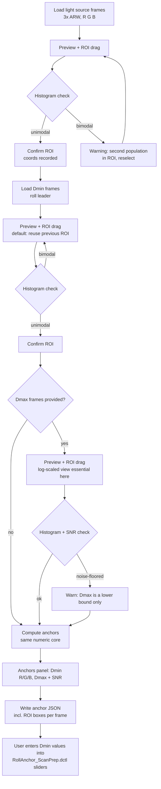

# Film scanner spectral calibration pipeline

A spectral calibration pipeline for a camera-based film scanner comprising a
Sony a7R III and narrowband sequential red, green and blue LEDs at 640, 544 and
450 nm. Narrowband illumination is the only supported mode. The purpose of the
pipeline is to convert raw scanner-space density into standardised, externally
defined density metrics, so that grading in DaVinci Resolve begins from a
metrically defensible quantity rather than from the combined idiosyncrasies of
the scanner and its illuminant.

Three film families are covered. Each is assigned a different target metric,
because each undergoes a different physical process:

- **Reversal / E-6 (Fujichrome Velvia 100/50, Provia 100F; Kodak Ektachrome
  E100/100D)** → D50 white-relative colorimetric density (CIE 1931 2° XYZ).
  No printing step exists in this process, so the target is the transparency
  as an object viewed on a D50 light table.
- **Negative / ECN-2 (Kodak Vision3 50D/200T/250D/500T)** → SMPTE RP 180
  printing density. A printing step does exist, so the target is the appearance
  this negative would produce when printed. ACES/APD (ST 2065-2) is the live
  successor standard and its reference table is held in `data/standards/`, but
  no transform in this repository lands on it.
- **Negative / C-41 (eleven still stocks, Kodak and Fujifilm)** → Status M density,
  followed by RA-4 **print emulation** to Display P3 or P3-PQ. A colour negative
  is designed to be printed, so print emulation is the sole delivery route.
  A "stock" in this document therefore denotes a dye set together with a D-min
  spectrum, that is, the unreacted coloured coupler described in the Glossary.
  It does not denote a tone curve.

Status A appears in exactly one place: the inversion of RA-4 paper
reflection-density curves on the C-41 print path, where it is the correct
standard. It is never used as a reversal target. The reversal target is D50 XYZ.

A collaborator's calibration tool, DiVERE, and their capture setup inform the
apparatus parameters and serve as a reference throughout, although this pipeline
is independently constructed.

## Contents

- [Current status](#current-status) – what is built, and what is not
- [Glossary](#glossary) – terms used throughout, including the orange mask
- [Repository layout](#repository-layout) – every directory and what belongs in it
- [Hard constraints (do not relax these)](#hard-constraints-do-not-relax-these) – the rules the pipeline may not break
- [Source data (`data/`)](#source-data-data) – every input, with its provenance
- [How a transform works](#how-a-transform-works) – the corridor convention and the three node chains
- [Per-roll anchoring](#per-roll-anchoring) – the two density scales, and which one Resolve needs
- [Engines and script reference](#engines-and-script-reference) – how to run each engine, and what it emits
  - [C-41 fleet discrimination gap](#c-41-fleet-discrimination-gap-the-most-important-caveat-in-this-document) – the document's most important caveat, which sits inside that section
- [Roll-anchor GUI](#roll-anchor-gui) – full specification of the measurement tool
- [Current state by stock](#current-state-by-stock) – residuals and build state, stock by stock
- [Bounded systematics register (everything currently known and unpatched)](#bounded-systematics-register-everything-currently-known-and-unpatched) – every effect currently known to be present, with its bound
- [The role of NamiColor in this project](#the-role-of-namicolor-in-this-project) – what it does, and where it must not be placed
- [Invariants](#invariants) – properties that must survive any future change
- [Known limitations](#known-limitations) – what is unverified, unmodelled or unmeasured

## Current status

| | State |
|---|---|
| Reversal | 4 stocks, complete |
| ECN-2 / Vision3 | Cineon PD cube and shaper pair, active |
| C-41 | fleet complete at 11 stocks, each with a print emulation |
| Qualitative use on real film | **passing**: in use, behaving as intended |
| **Quantitative validation** | **none. This is the open gate** |

Two facts qualify every number in this document and should be established
before any of them is relied upon.

1. **The chain functions, although no number within it has been checked against
   a measurement.** The cubes are in regular use on real scans and pass
   qualitative examination: the renders look and behave as intended, and the
   single external check available so far agrees with the model, in that the
   user reports Portra 160 and Portra 400 printing extremely close in a real
   darkroom and the model reproduces that result. **That check has little power
   to discriminate**, and the qualification belongs with it: both stocks are
   fitted against the SAME surrogate basis, their `fit_audit.basis` entries
   being identical, so the model had few ways to make them diverge. What the
   agreement tests is the mask and the characteristic curves, which do differ
   between the two; it does not test the dye model, which is the part in
   doubt. What is absent is
   *quantitative* validation: a grey-ramp exposure series, a ColorChecker frame,
   and spectrally read separation wedges, each compared against reference
   values. Until that roll is exposed and measured, every figure in this
   document is a model reporting on itself, however satisfactory the output
   appears. See Known limitations.
2. **The fleet cannot distinguish every stock from every other.** Basis
   sensitivity is 0.034–0.063 D while inter-stock distances run 0.024–0.220 D,
   so 17 of the 55 pairs sit inside the ambiguity band and cannot be told apart
   by their modelled dye sets. The remaining 38 are separated by more than the
   basis prior can account for. Datasheet-level comparisons are
   basis-independent and do hold; per-stock *rendering* differences largely do
   not. See "C-41 fleet discrimination gap".

### Evidence classes

The `knowledge/` notes rate every outside source A, B or C and record when it
was collected. This document applies the same discipline to its own claims,
because otherwise nothing distinguishes a value somebody read off a chart from
one a model produced or one nobody has ever checked. Four classes are used, and
the load-bearing quantities are classified below.

| class | meaning |
|---|---|
| **measured** | read from a manufacturer's published chart, or computed by running an engine in this repository over that data |
| **derived** | a model output, correct only to the extent its inputs and its model are |
| **assumed** | a choice made without a measurement behind it, which could have been made otherwise |
| **unverified** | asserted, and never checked against anything |

| quantity | class |
|---|---|
| the digitised characteristic curves, spectral dye densities and D-min spectra | measured, with the tracing bounded by register #13 |
| the LED spectral power distributions in `data/equipment/` | measured, on this apparatus |
| the three-dye decomposition and every per-layer curve | derived, and see register #8 |
| the Status M, print and reversal cubes | derived |
| the aggregate fit residual, node-solve residual and serialisation figures | measured, by running the engines |
| the end-to-end error budget | derived, from measured perturbations |
| the surrogate Vision3 basis standing in for C-41 couplers | **assumed** |
| the uniform ±25 nm shift bound and the 0.85–1.15 width bound | **assumed** |
| `DMAX = 3.30`, the negative corridor | **assumed**, with the requirement measured |
| `DIR_MATRIX = identity`, interimage disabled | **assumed** |
| that the scene illuminant survives the chain | **unverified** on film |
| that any part of the C-41 chain matches a physical reference | **unverified**, and this is the open gate |

Per-datum provenance is finer-grained than this table and lives in the data
itself, split by which class the file belongs to. All twelve
`*_datasheet_curves.json` and all ten `*_spectral_sensitivity.json` carry a
`digitization_audit` block naming the source sheet, the device-to-data
transform and the measured support: those files are the measured class. The
eleven C-41 `*_dye_density.json` carry a `fit_audit` block instead, recording
the basis, the bounds, which parameters rest on one, and the multistart that
found the solution: those are the derived class. The reversal and Vision3
`*_dye_density.json` carry neither, their per-layer curves being traced from a
published chart rather than fitted, which is why the reversal path does not
inherit register #8 at all.

## Glossary

Every term below appears without explanation somewhere in this document. They
are grouped by category, because the same letter frequently denotes different
quantities in different contexts.

**Photographic image formation**

| | |
|---|---|
| **Emulsion layer** | one of the three light-sensitive coatings on colour film, sensitised to blue, green or red light respectively |
| **Latent image** | the invisible record left in an emulsion layer by exposure, before development makes it visible |
| **Coupler** | the compound that reacts with oxidised developer during processing to form image dye. The blue-, green- and red-sensitive layers form yellow, magenta and cyan dye respectively |
| **Development** | the processing step that reduces exposed silver halide and, through the coupler reaction, forms dye in proportion to exposure |
| **C-41** | the colour-negative process for still film (Portra, Ektar, Gold, Superia and others) |
| **ECN-2** | Eastman Colour Negative 2, the *motion-picture* negative process (Vision3) |
| **E-6** | the colour-reversal, that is slide or transparency, process (Velvia, Provia, Ektachrome). It develops twice: a black-and-white first developer forms a negative silver image, the remaining halide is then fogged, and a colour developer forms dye where the first developer did not form silver, so the dye image is a POSITIVE. Reversal film carries NO orange mask, because a transparency is viewed directly and a coloured coupler would be visible; interimage is consequently its principal means of correcting unwanted dye absorption (register 11) |
| **RA-4** | the colour process for printing a negative onto photographic PAPER |
| **Orange mask** | a misleading name for a mechanism that involves neither a discrete layer nor a filter. Colour negative film builds its magenta- and cyan-forming chemistry from *coloured couplers*, yellow and pink respectively, which are consumed wherever image dye forms. The orange cast is the coupler that did NOT react, distributed through the emulsion layers. Its absorption is designed to complete the unwanted absorptions of the image dyes, so that dye plus surviving coupler sum to a nearly constant unwanted absorption at every exposure. Two consequences matter here: it is a POSITIVE image, maximal at D-min and falling as exposure rises, and it constitutes half of a correction, so removing it and correcting the film are different operations. Full sourcing in `knowledge/orange-mask-and-the-scanning-workflow.md` (Hanson, JOSA 40(3):166, 1950) |
| **DIR coupler** | Development-Inhibitor-Releasing coupler, the chemistry underlying interimage effects |
| **Interimage / IIE** | the inhibition of one layer's development by a neighbouring layer, which sharpens colour separation. `IIE%` denotes the gamma difference between a colour-separation exposure and a neutral one |

**Density and sensitometry**

| | |
|---|---|
| **OD** | optical density, −log₁₀(transmittance or reflectance). A density of 1.0 transmits one tenth of the incident light |
| **D-min / D-max** | the least and greatest density a film or paper attains. On a negative, D-min is the unexposed base together with the orange mask |
| **H&D curve** | Hurter–Driffield characteristic curve: density plotted against log exposure. Its slope is gamma |
| **logH / logE** | log exposure, the abscissa of the H&D curve. H and E are used interchangeably in the source literature |
| **Status M** | the ISO 5-3 densitometric standard for measuring colour NEGATIVES. C-41 datasheets publish in it, which is why it serves as the negative-side target here |
| **Status A** | the ISO 5-3 standard for reversal material and PRINTS. Used here in exactly one place, the inversion of RA-4 paper curves |
| **RP 180** | SMPTE printing density, the ECN-2 target, expressing the appearance a negative would produce when printed. RP 180-1999 was ARCHIVED by SMPTE in December 2006 and ST 2065-2 (APD) is the live standard; RP 180 is retained here because it publishes an explicit responsivity table, verified against the standard, whereas the label "Cineon printing density" properly denotes a different metric defined by discontinued stocks (5384 print, 5248 base) whose spectral sensitivities were never fully specified. This project's values are RP 180's throughout, notwithstanding the `cineon_pd_engine.py` filename |
| **LAD** | Laboratory Aim Density, a fixed reference density for placing mid-gray |
| **k** | normalised density, `k = OD / DMAX`. This is the domain in which the cubes and the Print Adjustment DCTL operate. Density runs *backwards* with respect to lightness: higher k means a denser negative and therefore a lighter print |
| **DMAX (corridor)** | the density range onto which a cube's 0–1 input domain is mapped: 3.30 for negatives on every sensor, and on the reversal path 5.00 sensor-free or 5.25 for this apparatus's a7R III build. This value is load-bearing, and cube and shapers must agree on it |

**Colour science**

| | |
|---|---|
| **SPD** | spectral power distribution, a light source's power as a function of wavelength |
| **CMF** | colour matching function. CIE 1931 2° is the standard observer used here |
| **D50 / D55 / D65** | CIE daylight illuminants at approximately 5000, 5500 and 6500 K |
| **XYZ** | CIE tristimulus space, the device-independent colour reference |
| **ΔE2000 / ΔE00** | CIE perceptual colour-difference metric. A value near 1.0 corresponds roughly to one just-noticeable difference |
| **a\* / b\* / L\* / Cab\*** | CIELAB axes: red-green, yellow-blue, lightness and chroma. Cab\* ≈ 0 indicates a neutral colour |
| **CAT02 / Bradford** | chromatic-adaptation transforms, used to convert between illuminants |
| **JND** | just-noticeable difference |

**Delivery and the Resolve chain**

| | |
|---|---|
| **LUT / `.cube`** | three-dimensional lookup table, the pipeline's principal deliverable. 65³ denotes 65 nodes per axis |
| **DCTL** | DaVinci Colour Transform Language, in which the hand-written Resolve nodes are implemented |
| **Shaper (pre/post)** | the DCTL pair that maps linear scanner values into and out of a cube's normalised density corridor |
| **P3 / Display P3 / P3-D65** | the wide-gamut display colour space used for delivery |
| **PQ (ST 2084)** | the HDR transfer function. "PQ203" = paper white placed at 203 nits per ITU-R BT.2408 |
| **SDR / HDR** | standard / high dynamic range |
| **DWG** | DaVinci Wide Gamut, Resolve's working space |
| **ACES / APD / IDT / LMT** | the Academy colour system: Academy Printing Density, Input Device Transform, Look Modification Transform |
| **PFE** | print film emulation |
| **CST** | Resolve's Colour Space Transform node |

**Capture and scanning**

| | |
|---|---|
| **Narrowband / trichrome** | three sequential exposures under R/G/B LEDs at 640/544/450 nm, in place of a single white-light exposure. The only supported mode here |
| **CFA** | colour filter array, the Bayer mosaic on the sensor |
| **SSF** | spectral sensitivity function, the sensor's response as a function of wavelength in each of its three channels. It is what the engines actually integrate; the CFA is the physical arrangement that produces it. Held in `data/cameras/` |
| **PDAF** | phase-detect autofocus pixels, which read differently from image pixels and must be rejected |
| **ARW / ARQ / EXR** | Sony single-shot raw file / Sony pixel-shift composite / OpenEXR half-float linear image. The converter also reads Canon CR2 and CR3, Nikon NEF and NRW, and DNG |
| **Pixel shift** | a capture mode that displaces the sensor by one photosite between exposures so that every site records all three colours, removing the need to demosaic. Written by Sony as `.ARQ`; see `raw_to_exr.py` for what the other manufacturers do |
| **ROI** | region of interest, the measured patch within an anchor frame |
| **Roll anchor** | the per-roll D-min measurement that normalises a scan ahead of any cube |
| **Flat field** | correction for uneven illumination across the frame |
| **SNR** | signal-to-noise ratio |

**Analysis and fitting**

| | |
|---|---|
| **RMSE** | root-mean-square error |
| **FWHM** | full width at half maximum, a measure of a curve's width |
| **Gauss-Newton** | the iterative solver used to invert density to dye amounts |
| **Decoupling condition** | the condition number of the LED crosstalk matrix. A value near 1.0 indicates that the three channels are well separated |
| **Basis sensitivity** | the displacement of a fitted result when the assumed dye basis is changed. It is 0.034–0.063 D here, and it bounds every stock comparison |
| **Serialisation RMSE** | the error introduced by writing a cube's floating-point values at six decimal places |
| **MTF** | modulation transfer function, a sharpness chart present on the datasheets but not harvested here |

**Data sources**

| | |
|---|---|
| **IT8 / ColorChecker** | standard reflective colour targets |
| **Munsell / NIST skin** | measured reflectance sets used to fit and test matrices |
| **UEF** | University of Eastern Finland, publisher of the Munsell and Agfa spectral sets |
| **CGATS / ISO 5-3** | the standards bodies and document defining Status A/M responsivities |

## Repository layout

```
data/
  cameras/        camera spectral sensitivity functions, 44 bodies imported
                  from the ACES rawtoaces-data library, plus index.json and a
                  README recording provenance. The engines read one of these
                  only when `--sensor` names a body; the default is none
  equipment/      measured LED SPDs
  films/          per-stock dye density JSONs
  papers/         RA-4 print-paper datasheet JSONs (Endura Premier,
                  Fujicolor Pro Laser TYPE II, Crystal Archive Type CA)
  standards/      Status M, Status A, RP 180 and CIE/D50 reference data, and
                  reflectance/ for the measured reflectance sets
engine/
  common/         shared numerics
    spectral.py                 density, resampling, integration primitives
    pdfchart.py                 vector-path extraction from datasheet PDFs
    interimage.py               interimage-effect analysis helpers
    gamut.py                    projection of unreachable LUT nodes onto the
                                reachable gamut (reversal path only)
  scan/           capture side
    raw_to_exr.py               camera raw scans -> half-float linear EXRs
                                (PRIMARY converter, self-contained, parallel;
                                Resolve does not read float32 TIFF reliably).
                                COLOUR sensors only; holds no monochrome path
    decode_selftest.py          guards on how both converters route a raw
                                file, run with no arguments and no sample
                                files: LibRaw's report is stubbed, so formats
                                this project holds no specimen of are covered
                                too. Exits non-zero on any failure
    mono_to_exr.py              the same, for a sensor with NO colour filter
                                array, native or stripped. Separate program
                                rather than a flag: a stripped array is not
                                distinguishable from an intact one in the file,
                                so the engine chosen IS the declaration.
                                Imports its merge, flat-field and scheduler
                                from raw_to_exr.py, so the two cannot drift
    roll_anchor_gui.py          self-contained per-roll Dmin/Dmax anchor
                                engine: ROI-picker GUI plus its own numeric
                                core, one independent engine
    aces_ssf_import.py          ACES camera SSFs -> data/cameras/
  c41/            still colour negative
    c41_statusm_engine.py       scanner density -> Status M cubes
    portra_decompose.py         aggregate dye curve -> three-dye decomposition
    portra_stocks.py            the eleven-stock registry
    c41_stock_compare.py        inter-stock distance and basis-sensitivity tool
    error_budget.py             propagates every error term into dE2000 on the
                                print output and combines them; read-only
    endura_print_engine.py      C-41 -> RA-4 Endura print emulation
                                (Display P3 / P3-PQ)
    fuji_print_engine.py        C-41 -> RA-4 Fuji Pro Laser TYPE II print
                                emulation, a thin preset over the same
                                PrintEmulationEngine
    portra_digitize.py, portra_digitize_sens.py, fuji_digitize.py,
    endura_digitize.py, fuji_prolaser_digitize.py
                                datasheet tracers -> data/films/, data/papers/
    datasheet_forensics.py, datasheet_paths.py, datasheet_render.py,
    datasheet_overlay.py, paper_overlay.py
                                the four-step digitisation routine
    endura_validate.py, endura_trim_check.py
                                print-branch checks
    render_stage_figure.py      one scan rendered at every stage of the C-41
                                chain -> docs/figures/
  ecn2/           motion-picture negative
    cineon_pd_engine.py         Vision3 negative side (the only route by which
                                the CPD cube is regenerated)
    v3_basis_build.py           the family-average Vision3 dye basis
    v3_dye_digitize.py          per-stock Vision3 dye-density tracer
    v3_datasheet_digitize.py    V3 500T sensitometric-curve raster tracer
    printer_lights_preset.py    datasheet -> per-stock printer-light offsets
    pfe_to_pq.py                2383 PFE LUT: Gamma 2.6 -> P3-D65 PQ (HDR)
  reversal/       slide film
    reversal_transform.py       parameterised engine, all reversal builds
  retired/        superseded, kept for reference only
builds/           engine-generated cubes, plus anchors/ per-roll JSONs and
                  pfe/ HDR print-film-emulation output. _ensemble/ and
                  _forensics/ hold diagnostics and are untracked
dctl/             hand-written DCTLs
  prep/           RollAnchor_ScanPrep.dctl
  shapers/        CPD pair (negative, corridor 3.30), and the 5.0 and 5.25
                  reversal pairs (sensor-free and a7R III respectively)
  output/         10^-D linearisation, XYZ D50 to DWG, printer lights,
                  print adjustment
  retired/        the 4.5 shaper pair, superseded
  dctl_shim.c     compiles a Transform DCTL as plain C to catch parse and
                  arithmetic faults before Resolve sees the file
film_datasheet/   manufacturer film datasheets. Publisher copyright, NOT
paper_datasheet/  redistributed, and gitignored. DATASHEETS.md carries the
                  publication code for each. Restore them to these paths in
                  order to re-run the digitisers
knowledge/        literature notes underlying the modelling decisions, each
                  tier-rated for source quality; README.md indexes them
literature/       third-party journal articles held for reference. Publisher
                  copyright, NOT redistributed, and gitignored in full so that
                  neither the PDFs nor any text extract can reach a publish
docs/             reader-facing documentation, split by the question it answers
  resolve.md      using the tables: capturing and measuring a roll, and the
                  node chain for each of the three processes
  method.md       how the transforms are derived and where their numbers come
                  from, including the film-chemistry background
  explainer.html  visual walkthrough, plotted from the repository's own files
  figures/        rendered figures, regenerated by scripts in engine/
  samples/        the frames shown in README.md
README.md         the front page: what the project provides, sample output,
                  a quick start, and the limitations. Detail is deferred to
                  docs/ and to this document rather than inlined
PROJECT.md        this document, the full technical reference, including
                  engine run instructions and the roll-anchor GUI specification
DATASHEETS.md     every source datasheet, with its publication code
LICENSE           MIT, covering engine/, dctl/ and the documentation
LICENSE-DATA      CC BY 4.0, covering the released cubes and data/, with a
                  scope exception for data/cameras/
```

### Repository hygiene (standing rules)

* **Run `git gc` periodically.** The auto-snapshot convention commits every few
  minutes, so loose objects accumulate rapidly and nothing packs them
  automatically. Left alone, the object store reaches thousands of loose
  objects and zero packs; 1505 loose objects have been observed on this
  repository.
* **Never run `filter-repo` on this repository.** Doing so would rewrite every
  commit hash, and the byte-identical-regeneration guard depends on that
  history.
* **A stale linked worktree constitutes a full second checkout**, `builds/`
  included, at a cost of approximately 100 MB. Verify that
  `git -C <wt> status --porcelain` is empty before removing one, and retain its
  `worktree-*` branch: removing the checkout is lossless only because the
  branch keeps the commits reachable.
* **Diagnostic artifacts are untracked.** `builds/_ensemble/`,
  `builds/_forensics/` and `data/films/_ensemble/` hold basis-sensitivity
  reruns of a stock against deliberately substituted dye bases, and the
  datasheet overlay renders. `.gitignore` marks all three transient. Note that
  `.gitignore` does not untrack retroactively, so a file added before the rule
  existed stays tracked until `git rm --cached` removes it; nine ensemble
  cubes totalling 21 MB were tracked in exactly that way. Removing them from
  the index does NOT shrink `.git`, because the blobs remain reachable in
  history, and nothing is lost from disk in any case:
  `portra_decompose.py --out-suffix` and `datasheet_overlay.py --all`
  regenerate them.

A single engine parameterised by stock and illuminant ensures that a
methodological correction propagates everywhere by construction. This
structurally eliminates the failure mode in which two stocks' build scripts
diverge and one silently overwrites the other's cube. The repository is under
git with auto-snapshots. Builds emit no per-build manifest recording engine
commit and data hashes.

## Hard constraints (do not relax these)

1. **No synthesised spectral shapes.** Never interpolate or extrapolate a dye
   or sensitivity curve into a wavelength region for which no measured data
   exists. Where a gap arises, for example because a datasheet plot ends before
   the support of the target responsivity does, the correct response is to
   document a bounded systematic of known sign in the register below.
   Inventing a plausible tail is prohibited.
2. **Numerical grounding takes precedence over qualitative review.** Every
   claim about accuracy, and every assertion that some effect is negligible,
   must derive from running the actual computation against the actual measured
   data in this repository rather than from plausible reasoning. The
   characteristic failure is a qualitative judgement of negligibility that
   proves wrong once computed over the relevant domain. Systematic #2
   illustrates this: a linear-in-cyan framing makes the cyan truncation appear
   negligible, whereas it in fact reaches 0.24 D in deep shadow.
3. **Validate the artifact as shipped, rather than the in-memory array.**
   `.cube` files are clipped to [0,1] and quantised to six decimal places on
   write. Re-parse the written file and validate that before treating a build
   as complete.
4. **Metric and aesthetic operations remain separated.** Per-channel log-space
   offsets, comprising printer lights, white balance and CC filtration, are
   aesthetic operations and belong in a node *above* the metric transform.
   Folding them into the metric, for instance by adopting a neutral point set
   by eye, corrupts it. This is also the central criticism of NamiColor's
   reversal-mode workflow, discussed below.

5. **No scene-dependent decisions occur anywhere in the chain.** Every
   operation is either a fixed physical constant, such as dye spectra, paper
   H&D curves or Status M responsivities, or a per-roll physical MEASUREMENT,
   namely the anchor. Nothing in the pipeline reads picture content. The two
   normalisations that could have introduced such a dependence are both keyed
   to scene-independent references by construction: the roll anchor to
   unexposed film base, which is light that never formed an image, and the
   gray-axis lock to the stock's own published neutral scale, solved once per
   stock and paper.

   **The practical consequences are as follows.**
   - **The scene illuminant survives into the grade.** A tungsten-lit frame
     remains warm, because no stage in the chain is capable of observing that
     it is warm. What is preserved is the PHOTOGRAPHIC rendering of that
     illuminant, that is, the light as this emulsion and this paper render it.
     It is not a colorimetric measurement of the illuminant, and the stronger
     claim should not be made.
   - **Frame-to-frame relationships across a roll survive.** A per-frame
     automatic neutralisation would erase a changing light across a sequence.
     The only per-roll operation here is a physical measurement, so the change
     remains present.
   - **The property is one-directional in the useful sense.** A cast can be
     removed later in the grade, whereas a cast removed by a content-dependent
     estimator cannot be restored, because the estimate consumed information
     that is no longer present.

   This arrangement is to be maintained. Any future automatic neutralisation,
   automatic exposure or content-driven correction belongs above the metric
   transform, per constraint 4, and never inside it.

## Source data (`data/`)

Equipment (`data/equipment/`):

- `film_scanner_SPD_combined.csv`: measured LED SPDs, 380–780 nm at 1 nm, all
  channels. Contains narrowband R/G/B at multiple drive levels, together with
  broadband white W1–W100 columns that are unused, narrowband being the only
  supported route

Camera spectral sensitivity (`data/cameras/`):

- Forty-four measured camera sensitivity functions, 380–780 nm at 5 nm,
  imported verbatim from the ACES `rawtoaces-data` library by
  `engine/scan/aces_ssf_import.py`. Each file records the source URL, the
  SHA-256 of the upstream document, the measuring laboratory and the creator,
  and the importer re-reads every file it writes through a copy of the
  engines' own reader before reporting success. `index.json` maps the EXIF
  model strings that identify each body. The population is the consumer
  interchangeable-lens Bayer subset of the library: fixed-lens compacts,
  drone and cinema modules and the X-Trans bodies are excluded, the last
  because a 6×6 colour filter pattern has no 2×2 reading. `GROUP_A` in the
  importer is an explicit list, so an addition upstream cannot enter
  unreviewed
- **No engine reads any of these files by default.** `--sensor` selects one;
  its default, `none`, supplies no spectral sensitivity at all. The directory
  exists so that a Bayer camera can be named, and so that register #9 can
  quantify what naming one is worth, measured across the whole population
- This directory is the one part of `data/` that is not CC BY 4.0. The
  upstream library is Apache-2.0, and `LICENSE-DATA` carries the scope
  exception

Per-stock dye density (`data/films/`). Each JSON documents its own
digitisation method, registration audit and known uncertainties:

- `Vision3_dye_density.json`: the Kodak VISION3 shared image-dye set, formed as
  the family average of the four traced stocks. The averaging is load-bearing,
  because a single-stock basis is wrong by up to 0.197 D in cyan at 402 nm,
  across a band carrying 69% of Status M blue responsivity. No
  spektrafilm-sourced data is used anywhere in this project, that data being
  unvalidatable
- `Velvia100_dye_density.json`, `Velvia50_dye_density.json`,
  `Provia100F_dye_density.json`
- `EktachromeE100_dye_density.json`: covers both E100 and 100D/5294-7294. The
  dye data on the two datasheets is identical, which has been verified. The
  source PDFs (Kodak Alaris E-4000 rev. 8-18; Eastman Kodak H-1-5294 rev.
  5-24) are not retained in the repository, and the JSON's provenance metadata
  identifies them should re-verification become necessary

Target-metric standards (`data/standards/`):

- `StatusA_ISO5-3.json`: ISO 5-3:1995 Table 3 Status A responsivities, taken
  from the public ANSI/NAPM IT2.18-1996 copy. Used in exactly one place, the
  inversion of RA-4 paper reflection-density curves on the C-41 print path.
  The provenance note in the Status M JSON records the cross-validation
  lineage
- `CIE1931_2deg_CMFs.json`, the CIE 1931 2° colour-matching functions over
  360–830 nm at 1 nm, and `D50_illuminant.json`, the CIE D50 relative SPD over
  300–780 nm at 5 nm. Both are exported from the official CIE tabulations in
  colour-science 0.4.7 and stored as published; reloading them has been
  verified to reproduce the D50 white point xy (0.3457, 0.3585) and XYZ
  (0.9642, 1.0, 0.8250) exactly. Together they form the target observer and
  illuminant for the colorimetric reversal transform
- `RP180_responsivities.json`: SMPTE RP 180 printing-density responsivities,
  peak-normalised, over 360–730 nm at 10 nm, including the sub-400 nm blue
  tail. Verified identical to the table consumed by `cineon_pd_engine.py`
- `reflectance/`: measured reflectance datasets used for broad-set matrix
  fitting and validation, comprising Munsell glossy 1600 and matt 1269 (UEF,
  via the colour-science Zenodo deposit), Agfa IT8.7/2 289, and NIST human
  skin 100 (Cooksey, Allen and Tsai 2017, per-subject averages). All share a
  common JSON schema with reflectance on 0–1; provenance and resampling notes
  are in the directory's own README.md

## How a transform works

Every transform is a **spectral round-trip**. The scanner SPD multiplied by the
camera's spectral sensitivity, integrated against the stock's measured dye
curves, yields scan density. The same dye state integrated against the target
responsivity, whether CIE D50 XYZ, RP 180 or Status M, yields target density.
The mapping between the two is solved numerically, by Newton or
Levenberg-Marquardt iteration at each node, and shipped as a three-dimensional
LUT. Not every lattice node admits a solution, the domain being a box of
densities of which the dye set reaches only part; the reversal engine
substitutes for the unreachable remainder, as
[`reversal_transform.py`](#reversal_transformpy-building-reversal-cubes-d50-xyz-only)
sets out. The cube is the only transform artifact; no analytic polynomial
DCTL is exported alongside it.

This constitutes a full change-of-observer problem and therefore requires all
four of the following: dye curves, illuminant SPD, camera spectral sensitivity
and target responsivity. Each comes from a different kind of source: the dye
curves are traced from the manufacturer's own published charts, the illuminant
SPD is a measurement of this apparatus, and the target responsivity is a
standard. The sensor term is the one that may legitimately be omitted, and by
default is: a monochrome sensor's response appears in both the numerator and
the denominator of a density measurement and cancels, so the engines integrate
the illuminant alone unless `--sensor` names a body. Register #9 sets out what
that costs and what it is worth.

### Corridor and shaper convention

A preshaper, `d = clamp(-log10(linear), 0, DMAX)/DMAX`, and a postshaper,
`× DMAX`, bracket the cube and convert into and out of the cube's normalised
[0,1] domain. Shapers carry no spectral content, so they are reusable across
any combination of stock and illuminant *that shares the same DMAX*.

**The negative path, Cineon PD and Status M alike, uses DMAX 3.3 on every
sensor. The reversal corridor depends on the sensor**, all builds being at 65³
under narrowband illumination, which is the only supported mode. The negative
path's shaper pair, `CPD Pre-shaper.dctl` and `CPD Postshaper.dctl`, is held in
the repository and must be used only with the CPD cube. On the reversal path a
single pair serves all four stocks at a given corridor: `Preshaper 5.0.dctl`
and `Postshaper 5.0.dctl` for the sensor-free cubes that ship, and the 5.25
pair for the a7R III build. Always check DMAX before reusing a shaper pair.

**The corridor is set by what the stock's densest state actually requires, and
that quantity is measured rather than assumed.** `reversal_transform.py`
evaluates scan density over a neutral dye-4.0 stack and an off-neutral sweep of
the same box, prints the requirement on every build, and warns, naming the
value to use, when the chosen corridor would clip it:

| stock | sensor-free | through the a7R III |
|---|---|---|
| Velvia 100 | 3.88 | 3.95 |
| Ektachrome E100 | 4.25 | 4.28 |
| Provia 100F | 4.60 | **5.08** |
| Velvia 50 | **4.75** | 4.91 |

Hence 5.00 sensor-free and 5.25 for this apparatus. **5.25 is a property of one
camera and not a general Bayer constant**, since a colour filter band-limits the
illuminant's spectral tails by an amount particular to that filter; another body
must have its corridor determined the same way.

**Corridor and LUT size are not independent parameters.** Node spacing is
`dmax/(size-1)` and trilinear error scales as the square of spacing, which has
been confirmed by measurement: moving from 4.5 to 6.0 at 33³ raises error by a
factor of 1.78 against 1.78 predicted. A corridor larger than the stock
requires therefore degrades accuracy everywhere for nothing. At a 6.0 corridor
the a7R III reversal builds measure RMSE 0.0004 D with a maximum of 0.0012 D
and reach 58–62% of it; at 5.25 they measure **0.0003 D and 0.0009 D** and
reach 68–73%. For
reference, a 4.5 corridor is overrun by two stocks even sensor-free, and gave
0.0009–0.0010 D with a maximum of 0.003 D at 33³.

**Two different numbers are both called a serialisation check, and only one of
them is an accuracy figure.** Comparing the written cube against the in-memory
lattice NODE FOR NODE measures the six-decimal write rounding and nothing else:
it is pinned at the quantisation floor of 2.9e-07 and cannot report any error
the engine makes. What a user meets is the value BETWEEN nodes, so the figure
that matters interpolates the artifact read back from disk at off-lattice
points, which is what hard constraint 3 asks for. Every engine now prints both,
labelled. On the print branch the gap is four orders of magnitude: Portra 400 to
Endura serialises at 2.6e-07 by node quantisation and carries an interpolation
RMSE of 2.2e-03 with a worst case of 5.9e-02, that is 15 code values out of 255,
and its PQ pair 4.3e-03 with a worst case of 1.4e-01. Those are the print
branch's real lattice accuracy, and they are the largest such error in the
chain.

**The negative corridor carries deliberate headroom, and the probe does not
cover it.** `DMAX = 3.30` is uniform across the eleven stocks, while their
published maxima need between 1.69 D of scan density (Gold 200) and 2.16 D
(Pro Image 100), so the corridor holds 53% to 96% more than any datasheet
documents and no stock comes close to overrunning it. That margin is a choice
rather than an error, real film being exposed past the end of its published
characteristic curve, and the engine now reports the requirement per stock so
the choice is at least informed.

**Tightening it was evaluated and rejected, on measurement.** Rebuilding
Portra 400 at 3.30, 3.00, 2.80, 2.60 and 2.40 and probing each over the SAME
physical density range separates two effects that the squared-spacing law alone
does not.

On the Status M cube the law holds: maximum error over the working dye range
falls from 0.0028 D at 3.30 to 0.0012 D at 2.40, a factor of 2.3 against 1.9
predicted. On the print cubes it does not hold at all. Measured over a fixed
0 to 2.16 D input, the interpolation error is flat across every corridor tried,
RMSE 2.3 to 3.1e-03 and maximum 7.3 to 8.0e-02, with no trend. The print
lattice's error is dominated by the Display-P3 gamut clip, which is a kink no
node spacing resolves, rather than by smooth-curve interpolation – consistent
with a quarter to a third of that lattice sitting outside P3 before clipping.

That settles it, because **print emulation is the sole C-41 delivery route**.
The corridor change improves only the intermediate artifact, whose 0.0028 D
maximum is already one to two orders below the 0.034 to 0.063 D basis
sensitivity that bounds every claim about these stocks, and leaves the delivered
number untouched.

The cost side is not small either. Real negatives are routinely overexposed one
to two stops by intent, and a 2.40 corridor leaves only 0.9 stop of headroom
beyond the published curve on Ektar 100 and Fujicolor 100, 1.1 on Portra 400.
Even 2.60 leaves under two stops on those three. Only 3.00 and above keeps every
stock past three stops. And `DMAX` is load-bearing in four places that must
agree exactly – both C-41 engines and both CPD shaper DCTLs – so a change
silently corrupts any node graph whose shaper was not updated with it.

The corridor therefore stays at 3.30: the accuracy it would buy is invisible
beneath a larger uncertainty, on a cube that is not the deliverable, and it
would be paid for in clipped highlights and a breaking change to every user's
node graph. The cost is visible in the same build: the
accuracy probe over the working dye range reaches 2.18 D, two thirds of the
corridor, and reports RMSE 0.0002 D with a maximum of 0.0028; probed over the
whole declared corridor it reports 0.0013 D and 0.0407. Both are printed, so a
reader can see which domain a quoted figure covers.

Underlying all of this is the fact that narrowband scan density exceeds the
film's Status A density, because the LEDs sit on the dye peaks. Velvia 50 scan
red reaches 4.08 D at a 3.5 D Status A neutral and 4.42 D at 3.6 D, and a 4.0
corridor clips Velvia 100's scan red by 0.17 D at a 3.5 D neutral. A corridor
must never be inferred from the film's physical Dmax.

### Resolve node chain (reversal path)

```
scan prep (linear; dctl/prep/RollAnchor_ScanPrep.dctl – per-roll Dmin
           anchoring; paste the EXR-SCALE Dmin R/G/B)
  → dctl/shapers/Preshaper 5.0.dctl (5.25 for a camera-named build; the 4.5
           and 6.0 pairs in dctl/retired/ serve older cubes only)
  → cube (own node, tetrahedral interpolation; 65^3)
  → dctl/shapers/Postshaper 5.0.dctl (or 5.25, matching the preshaper)
  → dctl/output/Density to Linear.dctl (the 10^-D view/linearisation node)
  → dctl/output/XYZ D50 to DWG.dctl (explicit 3×3; a Resolve CST cannot
           substitute, because the cube emits WHITE-RELATIVE XYZ)
  → aesthetic offsets (after the matrix node, never on XYZ channels)
  → display transform
```

Every node between the preshaper and the linearisation node displays as
inverted or negative-looking. This is expected behaviour rather than a fault,
because the image is in density space at that point and has not been rendered.
The linearisation node performs correctly the operation that NamiColor's
Negatives mode performs incorrectly in this position, as discussed below.

### Resolve node chain (ECN-2/Vision3 path)

```
scan prep (linear; dctl/prep/RollAnchor_ScanPrep.dctl – paste the roll's
           EXR-SCALE Dmin R/G/B, see "Two density scales" below)
  → dctl/shapers/CPD Pre-shaper.dctl (VALUE_BOXes at 1.0 – anchored upstream)
  → builds/ecn2/Vision3 to Cineon PD.cube  (scanner density → RP 180 printing density)
  → dctl/shapers/CPD Postshaper.dctl with Encode ON (normalised Cineon CV out)
  → dctl/output/Printer Lights Cineon.dctl (aesthetic per-channel density trims;
           a raw Cineon decode always needs printer lights – start from the
           stock's datasheet preset in the DCTL header, trim per scene on top)
  → DISPLAY / DELIVERY transform (consumes the Cineon Log signal), either:
       • CST (Cineon Film Log → timeline space; performs the negative decode) → grade
       • builds/pfe/…PQ dw203nit.cube (2383 print emulation straight to P3-D65 PQ;
         HDR-delivery path, see "HDR delivery via 2383 print emulation" below)
```

Density-space stages of a NEGATIVE display positive tonality in the viewer,
because density is high where the scene was bright. The reversal chain's note
about a negative-looking display therefore does not apply here. Do NOT use
Density to Linear.dctl in this path, since 10^-D of negative printing density
returns the negative's transmission. The Cineon CST performs the decode.

**Printer-light presets derived from datasheets.** These are stock-dependent
and roll-independent. `engine/ecn2/v3_datasheet_digitize.py` digitises the
V3 500T sensitometric curves from `film_datasheet/V3 500T.pdf`. A raster trace
is required here, because this PDF embeds the figure as a bitmap whereas the
Portra curves are vector artwork; the tracer uses frame-edge axis calibration,
a three-run column scan and continuity recovery past the legend text, and its
audit records 96.6% coverage, dmin values of B 0.847, G 0.590 and R 0.198, and
monotonicity. The result is written to
`data/films/V3500T_datasheet_curves.json`. The figure's Camera Stops axis pins
mid-gray without recourse to LAD estimation: stop 0 corresponds to gray-card
normal exposure, at logH = −4.0 + 8·log10(2).
`engine/ecn2/printer_lights_preset.py` then reads the stop-0 base-relative
Status M triplet, inverts it to dye amounts with a residual of 0.000000 D,
propagates it forward through RP 180, and emits the offsets that equalise the
printing-density triplet into `builds/ecn2/V3500T_printer_lights.json` and the
DCTL header. The V3 500T preset, expressed zero-mean, is R +0.028, G −0.077,
B +0.049, and is stable to ±0.04 D across ±1 stop of mid-gray choice. The
preset assumes the datasheet illuminant, which is tungsten for 500T. The first
roll's daylight-without-85 wall balance, G −0.323 and B +0.070 referenced to
R, differs from the preset value of G −0.106 and B +0.021 referenced to R by
the expected illuminant-mismatch trim, which remains a per-scene grading
operation applied on top of the preset.

**HDR delivery via 2383 print emulation.** A stock Kodak 2383
print-film-emulation LUT serves as the display transform for the print-look HDR
deliverable: `builds/pfe/DCI-P3 Kodak 2383 D65 PQ dw203nit.cube`, taking Cineon
Log in and producing DCI-P3 / Gamma 2.6 / D65 out at 33³. It remains at 33³
because it is a stock third-party LUT rather than an engine-generated one. It
consumes the same Cineon Log signal that the generic decode CST would consume,
namely the CPD postshaper output with Encode ON, so it substitutes for the
Cineon-to-timeline CST. It is never placed on top of that CST.

Its native output is Gamma 2.6, DCI-referenced at 48 nits. Passing that to a
naïve Gamma 2.6 to ST2084 CST produces an over-bright and over-contrasty
result, because PQ is an absolute encoding, Gamma 2.6 carries no nit anchor,
and the CST therefore stretches the film's reference white toward PQ's
10000-nit ceiling. `engine/ecn2/pfe_to_pq.py` instead re-encodes the LUT's
output to **P3-D65 PQ** in place, leaving primaries unchanged and baking a
per-channel gamma-2.6 decode, linear scaling and PQ encode into every entry.
The single LUT is then the entire display transform and no CST follows it.
Brightness is anchored on **diffuse white** rather than on the container peak:
Cineon 0.67, approximately 90% white, maps to **203 nits**, the ITU-R BT.2408
HDR reference white, which is the chosen Vision3 HDR-delivery target and
matches the reversal path's proposed 203-nit convention. The deliverable is
`builds/pfe/DCI-P3 Kodak 2383 D65 PQ dw203nit.cube`, with linear scale
S ≈ 315.5 and an audit recording black at 0.10, 18% gray at 31, diffuse white
at 203 and print peak white at 275 nits. Rebuild or rescale it with
`python3 engine/ecn2/pfe_to_pq.py [nits] [cineon_code]`.

This is an SDR-referred print look placed in a PQ container. Raising the anchor
brightens the image uniformly and adds no true HDR highlight headroom, because
the 2383 shoulder is baked in. Where pronounced speculars are wanted, grade the
Cineon-decoded negative to HDR directly and apply a print look only as a
lighter creative layer.

In Resolve, set the timeline and output to P3-D65 ST2084 (PQ) so that nothing
double-transforms. Under DaVinci-managed colour, place the LUT at output.


### `PrintEmulationEngine`: the shared print-emulation core

A configuration-driven `PrintEmulationEngine`, parameterised by `PrintConfig`
and supporting both reflective and transmissive media through `neutral_basis`,
`medium_base_spd` and `adapt_view_white_to_d65`, carries the print model.
`EnduraPrintEngine` is a thin preset over it. Two properties of the core are
load-bearing rather than film-only scaffolding:

* **The medium's spectral base appears in the rendered spectrum.** The engine
  subtracts `Dbase` to recover dye amounts and then forms
  `10^-(base + a·DYE)`. The alternative form `10^-(a·DYE)` would drop
  `base(λ)`. The term is inert for Endura, whose paper JSON carries no `base`
  block and therefore yields zeros, although it is required in the general
  case.
* **Chromatic adaptation** of the viewing white to D65 precedes the
  D65-referred XYZ to P3 matrix. This is a no-op when the viewing illuminant
  is already D65, which is why a purely reflective path never exercises it.

### Resolve node chain (C-41 path)

```
scan prep (linear; dctl/prep/RollAnchor_ScanPrep.dctl – paste the roll's
           EXR-SCALE Dmin R/G/B, see "Two density scales"; for C-41 this is
           also the orange-mask removal, per channel)
  → dctl/shapers/CPD Pre-shaper.dctl (VALUE_BOXes at 1.0 – anchored upstream)
  → builds/c41/Portra400_StatusM.cube   (scanner → Status M)
  → dctl/output/Print Adjustment.dctl   (optional; defaults are a no-op, and
                                         it must precede the print cube)
  → builds/c41/print_endura/Portra400_to_PortraEndura_DisplayP3.cube
                                        (Status M → RA-4 print → Display P3)
  → grade
```

A colour negative is designed to be PRINTED, so the print branch is the sole
C-41 delivery route and every stock is supplied with one. Kodak negatives pass
through `print_endura/` and Fujifilm negatives through `print_fuji/`;
substitute the Fujifilm paper cube when the stock is a Fujifilm stock.

Substituting `Portra160_` for `Portra400_` throughout runs the same chain on
Portra 160. The two cubes must originate from the SAME stock. Mixing them
mis-tones the image with no visible warning, because each encodes its own
D-min and characteristic curve.

The second cube replaces the postshaper and Density-to-Linear tail of the
Vision3 chain, since its output is already a display encoding: **Display P3
(D65), sRGB-encoded and clipped to [0,1]**, as written by
`endura_print_engine.py:854` and recorded in every cube header. Mid-gray
therefore appears as an ENCODED value, not a linear one: an input of k = 0.22
returns 0.4613/0.4613/0.4614, which is 18% grey carried through the sRGB
transfer function (0.4620), and simultaneously demonstrates the gray-axis lock
holding neutral to four decimal places. Do not place a colour space transform
after this cube on the assumption that it emits scene-linear data. The CPD
shaper pair is shared with the Vision3 path
and uses the same 3.30 corridor. For quality control, stop after the first cube
and multiply by 3.30: the result is Status M density with D-min excluded,
directly comparable with the E-4050 characteristic curves and, once the roll's
D-min is added back, with the gray-card corridor of 0.77–0.87. Cineon printing
density was deliberately avoided for C-41, because it encodes a cine print
stock's view of the negative and is therefore foreign to a stock whose
destinations are RA-4 or digital. DWG is preferred to AP0 as a scene-linear
landing on the basis of calculation: both fully contain Pointer's gamut, and
DWG wins on workflow grounds, being Resolve-native and matching the landing of
the reversal D50 path. AP0 remains one lossless CST away at delivery.

## Per-roll anchoring

This section states the convention and the rule. The tool that measures it is
specified in full under [Roll-anchor GUI](#roll-anchor-gui).

The cubes map scan density onto their target density exactly, D50 XYZ for
reversal and printing density or Status M for negatives, although density is
defined only with respect to a reference. Anchoring pins that reference to the
actual roll. It is performed per roll rather than per apparatus because Dmin
varies with E-6 processing and with film condition, while remaining within
specification.

**Measurement** is performed by `engine/scan/roll_anchor_gui.py`, a single
self-contained engine carrying both the graphical interface and the numeric
core. Its decode and merged-frame paths are validated on real a7R III
captures; real film frames are not. It consumes calibration captures that the
roll already carries: plain light with no film in the gate, the roll's clear
leader for Dmin, and optionally the unexposed rebate or frame gap for Dmax.
Dmax remains optional and is reached by lengthening the exposure, which the
shutter normalisation divides out. No dark-frame subtraction is performed,
in-camera dark-current handling being sufficient for a value used only
diagnostically. The program emits a per-roll anchor JSON into
`builds/anchors/`. The GUI entry point, its optional frame arguments
(`--plain --dmin --dmax --roll-id --out --film-family`), the input-format
options, the treatment of ISO, the shutter-normalisation ordering, the ROI and
bimodality handling, and the validation status are all documented under
**Engines and script reference** below and are not repeated here.

**LED drive level is a free variable.** The cubes are built against the
100%-drive SPDs, although scanning at other drive levels costs very little.
The worst case over dye 0–3.5, on Velvia 100 and even at 20% drive, is 0.013,
0.032 and 0.003 D in R, G and B respectively on saturated colours, where the
green LED's shift interacts with the steep magenta flank. The median is
≤0.006 D and dye-3 neutrals stay below 0.01 D, which lies within the dye-data
uncertainty floor and far below the interimage systematic. The measured
spectral shift is approximately 1 nm of centroid between 20% and 100% drive.
Because Dmin is measured at the same drive level as the scan, the anchor
absorbs the neutral-axis component automatically and only the colour-dependent
residual survives. As a rule of thumb, a drive level of 50% or above keeps the
worst case under approximately 0.02 D. Varying drive per stock or per roll, as
in expose-to-the-right practice, is acceptable. Where either control would
serve, prefer shutter time, which is spectrally free.

**RULE: the plain-light datum frame must be captured at the SAME LED drive
level as the roll's own scan**, or else the drive-level shift must be measured
and recorded in the anchor JSON. The anchor absorbs the neutral-axis component
of a drive change only because Dmin and the scan share a drive level, and a
datum exposed at a different drive level silently breaks that cancellation.

**Film families.** The extractor serves both paths, selected by
`--film-family` and prompted for in the GUI. For reversal, Dmin is the clear
leader and Dmax the rebate. For negative material such as Vision3, Dmin is the
unexposed rebate including the orange mask, and Dmax the light-struck leader
tip. The measurement is identical and only the patch protocol is exchanged.
Both feed RollAnchor_ScanPrep.dctl ahead of their respective preshaper, with
the CPD pre-shaper's built-in linear boxes left at 1.0.

**Application** is by `dctl/prep/RollAnchor_ScanPrep.dctl`, which is
hand-written and whose slider maximum is 2.0, because orange-mask Dmin values
exceed 1.0. Three sliders receive the Dmin R/G/B values from the extractor's
report, and the node multiplies linear values by 10^Dmin per channel so that
the roll's film base lands at density 0.0. This is base-relative density, the
convention every cube expects. A Strength slider provides an anchored and
unanchored A/B comparison. The arithmetic has been verified: the leader maps to
0.0 D exactly and base plus 1.5 D maps to 1.5 D exactly. This is a metric,
measured operation, and it is never a place for neutralisation set by eye.

**Two density scales.** The extractor reports Dmin against two zero points, and
the distinction is load-bearing.

(a) The *plain-light scale* expresses density relative to the plain-light
frame, giving true transmission density, and is the scale to compare against
datasheets.

(b) The *EXR scale*, recorded as `dmin_exr_scale` in the JSON and presented as
the headline figure on the GUI result screen and clipboard, expresses density
relative to the sensor white level, which is the normalisation that
`raw_to_exr.py` bakes into its EXR files. Each channel carries its own
plain-light-to-white-level offset, because the LED and CFA signal differs per
channel, amounting to approximately +0.24, +0.58 and +0.93 D in R, G and B on
this apparatus.

**Paste the EXR-scale values into RollAnchor_ScanPrep.dctl when grading
`raw_to_exr` EXRs.** The plain-scale values over-anchor: green and blue are
crushed past the preshaper's density-zero clamp, producing a strong
yellow-green cast after the decode. EXR-scale values are valid only if the
anchor frames were exposed at the roll's own per-channel exposure and at the
same ISO.

## Engines and script reference

`engine/` is organised by family: `scan/` holds the converter and the anchor
extractor with its GUI; `reversal/` holds the cube builder; `ecn2/` holds
`cineon_pd_engine.py`, retained solely as the regeneration route for the
negative-path CPD cube and described in its own note below; and `c41/` holds
the C-41 toolchain, covered in the subsection that follows. Run everything from
the repository root unless stated otherwise.

### C-41 toolchain (`engine/c41/`)

This is datasheet-only calibration for C-41 stocks, none of which publish
per-layer dye spectra. The missing per-layer data is INFERRED rather than
measured, by a constrained fit against the Vision3 dye basis that is pinned
metrically by the published Status M characteristic curves. Register #8 records
the resulting uncertainty. The pipeline order is given below, and each stage
prints its own audit metrics.

> **Shared KODAK VISION emulsion lineage does not justify the basis.** Gold 200
> is a deliberate non-VISION control, and it fits the Vision3 basis *better*
> than any VISION-lineage stock, at RMSE 0.0142 against Ektar 0.0159, Portra
> 400 0.0174 and Portra 160 0.0183. The basis therefore encodes no
> VISION-specific chemistry, and is best understood as a generic flexible
> three-dye model that fits any C-41 aggregate. It remains the best available
> basis and the fits stand, although lineage is not a reason to trust them.
> Register #8 and the discrimination gap carry the consequence.

**Step 0, MANDATORY: `datasheet_forensics.py <pdf>`.** This is read-only and
writes nothing. Run it and READ its output before adding any stock to the
registry. Four different silent assumptions have each been broken by a
different sheet, as recorded under "Datasheet traps found so far".

Every script below is **parameterised by stock** through `--stock`, and the
registry is `engine/c41/portra_stocks.py`, which holds the per-stock PDF, page,
provenance code, output filenames and the device-space geometry that genuinely
differs between datasheets. The metrics quoted below are those of Portra 400;
the per-stock table appears under "Current state by stock".

1. `portra_digitize.py` performs vector-exact digitisation of the page-4
   characteristic and spectral-dye-density charts, using pdfminer path
   geometry with gridline calibration, at RMS 0.0012 logH, 0.0005 D and
   0.013 nm, writing `data/films/<Stock>_datasheet_curves.json`.
2. `portra_digitize_sens.py` applies the same method to the
   spectral-sensitivity chart, for which the Portra 400 layer peaks are 406,
   550 and 651 nm, writing `data/films/<Stock>_spectral_sensitivity.json`.
3. `portra_decompose.py` performs a nine-parameter warped-basis fit, over
   per-dye amount, peak shift within ±25 nm and width within ±15%, of
   midscale minus Dmin onto the Vision3 dyes. Aggregate reconstruction RMSE is
   0.0109 D, the Status M reproduction deltas are 0.009, −0.001 and −0.002 D
   in R, G and B, and the LED crosstalk matrix condition number is 1.3625. The
   solve is a seeded 64-point multistart rather than a single start, because
   `least_squares` is local and one fixed start reports its own basin; see
   register #12. It writes `data/films/<Stock>_dye_density.json`, carrying the
   negative schema and a `fit_audit` block. The ±25 nm shift bound is uniform across all eleven
   stocks and is recorded per stock as `shift_bound_nm` in the registry; see
   register #8 for why the earlier ±15 nm bound was withdrawn.
4. `c41_statusm_engine.py` builds the scanner-to-Status M cube, modelled on
   `cineon_pd_engine.py`, with D-min excluded and Status M red truncated at
   the 700 nm dye-chart edge and renormalised, which accounts for 0.28% of the
   red area. It writes `builds/c41/<Stock>_StatusM.cube`.

`engine/retired/c41_scene_engine.py` forms no part of any shipped build and
produces no cube in `builds/`. It is data-driven through a STOCKS dictionary
and proceeds from Status M to dye amounts by Gauss-Newton, then through
characteristic-curve inversion to layer exposures, then through a 3×3 matrix
fitted on the ColorChecker babel_average under D55 and adapted to D65 by
Bradford with 18% gray pinned to DWG 0.18 exactly, producing a scene-referred
`<Stock>_StatusM_to_DWG.cube`. It is retained because it is the only home for
the broad-set 3×3 fit over 3,258 measured reflectances, the ColorChecker
full-chain ΔE2000 harness, and the neutral-axis ramp diagnostic. The interimage
and DIR stage does not reside there; it is in `engine/common/interimage.py`.

A supporting standard is provided in `data/standards/StatusM_ISO5-3.json`,
holding the ISO 5-3 and CGATS.5 Status M spectral products obtained via
ArgyllCMS `xspect.c`, whose Status A table matches this repository's
`StatusA_ISO5-3.json` exactly, indicating a shared lineage. Status M was chosen
as the C-41 densitometric target because it is the space in which the C-41
characteristic curves are published, which makes the datasheet numbers usable
for quality control.

**Interimage and DIR structure, and the spektrafilm data-provenance
boundary.** spektrafilm (github.com/andreavolpato/spektrafilm) is a forward
film simulator that independently converges on the same datasheet-spectral
principles. Two ideas are taken from it, the DIR matrix architecture and
grey-ramp pre-compensation, and **no data** is taken, deliberately.

- **`DIR_MATRIX`, the interimage stage.** The shared helper is
  `engine/common/interimage.py`. A 3×3 matrix, identity by default, in
  `cineon_pd_engine.py` and in `engine/retired/c41_scene_engine.py` applies
  layer inhibition in dye-amount space with grey-ramp pre-compensation, in
  which the pre-coupler curves are solved so that the neutral ramp reproduces
  the datasheet curves exactly. Neutrals are therefore preserved by
  construction and only off-neutral colours shift. The identity case takes a
  fast path that has been verified bit-identical. Its parameters are
  unmeasured. **Do not copy spektrafilm's inhibition numbers.** They constitute
  a single author-tuned default shared across ALL C-41 negatives, an
  unpublished aesthetic optimisation with some entries commented "just
  eyeballed". They carry no per-stock signal and serve at most as an
  order-of-magnitude prior, with interlayer terms around 0.15–0.35 of the
  same-layer terms. `DIR_MATRIX` gates no shipped cube, and the discrimination
  gap explains why it is not the remedy there either.
- **Everything metric in this chain rests on measured data.** The reflectance
  sets are genuine spectrophotometry, comprising UEF Munsell glossy 1600 and
  matt 1269, Agfa IT8.7/2 289 and NIST skin 100, held in
  `data/standards/reflectance/`, and the film curves are this project's own
  digitisation of published charts. **The sole non-measured element in the
  entire C-41 chain is the inferred per-layer dye split**, covered by register
  #8. This state of affairs is to be maintained; see the Hard constraints.

The broad-set 3×3 matrix fit over those 3,258 reflectances resides in
`engine/retired/c41_scene_engine.py`, and its finding is significant: the
ColorChecker-only matrix is already near-optimal on 3,258 unseen spectra, since
the broad-set matrix improves the checker mean only from 2.50 to 2.46, skin
from 2.67 to 2.64, and Munsell maximum from 8.51 to 8.10. **The saturated-red
ΔE of 6.3 is therefore a limit of the forward model, attributable to the
surrogate cyan and to missing interimage effects, rather than an artefact of
the matrix fit.** No 3×3 matrix can remedy it.


### C-41 → RA-4 print-paper emulation (Kodak ENDURA Premier)

**This is the ONLY C-41 delivery route**, because a colour negative is designed
to be printed. The stage prints the reconstructed negative onto RA-4 paper and
evaluates the result. Its input domain is normalised Status M density with
D-min excluded, so it chains AFTER `<Stock>_StatusM.cube`, and Status M is left
untouched on the negative side. Each of the eleven C-41 stocks has a print
emulation, paired by manufacturer: Kodak negatives print to Kodak ENDURA
Premier in `print_endura/`, and Fujifilm negatives to Fujicolor Pro Laser
TYPE II in `print_fuji/`.

```
  ... → builds/c41/Portra400_StatusM.cube
      → dctl/output/Print Adjustment.dctl   (optional; defaults no-op)
      → builds/c41/print_endura/Portra400_to_PortraEndura_DisplayP3.cube
```

1. `endura_digitize.py` performs vector-exact digitisation, reusing the
   pdfminer helpers from `portra_digitize.py`, of pages 4–5 of the ENDURA
   Premier datasheet (E-4070, March 2013). It extracts the characteristic
   curves as Status A density against logE for R/G/B, the spectral sensitivity
   of the Y/M/C-forming layers, and the spectral dye density of C/M/Y.
   Axis-calibration RMS is 0.009 logE, 0.24 nm and 0.036 nm, and layers are
   assigned by spectral peak. It writes
   `data/papers/EnduraPremier_paper.json`, holding per-layer sensitivity, dye
   and H&D data together with a `digitization_audit` block. This is REAL
   datasheet data. The provisional online set (spectral_film_lut) measures
   approximately ΔE2000 5 different across the whole cube and is not used.
2. `endura_print_engine.py` implements the print model. At each node it
   proceeds from Status M density to negative dye amounts by Gauss-Newton
   inversion, then to negative spectral transmittance including the orange
   mask, then through a tungsten enlarger at 3200 K to paper exposure, then
   through the paper H&D curves, then through Status A inversion using
   `data/standards/StatusA_ISO5-3.json` to print reflectance, and finally to a
   D65 viewing condition and P3. Gray balance is implemented as a full
   per-channel GRAY-AXIS LOCK, in which all channels are pulled onto the mean
   neutral tone curve at every density. A two-point affine correction is
   inadequate here, because the orange mask flattens the red layer's exposure
   and destabilises it. The lock is auto-solved, so that a neutral negative
   prints neutral.

```
python3 engine/c41/endura_digitize.py      # datasheet PDF -> data/papers/EnduraPremier_paper.json
python3 engine/c41/endura_print_engine.py   # -> the two print cubes (self-reports all metrics)
```

The stage outputs
`builds/c41/print_endura/Portra400_to_PortraEndura_DisplayP3.cube`, a Display
P3 SDR print soft-proof, and
`print_endura/Portra400_to_PortraEndura_P3D65_PQ203.cube`, a P3-D65 PQ HDR
container with paper white at 203 nits. `--stock` selects which of the five
Kodak negatives is printed, and **no modelling constant differs between
stocks**: the engine applies the same print to all of them.

`python3 engine/c41/endura_validate.py` is the read-only validation battery,
covering groups A to F, namely digitisation integrity, grid coverage,
gray-axis lock, solver health, colorimetry and shipped-artifact fidelity. It
writes nothing and self-reports PASS or FAIL. **Only some of its checks carry
a pass criterion at all**, and `FAILED: none` speaks for those alone: the rest
print numbers under `note()` and are listed on the summary's `numbers-only`
line, which is why the battery also reports how many checks were verdicted out
of the total. Groups A and B are largely numbers-only by nature, an axis-fit
residual or an exposure-band fraction having no threshold that can be justified
in advance rather than chosen after seeing the value. Of the verdicted checks,
all currently pass, group F included: F1 RMSE 2.6e-07 and 2.8e-07, F2 zero
violations, F3 5.9e-06. Read BOTH summary lines, and treat a traceback as a
FAIL. A validator
that dies part-way through still prints its earlier groups, so the observation
that the visible checks passed is not evidence that the battery ran to
completion, and a silently dead test group still reports success.

#### The printable neutral window

**This is the single most important property of the print path.** At the true
paper gamma, approximately 2.6 taken directly from the datasheet H&D curves,
the printable neutral window is NARROW, and outside it the print clips to paper
white or maximum black exactly as a real RA-4 print does. The window is a
property of the PAPER rather than of the negative.

> **Measured on the shipped 65³ cubes.** The criterion is a neutral-ramp slope
> exceeding 1% of its peak, resolvable to the 0.0156 node step.
>
> | paper | window (Dnorm k) | OD | sensitivity at mid-gray |
> |---|---|---|---|
> | Endura Premier | [0.109, 0.391] | 0.93 | 0.39 stop per 0.01 k |
> | Fuji Pro Laser | [0.062, 0.406] | 1.13 | 0.33 stop per 0.01 k |
>
> **The window is identical across all five stocks on each paper**, confirming
> against two papers that it is a property of the paper rather than of the
> negative. Fuji Pro Laser is the lower-contrast paper, offering roughly 0.2 OD
> more room, almost all of it at the shadow end.

Off-neutral corners are correspondingly extreme: 37.5% of the lattice falls
outside P3 before clipping, and 69% of nodes request a print-dye triplet that
would require a negative dye amount. This is expected rather than defective,
because the box input domain contains density triplets that no non-negative dye
combination can produce. All of the engine's Status A residual mass sits on
exactly those clipped nodes and is exactly zero on the remainder. The engine
also reports the Status M inversion residual, at which 19.5% of nodes are
unrealisable.

CAVEATS. The print path has not been validated against a physical print. The
enlarger SPD at 3200 K is nominal, and the negative side still uses the
surrogate Portra dye model of register #8. D65 viewing is nominal although
*measured harmless*: the datasheet specifies evaluation at 5000 K ± 1000, and
D50 with CAT02 differs from the shipped D65 render by only ΔE00 median 0.75 and
maximum 3.28, falling to 0.017 on the neutral axis. Without the adaptation the
figures would be 7.3 and 15.3, so the D65-direct path is self-consistent by
construction. The paper's spectral base is absent from the datasheet, so its
D-min non-neutrality, Status A 0.0915/0.0915/0.0651 and therefore a 0.026 D
blue-versus-red difference, is discarded rather than rendered: `Dbase` is
stripped as a scalar and `base_spec_C` is zeros. This limitation is imposed by
the available data. Status A reflection densitometry is the correct standard
for prints, and this is its only use in the project.

#### Darkroom controls

Three controls are provided, at the three stages where a real darkroom provides
them. All default to no-ops, so the shipped cubes are unchanged until one is
adjusted.

| control | where | what it does |
|---|---|---|
| `PrintConfig.flare` | paper, during exposure (pre-lock) | contrast: system gamma 1.83 → 1.61 at 0.010 |
| `PrintConfig.printer_lights` | paper, after the lock | colour balance: b\* ±16 for ∓0.05 logE |
| `dctl/output/Print Adjustment.dctl` | negative, before the cube | tone + balance, live: gamma about a pivot, exposure offset, per-channel printer lights |

The placements are load-bearing rather than stylistic. `flare` is a property of
the optical path that is present while the print is being balanced, so it
precedes the gray-axis lock and the lock solves with it in place.
`printer_lights` follows the lock, because the lock defines the neutral
reference and printer lights are a deliberate departure from that reference.
Placed before the lock, they would be re-neutralised and the control would
become a no-op on neutrals. Both orderings have been verified: flare moves
gamma while leaving the neutral axis untouched, at Cab\* ≤ 0.001, and printer
lights swing b\* by ±16 with gamma unchanged in the range 1.79–1.84. The DCTL
precedes the cube for a related reason: on the negative side it functions as an
enlarger, exposure and printer lights being precisely what an enlarger
provides, whereas the same sliders after the cube would post-correct a finished
render.

**Contrast grades do not exist for RA-4.** In contrast to black-and-white
variable-contrast paper there is no dual emulsion for filtration to bias, so
the light mix controls colour balance alone. A per-channel logE offset cannot
alter dD/dlogE and changes only the point on the H&D curve at which the image
sits. The effects that genuinely soften a real print are veiling flare, the
paper surface, the placement of exposure onto the toe and shoulder, and local
work such as dodging, burning and contrast masking. The exposure-placement
effect has been measured: an overall shift of −0.30 logE takes system gamma
from 1.83 to 0.81, because the curve is sigmoidal with a local slope of 0.9 in
the toe, 4.6 mid-curve and 1–2.5 in the shoulder.

The Print Adjustment DCTL is the control to reach for first. It requires no
rebuild, and because it precedes the cube it drives the print in the manner of
an enlarger rather than post-correcting the render. Its domain is normalised
Status M density, `k = OD/3.30`, so a general-purpose gain and gamma tool at
that node would operate on the wrong quantity, which is why a purpose-built
DCTL exists. Two properties of the domain govern the whole design: **density
runs backwards**, so that higher k means a denser negative and a lighter print,
and the **printable window is narrow**, at k ∈ [0.109, 0.391] on Endura and
[0.062, 0.406] on Fuji Pro Laser per the table above, against a paper gamma of
approximately 2.6, so that a change of 0.01 in k is visible.

Two modes are provided, selected by `Literal Pow`:

```
darkroom (default) :  k' = pivot + (k - pivot) * gamma + gain
literal            :  k' = (1 + gain) * k ^ gamma
```

Darkroom mode is the useful one. `gain` is a pure density offset, corresponding
to enlarger exposure and leaving slope untouched, while `gamma` is contrast
about `pivot`, whose default of 0.22 is the engine's calibrated mid-gray, the
value of k that renders Y = 0.18. Literal mode is the plain power law, provided
on request, subject to a caveat that the measurements below confirm: the fixed
point of a power law is k = 1.0 whereas the entire image lies below k ≈ 0.41,
so the control reads predominantly as a **brightness** shift rather than as
contrast. `Gain R/G/B` are additive density offsets applied after the master in
both modes. A per-channel density offset at this point *is* printer-lights
colour balance, the same physical control as `PrintConfig.printer_lights`
operating live.

Measured through the engine's own calibrated neutral ramp
(`engine/c41/endura_trim_check.py`, read-only; system gamma over the printable
window, and mid-gray at k = 0.22):

| case | gamma | Y(mid) | a\* | b\* |
|---|---|---|---|---|
| baseline | 3.015 | 0.1828 | −0.01 | 0.01 |
| gain +0.010 | 2.915 | 0.2362 | −0.01 | −0.00 |
| gain −0.010 | 3.083 | 0.1380 | −0.02 | 0.02 |
| gamma 1.20 | 3.279 | 0.1834 | −0.01 | 0.01 |
| gamma 0.85 | 2.734 | 0.1824 | −0.01 | 0.01 |
| gamma 0.85, pivot 0.10 | 2.860 | 0.1073 | −0.01 | 0.01 |
| literal gamma 0.90 | 2.671 | **0.4130** | −0.01 | 0.01 |
| trim R +.005 B −.005 | 3.006 | 0.1870 | 2.09 | 5.34 |

Reading the table: the pivot holds, in that a gamma change from 0.85 to 1.20
swings system gamma from 2.73 to 3.28 while mid-gray remains at 0.182–0.183.
Moving the pivot into a shadow at 0.10 instead drags mid-gray down to 0.107, as
intended. Gain produces a clean exposure move, from 0.183 to 0.236 at +0.010,
in which *more* density yields a brighter print. That sign convention is a
common source of confusion. Literal mode at gamma 0.90 more than doubles
mid-gray to 0.413 for a modest contrast change, which quantifies the caveat
above. The per-channel trim swings b\* by 5.3 at ±0.005 k with system gamma
unchanged, 3.006 against 3.015, giving colour at constant contrast exactly as
printer lights behave. For comparison, the engine's own control produces b\*
±16 for ∓0.05 logE.

Verification via `dctl_shim.c` confirms further that the defaults are a
bit-exact no-op in *both* modes, that pivoted gain offsets all three sample
points by exactly +0.010000, that literal gain is exactly `1.1 × k`, that the
per-channel trim is identical across modes, and that the output clamps into the
cube's `[0, 1]` input domain at both ends.

**DCTL authoring constraints in this project.** Resolve rejects some otherwise
valid files with `wrong argument int p_Width in Transform DCTL` or `main DCTL
function has wrong arguments`. The error names the `transform` signature, while
the actual cause is something *earlier* in the file derailing the parse, so the
message points away from the real fault. The defence is to restrict a file to
constructs that already appear in a working DCTL in this repository:

- **one function only**, with everything inside `transform()`. `__DEVICE__`
  helper functions are the leading suspect, and no working DCTL in `dctl/`
  defines one.
- no `__CONSTANT__` at file scope; use `const float` locals instead.
- no `DCTLUI_COMBO_BOX`. Only `DCTLUI_SLIDER_FLOAT`, `DCTLUI_CHECK_BOX` and
  `DCTLUI_VALUE_BOX` are proven. Combo-box display names are expanded as code,
  so a hyphen within one is read as an operator.
- ASCII only, no tabs, and `if/else` in preference to ternaries.

Which of those constructs Resolve rejects has not been isolated, so none of
them should be reintroduced casually. `dctl/dctl_shim.c` compiles a Transform
DCTL as plain C using fake macros and catches signature errors, undefined
identifiers and faulty arithmetic. It does not catch Resolve-specific macro
faults, so it passes files that Resolve rejects. Verify numerics with the shim
and verify loading in Resolve. Usage:

```
sed "s|DCTL_UNDER_TEST|$PWD/dctl/output/Print Adjustment.dctl|" dctl/dctl_shim.c > /tmp/shim.c
cc -std=c99 -o /tmp/shim /tmp/shim.c -lm && /tmp/shim
```

### Datasheet admissibility: what a sheet must carry before step 1

The routine below is a tracing quality floor. It presumes the sheet has already
been admitted, and admission is a separate judgement that was for a long time
made case by case. The criteria are these, each one a thing the pipeline cannot
proceed without rather than a preference.

1. **Vector chart geometry.** The curves must be PDF paths that
   `PyMuPDF.get_drawings()` returns, not a raster image of a chart. Everything
   downstream reads control points; there is no tracing path from pixels, and
   nothing in this repository will digitise a scanned chart.
2. **A spectral dye-density chart carrying two curves**, midscale neutral and
   D-min. This is the sheet's whole contribution to the colour model: the dye
   decomposition fits the difference between them, and without it a stock cannot
   be built at all. The digitisers fail loudly on any other count of paths.
3. **Characteristic curves for all three records**, separable and with a
   recoverable log-exposure axis. Three paths, ordered B above G above R, which
   `portra_digitize.py` now asserts by a 0.05 D margin.
4. **An axis that can be pinned by something other than gridline count.** Evenly
   spaced gridlines fit any origin and any step with zero residual, so a sheet
   whose labels cannot be extracted and whose decade structure is ambiguous
   offers no way to be sure the axes mean what they appear to mean.
5. **A publication code and revision**, so the source can be identified and
   re-obtained by a reader who does not hold the file. DATASHEETS.md carries
   these; `not recorded` is permitted where the sheet genuinely omits one.

**Spectral sensitivity is NOT required.** Pro 400H ships without it, its chart
drawing a fourth sensitised layer that a three-channel exposure model cannot
consume, and the stock is marked `sensitivity_absent` in the registry. A missing
sensitivity chart costs the analyses that need one and blocks no deliverable.

A sheet failing 1 or 2 is inadmissible and no amount of care recovers it: that
combination is why Harman Phoenix II was rejected, its charts carrying no vector
geometry and no densitometry of any kind. Failing 3, 4 or 5 is a per-sheet
judgement about whether the gap can be bounded and recorded.

### Datasheet digitisation: the mandatory routine

Every stock and paper in this repository is traced from a published datasheet,
so this routine constitutes the entire quality floor. Pure vector inspection is
insufficient, because the Fujifilm sheets defeat it, and all four steps are
therefore mandatory.

1. `datasheet_forensics.py <pdf>` **auto-detects the chart page** rather than
   defaulting to index 3. Fujifilm 400's charts are on index 5, and a fixed
   default reports "NO FRAME BOXES FOUND … a third spelling" on the wrong page,
   a false alarm that sends the reader after a frame format that does not
   exist.
2. **`datasheet_render.py <pdf>` renders the chart so that it can be examined
   visually.** Two facts on the Fujifilm sheet are unrecoverable from geometry:
   that its dye chart uses the Kodak midscale and D-min convention, which is
   written on the chart in words, and that its curves are cubic Béziers whose
   control points do not lie on the curve.
3. `datasheet_paths.py`, or PyMuPDF `get_drawings()` where operator structure
   matters. pdfminer flattens a path into a bare point list, which renders a
   Bézier control point and a sampled vertex indistinguishable. Reading the
   former as data introduces phantom peaks into the spectrum.
4. **Overlay the digitised JSON back onto the raster**, using
   `engine/c41/datasheet_overlay.py --all`. If the curves land on the printed
   ink, then frame detection, axis origin, axis STEP and curve sampling are all
   confirmed simultaneously. This is strictly stronger than any residual:
   evenly spaced gridlines fit any origin and any step with zero residual, so a
   clean fit demonstrates nothing. The tool operates from each JSON's own
   `digitization_audit.device_to_data` strings and therefore requires no
   cooperation from the digitiser that wrote them, which is what allowed it to
   re-check stocks digitised before the overlay existed.

   A point that falls outside the rasterised page counts as a MISS, and the
   per-curve off-canvas total is reported. The earlier behaviour skipped such
   points, so a curve thrown entirely off the page by a wrong origin scored
   nothing at all and was dropped from the summary, which then reported a high
   mean over fewer curves than were drawn. That is the one failure this check
   exists to catch, and it was the one case in which the check fell silent.

### Datasheet digitisation lessons (apply to every sheet)

Standing rules:

1. **Digitise a datasheet's own internal identity and use it as a test.** The
   2383 dye curves are stated to form a visual neutral of 1.0. Summing them and
   measuring a\* and b\* caught a b\* = −26 data error that the QA overlays had
   passed. An overlay establishes that the drawn line was traced correctly, and
   nothing about whether the data itself is right.
2. **A chart's toe and axis region constitutes a trap.** Three features stack
   within approximately 30 px: the axis line, the integer-label TICK MARKS, and
   the curve toes. Ticks merge with everything above them and yield a plausible
   but incorrect D-min, 0.092 in the observed case, which survives casual
   checking. Read tick-free columns, using a run-merge gap small enough to keep
   near-coincident curves apart.
3. **Never calibrate over a data defect.** A visual-neutral gray-axis lock made
   neutrals measure perfectly while saturated colour remained wrong, because it
   was silently compensating for the missing base. Once the data was corrected,
   the plain density lock scored about as well as Endura's own residual. The
   cost of that class of defect is large: modelling the negative as clear film
   outside its measured support loses 21.1% of cyan sensitivity above 700 nm,
   spreads per-layer contrast by a factor of 4.5, and uses only 0.86 of the
   paper's 2.86 log-E latitude.
4. **Cross-check derived quantities against a second chart.** The spectral
   base's Status A density must agree with the H&D D-min, and that agreement is
   what finally pinned it: R and G at approximately 0.054, with blue higher
   owing to the UV absorber, matching the observation that the B curve sits
   highest in the toe.
5. **Calibrate wavelength axes from the printed numerals** rather than from
   evenly spaced interior marks. The 2383 dye chart carries decorative
   gridlines at ten equal divisions that are not round-nanometre ticks.
6. **Numerals for VALUES, gridlines for POSITIONS.** This refines lesson 5. A
   numeral's glyph centre only approximates the tick it names, because text
   boxes carry 1–2 pt of centring error. Glyph centres sit approximately 0.02 D
   off, and anchoring on them imposes that constant density offset together
   with 0.027 of gamma error on every density. Use the numerals to establish
   *which* gridline holds which value, then take positions from the gridlines.
   Retain the numeral fit as a recorded cross-check.

**Datasheet traps: check all four on any new stock.** Each produces plausible
but incorrect numbers rather than raising an error, and each is exercised by a
different sheet.

1. **The frame is drawn as a rectangle rather than as lines.** Portra 400 draws
   chart frames as four `LTLine` objects, whereas Portra 160 draws them as ONE
   stroked `LTCurve` rectangle closing with a bare `('h',)`, so that only four
   vertices carry coordinates. Tick VALUES are inferred from tick COUNT, so a
   missed frame edge shifts logH by a full decade and density by 1.0 D.
   `portra_stocks.frame_boxes()` accepts both spellings, and a hard 6/5 count
   guard refuses to write if detection falls short.
2. **The axis ORIGIN is not always zero.** Portra 400's log-sensitivity axis
   runs 0.0 to 4.0 whereas Portra 160's runs −1.0 to 3.0. Hardcoding 0.0 places
   every Portra 160 sensitivity 1.0 logH too high, so that the slower stock
   reads as the *more* sensitive one. The per-stock origin, `sens_y_origin`,
   must be calibrated with a label-based anchor check against the extreme
   labels, to within ±0.05 data units.
3. **The axis RANGE is not always shared either.** Ektar's characteristic
   x-axis runs −3.0 to +2.0 where both Portras run −4.0 to +1.0. The two share
   six gridlines, so the count guard from trap 2 passes while every log
   exposure emerges a full decade wrong, that is, every exposure is off by a
   factor of ten.
4. **Evenly spaced gridlines fit any origin and any step with zero residual**,
   so a clean calibration residual establishes nothing about either quantity.
   This is why traps 1 to 3 are invisible to a residual check, and why the
   overlay rather than a residual is the real test.

Both defences are implemented in the code: every count-inferred axis is
cross-checked against the printed labels and raises `SystemExit` on
disagreement beyond 0.05 data units, and `datasheet_forensics.py` is mandatory
before a stock is registered.

### C-41 fleet discrimination gap: the most important caveat in this document

**The pipeline cannot reliably distinguish its eleven C-41 stocks from one
another.** This limitation is structural rather than a build defect, and it
bounds what every C-41 deliverable in this repository may be claimed to do.

The gap becomes apparent against ground truth that the datasheets cannot
supply: the user reports that Ektar 100 is a very different stock from the
Portras, both scanned and paper-printed. The model reports the opposite,
reading Ektar as one of the *closest* stocks to Portra 400, and increasing
fleet size does not resolve the discrepancy.

**The measurement comes from `engine/c41/c41_stock_compare.py` over all 55
pairs.** Inter-stock spectral shape distances span **0.024–0.220 D**, and the
measured basis sensitivity of the surrogate decomposition is **0.034–0.063 D**.
For any pair below approximately 0.063 D the model cannot distinguish a genuine
film difference from an artefact of the dye basis that was assumed, which is
the case for 17 of the 55 pairs. One of those is Fujifilm 200 against
Fujifilm 400, whose datasheets carry a single shared chart, so its distance of
zero measures the artwork rather than the emulsions. The closest pairs, all
lying inside the ambiguity band, are:

| pair | shape distance (D) |
|---|---|
| Fujifilm 200 / Fujifilm 400 | 0.0000, identical by construction, one shared dye chart |
| Portra 400 / Pro Image 100 | 0.0208 |
| Gold 200 / Portra 400 | 0.0244 |
| Portra 160 / Pro Image 100 | 0.0264 |
| Portra 160 / Portra 400 | 0.0271 |
| Ektar 100 / Portra 160 | 0.0305 |
| Gold 200 / Ultra Max 400 | 0.0313 |

Only the most widely separated pairs, namely Superia Premium 400 against most
Kodak stocks at 0.15–0.22 D, sit clear of the band.

**The cause.** Every stock's dye set is a warped Vision3 basis, per register
#8, so the eleven fitted sets stay within a mean |ΔD| of 0.004–0.073 when
peak-normalised, most pairs falling in 0.012–0.055, a spread that still lies
largely inside the basis-sensitivity band and therefore still cannot separate
the stocks. `DIR_MATRIX = np.eye(3)`, so interimage and
DIR coupling are disabled. Grain is not modelled. **The two mechanisms that
actually make stocks look different, real dye chemistry and interimage
coupling, are precisely the two mechanisms absent from this model.**

**A third mechanism is present, measured, and much larger than either.** The
orange mask differs between these stocks far more than their fitted dyes do.
Measured from the published D-min spectra as blue minus red density, that is
D-min at 440 nm less D-min at 650 nm, the fleet spans **0.6005 D on Fujicolor
100 to 0.9467 D on Fujifilm 200 and 400, a spread of 0.346 D**. The mask's
spectral shape varies as well as its magnitude: the ratio (B−R)/(G−R) runs from
1.414 on Portra 160 to 2.049 on Ultra Max 400.

| Quantity | Magnitude |
|---|---|
| Inter-stock distances between fitted dye sets | 0.024–0.220 D |
| Basis sensitivity of the surrogate decomposition | 0.034–0.063 D |
| C-41 process-control tolerance (Kodak Z-131) | ±0.03–0.09 D |
| **Mask-strength spread across the fleet** | **0.346 D** |

This measurement is **basis-independent**, coming from the digitised D-min
curves without passing through the dye fit, and it therefore belongs to the
admissible class described below. The ordering is coherent: the professional
Kodak stocks carry the weakest masks, at Portra 400 0.623, Portra 160 0.638 and
Ektar 100 0.652, with Pro Image 100 at 0.700, and the consumer and Fujifilm
stocks the strongest, at Gold 200
0.738, Ultra Max 400 0.753 and Fujifilm 200/400 0.947. Coupler chemistry offers
a reason to expect this, since pyrazolotriazole magenta couplers have negligible
unwanted blue absorption and so require less yellow masking coupler than
pyrazolone couplers, although no datasheet names a coupler class and the
inference is a consistency rather than a demonstration.

**This propagates into the print cubes, and it has been measured.** Pairs of
engines were built differing ONLY in `dmin_spec`, with dyes, paper, illuminant
and all support handling shared, the gray-axis lock re-solved against each mask,
and the result evaluated over a 25³ grid. Re-injecting a stock's own mask and
re-solving reproduces the engine exactly, at a maximum linear-P3 difference of
0.000e+00, which is the null control for the measurement.

| Mask swap (dyes held fixed) | Δ(B−R) | Δ shape ratio | neutral max ΔE | nodes > 1 ΔE | max ΔE |
|---|---|---|---|---|---|
| Fujicolor 100 → Fujifilm 400 mask | +0.346 | +0.443 | 0.034 | 15.7% | 4.06 |
| Portra 400 → Gold 200 mask | +0.115 | +0.368 | 0.096 | 9.8% | 4.48 |
| Ektar 100 → Pro 400H mask | +0.173 | +0.013 | 0.114 | 3.7% | 2.33 |
| Fujicolor 100 → Superia Premium 400 mask | +0.009 | +0.423 | 0.013 | 9.9% | 4.11 |

ΔE is ΔE2000; percentages are of the 15 625 grid nodes; the neutral column is
the maximum over a 128-sample grey ramp.

Three conclusions follow, and the last is the important one.

- **The gray-axis lock does absorb the mask on the neutral axis**, to a maximum
  of 0.114 ΔE2000 across every pair tested, far below one just-noticeable
  difference. Colours at C\*ab below 5 show a median difference of exactly zero.
  Neutral rendering is therefore genuinely stock-independent, by construction.
- **Off the neutral axis the mask survives.** For realistic stock pairs 10–16%
  of grid nodes differ by more than 1 ΔE2000, reaching 4.1–4.5 ΔE2000 at
  saturated colours of middling lightness. The worst node sits at
  Dnorm [0, 0.208, 1.0], L\* ≈ 50 and C\*ab ≈ 61, which is a reachable saturated
  colour rather than a degenerate corner of the domain.
- **The driver is the mask's spectral SHAPE, not its strength.** The two
  diagnostic pairs separate these cleanly. A swap changing mask strength by
  0.173 D with almost no change of shape produces 3.7% of nodes above 1 ΔE and a
  maximum of 2.33. A swap changing strength by only 0.009 D, nineteen times
  less, but changing shape by a comparable amount to the extreme pair, produces
  9.9% and a maximum of 4.11. **Mask shape propagates; mask strength is largely
  locked out.**

**This is the first demonstrated mechanism by which the C-41 print cubes
discriminate between stocks**, and it owes nothing to the surrogate dye basis.
Full derivation and sourcing in
`knowledge/dye-sets-across-the-three-processes.md` §4f.

**What this does and does not invalidate:**

- **Do NOT treat the print cubes as stock-DISCRIMINATING on the strength of
  their dye sets.** They are metrically sound as prints, and their dye component
  does not distinguish eleven films from one another.
- **Their per-stock MASK term does discriminate, off the neutral axis only.**
  The measurement above puts it at 10–16% of cube nodes above 1 ΔE2000 and up to
  4.5 ΔE2000 at saturated colours for realistic stock pairs, while neutrals stay
  within 0.114 ΔE2000. Two consequences: a claim that two print cubes render a
  saturated colour differently **is** supportable and is basis-independent,
  whereas any claim resting on neutral rendering is not, because the gray-axis
  lock makes neutrals identical by construction.
- **Datasheet-level comparisons ARE admissible**, because they never pass
  through the basis. The `char` characteristic-curve column and the D-min-shape
  column of `c41_stock_compare.py` are basis-independent, which is why they
  carry the stock-provenance work. The mask measurement above belongs to this
  class, and it is the largest basis-independent inter-stock signal the project
  has found.
- **`DIR_MATRIX` is NOT the remedy.** Interimage occurs during DEVELOPMENT, and
  every cube here begins after that point. `<Stock>_StatusM.cube` performs pure
  densitometry on dyes that already exist, and `endura_print_engine.py` neither
  inverts a characteristic curve nor calls `apply_dir`, which has been verified
  by grep. When a real negative is scanned, the interimage effect is already
  present in the measured densities, and the model correctly refrains from
  re-simulating it. `DIR_MATRIX` gates no shipped cube at all.
- **The remedy is MEASURED per-layer dye data**, which only colour-separation
  wedges on a measured validation roll can supply. No improved fit to the same
  aggregate curve can close the gap, because one aggregate spectrum cannot
  determine three components.

Supporting literature is collected in
`knowledge/interimage-effects-and-stock-differentiation.md`. Kodak names
proprietary DIR couplers as an explicit Ektar design element; published
interimage magnitudes run to a 10–35% gamma change; and according to the
retired Kodak emulsion engineer posting as "Photo Engineer", an UNVERIFIED
tier-C source, saturation differences between Kodak stocks are *designed in by
means of interimage effects* rather than through dye-set differences. That is
precisely the axis this model has set to identity.

### Second RA-4 paper: Fujicolor Pro Laser TYPE II

This is a second paper on the same print branch, and it demonstrates that
`PrintEmulationEngine` is genuinely configuration-driven:
`engine/c41/fuji_print_engine.py` is a thin preset differing from
`EnduraPrintEngine` **only** in `print_medium_path`.

```
python3 engine/c41/fuji_prolaser_digitize.py   # datasheet PDF -> data/papers/FujiProLaserTypeII_paper.json
python3 engine/c41/fuji_print_engine.py        # -> the two Fuji print cubes (self-reports all metrics)
```

Outputs a pair per Fujifilm stock, for example
`builds/c41/print_fuji/Fujicolor100_to_FujiProLaser_DisplayP3.cube` and
`print_fuji/Fujicolor100_to_FujiProLaser_P3D65_PQ203.cube`. These are siblings
of the Endura pair with the same input domain, so
`dctl/output/Print Adjustment.dctl` sits in front of them unchanged. The stock
prefix is always a Fujifilm stock: the engine is paired with Fujifilm paper,
and a Kodak prefix here would breach the pairing rule.

**Which Fujifilm paper, and why not the other one.** `paper_datasheet/` holds
two: Crystal Archive Type CA and Pro Laser TYPE II. **Type CA cannot drive this
engine, because it publishes no characteristic curves.** This was verified
against the PDF rather than assumed: its section list runs from 1 to 18, with
§12 giving spectral dye density and §13 spectral sensitivity, and it contains
no H&D section anywhere. §16, "Calibration data", contains Frontier minilab
paper-type setup instructions rather than densitometry.
`data/papers/CrystalArchiveTypeCA_paper.json` therefore holds dye and
sensitivity data only and is **unusable for print emulation**. It is retained
as reference data and not as a build input.


**Measured on metrics identical to those used for Endura**, namely a neutral
ramp through each engine's own calibrated path, with system gamma taken over
the printable window:

| | Endura Premier | Fuji Pro Laser II |
|---|---|---|
| printable window (Dnorm k), shipped 65³ | **[0.109, 0.391]** | **[0.062, 0.406]** |
| system gamma, own window | 3.015 | 2.302 |
| system gamma, Endura's window | 3.015 | **2.452** |
| mid-gray at k=0.22 | Y 0.1828, L\* 49.83 | Y 0.1824, L\* 49.79 |
| neutral a\*/b\* at mid-gray | −0.01 / +0.01 | −0.02 / +0.02 |
| max neutral chroma, Endura's window | 0.2970 | **0.0767** |
| outside P3 pre-clip | 37.5% | 23.8% |
| dye-amount zero-clip nodes | 69% | 64.3% |
| gray-lock solve residual | not tabulated | RMS 0.032, max 0.142 D |
| 65³ LUT interp RMSE (P3 / PQ) | not tabulated | 1.7e-3 / 4.5e-3 (5.7e-3 / 9.5e-3 at 33³) |
| serialised node quantisation (P3 / PQ) | 2.6e-7 / 2.8e-7 | 3.0e-7 / 3.2e-7 |

The Fujifilm paper renders **lower contrast over a wider printable window**,
the two properties being connected, and shows a visibly cleaner neutral axis.
Both papers land mid-gray on Y = 0.18 with neutral a\* and b\*, so the
gray-axis lock solves successfully on this paper as well.

CAVEATS, all recorded in the engine's docstring and in the cube headers:

1. **Laser paper rendered through a tungsten enlarger.** Pro Laser TYPE II is a
   Frontier minilab paper: its H&D curves were measured under narrowband
   *laser* exposure and its sensitisation is laser-tuned, whereas it is
   rendered here through the default 3200 K tungsten enlarger. `enlarger_K` is
   deliberately left unchanged so that the Fujifilm and Endura results remain
   comparable. Integrating a tungsten SPD against a measured
   spectral-sensitivity curve is legitimate physics; the caveat is that the
   speed point was established under a different exposure spectrum.
2. **Relative exposure axes.** The datasheet prints no absolute logH origin.
   The H&D abscissa is a 0.5-decade lattice and the sensitivity ordinate a
   1.0-decade lattice, both with an arbitrary zero. This is harmless in the
   present application and no origin constant is assumed anywhere: a global
   shift passes through `inv_hd` into the lock's exposure offset `o` and
   cancels, and a global sensitivity offset scales all three layers equally
   into that same constant. Inter-layer speed ratios survive because all three
   curves share one axis on one chart. The lock's solved offsets,
   `o = [1.4899, 0.9382, 0.7264]`, have the arbitrary origin folded into them
   and are therefore not comparable with Endura's.
3. The datasheet labels its densities **"Status A equivalent"**
   (ステータスA相当) rather than certified Status A.
4. **Deep Matte is excluded**, the datasheet stating that its characteristic
   curves do not apply to that surface.
5. **This is not the intended paper.** Both Fujifilm JSONs record that the
   actual target was the darkroom cut-sheet Pro-G / Pro-L, for which no
   standalone optical datasheet was found. Pro Laser TYPE II is the closest
   same-family relative and is not a documented one-to-one equivalent.
6. The path has not been validated against a physical print, and the negative
   side still uses the surrogate Portra dye model. `endura_validate.py` is
   Endura-specific and has **not** been generalised to this paper, so the
   figures above are the engine's own self-report together with the
   shared-metric comparison, rather than the output of that battery.

### `reversal_transform.py`: building reversal cubes (D50 XYZ only)

This is the canonical engine for all reversal builds. D50 XYZ is the only
reversal target; there are no Status A build targets, and legacy build names
fail loudly:

```
python3 engine/reversal/reversal_transform.py velvia100-narrowband-d50
python3 engine/reversal/reversal_transform.py velvia50-narrowband-d50
python3 engine/reversal/reversal_transform.py provia100f-narrowband-d50
python3 engine/reversal/reversal_transform.py ektachrome-narrowband-d50
```

The integration grid is derived per stock by `dye_support_grid()` from that
stock's measured dye support, namely 400–710 nm for Velvia 100 and Velvia 50,
400–719 nm for Provia and 401–700 nm for Ektachrome. It is never hand-set, so
no wavelength is modelled as clear film. The cube outputs white-relative
colorimetric density, −log10(XYZ/white), and requires
`dctl/output/XYZ D50 to DWG.dctl` after the linearisation node. That node
un-normalises by the D50 white, applies a Bradford adaptation from D50 to D65
and converts XYZ to DWG in one explicit 3×3. Do NOT use a Resolve CST in that
position, because the cube's white-relative XYZ is not true CIE XYZ. The engine
reads `data/standards/CIE1931_2deg_CMFs.json` and `D50_illuminant.json`.

It reads the `data/` tree, writes cubes into `builds/`, and validates the
re-parsed serialised cube rather than the in-memory array. The `.cube` file is
the only transform artifact, and no analytic polynomial DCTL is exported.
`dctl/` holds hand-written nodes only: `prep/RollAnchor_ScanPrep.dctl`, the
reversal corridor pairs `shapers/Preshaper 5.0.dctl` and
`shapers/Postshaper 5.0.dctl`, together with the 5.25 pair for a camera-named
build, and the 4.5 and 6.0 pairs in `dctl/retired/` for
reprocessing projects built against them, the generic 10^-D linearisation node
`output/Density to Linear.dctl`, the matrix node `output/XYZ D50 to DWG.dctl`,
and the CPD pair for the negative path. `DMAX` is an explicit per-build
corridor, resolved from the sensor: **5.00 for the sensor-free reversal builds
that ship, and 5.25 for the a7R III build**, with `--corridor` overriding
both. All are narrowband; see Deliverables below. It must never be inferred
from the film's physical Dmax.

**The lattice extends beyond the reachable gamut, and the excess is projected
onto its boundary.** The input domain is a box of scan densities, and three
dyes reach only part of that box: for a large minority of nodes no dye triple
has the node's scan density, and Gauss-Newton terminates against its clip bounds
rather than at a solution. Reachability is governed by chroma rather than by
density: nodes whose channel spread is small converge almost without
exception, and the failures concentrate at high chroma. **The reachable
proportion depends on the sensor**, because a colour filter band-limits the
illuminant's spectral tails and a sensor-free build has none. On the shipped
sensor-free cubes at corridor 5.00 it is 41.3% on Provia 100F, 47.8% on
Velvia 100, 48.4% on Velvia 50 and 50.3% on Ektachrome E100; the a7R III build
at 5.25 reaches 67.8% to 73.5% across the same four.

`project_to_reachable()` substitutes for those solutions instead of writing
them into the cube. A node counts as reached when its residual is at or below
`REACH_TOLERANCE_D`, 10^-3 D. The residual distribution is bimodal, 58.40% of
Provia's nodes falling at or below 10^-6 D against 58.43% at or below 10^-3 D,
so the threshold selects the same set anywhere across that range. Each
unreachable node takes the dye solution of the nearest node the solve did
reach, located by an exact separable distance transform over the lattice; node
spacing is uniform and equal on all three axes, so the nearest node by index is
also the nearest in scan density. The substitution is made in dye space before
the target integration, so every value written to the cube is the colorimetric
density of a colour the film can produce, and is the closest such colour to the
node. Nodes the solve reached are not touched: they are bit-identical to the
unprojected build.

**The consequence for a sensor-free build is a real loss of accuracy in deep
shadow, and it is not a corridor problem.** Because the unreachable region is
so much larger there, interpolation cells that a real transparency does reach
begin to contain projected corners once dye exceeds about 2.5. Sampled against
the full chain the shipped cubes hold to a maximum of 0.0019 D up to dye 2.0
and 0.0123 D up to 2.5, then reach 0.2931 D by 3.4. Lowering the corridor from
6.00 to 5.00 recovers part of this, roughly a factor of two at moderate
density, and no corridor recovers the remainder: sweeping 4.5, 5.0, 5.5 and 6.0
shows the gain from finer node spacing offset by increased clipping at the
corridor ceiling, the two effects very nearly cancelling above dye 3. A build
named to a specific camera does not exhibit the loss at all, holding to
RMSE 0.0003 D and a maximum of 0.0009 D across the whole range.

#### What would recover it: per-exposure filtering

**The colour filter's value is that it is CHANNEL-SELECTIVE, not that it is
narrow.** Its blue channel suppresses 540–660 nm for the blue exposure while
its red channel keeps 640 nm for the red exposure. A monochrome sensor has one
response for all three, and no filter placed in the shared light path can
reproduce that, because such a filter must pass 640 nm for every exposure
including the blue one, which is precisely where the damage is done. The
mechanism is visible in the blue LED's own spectrum, which carries a plateau
from roughly 540 to 660 nm at 0.13% of peak; a dense yellow dye is transparent
across exactly that band, so at high yellow the blue reading is dominated by
it.

Four remedies were tested and rejected, and are recorded so that they are not
re-attempted:

- **Treating the blue plateau as instrument stray light and removing it.** It
  is not an artefact. Across drive levels from 5% to 100% it tracks the in-band
  signal at a ratio of 0.0080–0.0081 with an additive intercept of 0.2%, so it
  scales with the emission and the light is genuinely present. Removing it
  would constitute fabrication presented as baseline correction.
- **More solver iterations.** Raising Gauss-Newton from 14 to 60 leaves the
  reachable fraction unchanged at 41.34% on Provia 100F, the failures sitting
  at a median residual of 2.65 D. Those nodes admit no solution.
- **A 3×3 decoupling matrix in the shaper.** The gap is not shear but
  curvature: deviation from the best linear model of dye onto scan density is
  1.10 D sensor-free against 0.44 D on the a7R III. No matrix corrects that.
- **A bandpass filter in the shared path.** Even a triple bandpass at ±10 nm,
  narrower than the LEDs themselves, moves the reachable fraction only from
  40.0% to 56.6% and leaves the nonlinearity at 1.01 D.

**Filtering each exposure separately is effective, and is available on this
class of apparatus** because the LEDs already fire sequentially. The following
was simulated as ideal top-hats and then built through the engine:

| sensor response | nonlinearity | reachable | serialised RMSE / max |
|---|---|---|---|
| none, as shipped | 1.096 | 40.0% | 0.0203 / 0.6479 D |
| shared bandpass ±10 nm | 1.011 | 56.6% | not built |
| a7R III colour filter | 0.443 | 69.3% | 0.0003 / 0.0009 D |
| **per-exposure ±40 nm** | **0.243** | **77.0%** | **0.0003 / 0.0008 D** |
| per-exposure ±25 nm | 0.083 | 82.6% | not built |

Nonlinearity and reachability are on Provia 100F; the serialised figures are
the engine's own, over dye 0–4.0. A monochrome sensor filtered per exposure
therefore outperforms a Bayer camera on both measures.

Two practical consequences follow. **The least costly realisation filters the
LEDs rather than the sensor**: a filter wheel at the sensor must move, whereas
each LED already occupies its own housing and fires alone, so a fixed filter
per LED forms the same product with nothing in motion. And **no code change is
required either way**, since the sensitivity schema already carries three
independent curves;
the more honest route, where the filters sit at the LEDs, is to re-measure
`film_scanner_SPD_combined.csv` with them fitted, that being a direct
measurement of the quantity that changed rather than a model of it.

Three qualifications attach to the figures above, which are those of ideal
top-hats. A physical filter has shoulders and will therefore recover less than
the table indicates. Filtering attenuates the light and lengthens the exposure
accordingly. And the corridor moves, since narrowing the band raises density:
Provia 100F required 5.08 D in the ±40 nm configuration, which the engine's own
corridor check reported.

The purpose is continuity at the gamut boundary. Written directly, an
unconverged solution places an unphysical value one lattice step from a
reachable colour, and tetrahedral interpolation carries it inward. The largest
step between adjacent nodes where one of the pair is unreachable is 0.8461 on
Provia 100F and 0.7419 on Ektachrome E100, against 0.0498 and 0.0806 for steps
between two reached nodes. With the projection in place those figures are
0.0623 and 0.0743, at or below the roughness of the reachable region itself,
and the reached-to-reached figures are unchanged.

**The projection writes values the transform did not compute, and that is a
deliberate exception of bounded scope.** Hard constraint 1 forbids inventing a
value where measurement is absent, and the same instinct applies to a cube
node. The two cases differ in kind. A flat-held spectral tail fabricates a
value that exists and was not measured, whereas an unreachable node has no true
value of any kind, no dye triple producing its scan density, so there is
nothing to fabricate and no measurement that could settle it. A `.cube` must
nonetheless carry a value at every node, so the alternative is not abstention
but the arbitrary point at which a clipped iteration happened to stop. The
projection introduces no new dye state and no new spectral shape: every value
it writes is the model's own output at a node the solve did reach, and reached
nodes are bit-identical, so no quantity measurable against a reference is
affected.

**No plausible input reaches the region, on any path.** Sampling 40,000 dye
triples per build, mapping them through the forward model and asking whether
the resulting point's trilinear cell contains an unreachable node returns 0.00%
for both reversal builds, for every C-41 stock tested and for the Vision3
build, and remains 0.00% under a per-channel anchoring offset of up to 0.2 D.
Only at 0.4 D, an error far exceeding the anchor tool's own tolerance, does
anything appear, at 0.26% on Provia 100F, 0.18% on Ektachrome E100 and 0.01% on
Fujicolor 100. The projection is therefore defensive rather than corrective. It
is retained on the reversal path because the discontinuity it removes is
largest there, at seventeen times the roughness of the reachable region, and
because that path carries an order of magnitude more residual exposure under
gross anchoring error than the negative path does.

**It is confined to the reversal path.** Applying it in
`c41_statusm_engine.py` and `cineon_pd_engine.py` was tested and rejected on
measurement. Their unreachable fractions are far smaller, at 4.4% for
Fujicolor 100, 4.7% for the Vision3 build and 10.8% for Portra 400 against
41.6% for Provia 100F, and those nodes form scattered pockets rather than one
contiguous region. Projecting a pocket one node deep gives it a neighbour's
value and thereby doubles the step to the node on its far side: the largest
step involving an unreachable node ROSE from 0.2019 D to 0.4019 D on
Fujicolor 100 and from 0.3719 D to 0.5461 D on the Vision3 build, against falls
from 0.9713 D to 0.4174 D on Fujifilm 400 and from 0.4031 D to 0.3384 D on
Portra 400. Two builds of four were made worse for no reachable benefit, so the
negative and ECN-2 paths retain their unprojected solve output.

### `raw_to_exr.py`: trichrome scans to half-float linear EXRs (PRIMARY)

This is the pipeline's primary scan converter, contained in a single
self-contained file, so that a lone copy runs anywhere the dependencies are
installed. It asks three questions, covering the export folder, pixel shift
versus superpixel, and the flats folder or skipping flats, and it can
alternatively be driven non-interactively by `--out-dir`, `--mode`,
`--flats skip`, `--in-dir` and `--workers`, the last defaulting to 4. It
outputs 16-bit half-float OpenEXR with ZIP compression. Resolve does not read
float32 TIFF reliably, whereas this EXR variant imports verbatim, which has
been verified to involve no hidden transform. Half floats provide an
approximately constant precision of 0.0002 D. Metadata is written to the
`capture_metadata` EXR header attribute. There is no EXIF stamping, exiftool
being unable to write EXR, and no colour space attribute or ICC profile is
emitted. Performance derives from a process pool across triplets, at four
workers by default and approximately 2.5 GB each on full-resolution
pixel-shift frames, together with one batched exiftool call. The decode and
flat-gain paths deliberately avoid float64, which would increase memory use
enough to cause system-wide swapping. Per-frame progress prints live as
(n/N). Use `--workers 2` or `--workers 1` on machines with limited memory.
Output has been verified pixel-identical and metadata-identical to the serial
reference on both synthetic and real frames.

**Input is routed by what LibRaw reports a file to be, rather than by its
extension.** One extension can be either kind, a `.dng` holding a Bayer mosaic
or a per-site composite, so extension is the wrong question. A two-dimensional
raw image is a single-shot mosaic and belongs to superpixel mode; a stack of
planes is a pixel-shift composite and belongs to pixel-shift mode. Accepted
extensions are `.dng`, `.arw`, `.arq`, `.cr2`, `.cr3`, `.nef` and `.nrw`,
together with RGB TIFF on the pixel-shift path. The superpixel decoder takes
mosaic, colour filter pattern and levels from LibRaw and is therefore
independent of manufacturer. It is verified against real Canon CR3 and CR2,
Nikon NEF from a Z f and a D850, and Pentax DNG, and triplets of Canon and of
Nikon frames produce a correct EXR from end to end.

**Each green site is black-corrected with its own level.** A Bayer pattern
usually reports its two green sites as separate colour indices, 1 and 3, and
LibRaw publishes a black level for each. The superpixel decoder and the anchor
extractor both read the colour index from the pattern, so every green site is
corrected with the level that belongs to it. Applying one green's level to both
would leave the reference body untouched, its four levels being equal, while
introducing a fixed additive bias on the green record of any camera whose
levels differ. Reading the index also means a sensor that reports both greens
as index 1 is handled by the same code path rather than by a separate
assumption.

**The ARQ decode is verified against a real a7R III file.** LibRaw exposes the
composite as four planes, R, G1, B and G2 per site. The decoded channels
correlate 1.0000, 0.9998 and 1.0000 with LibRaw's own decode of the same file,
against 0.9603 to 0.9819 off-diagonal, at a per-channel scale of 1.000. That
establishes the plane order rather than assuming it.

**Two kinds of file are refused rather than decoded.** X-Trans sensors report a
6x6 colour filter pattern, on which 2x2 binning has no meaning; the reader
requires a 2x2 pattern, because indexing the first four elements of a 6x6
pattern would silently return the wrong planes. Canon sRAW and mRAW are the
subtler case, LibRaw reporting them as a stack exactly as it reports a
pixel-shift composite, although they carry subsampled chroma and hold no
per-site RGB. They are identified by declaring three colours across four
planes, and are refused with that explanation.

**Pixel shift is not available from every manufacturer.** Canon writes no
pixel-shift raw at all: the EOS R5's In-Body IS High Resolution Shot emits a
400 MP JPEG only, and the R5 Mark II withdrew the mode. Nikon's pixel shift
merges in NX Studio to `.NEFX`, which LibRaw does not read, and Adobe's DNG
Converter renders that as a linear DNG. A three-plane stack of the latter form
is accepted, although no such file has been tested here.

```
python3 engine/scan/raw_to_exr.py                        # interactive
python3 engine/scan/raw_to_exr.py --mode pixelshift --flats skip --in-dir /path/to/roll
```

### `roll_anchor_gui.py`: per-roll Dmin and Dmax anchors

This is a single self-contained engine comprising the ROI-picker GUI together
with its own numeric core, with no dependency on a separate module. Its
raw-capture input carries its own colour-filter decode, splitting each frame
into the planes named by `color_desc` and reading each LED's frame through the
matching one, so that path serves colour sensors only: a sensor with no filter
array reports one plane and yields no red or blue, and its rolls are anchored
from the merged EXRs that `mono_to_exr.py` writes. The merged-EXR input, which
is the primary one, is unaffected. It measures
scanner-space density anchors from calibration captures: a plain-light frame
with no film in the gate, a Dmin patch, and optionally a Dmax patch, the last
being diagnostic only and never a rescaling reference. **Which area of film
supplies which anchor depends on `--film-family`**, which defaults to reversal
and is recorded in the JSON. For reversal, Dmin is the light-struck clear
leader and Dmax the unexposed rebate. For negative material such as Vision3,
Dmin is the unexposed rebate or frame gap, which carries the orange mask and
therefore gives three strongly unequal channel values, and Dmax is the
light-struck leader tip. Anchoring is performed per roll because Dmin varies
with processing while remaining within specification. The resulting Dmin values
are entered into the sliders of `dctl/prep/RollAnchor_ScanPrep.dctl` in Resolve
on BOTH paths, ahead of either the reversal pair or the CPD pair. Leave the CPD
pre-shaper's own linear Dmin boxes at 1.0. The slider names match this tool's
output verbatim.

```
# Primary use: run with NO arguments for the fully-graphical flow.
python3 engine/scan/roll_anchor_gui.py

# Or pass the frame sets to skip the file/roll-ID dialogs (the ROI-picker
# windows still open – there is no headless path):
python3 engine/scan/roll_anchor_gui.py \
    --plain R.arw G.arw B.arw --dmin R.arw G.arw B.arw \
    --dmax R.arw G.arw B.arw \
    --roll-id "V100-2026-07-A" --out builds/anchors/V100-2026-07-A.json
```

**Frame input**, per frame set and including Dmax, takes one of two forms:
either three raw files in R, G, B LED order, each read through the matching CFA
plane, or one merged frame from `raw_to_exr` as a half-float EXR, which is the
primary route, or from `tiff_maker` as a legacy TIFF. In the merged case the
embedded metadata supplies per-channel exposure and ISO, and anchoring on the
merged frame measures exactly the flat-fielded data that enters Resolve.
Foreign files lacking the metadata are rejected. The path is validated on real
EXR files, producing anchors identical to the TIFF path. No dark-frame
subtraction is performed: modern in-camera dark-current handling is sufficient
for the diagnostic-only role of Dmax, and the low-SNR warning flags a
noise-floored reading.

**ISO is recorded and never validated.** Base ISO differs from body to body,
so any test against a fixed list of acceptable values would reject sound
apparatus for no physical reason. The measurement does not require one: density
here is a ratio of two frames' shutter-normalised rates, and a sensor gain
common to both cancels exactly, whatever its value. What the measurement does
require is that the gain not drift within a frame set, since a difference
biases the result by the logarithm of the gain ratio, approximately 0.8 D
between ISO 100 and ISO 640 on the reference body. Each frame's ISO is
therefore written into the anchor JSON for the audit trail, the values are
compared against one another after measurement, and a difference raises a
warning naming the frames concerned. It is a warning rather than a refusal
because only the operator knows whether a deliberately different Dmax exposure
is worth the bias; aperture, by contrast, remains a hard failure, since no
comparable case for allowing it exists. This is verified on synthetic frames:
identical light measured at ISO 64 and at ISO 6400 yields identical densities,
and a set mixing ISO 100 with ISO 640 returns the uncorrected ratio together
with the warning.

**Shutter speed is a working variable.** Frames may be exposed differently
from one another, and a Dmax patch requires approximately 250 times the
plain-light exposure. Exposure time is read from EXIF, with `file.arw@1/30`
available as an override, and divided out in linear space **before** any
logarithm is taken. This ordering is load-bearing, and skipping it has been
verified to corrupt a Dmax reading by approximately 2.4 D. It is also what
makes a long Dmax exposure the sole route to that patch now that the gain
correction is gone. Aperture must match across frames or the tool refuses to
run; ISO should match too, and is warned about rather than enforced.

**ROI.** The default is the central 50% of each axis, which is 25% of frame
area, approximately 10.5 Mpx on the a7R III and approximately 2.6 Mpx per CFA
plane, on the grounds that peripheral objects may occupy the outer
quarter-frame margin on every side. The box is chosen visually with the ROI
picker, by dragging on the preview or by using the Central 50% and Reuse
previous buttons, as described under Roll-anchor GUI below. The effective pixel
box is recorded per channel in the output JSON as an audit trail of what was
measured. There is no headless `--roi` re-run path, and anchors are always
produced through the GUI. Within the ROI, statistics are trimmed to the 1st to
99th percentile to exclude dust and hot pixels, and a **bimodality check**
warns when the ROI's pixel distribution contains a second population, such as a
film box or gate edge inside the box. On synthetic tests, a 20% contamination
both corrupts Dmin by approximately 0.06 D and triggers this warning.

**GUI** (`engine/scan/roll_anchor_gui.py`) – run with **no arguments** for the
fully graphical flow: native tkinter dialogs (macOS-native appearance)
first ask whether the frames
are tiff_maker merged TIFFs (one file per frame set) or raw captures
(collected one channel at a time – R, then G, then B per frame set, so
selection order can never scramble the LED assignment), then ask whether to measure Dmax, then the roll ID and where to save the JSON (default
`builds/anchors/<roll-id>.json`). After that, one ROI-picker window per
frame set: log-scaled preview, drag the ROI, live histogram + bimodality
verdict, Reuse previous / Central 50% / Confirm. Shutter speed is never
asked when it is readable (EXIF or merged-frame metadata); if a frame set
has none (e.g. a legacy TIFF from RawTherapee sources), a fallback dialog
asks once per set – enter a denominator ("125" = 1/125 s) or seconds with
an s suffix ("2s"). Passing the frame arguments skips the file/roll-ID
dialogs but still opens the ROI-picker windows. Either way it writes the
anchor JSON with the chosen ROI boxes recorded for audit. See
Roll-anchor GUI below for the full build spec.

**Status.** Numeric core verified on synthetic frames (Dmin ±0.0003 D, Dmax
±0.0001 D at 4.31 D), including the ISO-independence and ISO-drift cases. The
merged-frame path is validated on real a7R III captures. Real film frames
(leader/rebate) are untested, and the rawpy ARW decode path has never run on a
real file.

### `cineon_pd_engine.py`

It reads from `data/` like `reversal_transform.py` and writes the shipped cube
directly. It is kept because it is the ONLY route to regenerate the
negative-path CPD cube. There are no other per-stock scripts – the reversal
family is fully served by `reversal_transform.py`.

| Script | Builds | Reads |
|---|---|---|
| `cineon_pd_engine.py` | Vision3 250D → Cineon/RP 180 printing density | `data/equipment/film_scanner_SPD_combined.csv`, `data/films/Vision3_dye_density.json`, `data/standards/RP180_responsivities.json` |

The Vision3 negative path is active. Its deliverables are
`builds/ecn2/Vision3 to Cineon PD.cube` together with the
`dctl/shapers/CPD Pre-shaper.dctl` and `dctl/shapers/CPD Postshaper.dctl`
pair, at DMAX 3.30, which is load-bearing across all three artifacts.
`cineon_pd_engine.py` writes and validates that shipped cube directly and
exports no DCTL (cubes are the only transform artifact on both paths); the
serialised-cube validation (hard constraint #3) applies on the negative path
too. It runs from the repo root against the repo `data/` paths, with no
absolute paths anywhere.

Two authoring hazards this class of per-stock script carries, both worth
checking on any copy of one:

1. **A copied engine can keep the source stock's output filename**, so running
   two stocks into one output folder silently overwrites the first stock's
   cube. Verify the output name matches the stock before running.
2. **DMAX must be explicit and correct in every build script.** It is a
   corridor choice, never the film's physical Dmax: narrowband scan density
   exceeds the film's own Status A density because the LEDs sit on the dye
   peaks, so a corridor set at the film's Dmax clips (a 4.0 corridor clips
   V100's scan red by 0.17 D at a 3.5 D neutral). If a regenerated cube does
   not match the shipped one, check this constant first.

`cineon_pd_engine.py` duplicates the spectral-round-trip logic (load dyes,
load illuminant, integrate, node-solve, export) rather than folding into the
parameterised engine; the reversal family shares one module,
`reversal_transform.py`. The duplication costs nothing operationally – the CPD
cube can be regenerated from this repo without adaptation.

## Roll-anchor GUI

The convention this tool measures against, and the rule governing which of its
two outputs Resolve requires, are set out under
[Per-roll anchoring](#per-roll-anchoring).

`engine/scan/roll_anchor_gui.py` allows a user to load the calibration captures
and select each measurement ROI by dragging a box on a preview, in place of the
hard-coded central-50% crop. The motivation is that real scan frames contain
peripheral objects, such as the film box, gate edges and holder, which would
contaminate a blind ROI. The GUI and its numeric core form one self-contained
engine, and the picker produces ROI boxes and nothing else: the numeric core
measures whatever box it is given.

**Status.** The tool is verified on synthetic frames, where the anchors are
exact, custom and default ROI boxes are recorded in the JSON, clean frames go
unflagged, and a 20%-contaminated ROI both corrupts Dmin, from 0.121 to 0.184,
and triggers the warning, which is the failure mode the tool exists to catch.
The GUI itself is verified headlessly, covering construction and the wiring of
selector, buttons and histogram. The interactive windows and the rawpy decode
path have not been run on real ARW files.

**Fully graphical launch.** Running with no arguments collects everything
through native tkinter dialogs, which present macOS-native appearance. Files
are collected one channel at a time, which is proof against the pick-order
ambiguity of multi-select. Optional Dmax and dark frames are offered through
yes/no prompts, followed by the roll ID, which carries a dated default, and a
save-as dialog defaulting to `builds/anchors/`. The run ends with a result
dialog showing the three Dmin slider values, which constitute the tool's actual
deliverable and match the slider names and 0.001 step of
`RollAnchor_ScanPrep.dctl` verbatim, copied to the clipboard. The dialog also
shows Dmax marked "diagnostic only", any warnings raised, and the path to the
audit JSON. A single persistent one-screen window has not been built, the
sequential dialogs and picker windows of the graphical launch covering the same
convenience goal.

**One independent engine.** The numeric core is inlined in
`engine/scan/roll_anchor_gui.py`; there is no separate `roll_anchor_extractor`
module and no standalone headless `--roi` CLI. Anchors are produced solely
through the GUI (its optional `--plain/--dmin/...` frame arguments skip the
file dialogs but always open the ROI pickers).

**Portability: the file reads NOTHING else in the repository.** Its one
repository-path read is optional, being the `builds/anchors/` save-dialog
default. `repo_root()` returns `None` unless `PROJECT.md` is found two levels
up, in preference to indexing `parents[2]`, which raises `IndexError` on a
shallow path, and the caller degrades gracefully by falling back to the working
directory. The script can therefore be copied to a scanning machine on its own,
and a copy is now indistinguishable from an in-repository run, no rig constant
remaining that could differ between them. The external dependencies are not
files: they are the `exiftool` binary and the numpy, matplotlib, rawpy, OpenEXR
and tifffile packages.

**Nothing in the file is specific to one camera.** No ISO value, sensor gain
or body name is written into it, so the same copy serves any apparatus that
can produce three raw frames or one merged EXR.

### Principles (non-negotiable)

1. **One numeric core.** The measurement functions, comprising
   `measure_frame`, `robust_stats`, `density`, `patch_snr`,
   `load_linear_planes`, `load_merged_frame` and others, exist once, inlined
   in `roll_anchor_gui.py` itself. There is no separate command-line module,
   so the metric path cannot fork, and the ROI picker merely chooses the box
   that those functions measure.
2. **Reproducibility and audit.** Every chosen ROI box is written into the
   output anchor JSON in raw-pixel coordinates, so the record states exactly
   which region was measured and no anchor depends on an unrecorded gesture.
   There is no headless re-run of a recorded box; the boxes exist in the JSON
   as an audit trail.
3. **The measurement rules**: shutter normalisation in linear space before any
   logarithm; exposure read from EXIF with a `file@1/30` override; an aperture
   consistency check that refuses to run and an ISO consistency check that
   warns, neither testing a value against a fixed list; statistics trimmed to
   the 1st to 99th percentile; and Dmax treated as diagnostic only, never as a
   rescaling reference.

### Workflow: two required frame sets, one optional, then per-frame ROI

The interface asks for frame sets in order. Each set is supplied either as
three ARW files in R, G, B LED order, narrowband being the only supported
mode, or as one merged EXR or legacy TIFF, as described under
`roll_anchor_gui.py` under Engines and script reference above.

1. **Light source frame**, plain light with no film in the gate: required
2. **Dmin frame**, the roll's clear leader: required
3. **Dmax frame**, unexposed rebate or frame gap: optional. No dark-frame
   subtraction is performed, in-camera dark-current handling being sufficient
   for a diagnostic-only value

Each slot displays its state, being either empty and acting as a drop zone,
selecting an ROI, or confirmed with the ROI locked and the exposure shown.
Once files land in a slot, the ROI step runs for that frame before the
workflow moves on.

### Flowchart



### UI elements and behaviors

- **Preview rendering** applies per-frame log or gamma scaling for display
  only, because a rebate patch is approximately 4 D down and would render as
  black in linear. The selection box maps back to raw sensor pixel coordinates
  for the measurement itself. The relevant CFA plane is shown for the channel
  being displayed.
- **ROI drag** with a live raw-pixel coordinate readout, for example
  `x 1988-5964 · y 1590-4066`. The buttons are **Reuse previous ROI**, the
  default gesture between frames since the captures usually share framing,
  **Reset to central 50%**, which recovers the default box, and **Confirm**.
- **A live histogram** of the selected region, per channel, provides the
  anti-contamination feature. A unimodal distribution indicates a clean patch,
  whereas a second lobe indicates a peripheral object inside the box and
  raises a visible warning before confirmation. This renders the failure mode
  that motivated the tool observable rather than inferred, and it is the
  mechanism behind the 20% contamination test above, in which a corruption
  from 0.121 to 0.184 D was caught by the warning.
- **The anchors panel** fills in as frames are confirmed, and **Write anchor
  JSON** becomes enabled only once the plain-light and Dmin sets are
  confirmed. The output carries the ROI records alongside the same anchor
  fields that any consumer expects.
- **The ROI is per frame rather than global**, because the plain-light, leader
  and rebate exposures will not frame identically.
- A slot metadata line reports the roll ID, the mode, which is narrowband, and
  the per-frame exposure read from EXIF.

### Implementation

- **ROI selection** takes either a fraction, defaulting to the central 50%, or
  an explicit pixel box, and the effective ROI is recorded in the output JSON.
  The histogram bimodality warning, implemented as a dip test and
  two-cluster separation heuristic over the trimmed pixel values, runs on
  every measurement path.
- **The picker is built on matplotlib**, using `RectangleSelector` in
  approximately 40 lines and requiring no additional dependencies. It presents
  sequential windows, one per frame, with a histogram subplot updating on drag
  and the buttons described above, which suits a workflow of three frames per
  roll.
- **A single-screen front-end**, presenting three slots, the picker and the
  anchors panel on one page, has not been built. The sequential-dialog launch
  serves the same purpose.

### Constraints on use

- Validation state is stated once, under **Status** above and in register #6,
  and is not restated here. The consequence for use is that a real capture
  should be treated as exercising the decode path for the first time, and
  validating it requires real ARW files including a7R III PDAF-row behaviour
  and black-level checks.
- ROI framing: the measured patch must fill the central half of the frame on
  both axes, as described in the ROI paragraph under `roll_anchor_gui.py` in
  Engines and script reference above.

## Current state by stock

**Reversal (E-6).** The target is D50 XYZ, at corridor DMAX 5.00 and 65³
throughout. All four stocks are complete and built on integration grids derived
from measured dye support, per register #2. The white point is exact. Accuracy
depends on how dense the transparency is, because a sensor-free build cannot
resolve the densest and most saturated states the film reaches:

| dye up to | RMSE | maximum |
|---|---|---|
| 2.0 | 0.0003 | 0.0019 |
| 2.5 | 0.0003–0.0004 | 0.0123 |
| 3.0 | 0.0005–0.0015 | 0.0818 |
| 3.4 | 0.0016–0.0051 | 0.2931 |

The ranges span the four stocks, Velvia 50 being the worst of them throughout
and Ektachrome E100 the best. A build named to a specific camera does not
degrade in this way, holding to RMSE 0.0003 D and a maximum of 0.0009 D across
the whole range.

| Stock | Cube |
|---|---|
| Velvia 100 | `V100_XYZ_D50.cube` |
| Velvia 50 | `V50_XYZ_D50.cube` |
| Provia 100F | `Provia100F_XYZ_D50.cube` |
| Ektachrome E100/100D | `E100_XYZ_D50.cube` |

**Negative, ECN-2 (Vision3).** Corridor DMAX 3.3. The path is active, with
`Vision3 to Cineon PD.cube` together with the CPD shaper pair. Cubes are the
only transform artifacts. The node solve leaves a mean residual of 0.1944 D,
above 0.02 on 24.0% of nodes, on the same sensor-free basis as the C-41 fleet
and with the same qualification; the 65³ interpolation RMSE is 0.0002 D with a
maximum of 0.0019 D, and the serialised round trip 0.0002 D with a maximum of
0.0054 D.

**Negative, C-41: the fleet is COMPLETE at ELEVEN stocks**, at corridor DMAX 3.3,
all built from datasheets alone. No per-layer dye data is published for any of
them, so the per-layer split is inferred, per register #8. Every stock has a
`<Stock>_StatusM.cube` together with a print emulation paired by manufacturer.
**None of the eleven has a measured validation**, which is the open gate on the
whole family.

| Stock | Print branch | Node-solve residual (mean D, % nodes >0.02) |
|---|---|---|
| Superia Premium 400 [JP] | `print_fuji/` | 0.1633 · 21.4%, best of the fleet |
| Pro 400H | `print_fuji/` | 0.1769 · 22.5% |
| Ektar 100 | `print_endura/` | 0.1824 · 24.8%, best of the Kodak stocks |
| Pro Image 100 | `print_endura/` | 0.1840 · 25.6% |
| Fujicolor 100 [JP] | `print_fuji/` | 0.1853 · 24.5% |
| Portra 400 | `print_endura/` | 0.1887 · 25.7% |
| Gold 200 | `print_endura/` | 0.2003 · 26.7% |
| Portra 160 | `print_endura/` | 0.2039 · 30.1% |
| Ultra Max 400 | `print_endura/` | 0.2080 · 27.0% |
| Fujifilm 400 | `print_fuji/` | 0.3216 · 53.8%, least confident |
| Fujifilm 200 | `print_fuji/` | 0.3216 · 53.8%, identical to Fujifilm 400 |

**The node-solve residual is not the accuracy of the cube**, and on the
sensor-free builds the distinction is large enough to be worth stating plainly.
It is a mean over the whole lattice, most of which lies outside the gamut any
dye triple can produce, and dropping the colour filter widens each channel's
effective sampling band and so enlarges that unreachable region considerably.
Over the density range a colour negative actually occupies the cubes are
unaffected: the 65³ interpolation RMSE is 0.0001–0.0002 D with a maximum of
0.0020 D, and the serialised round trip 0.0001–0.0002 D with a maximum of
0.0043 D, both sampled over dye 0–2.2. Sampling 40,000 plausible dye triples
puts the proportion landing in an interpolation cell that contains an
unreachable node at 0.03%, rising only to 0.07% under a gross 0.4 D anchoring
error. **Two further caveats travel with this table.** First,
Fujifilm 200 and Fujifilm 400 carry identical VALUES in every shipped artifact
because they share one dye chart, as recorded under Deliverables: the two
sheets share ARTWORK with identical Bézier control points, so their agreement
at 0.0000 D is a statement about the artwork rather than about the emulsions,
and the pair cannot be compared spectrally at all. Second, the fleet as a whole
cannot distinguish its stocks, as set out under "C-41 fleet discrimination
gap", so the per-stock ranking here reports fit quality rather than a
demonstrated difference between stocks.

All reversal builds use narrowband illumination.

### Deliverables currently in the repo


```
builds/reversal/   (engine-generated cubes, regenerable via
                    engine/reversal/reversal_transform.py; all narrowband, DMAX 5.0, 65^3)
  V100_XYZ_D50.cube, V50_XYZ_D50.cube, Provia100F_XYZ_D50.cube
                                 (D50 colorimetric variants, built on
                                 dye-support-derived grids, register #2)
  E100_XYZ_D50.cube              Ektachrome E100/100D D50 variant (grid
                                 401-700; the 401 floor avoids a 1 nm clear
                                 hole that caps modelled blue density at
                                 3.41 D)
                                 All four: white point exact; accuracy by
                                 dye range under "Current state by stock".
                                 Between 49.7% and 58.7% of nodes lie outside
                                 the dye gamut and hold a projected value.

builds/ecn2/   (negative path)
  Vision3 to Cineon PD.cube      Vision3 -> RP 180 printing density, DMAX 3.3

builds/c41/   (C-41 path. Fleet complete at ELEVEN stocks. All regenerable via
               engine/c41/ with --stock.)

  NEGATIVE BRANCH, at builds/c41/ root -- ONE cube per stock:
    <Stock>_StatusM.cube          scanner density -> Status M density
                                  (D-min excluded; corridor 3.30).
                                  This is the FRONT of the chain, not an output:
                                  both print branches and the Print Adjustment
                                  DCTL consume it.

  There is no scene-referred landing. A colour negative is designed to be
  printed, so the print branch is the sole delivery route. The producer of a
  scene-referred <Stock>_StatusM_to_DWG.cube resides at
  engine/retired/c41_scene_engine.py and forms no part of any shipped build.
  This is also what allows the fleet to be uniformly complete: Pro 400H
  publishes no spectral sensitivity, per the fourth-layer question below, which
  would have blocked a scene cube for that stock alone.

  The per-stock node-solve residual is tabulated once, under "Current state by
  stock" above, and is not repeated here. Two observations that belong with
  the artifacts rather than with the table follow from it. Pro 400H is subject
  to the fourth-layer question below. A ColorChecker "full-chain" ΔE2000 was
  once quoted here for Portra 400; it is withdrawn, that harness being blind to
  the film model for the reason given under register #8.

  Note that the two best-fitting stocks are FUJIFILM stocks. Any claim that
  Fujifilm data suits this pipeline badly is refuted by the fleet: the only two
  anomalous stocks are Fujifilm 400 and Fujifilm 200, which are also the only
  two that SHARE one dye chart. The anomaly therefore tracks the artwork rather
  than the manufacturer. Their figure of 0.2019 is the deliberately accepted
  cost of applying the justified +/-25 nm shift bound uniformly, in preference
  to damping those two stocks with a tighter bound; see portra_stocks.py.

  **Fujifilm 200 and Fujifilm 400 carry identical VALUES in every shipped
  artifact**, comprising the Status M cube and both print cubes: all 274,625
  entries of each pair match. The files are not byte-identical, differing in the
  single header comment that names the stock, so `md5` reports them as different
  and that is not a defect. This has been verified rather than assumed. Their datasheets publish ONE shared
  spectral-dye-density chart, the same ARTWORK with identical Bezier control
  points, and the chain depends on the negative only through its DYE SET and
  D-MIN SPECTRUM, both of which derive from that chart. Their agreement at
  0.0000 D is therefore a statement about the artwork rather than about the
  emulsions, and the pair cannot be compared spectrally at all. Only their
  characteristic curves differ, and no shipped artifact reads those.

  This reflects the available evidence rather than a defect: no data
  distinguishes the two stocks within the print chain. The general implication
  follows.

  **The negative's H&D characteristic curves feed NO shipped artifact.** The
  print branch reads the curves JSON only for the D-MIN SPECTRUM, at
  `endura_print_engine.py:271-275`, and the negative's H&D is not used. This is
  correct rather than an oversight: the print route's input is a real scan of
  real film, so the film's characteristic curve is already physically present
  in the measured density, and modelling it again would double-count. A
  scene-referred route requires the H&D precisely because it INVERTS it in
  order to recover scene exposure. Within this pipeline, therefore, choosing a
  "stock" means choosing a dye set together with a D-min spectrum, that is, the
  unreacted coloured coupler that constitutes the orange cast, as set out in
  the Glossary. It does not mean choosing a tone curve.

  The characteristic curves remain digitised and are not dead data. They
  constitute the basis-independent `char` column in `c41_stock_compare.py`,
  which supports the stock-provenance work and is how the Fujifilm 200 and 400
  manufacture question was examined. They serve as quality-control and
  comparison data rather than as build inputs.

  CAVEAT retained: both Fujifilm sheets print a RELATIVE log-sensitivity axis
  with no absolute origin, so any overall gain difference derived from them is
  untrustworthy in absolute terms, and only shape and channel structure may be
  relied upon.

  PRINT BRANCH, split by paper on disk so that the pairing rule is visible
  there -- Kodak negatives print to Kodak Endura, Fujifilm negatives to the
  Fujifilm paper. Each stock contributes a DisplayP3 / P3D65_PQ203 pair,
  giving 22 print cubes in total:
    print_endura/  Portra400, Portra160, Ektar100, Gold200, Ultramax400, ProImage100
                   (Kodak Endura Premier RA-4, datasheet E-4070)
    print_fuji/    Fujifilm400, Fujifilm200, Fujicolor100,
                   SuperiaPremium400, Pro400H
                   (Fujicolor Professional Paper Pro Laser TYPE II)
  No cross-paired cube such as Portra400_to_FujiProLaser_* is shipped, since
  it would print a Kodak negative onto Fujifilm paper, which the pairing rule
  forbids. The rule is enforced in code rather than by convention: each stock
  carries a `print_paper` key in `portra_stocks.py`, and each print engine
  offers only the stocks matching its own paper, so a cross-paired build is
  rejected by the argument parser instead of silently producing a cube nobody
  could print. The key records which paper a user would print that brand on and
  makes no claim about which factory coated the film.

  Shipped total: 11 Status M cubes + 22 print cubes + 4 reversal cubes +
  1 Vision3 CPD cube = 38 .cube files from the live engines. The release
  carries 39, the extra being the scene-referred
  Portra400_StatusM_to_DWG.cube that `engine/retired/c41_scene_engine.py`
  produces. Alongside them ships the V3500T_printer_lights.json preset.

dctl/     (hand-written, in prep|shapers|output|retired subfolders;
           the engine generates no DCTLs)
dctl/prep/
  RollAnchor_ScanPrep.dctl       per-roll Dmin anchoring (see Per-roll anchoring)
dctl/shapers/
  Preshaper 5.0.dctl             reversal corridor, sensor-free (shipped):
                                 clamp(-log10(linear),0,5.0)/5.0
  Postshaper 5.0.dctl            x 5.0 back to density
  Preshaper 5.25.dctl            reversal corridor for the a7R III build; an
  Postshaper 5.25.dctl           example of a per-camera corridor, not a
                                 general Bayer constant
  CPD Pre-shaper.dctl            negative-path preshaper: linear -> per-channel
                                 Dmin anchor (LINEAR value boxes, see note) ->
                                 -log10 -> /3.30 -> clamp [0,1]; Diag mode
                                 passes raw scanner density for scope checks
  CPD Postshaper.dctl            x 3.30 back to printing density (OD), with an
                                 optional Cineon code-value encode
                                 ((95 + D/0.002)/1023)
dctl/output/
  XYZ D50 to DWG.dctl            D50-route matrix node: the cube's
                                 white-relative XYZ is NOT true CIE XYZ (film
                                 base = 1,1,1), so Resolve's CST cannot convert
                                 it regardless of its white-adaptation checkbox.
                                 One explicit 3x3: un-normalise by D50 white ->
                                 Bradford D50->D65 -> XYZ->DWG. Base white lands
                                 on DWG neutral exactly
  Density to Linear.dctl         10^-D view/linearisation, plus built-in
                                 AESTHETIC density trims (master/RGB offsets,
                                 output gain). Generic 10^-D: it serves the
                                 D50 XYZ chain too, but keep its trims at
                                 defaults there, because aesthetic adjustments
                                 belong after the XYZ D50 to DWG matrix node
                                 rather than on XYZ channels
  Printer Lights Cineon.dctl     ECN-2 aesthetic per-channel density trims,
                                 after the CPD postshaper; the header carries
                                 the per-stock datasheet preset
  Print Adjustment.dctl          placed BEFORE any print-emulation cube (on the
                                 C-41 chain: after StatusM, before
                                 the Endura print cube). Operates on normalised
                                 Status M density: gamma about a pivot plus
                                 gain as a density offset (darkroom mode), or a
                                 literal gain*k^gamma, plus per-channel density
                                 offsets acting as printer lights.
                                 Paper-agnostic; only Pivot is paper-specific
                                 (0.22 = Endura's mid-gray). Defaults no-op;
                                 see "Darkroom controls"
dctl/retired/
  Preshaper 4.5.dctl             the superseded 4.5 and 6.0 corridor pairs,
  Postshaper 4.5.dctl            kept OUT of dctl/shapers/ so neither can be
  Preshaper 6.0.dctl             picked by accident. Only for reprocessing
  Postshaper 6.0.dctl            cubes built on those corridors. The maths is
                                 corridor-generic
```

DMAX 3.30 is load-bearing across the CPD cube and both shapers, and all three
must agree. A note on anchoring: `CPD Pre-shaper.dctl` carries its own built-in
Dmin boxes, which take the LINEAR value that the clear base reads, defaulting
to 1.0 to indicate anchoring upstream. The sliders of
`RollAnchor_ScanPrep.dctl` instead take density values from the extractor. Use
one mechanism or the other and never both: with the roll-anchor node in front,
leave the preshaper's boxes at 1.0.

No analytic transform DCTLs are generated on either path: cubes are the only
transform artifacts.


## Bounded systematics register (everything currently known and unpatched)

**The orange mask is a POSITIVE IMAGE. It is neither a filter nor a layer.** It
consists of *unreacted* coloured coupler distributed through the magenta- and
cyan-forming layers, as described in the Glossary. Coupler is consumed wherever
image dye forms, so mask density is maximal at D-min and falls as exposure
rises. See `knowledge/orange-mask-and-the-scanning-workflow.md` and Hanson,
JOSA 40(3):166, 1950. Two consequences have been traced.

- **Scan to Status M: the approximation CANCELS.** The per-roll D-min
  subtraction used here and the datasheet's midscale-minus-D-min leave the same
  effective quantity, namely dye minus consumed mask, and the Vision3 basis is
  itself D-min subtracted, as its `units` field states. Calibration and
  application therefore share one convention, which is why the neutral axis
  emerges exact. This is not a defect.
- **Print emulation: the approximation does NOT cancel, although the defect is
  narrow.** `endura_print_engine.py` builds the negative as
  `N(l) = dmin_spec(l) + sum dye*DYE(l)`, at `endura_print_engine.py:476`. This
  is exact ALONG THE NEUTRAL AXIS: `dye = 0` gives exactly D-min, that is, the
  full mask, and the midscale dye amounts give exactly the measured midscale,
  so both endpoints are correct. Since mask consumption is linear in the dye
  formed, the interpolation between them is correct as well. The engine does
  NOT re-add the mask at its maximum uniformly at every lattice node.

  The real systematic is **off-axis MIS-ATTRIBUTION**. Each fitted per-layer
  curve carries a share of mask consumption apportioned as it was at the
  NEUTRAL ratio, that being the only ratio the datasheet publishes. At
  saturated colours the dye ratios depart from neutral and the per-layer split
  of the consumed mask is wrong. The expected residual is a chroma-dependent
  colour drift, rather than a density-dependent one, which is zero on the gray
  axis by construction and grows with saturation.

  **The neutral ramp provably cannot close this, as measured.** Adding one free
  parameter that subtracts mu times the stock's own measured D-min improves the
  aggregate fit by 18–25% on the four clean Kodak stocks, at a suspiciously
  consistent mu of approximately 0.14–0.20. The control refutes the
  interpretation: a FLAT constant vector, which is meaningless as a mask, fits
  better than the real D-min on every stock, at Portra 400 0.00782 against
  0.01054, Ektar 0.00714 against 0.00955, Gold 0.00669 against 0.00794 and
  Ultra Max 0.00755 against 0.00899. On Portra 160 and the Fujifilm stocks the
  REVERSED D-min beats it outright, at 0.00836 against 0.01462. The improvement
  was therefore attributable to the additional degree of freedom alone, and no
  D-min-shaped structure exists in the residual. Any diagnostic of this kind
  should be run against a shape-matched control before it is believed.

  Closing this requires BOTH spectral density at several exposure levels AND
  OFF-NEUTRAL R/G/B separation exposures for the per-layer attribution, the
  latter being the same separation wedges that `DIR_MATRIX` requires. One
  shoot serves both purposes.

  **Rejected: importing spektrafilm's representation.** Its profiles encode
  mask consumption as NEGATIVE absorption within the per-layer curves. Every
  negative film in that set shows negative excursions while both print papers
  are strictly positive, so the mechanism it represents is real. The negative
  bands nevertheless sit under OTHER layers' peaks: cyan is negative at 440–465
  and 535–565 nm, which are yellow's and magenta's peaks, and magenta is
  negative at 650–750 nm, which is cyan's peak. Furthermore the yellow layer is
  classically UNMASKED in C-41, and no red-absorbing mask exists in the magenta
  layer. This is the signature of crosstalk unmixing, consistent with the
  commit that produced it, `feat: non-linear unmixing of status densities`,
  conflated with the physical mask. Adopting it would import their assumption
  together with the unmixing contamination. The measured aggregate used here,
  midscale minus D-min, never goes negative on any stock, with a minimum of
  0.22–0.53 D, so nothing in this project's data compels negative per-layer
  curves.

The entries below are documented rather than fixed, in accordance with the
no-synthesised-spectra rule.

1. **380-400 nm grid truncation (Vision3/RP 180 only).** Blue printing
   density overestimated by ~0.02-0.05 D at typical yellow concentrations.
   Sub-400 nm truncation is set by the Kodak datasheet's own starting
   wavelength, not an arbitrary code choice. RP 180's Dmin-zeroing
   renormalisation likely suppresses this further; unmeasurable with
   available rig (phosphor cuts off ~420 nm). Does not affect APD (blue
   responsivity carries only 0.2% of its integral below 400 nm vs RP 180's
   ~3.5%).
2. **Cyan long-wavelength truncation: handled for the shipped reversal cubes,
   although the bounded-observer residual described below remains.**
   The engine takes no hand-set `grid_stop_nm`. `dye_support_grid()`
   derives the integration grid from each stock's own measured dye support
   (union of the three curves, floored at 400 nm), so no wavelength inside
   the grid is ever modelled as perfectly clear film. This is the same rule
   the print path uses as `PrintConfig.neg_support_mode="truncate"`.

   Grids: Velvia 100 400-710, Velvia 50 400-710, Provia 100F 400-719,
   Ektachrome 401-700. A fixed 400-730 grid would fabricate 11-20 nm of clear
   film on the three Fuji stocks, and 400-700 truncates Ektachrome.

   **Measured cost of getting this wrong**, a fixed-grid cube vs a
   support-derived one, both scored against the correct physics over reachable
   dye states (0-3.4, 20k samples):

   | stock | fixed-grid RMSE / max | support-derived RMSE / max |
   |---|---|---|
   | Velvia 100 | 0.0133 / 0.173 D | 0.0009 / 0.003 D |
   | Velvia 50 | 0.0319 / 0.392 D | 0.0009 / 0.003 D |
   | Provia 100F | 0.0161 / 0.223 D | 0.0009 / 0.003 D |
   | Ektachrome | 0.0232 / 0.246 D | 0.0010 / 0.003 D |

   Spurious hard ceilings (X-density 3.30 D Velvia, 3.73 D Provia; Z-density
   3.41 D Ektachrome) do not arise – there is no clear-film weight to
   impose one. Deep-shadow neutral spread at dye 3.5 is 0.05 D
   (Ektachrome), 0.28 D (V50), 0.39 D (Provia), 0.07 D (V100), against
   0.32 / 0.78 / 0.68 / 0.17 D on a fixed grid. Ektachrome is the diagnostic
   case: its dye set is the one normalised to be *neutral-forming*, so equal
   dye amounts should read neutral, and they do. The residual V50/Provia
   spread is real – those sets are unit-peak-normalised and are not
   neutral-forming.

   Beyond dye 4.0 on a 4.5 corridor, V50 and Provia degrade to RMSE 0.009 /
   0.017 D. That is **corridor clipping**, not LUT resolution: at dye 4.0 those
   two stocks' scan densities reach 4.91 / 5.06 D, past a 4.5 ceiling. The tell
   is that in-corridor samples converge cleanly with LUT size (0.0009 → 0.0002 D,
   33→65, textbook O(h²)) while the clipped 0.86% do not (0.0977 → 0.0693,
   flattening toward a nonzero floor), and that Velvia 100 – which never exceeds
   4.5 – shows no degradation at all. A corridor sized to the measured
   requirement removes it: on the a7R III at 5.25 both stocks sit at
   RMSE 0.0003 / max 0.0009 D over dye 0-4.0 with zero clipping.
   Lesson: a domain-boundary artifact and an interpolation artifact look
   identical in a headline RMSE. Split the samples by whether they clip.

   *The defect the support-derived grid prevents, and why the grid rule is
   load-bearing:* dye plots end at 710 nm (V100) / 718-719 nm (Provia) while
   cyan is still substantial (0.29 / 0.59 D). Any grid running past that edge
   treats the unmeasured band as clear film. Status A red carries ~0.02% of
   its weight beyond the edge, and the effect is **nonlinear in cyan amount**,
   not a fixed per-unit-cyan offset – a "negligible, ~0.00004 D/unit"
   characterisation is only valid below ~cyan 2.5 and wrong at high cyan. It
   imposes a spurious hard ceiling on modelled Status A red at exactly
   `-log10(0.0002) = 3.708 D`, and (after partial cancellation with the
   scan-side red LED's own truncated tail) costs up to **0.24 D max** in deep
   shadow (dye 2.5-3.5) while being negligible below dye ~2. Sign known:
   physical red reads higher than model. The D50 XYZ cubes would be hit HARDER
   than Status A: the X channel carries 0.066% (V100) / 0.034% (Provia) of its
   weight beyond the dye edge, giving lower spurious ceilings – X-density
   3.18 D (V100) / 3.47 D (Provia) against 3.71 – and at a dye-3.5 neutral the
   clear-tail term would be 54% (V100) / 90% (Provia) of the modelled X signal,
   an X-density error reaching +0.34 D (V100) / +0.99 D (Provia) if the physical
   tail were opaque, unbounded above without measured tail data (no-synthesis
   rule). **Velvia 50 does not have the merged-baseline form of this problem** –
   its datasheet chart draws all three curves to a common frame with no baseline
   merging.

   **What actually survives, for ALL four stocks**: the observer is truncated at
   the dye edge and renormalised (for Ektachrome, 0.139% of X weight and 0.048%
   of Y omitted, its chart ending at 700 nm with cyan still ~0.75 D), which
   produces NO hard ceiling. The residual is a bounded bias, worst in deep
   shadow, ~0.01 D-class if the cyan tail stays edge-dense beyond the edge. Its
   sign depends on the unmeasured tail's density versus the in-band mean.
   Practical guidance: treat deep shadows (dye ≳2.5) as qualitative; the
   mini-LED display's own deep-shadow weakness coincidentally covers the same
   region.
3. **Not applicable: the Velvia 50 yellow reading floor.** This applies to
   broadband illumination only, where yellow is indistinguishable from the
   baseline beyond 592 nm, at a plot floor of approximately 0.013 D, which
   bounds the broadband red-channel error to ≤0.013 D per unit of yellow.
   The 640 nm narrowband LED renders it irrelevant. The entry is retained so
   that the numbering remains stable.
4. **Not applicable: quadratic and cubic DCTL extrapolation.** This applies to
   analytic transform DCTLs, which are fitted over a bounded dye range,
   typically 0–3, whereas the density clamp admits values up to DMAX. No such
   DCTL is exported, the cube being the only transform artifact. The entry is
   retained so that the numbering remains stable.
5. **Reversal (5.00 or 5.25) and negative/CPD (3.3) shaper pairs are not
   interchangeable, and neither are the two reversal pairs.** One pair is
   shared across all four reversal stocks at a given corridor, and the
   corridor now depends on the sensor, so a cube and its shapers must be taken
   from the same build. Crossing corridors silently rescales density by their
   ratio.
6. **No Dmin/Dmax anchoring from real FILM frames**, for any stock. Be
   precise about what has and has not been exercised:
   - real *calibration* captures HAVE been through it (merged-frame path,
     a7R III);
   - real *film* frames have not;
   - the rawpy ARW decode path specifically has never touched a real file –
     PDAF rows and black level are unexercised there.
7. **Axis-calibration uncertainty varies by datasheet source.** Provia's
   gridlines are unevenly spaced in the source artwork (up to 1.2 nm /
   0.005 D residual after least-squares fit) – confirmed to be datasheet
   drawing imprecision, not a tracing error, since labels corroborate the
   gridlines. Velvia 50's chart is a 600 dpi raster (not vector) requiring
   joint multi-track tracing; registration audits for both are in their
   respective dye JSONs.
8. **Per-layer C-41 dyes are inferred rather than measured, across the whole
   C-41 chain and all eleven stocks.** No C-41 manufacturer publishes per-layer
   dye spectra, so
   each stock's dye set is a 9-parameter warped-Vision3-basis fit to the
   AGGREGATE datasheet curve (see the C-41 toolchain section). One aggregate
   spectrum cannot determine three components; that under-determination is the
   root cause of the fleet discrimination gap, and only measured separation
   wedges can close it.

   Stocks share the basis, so **agreement between two stocks is not independent
   validation of either** – they inherit one prior. Current fit state, read from
   the shipped `data/films/*_dye_density.json`:

   | stock | aggregate RMSE (D) | max (D) | cyan shift sC (nm) | decoupling cond |
   |---|---|---|---|---|
   | Ultra Max 400 | 0.0082 | 0.0456 | **+25.00 (pinned)** | 1.3655 |
   | Gold 200 | 0.0086 | 0.0408 | +24.16 | 1.3637 |
   | Ektar 100 | 0.0086 | 0.0724 | **+25.00 (pinned)** | 1.3626 |
   | Pro 400H | 0.0107 | 0.0258 | **+25.00 (pinned)** | 1.3951 |
   | Portra 400 | 0.0109 | 0.0611 | **+25.00 (pinned)** | 1.3625 |
   | Portra 160 | 0.0139 | 0.0787 | +23.75 | 1.3848 |
   | Pro Image 100 | 0.0139 | 0.1092 | +24.99 | 1.3464 |
   | Fujifilm 400 / 200 | 0.0179 | 0.0451 | **+25.00 (pinned)** | 1.6412 |
   | Superia Premium 400 | 0.0196 | 0.1479 | +19.89 | 1.4171 |
   | Fujicolor 100 | 0.0207 | 0.0846 | +15.13 | 1.3877 |

   Sub-effects, none of them closable without a measured validation roll:
   - **Every stock's cyan sits well to the red of the Vision3 basis cyan**, at
     sC between +15 and +25 nm – and six stocks rest exactly on the +25 nm
     bound while two more sit within 1 nm of it, so for eight of the eleven the
     value is the constraint rather than a fitted optimum. What the fit
     establishes is a direction, not a per-stock magnitude: the spread that
     survives belongs to the three stocks the bound does not reach.
     C-41 cyan genuinely differs from Vision3's, and
     the residual concentrates as a Status M red delta at midscale. It is often
     said also to concentrate as ΔE at saturated reds, citing Portra 400's worst
     ColorChecker patch at 6.3 ΔE2000 against a mean of 2.5; **that citation
     does not support the claim.** Those figures come from a harness whose
     forward and inverse film stages cancel exactly, so they measure the 3×3
     matrix fitted on the same 24 patches and nothing about the dye model –
     they did not move at all when a refit changed every stock's dye set. The
     neutral axis is unaffected, being constrained, with a ramp chroma error of
     0.0002.

     **The shift bound is a uniform ±25 nm on every stock, without exception**,
     as set in `portra_stocks.py`. The former ±15 nm bound was an artefact
     rather than a prior: five stocks clipped against it at exactly +15.000,
     and a control that releases the WIDTH bound instead buys nothing. Moving to
     ±25 did NOT remove the pinning, as was once claimed here; it moved which
     stocks pin and how many, six of eleven resting on +25.00 today.

     **The bound is an extrapolation guard, and that is a stronger
     justification than the chemistry prior it was introduced as.** Refitting
     the fleet at ±15, ±20, ±25, ±35 and ±50 gives mean aggregate RMSE 0.0181,
     0.0158, 0.0137, 0.0130 and 0.0130 D, so the solve converges by ±35 and
     nothing beyond it is reachable. Releasing the bound that far buys 5% of
     residual and moves the modelled cyan peak to 721 nm. Against that, the dye
     arrays end at 700 nm and every stock's fitted cyan is still rising there,
     so the peak is already an extrapolation at ±25 and a looser bound simply
     buys fit quality over the measured region by making an unmeasured claim
     more extreme. Hard constraint 1 forbids exactly that, and nothing else in
     the fit enforces it. **Releasing the bound was therefore measured and
     rejected**; tightening it to ±20 or ±15 costs 15% and 32% of residual and
     leaves the peak extrapolated regardless, so it buys nothing either.

     **What would actually resolve the peak is not a bound at all.** The
     Fujifilm-family sheets publish spectral dye density out to 717–719 nm and
     the Kodak sheets to about 703, but `GRID` stops at 700 and that trace is
     discarded when the digitiser resamples. Recovering it would let the data
     rather than the constraint place the cyan peak. It is a digitiser change
     and not a free one: see the Invariants on why raising the ceiling without
     re-digitising degrades measured RMSE by 500–1160% and inverts every fitted
     cyan shift. A per-stock bound is inadmissible,
     because it would fit different stocks under different priors and thereby
     render cross-stock comparison meaningless. **Fujifilm 400 and 200 pin
     +25.00 as well**, and their node-solve residual of 0.3216, the highest in
     the fleet, is the deliberately accepted cost of declining to damp them
     with a tighter bound that they alone would receive.

     **A stock that pins MORE THAN ONE bound simultaneously**, for example a
     cyan shift resting on the ±25 nm limit together with a magenta width
     resting on the 0.85 width floor, **is signalling under-determination of
     the basis rather than a per-stock peculiarity.** Read such a result as
     evidence about the basis and never as a property of that emulsion.
     Fujifilm 200 and 400 are exactly that case, pinning the cyan shift and
     both the cyan and magenta widths. The width bound is pinned more widely
     than a single-start fit made it appear. **Nine of the eleven stocks fit
     against a bound rather than freely**, only Portra 160 and Pro Image 100
     being free of one: Ektar 100 and Ultra Max 400 pin the cyan shift together
     with the 1.15 cyan width; Portra 400 and Pro 400H pin the cyan shift; and
     Gold 200, Fujicolor 100 and Superia Premium 400 pin the 1.15 cyan width.
     That the bound binds this widely under the multistart solve of Entry 12 is
     itself the basis under-determination described above. The engine reports
     every pin from the solution itself.
   - The eleven fitted dye sets lie within a mean |ΔD| of 0.004–0.073 of one
     another, most pairs falling in 0.012–0.055, which is why the fleet cannot
     distinguish its own stocks; see "C-41 fleet discrimination gap".
   - C-41 interimage and DIR-coupler effects are unmodelled. These fall into
     the same class as the reversal interimage caveat of entry 11, and **their
     magnitude
     relative to that of reversal film is unknown**. No source measures both
     classes by one method. The functional argument in fact runs the other way:
     a reversal film cannot use coloured masking couplers, because the image is
     viewed directly, so interimage is its principal means of correcting
     unwanted dye absorption, and Fuji attributes the Velvia, Provia and Astia
     characters to interimage deliberately enhanced by DIR hydroquinones. The
     mechanisms also differ, interimage arising from DIR couplers during colour
     development in a negative but from iodide released during the first,
     black-and-white development in a reversal film. Sourcing in
     `knowledge/interimage-effects-and-stock-differentiation.md` §4a. The
     effects are largest off-neutral and are invisible to datasheet-only
     validation. The structure exists, in the form of `DIR_MATRIX` and
     grey-ramp pre-compensation with an identity default that leaves behaviour
     unchanged, but it is present in **`engine/ecn2/cineon_pd_engine.py` and in
     `engine/retired/c41_scene_engine.py` only**. No file under
     `engine/c41/` contains a DIR stage at all, so the live C-41 branch has no
     interimage structure to parameterise, and in any case its parameters are
     unmeasured. The broad-set matrix comparison, under the C-41
     toolchain, confirms that the saturated-red ΔE is not matrix-fit error,
     which is what identifies this effect and the surrogate cyan as the true
     source of the residual.
   - `logH_mid` shows a per-channel spread of 0.23 logH: the characteristic
     curves do not cross the digitised midscale-neutral densities at one common
     exposure, which is partly real film behaviour and partly digitisation
     tolerance. The mean is used wherever a characteristic curve is inverted,
     and it cancels exactly on neutrals.
   - Status M red responsivity is truncated at the 700 nm dye-chart edge and
     renormalised, affecting 0.28% of the red area. This belongs to the same
     handling class as the Ektachrome truncation.
   - A datasheet cross-check anomaly persists: the spectral chart's midscale
     neutral integrates to a Status M red of 0.969, against the judging table's
     gray-card corridor of 0.77–0.87. The chart's midscale evidently sits above
     the gray-card exposure. This is not an error in the chain, although the
     true gray-card point remains unlocated in the absence of a measured roll.
   - A Status M to DWG landing is a metameric 3×3, film sensitivities not being
     combinations of the colour matching functions. This is the same compromise
     that any camera input device transform makes, and it is quantified by the
     ColorChecker ΔE figures above.

9. **The shipped cubes embed no camera at all, and naming one is worth a
   bounded and measured amount.** The engines integrate
   `PHI = LED_SPD x camera_SSF`, in `c41_statusm_engine.py`,
   `cineon_pd_engine.py`, `portra_decompose.py` and `reversal_transform.py`.
   All four row-normalise `PHI`, so a per-channel scale factor cancels and only
   the SHAPE of the sensitivity curve can matter, and all four default to
   `--sensor none`, which drops the factor entirely rather than substituting a
   curve for it.

   **That default is exact for a monochrome sensor up to a bounded term.** One
   response curve serves all three exposures, appears in both integrals of
   `D = -log10(INT LED*Q*T / INT LED*Q)`, and cancels: a constant `Q` moves no
   modelled density by more than 2e-16 D, which has been verified rather than
   argued. What survives is the variation of `Q` ACROSS one LED's own band,
   worth the following against a flat reference:

   | response tilt | R | G | B |
   |---|---|---|---|
   | 1% per 10 nm, dye 1.0 | 0.0008 | 0.0033 | 0.0006 |
   | 1% per 10 nm, dye 1.8 | 0.0014 | 0.0072 | 0.0017 |
   | 1% per 10 nm, dye 2.5 | 0.0021 | 0.0109 | 0.0035 |
   | 1% per 10 nm, dense yellow | 0.0001 | 0.0028 | 0.0376 |
   | 3% per 10 nm, dense yellow | 0.0003 | 0.0083 | 0.1201 |

   Blue under a dense yellow dye is the worst case by an order of magnitude,
   because at that density the blue reading is dominated by the LED's spectral
   tails where the dye is weaker. A monochrome user chasing deep shadow can
   write a measured `Q` into all three channels of an SSF file, which the
   existing reader accepts without a code change.

   **The bound is a function of density rather than a single number.**
   Substituting each of the forty-four measured cameras in `data/cameras/` in
   turn, and reading scan-space density on the Portra 400 dye set, gives the
   following peak-to-peak spread across the population:

   | dye state | R | G | B |
   |---|---|---|---|
   | neutral 0.3 | 0.0034 | 0.0041 | 0.0012 |
   | neutral 1.2 | 0.0139 | 0.0230 | 0.0060 |
   | neutral 2.5 | 0.0299 | 0.0770 | 0.0173 |
   | cyan 2.5 | **0.0503** | 0.0076 | 0.0062 |
   | magenta 2.5 | 0.0068 | **0.1141** | 0.0024 |
   | yellow 2.5 | 0.0017 | 0.0141 | **0.0667** |

   Measured against the a7R III specifically, that is, the displacement a
   second camera would see from the shipped cubes rather than the spread of
   the whole population, the corresponding maxima are 0.0031/0.0026/0.0010 at
   a 0.3 neutral and 0.0272/0.0468/0.0130 at a 2.5 neutral, reaching 0.0647 in
   green at a dense magenta.

   Three properties follow, and the first is the one to quote:

   - **Below approximately 1.2 peak dye the camera is irrelevant**, at under
     0.023 D in every channel, and above it the dependence climbs past the
     0.034–0.063 D basis-sensitivity band of entry 8. A single figure for the
     whole cube overstates the low end and understates the high end.
   - **Each channel is most camera-sensitive where its own dye is dense**, and
     green is roughly twice as sensitive as red or blue. This tracks the
     illuminant rather than the model: the LEDs are 15, 32 and 15 nm FWHM in
     R, G and B, so each samples the film at nearly a single wavelength and
     the SSF enters approximately as a per-channel scalar that cancels in the
     density ratio, and the green LED is the widest and therefore the least
     monochromatic. **This is an apparatus finding: a narrower green LED would
     remove most of the residual dependence without altering a line of code.**
     A broadband scan would carry the dependence at first order, which is a
     further reason why narrowband is a hard constraint.
   - **The camera is not what blocks portability.** The other half of `PHI` is
     `film_scanner_SPD_combined.csv`, a measurement of this apparatus's own
     LEDs, and no public dataset supplies the equivalent for another rig.

   **A colour filter is not purely a cost, and this was found by measurement
   rather than expected.** It also band-limits the illuminant's spectral tails,
   and does so per channel, which is the property that matters; see "What would
   recover it: per-exposure filtering" under `reversal_transform.py`.
   Removing it widens each channel's effective sampling band, on the a7R III
   from a standard deviation of 16.4 to 21.8 nm in green and 11.5 to 20.1 nm in
   blue, which enlarges the region of the lattice no dye triple can reach. On
   the 3.3 corridor that is immaterial, the affected nodes lying outside
   anything a negative contains. On the 5.0 reversal corridor it is not, and it
   is the reason the sensor-free reversal cubes lose accuracy beyond dye 2.5.
   The forward model is not saturating: scan density rises at slope 1.0 to 1.1
   out to dye 5.0 on both sensors, so the effect is confined to the chroma
   corners.

   CAVEAT: every figure here comes from published sensitivity curves, and no
   second physical camera has been used to scan film through this chain. The
   provenance of the library is thinner than its size suggests, as
   `data/cameras/README.md` records: thirty-eight of the forty-four come from
   one creator on one instrument and carry no `laboratory` field at all, and no
   file in the library declares a monochromator bandwidth or the lens and
   filter stack in front of the sensor.

10. **Scan-side stray light is unmodelled.** `engine/` contains no
   veiling-glare or stray-light term anywhere on the capture side; the `flare`
   control in `PrintEmulationEngine` belongs to the print stage and is a
   different quantity. Measured density is
   `-log10(rate_film / rate_plain)`, in which a per-channel sensor GAIN
   cancels, whereas an ADDITIVE floor arising from glare, LED crosstalk or
   black-level residual does not. Such a floor compresses the dense end and
   imposes a ceiling:

   | stray-light fraction | max measurable D | error at D 2.0 | at D 3.0 |
   |---|---|---|---|
   | 0.01% | 4.00 | 0.004 | 0.041 |
   | 0.1% | 3.00 | 0.041 | 0.301 |
   | 0.5% | 2.30 | 0.174 | 0.776 |

   Note that the corridor ceilings this project uses are DMAX 3.30 on the
   negative path and dye densities near 4.0 on the reversal path, so the
   sensitivity above is not merely academic. **The apparatus controls flare
   effectively, so this is not a priority**, and the term is recorded as known
   and unquantified rather than as a defect. Should closing it ever become
   worthwhile, the inexpensive route is a certified step tablet, for example 21
   steps spanning 0.05–3.05 D, scanned in the gate. That supplies many KNOWN
   densities in a single capture, requires neither film nor development, and
   yields both the linearity curve and the stray-light fraction per channel. A
   roll's own D-max cannot serve this purpose: it constitutes a second UNKNOWN
   rather than a second reference, and it is the noisiest patch on the roll.

11. **Reversal interimage is unmodelled, and no structure exists for it.**
   Entry 8 refers to this caveat.
   `engine/reversal/reversal_transform.py` contains no `DIR_MATRIX`, no
   grey-ramp pre-compensation and no interimage stage of any kind, so unlike
   the ECN-2 path there is not even an identity-default hook to parameterise.

   **The mechanism differs from the negative case and is not a variant of it.**
   In a colour negative, interimage arises from DIR couplers releasing
   inhibitor during colour development. In a reversal film it arises during the
   FIRST, black-and-white development, from iodide ions released by developing
   grains diffusing into neighbouring layers and inhibiting solution physical
   development there. It requires a silver halide solvent in the first
   developer and silver iodide in the causing layer, and manufacturers enhance
   it with DIR hydroquinones, which act in black-and-white development where
   ordinary DIR couplers cannot.

   **Its importance is greater in reversal material, not smaller.** A
   transparency is viewed directly and therefore cannot carry coloured masking
   couplers, so interimage is the principal remaining means of correcting the
   unwanted absorptions of the image dyes. Fuji attributes the differing colour
   characters of Velvia, Provia and Astia to deliberately controlled
   interimage. **No published IIE percentage exists for any stock in this
   fleet**, and no source measures reversal and negative interimage by one
   method, so the two magnitudes cannot presently be compared.

   **Why this is a caveat rather than a defect.** The reversal cubes perform
   densitometry on dyes that already exist. When a real transparency is
   scanned, its interimage effect is physically present in the measured
   densities, so re-simulating it would double-count, exactly as argued for
   C-41 in the discrimination-gap section. The consequence is not a wrong cube
   but an inability to PREDICT how two reversal stocks differ off the neutral
   axis from datasheet data alone, since the effect is largest off-neutral and
   is invisible to datasheet-only validation. Sourcing in
   `knowledge/interimage-effects-and-stock-differentiation.md` §4a.
12. **Most of the C-41 fleet fits against a bound rather than freely.**
   Nine of the eleven stocks rest at least one shape parameter exactly on its
   limit. Only Portra 160 and Pro Image 100 are free of one. Six stocks pin the
   cyan shift at +25 nm – Ektar 100, Ultra Max 400, Portra 400, Pro 400H and
   both Fujifilm stocks – and five pin a width: Ektar 100, Ultra Max 400, Gold
   200, Fujicolor 100 and Superia Premium 400 at the 1.15 cyan ceiling, and the
   two Fujifilm stocks at the 0.85 cyan and magenta floor. A pinned value is the
   constraint speaking, not a fitted optimum, and the residual reported beside
   it is the best the model could manage while held there.
   `portra_decompose.py` derives the list from the solution itself, prints a
   warning naming each pinned parameter, and records it as
   `fit_audit.bounds_pinned`.

   **The count rose from five to nine when the solve stopped depending on where
   it started.** `least_squares` is a local method, and a single fixed start
   reported whichever basin that start sat in: on seven of the eleven stocks a
   seeded 64-point multistart over the same bounds finds a strictly better
   optimum, by up to 29.5% in RMSE on Ektar 100. The better optima push harder
   against the cyan shift limit, so a fit that looked free was in several cases
   an early stop short of the constraint. `fit_audit.multistart` records the
   seed, the start count, the single-start RMSE and the improvement, so the
   margin by which the fixed start fell short is auditable per stock.

   **The consequence is that the ±25 nm bound is now load-bearing for eight of
   the eleven**, counting the two stocks within 1 nm of it, and the fitted cyan
   shift is therefore not a per-stock measurement for those stocks. Whether the
   uniform bound should be widened is an open modelling question and is not
   settled here: the bound is a prior about how far a C-41 cyan may sit from the
   Vision3 basis cyan, and releasing it would have to be justified against dye
   chemistry rather than against the residual it would buy.

   **The shift parameter is not the peak displacement in nanometres.** The warp
   is `basis(p + (l - p)/w - s)`, whose peak therefore lands at `p + s·w`. At
   the width limits the two differ by up to 15% of `s`, so the ±25 nm bound
   permits a true displacement of up to ±28.75 nm, and a stock reported at
   +25.0 nm may have moved its peak by 21.25 nm. The parameterisation is
   self-consistent and is left as it stands, a change requiring the whole fleet
   to be refitted; the derived quantity is now published alongside it as
   `fit_audit.peak_shift_nm`, and cross-stock comparisons should use that.
13. **The digitised spectral curves carry fabricated edges, bounded but real.**
   Every Kodak spectral trace stops short of the 400–700 nm frame, and the
   digitizer flat-holds its last traced value across the gap: 59 samples across
   the six Kodak stocks, up to 12 samples wide on Ektar 100 and held at a
   D-min of 0.2603 rather than at some negligible tail. Replotting them onto
   the printed chart settles what they are. The traced regions hit the ink on
   100.0% of samples for every stock and both curves; the held edges hit it on
   20.0% (Ektar 100), 50.0% (Portra 160), 66.7–75.0% (Gold 200, Ultra Max 400),
   66.7–80.0% (Pro Image 100) and 100.0% (Portra 400, two samples). The held
   value therefore disagrees with the printed curve in most cases, by more
   than the chart's line width.

   **Where the fabrication does and does not reach.** The decomposition
   excludes it: `portra_decompose.py` masks its objective to each stock's
   measured support, and all 59 samples fall outside that mask. The Status M
   cube is untouched, the spectral arrays being read only after the cube is
   written, for a printed neutral-axis diagnostic. The print path is the one
   place it does enter: the negative's D-min spectral density feeds the paper
   exposure integral, whose support mask stops at the 400–700 nm grid edge
   rather than at the stock's own measured range, so 17 of Ektar 100's
   fabricated samples sit inside it and carry 31.5% of the cyan record's
   exposure weight. The consequence is nonetheless small, because the curve is
   nearly flat where it was held: continuing it linearly from the last ten
   measured samples instead moves the D-min by 0.009 D and the cyan record's
   printing exposure by −0.0014 log₁₀ E, approximately 0.005 stop, with the
   magenta and yellow records unmoved. The Fujicolor Pro Laser paper's magenta
   dye curve is held for 33 samples in the same way but hits the ink on 100.0%
   of them, so that extension agrees with the chart.

   **Why it is recorded rather than corrected.** Removing the hold means
   re-tracing and re-emitting the affected `data/` files, and revalidating
   every stock that depends on them, for a demonstrated benefit of about
   0.005 stop on one record of one stock. The honest course is to state what is
   invented and how far it reaches. Anyone reusing `data/films/*_curves.json`
   should treat each curve as authoritative only within the
   `digitization_audit.spectral_dye_density.endpoints` range it publishes. Pro
   Image 100 shows the same effect at its short-wavelength end alone, its
   midscale trace beginning only at 405.96 nm where the printed curve has
   already been clipped by the top of the plot box, so five samples of midscale
   and three of D-min are held rather than traced. Those held edges hit the ink
   on 80.0% and 66.7% of samples respectively, in the same band as Gold 200 and
   Ultra Max 400.
14. **Part of the Vision3 basis is tracked rather than measured, and the
   proportion is not published.** `v3_dye_digitize.py` follows each dye curve
   column by column. Where a column yields no centroid within tolerance, or
   where the run is shared with a neighbouring curve, the tracker takes the
   value from its own linear prediction instead. Trailing predicted columns are
   rolled back so that the recorded support ends at real ink, but interior ones
   are kept and are not distinguished in the output. Measured across the four
   traced stocks, the share of columns taking a predicted value is 0.4–5.2% for
   most curves and rises to 19.3% for Velvia 50D's magenta and 22.9% for 200T's
   magenta, both of which run through extended crossings.

   **The ink test cannot see this, which is why it is stated here.** At a
   crossing the neighbouring curve's ink occupies the same place, so a predicted
   point lands on ink and scores as a hit; the audit accordingly reports 100.0%
   for curves that are a fifth predicted. This is a second blind spot of the
   overlay alongside the known one for labelling, and it bears on every C-41
   stock, the Vision3 set being the surrogate basis all eleven are fitted onto.
   The interior case is interpolation across a region where the ink is genuinely
   ambiguous rather than invention where no ink exists, which is why it is a
   caveat and not a defect.
15. **Paper channel assignment rests on vertical order alone.** In
   `endura_digitize.py` the three characteristic curves are sorted by descending
   bounding-box centre and named R, G and B in that order, with nothing
   corroborating the assignment. The three curves of Endura Premier cross one
   another two or three times over the shared exposure range and touch to within
   0.0000 D, so their vertical order is not constant, and the overlay cannot
   help: a channel swap preserves geometry exactly and scores 100%, measured.

   **The film path is guarded, by three different mechanisms, and the paper path
   is not.** `portra_digitize_sens.py` and `fuji_digitize.py`'s sensitivity
   stage classify by PEAK WAVELENGTH rather than vertical order, and assert the
   result against expected bands. `fuji_digitize.py` asserts that the
   characteristic curves do not cross. `portra_digitize.py` asserts that they
   are separated in the documented B > G > R order by at least 0.05 D – the
   orange mask offsets the three records, and the smallest gap anywhere in the
   eleven-stock fleet is 0.175 D on Fujicolor 100, with no sign change on any
   stock, so the floor sits far below the physical margin and far above tracing
   noise. Verified to fail: permuting that digitiser's channel names aborts the
   run at a worst gap of −0.48 D.

   The paper path has no equivalent, and none of these mechanisms transfers to
   it: RA-4 curves genuinely cross, so neither a non-crossing assertion nor an
   ordering margin can be stated for them, and paper characteristic curves have
   no peak to classify by. It remains unguarded.

## The role of NamiColor in this project

NamiColor (open source, GPL-3.0, github.com/Wavechaser/NamiColor) is a generic
film-scan lineariser. It applies `log10`, or `-log10` for negatives, followed
by a per-channel affine gain and offset alignment performed by eye against a
neutral reference, landing in a Cineon Film Log container. It provides **no
spectral model, no crosstalk correction and no standardised target**, and its
own author documents it explicitly as approximable using stock Resolve nodes.

This pipeline's cubes and DCTLs perform the work of NamiColor's
channel-alignment step, while being spectrally derived and metrically
anchored. Do **not** place NamiColor after the postshaper in the expectation
that it will linearise Status A density back to a positive image. Its Negatives
mode computes `-log10` of an already logarithmic quantity, that is, a logarithm
of a density, which is not the correct `10^-D` inverse. Use
`Density to Linear.dctl` for that step. NamiColor-style per-channel offsets,
where wanted, belong as aesthetic trims within that same node or above it, and
never fused into the linearisation arithmetic.

## Invariants

The rules below are load-bearing. Each prevents a defect that is not apparent
from the code alone.

- **Never flat-hold a spectral curve outside its measured support.** Fit only
  the measured region; do not default to 400-730 nm. Flat-holding the
  unmeasured 400-403 nm blue edge degrades every Kodak C-41 dye fit by 3-7×.
- **Derive a curve's measured support from the DATA, never from a metadata
  field.** `reversal_transform.dye_support_grid()` reads support from
  `~isnan(values)` on the array itself and therefore cannot claim support the
  array does not contain. `portra_decompose.py` instead reads
  `digitization_audit.spectral_dye_density.endpoints`, and those two disagree:
  ten of the eleven C-41 stocks record an `endpoints` upper limit ABOVE the end
  of their own 400–700 nm array, by 2.6–3.1 nm on the Kodak sheets and by
  16.9–19.1 nm on the Fujifilm ones, because the wider trace was discarded when
  the digitiser resampled onto the standard grid. The fit mask is saved only by
  its intersection with a `GRID` that stops at 700 nm. Raise that ceiling
  without re-digitising and `resample()` supplies zero density, that is
  perfectly clear film, across the difference; measured RMSE degrades by
  500–1160% and every fitted cyan shift inverts. Clamp any metadata-derived
  support with `min(hi, wl.max())`, or read the array as the reversal engine
  does.
- **Never bridge an unmeasured gap in a digitised curve.** Gold 200's cyan has
  a real gap at 470-485 nm where the blue tail dives below the axis floor and
  resurfaces; the datasheet does not print it, so it is kept null. Bridging it
  would fabricate a straight line across data nobody measured. The reversal
  engine's gap handling is the reference implementation.
- **Ektar 100's printed spectral curves stop at 687.9 nm; the 688-700 nm red
  tail must not be flat-held.** That band carries 1.1% of Status M red;
  flat-hold versus zero-fill moves Ektar's red Status M aggregate by 0.028 D,
  comparable to the smallest inter-stock distance in the fleet (0.024 D). True
  support is recorded in each `digitization_audit.endpoints` block.
- **Spectral comparison tools must restrict fits to each stock's measured
  support**, not a fixed 400-700 nm grid. On the fixed grid, Ektar silently
  contributes 13 fabricated flat-held points.
- **Vision3 ships ONE shared dye cube, not four per-stock cubes.** Inter-stock
  disagreement is 4-9 Cineon code values RMS, far below the 58 code values that
  separate the corrected basis from the uncorrected one; per-stock cubes would
  bake tracing noise in as chemistry. Per-stock JSONs are kept as reference
  data only.
- **Do not drop the 9-parameter warp or substitute an unwarped shared basis**
  without reproducing what the warp absorbs. The closure residual has the same
  structure across all four independently traced Vision3 stocks (correlations
  +0.78 to +0.99), peaks at 580 nm in the magenta-cyan valley at +0.164 D, and
  the warp absorbs 60-69% of it (0.059-0.078 D down to 0.018-0.031 D). It
  compensates a real shape mismatch between published peak-normalised dyes and
  dye shapes at developed midscale neutral; an unwarped basis inherits the full
  residual.
- **A dye-amount inversion residual that sits entirely on zero-clipped nodes is
  a constraint violation, not a fit error.** 100% of Endura's Status A residual
  mass sits on nodes where Gauss-Newton clips dye to zero – the inversion is
  impossible by physics, and no amount of refitting will improve it.
- **The gamut projection is confined to the reversal path.** Applying
  `project_to_reachable()` in `c41_statusm_engine.py` or `cineon_pd_engine.py`
  RAISES the largest step involving an unreachable node, from 0.2019 D to
  0.4019 D on Fujicolor 100 and from 0.3719 D to 0.5461 D on the Vision3 build,
  because those unreachable sets are scattered pockets rather than one
  contiguous region. No plausible input reaches the region on any path, so the
  treatment buys nothing there and costs smoothness.
- **A gamut projection must never touch a node the solve reached.**
  `reversal_transform.project_to_reachable()` substitutes only where the
  residual exceeds `REACH_TOLERANCE_D`, leaving every colour the film can
  produce bit-identical to the unprojected build. A projection that smoothed
  across the boundary would displace reachable colours in order to tidy a
  region no scan can address.

## Known limitations

The single most consequential caveat is documented at length elsewhere in this
file, under
[C-41 fleet discrimination gap](#c-41-fleet-discrimination-gap-the-most-important-caveat-in-this-document).
It is summarised in the second entry below.

- **No measured validation.** Every metric the C-41 fleet reports is derived
  from datasheets and verified only against itself; the chain is in real use
  and passes qualitative examination, but no part of it has a MEASURED check.
  Turning "looks right" into "agrees with a reference to within X" requires a
  validation roll, and requires at least two stocks – **Portra 400 AND Ektar
  100** – because the discrimination gap is the specific thing under test and
  one stock cannot show it.

  Such a roll would carry, on each stock, on one development:
  1. a neutral gray-card exposure ramp (±3 stops), and a ColorChecker frame;
  2. **R/G/B colour-separation step wedges** – without these the roll cannot
     fit `DIR_MATRIX`, the thing it exists to gate. Interimage is *defined* as
     the gamma difference between a separation exposure and a neutral one
     (US4830954A; `knowledge/interimage-effects-and-stock-differentiation.md`),
     so a gray ramp together with a ColorChecker, both of which are exposed
     under neutral light, contains no interimage signal whatsoever. Per channel
     `IIE% = 100·(γ_separation − γ_neutral)/γ_neutral` gives the six
     off-diagonal terms. Published magnitudes run ~10–35% (magenta largest,
     yellow smallest), far larger than the ~5% characteristic-curve contrast
     difference that currently constitutes the only separation between the
     stocks in this fleet;
  3. an unexposed-developed **D-min patch**.

  The patches would need to be read **SPECTRALLY, 380–730 nm, at ≥3 exposure
  levels** spanning the printable window – not just as densitometry. The
  marginal cost is a spectrophotometer pass over film already shot, and it
  closes two further register items that no amount of modelling can:
  - **Orange-mask off-axis mis-attribution.** Needs spectral density at ≥3
    exposure levels AND off-neutral colours; the neutral ramp alone is provably
    insufficient (the D-min-residual diagnostic fails its own control). The
    R/G/B separation patches *are* the off-neutral colours.
  - **Per-layer dye separation** (register #8). One aggregate spectrum cannot
    determine three components – that is the root cause of the discrimination
    gap. A separation exposure produces a patch dominated by ONE layer, so its
    spectrum approaches a direct read of that layer's dye. This is the only
    route on the table to MEASURED per-layer curves, and it is what would make
    the surrogate basis checkable rather than merely plausible.

  Densitometer or spectrophotometer geometry and illuminant belong in the audit
  block, since the comparison is only as good as its provenance.

- **The C-41 fleet cannot distinguish every stock it holds by their modelled
  dye sets.** Basis sensitivity is 0.034–0.063 D against inter-stock distances
  of 0.024–0.220 D, so 17 of the 55 pairs sit inside the ambiguity band. The section of that
  name sets out what is and is not affected. Adding further stocks does not
  change this. The qualification matters: the stocks differ markedly in their
  published D-min, whose blue-minus-red mask strength spans 0.346 D across the
  fleet, and that measurement is basis-independent. That difference has been
  shown to reach the print cubes, at 10–16% of nodes above 1 ΔE2000 and up to
  4.5 ΔE2000 on saturated colours, while leaving neutrals within 0.114 ΔE2000.
  **The print cubes are therefore not fully degenerate between stocks**, though
  what separates them is the orange mask rather than the modelled dye sets, and
  the separation exists only away from the grey axis.

- **The survival of the scene illuminant through the chain is unverified on
  film.** Hard constraint 5 asserts that it survives, and in contrast to any
  neutral-axis check that assertion is NOT guaranteed by construction: the
  gray-axis lock is calibrated on the stock's own neutral and has no knowledge
  of the capture illuminant. Testing it costs one frame and requires no
  laboratory: photograph a grey card under a KNOWN illuminant, run the full
  chain, and compare the print's cast against the prediction from the stock's
  published spectral sensitivity. It is the cheapest real-film evidence
  available to this project.

- **The Print Adjustment trims actually applied are not logged**, either per
  roll or per stock. In practice only 0.005–0.020 k of per-channel trim is ever
  required, corresponding to 0.2–0.8 stop of printer light. The quantity with
  which that residual CORRELATES constitutes free diagnostic information that
  nobody currently records. If it varies by roll within one stock, the cause is
  anchor noise or development variation. If it is consistent within a stock but
  differs between stocks, the cause is dye-model error, and it would be the
  first per-stock signal this pipeline had produced. If it correlates with
  neither, the cause is the scene illuminant, which is the expected and correct
  answer.

  **A small trim constitutes WEAK evidence, and that caveat must travel with
  the observation.** The gray-axis lock forces the neutral axis by
  construction, `K_MID` being an input it solves against, and it has corrected
  as much as 1.23 log-E, or four stops, while neutrals still measured clean.
  That is how it can mask a serious dye-model defect. A small residual
  therefore establishes that the normalisation stages are mutually consistent
  ALONG THE NEUTRAL AXIS, and establishes nothing about the dye model, whose
  errors are off-neutral by nature.

- **Half of every reversal lattice lies outside the dye gamut and holds a
  projected value.** Between 49.7% and 58.7% of nodes, by stock, have no dye
  triple that reproduces their scan density on the shipped sensor-free builds,
  against 26.5% to 32.2% on the a7R III build, and `project_to_reachable()`
  gives them the dye solution of the nearest node that does. The sensor-free
  figure is high enough that the projection reaches material a real
  transparency contains, which is why those cubes lose accuracy beyond a dye
  density of about 2.5; see "Current state by stock". The cube is therefore
  continuous at the boundary and every value in it is a colour the film can
  produce, but the region beyond the gamut is a clamp and carries no
  information: it records the nearest attainable colour, not the colour the
  node asks for, which does not exist. A further 28,361 of Provia's nodes are
  reached only with a negative dye amount, which is equally unphysical; those
  are left untouched, because the mapping through them is continuous and
  clamping them would displace colours near the boundary that the film does
  produce. The negative and ECN-2 paths hold their unprojected solve output at
  the corresponding nodes, for the reason recorded under Invariants.

- **The reversal family has no empirical validation either.** Scanning a real
  IT8 or gray-scale target and comparing the measured Status A values against a
  reference densitometer would validate the whole chain rather than the cube in
  isolation, which per-roll anchoring renders meaningful.

- **The rawpy ARW decode path in `roll_anchor_gui.py` has never run on a real
  file**, leaving PDAF rows and black level unexercised. Everything else in
  that tool is verified on synthetic frames, and the interactive windows have
  likewise not run on real captures. The separate decoder in `raw_to_exr.py`
  runs on real Canon CR3 and CR2, Nikon NEF and Pentax DNG files and on a real
  Sony a7R III ARQ, so the mosaic, pattern and level handling is exercised
  there, although the ARW container and the a7R III PDAF rows are not.

- **Interimage and masking effects are unmodelled.** These are potentially the
  largest unmodelled systematic across the industry, at approximately 0.1 D in
  cross-band couplings and amplified roughly twofold through inversion in the
  negative case. The structure exists, in `engine/common/interimage.py`, and
  `DIR_MATRIX` sits at identity, its real parameters being unmeasured.

- **There is no LAD calibration** on the negative path. That is a fixed
  per-apparatus constant required in order to place mid-gray correctly in ACES.
  The chain is anchored only on D-min, so the absolute level of mid-gray is
  unconstrained. The anchor tool measures a second point per roll, D-max, and
  marks it diagnostic-only. Whether it can serve as that second constraint is
  untested, and its own SNR warning indicates that it is frequently no more
  than a lower bound.

- **The computed LED crosstalk has never been compared against a measured
  one.** The engines build `PHI = LED_SPD x camera_SSF` and report a decoupling
  condition number, although that matrix is unmeasured. `roll_anchor_gui.py`
  records `led_crosstalk` in every anchor JSON built from three-raw frame sets,
  capturing the off-diagonal CFA response under each LED as measured on the
  plain-light frames, where no film is in the gate. It costs nothing at capture
  time and nothing consumes it. Comparing it against `PHI` would provide an
  inexpensive empirical check on a quantity the whole chain assumes, and in
  contrast to the validation roll it requires no new film.

- **HDR delivery in P3-PQ has not been exercised on a real master.** The
  upstream Cineon diffuse-white placement at 685/1023 requires correction
  before tone-mapping, and the ACES LMT path is ruled out on account of a
  bad-pixel artefact. For reversal, the proposed default is film-base white, at
  post-anchor density 0.0, mapped to 203 nits per ITU-R BT.2408, with a
  brighter placement of approximately 300–400 nits available as a deliberate
  mastering choice. In either case this is one scalar in the grade or output
  stage and is never baked into a cube.

- **Pro 400H's fourth sensitivity layer is not modelled.** Its chart shows a
  dashed "Cyan Sensitive Layer" between green and red, giving three dyes and
  four sensitivity layers, whereas every digitiser assumes three layers
  classified by ascending peak. How a fourth layer should feed a three-channel
  exposure model is a modelling question rather than a tracing one, and the
  weighting is unpublished. The registry marks the stock
  `sensitivity_absent: True`. This blocks no deliverable and affects only
  analysis that requires spectral sensitivity.

- **Builds emit no per-build manifest** recording engine commit and data
  hashes.

## End-to-end error budget

`engine/c41/error_budget.py` propagates every known error term into the units of
the actual deliverable, ΔE2000 on the print output, and combines them. It writes
nothing. Before it existed the terms were bounded individually in fifteen
register entries, in four different spaces, and never added, so the number the
per-stock tables lead with could not be compared against any other.

**The two colour groups are reported separately and must never be merged.** The
gray-axis lock forces the neutral axis by construction, so every dye-side term
reads near zero on neutrals; averaging the groups understates the real
uncertainty by about an order of magnitude. The off-neutral column is the
budget.

Portra 400, shipped sensor-free configuration, off-neutral, mean and maximum
ΔE2000 over 360 in-gamut patches spanning the printable window:

| term | mean | max |
|---|---|---|
| basis sensitivity, six refits under different surrogate bases | **2.83** | **23.12** |
| dye fit residual, ±0.0109 D per curve | 0.10 | 2.66 |
| print cube trilinear interpolation, per patch | 0.13 | 0.95 |
| Status M cube serialisation, 0.0002 D on the input | 0.02 | 0.08 |
| fabricated spectral edges | 0.00 | 0.00 |
| camera spectral sensitivity | 0.00 | 0.00 |
| **total, root-sum-square** | **2.84** | 23.29 |
| total, plain sum | 3.08 | 26.81 |

Four things follow, and the first is the one to quote.

- **The figure these documents lead with is the smallest term that matters.**
  The dye fit residual contributes 0.10 ΔE2000 where basis sensitivity
  contributes 2.83, a factor of 29. A reader who takes the per-stock RMSE as
  "how accurate is this stock" is reading the wrong number by more than an
  order of magnitude, and the same holds on Fujicolor 100, where the residual is
  the fleet's worst at 0.0207 D and still contributes 0.36 against 3.57.
- **The budget is one term.** Everything except basis sensitivity is below
  0.15 ΔE2000 in the mean. Reducing any of them changes nothing; the surrogate
  basis is the whole uncertainty, which is the quantitative form of the
  discrimination gap.
- **Two terms are exactly zero for the shipped configuration**, by construction
  rather than by measurement: the fabricated spectral edges never reach the
  render because `neg_support_mode` truncates that band, and a monochrome
  response cancels in the density ratio. Both are reported alongside as bounds
  for the configurations where they do apply – a Bayer capture carries up to
  10.9 ΔE2000 by register #9's worst case, which is a ceiling rather than a
  typical value.
- **The root-sum-square is a LOWER bound, not the answer.** It assumes the terms
  are independent, and they are not: the fit residual and the basis sensitivity
  act on the same three dye curves. The true combined value lies between the RSS
  and the plain sum, and nothing in this project locates it.


