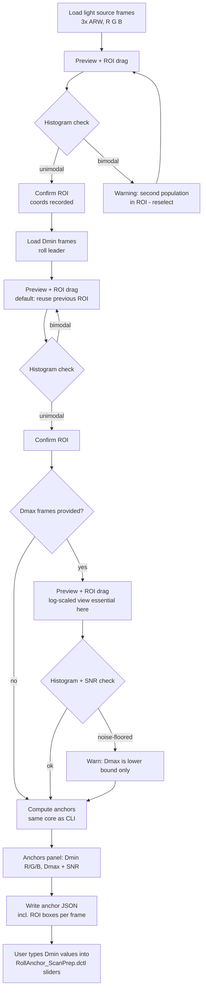

# Film scanner spectral calibration pipeline

A precision spectral calibration pipeline for a camera-based film scanner:
Sony a7R III, narrowband sequential R/G/B LEDs at 640/544/450 nm. Narrowband
is the only supported illumination mode. Its goal is to convert raw scanner-space density
into standardized, defined density metrics, so that DaVinci Resolve grading
starts from a metrically honest base rather than baked-in scanner/illuminant
idiosyncrasies.

Three film families are covered. Each gets a different target metric, because
each has a different physical process:

- **Reversal / E-6 (Fujichrome Velvia 100/50, Provia 100F; Kodak Ektachrome
  E100/100D)** → D50 white-relative colorimetric density (CIE 1931 2° XYZ).
  No printing step exists, so the target is the transparency as an object
  viewed on a D50 light table.
- **Negative / ECN-2 (Kodak Vision3 50D/200T/250D/500T)** → Cineon/RP 180
  printing density and ACES/APD (ST 2065-2). There *is* a printing step, so the
  target is "what would this negative print as."
- **Negative / C-41 (ten still stocks, Kodak and Fujifilm)** → Status M density,
  then RA-4 **print emulation** to Display P3 / P3-PQ. A colour negative is
  designed to be printed, so print emulation is the sole delivery route.
  Consequently a "stock" here means a dye set plus a D-min spectrum (the
  unreacted coloured coupler — see Glossary), *not* a tone curve.

Status A appears in exactly one place: inverting RA-4 paper reflection-density
curves on the C-41 print path, where it is the correct standard. It is **not** a
reversal target — the reversal target is D50 XYZ.

A collaborator's calibration tool, DiVERE, and their capture setup inform rig
parameters and serve as a reference throughout, though this pipeline is
independently built.

## Where things stand

| | State |
|---|---|
| Reversal | 4 stocks, complete |
| ECN-2 / Vision3 | Cineon PD cube + shaper pair, active |
| C-41 | fleet complete at 10 stocks, each with a print emulation |
| Qualitative use on real film | **passing** — in use, behaving as intended |
| **Quantitative validation** | **none — this is the open gate** |

Two things a newcomer should know before trusting any number here:

1. **The chain works, but no number in it has been checked against a
   measurement.** The cubes are in real use on real scans and pass qualitative
   examination — the renders look and behave as intended, and the one external
   check available so far agrees (the user reports Portra 160 and Portra 400
   print extremely close in a real darkroom, and the model reproduces that).
   What is missing is *quantitative* validation: a grey-ramp exposure series, a
   ColorChecker frame, and spectrally-read separation wedges, compared against
   reference values. Until that roll is shot and measured, every figure in this
   document is a model reporting on itself, however well the output looks. See
   Known limitations.
2. **The fleet cannot reliably tell its stocks apart** — basis sensitivity is
   0.030–0.105 D while inter-stock distances run 0.024–0.220 D, so the two
   ranges overlap for most pairs and only the widest-separated ones sit clear.
   Datasheet-level comparisons are basis-independent and do hold; per-stock
   *rendering* differences largely do not. See "C-41 fleet discrimination gap".

## Glossary

Everything below appears unexplained somewhere in this document. Grouped by what
kind of thing it is, because the same letter often means different things.

**Film processes and materials**

| | |
|---|---|
| **C-41** | the colour-negative process for still film (Portra, Ektar, Gold, Superia…) |
| **ECN-2** | Eastman Colour Negative 2, the *motion-picture* negative process (Vision3) |
| **E-6** | the colour-reversal (slide/transparency) process (Velvia, Provia, Ektachrome) |
| **RA-4** | the colour process for printing a negative onto photographic PAPER |
| **Orange mask** | **not a layer and not a filter** — the name is misleading. Colour negative film builds its magenta- and cyan-forming chemistry from *coloured couplers* (yellow and pink respectively), which are consumed where image dye forms. The orange cast is the coupler that did NOT react, distributed through the emulsion layers. Its absorption is designed to complete the unwanted absorptions of the image dyes, so dye + surviving coupler sum to a near-constant unwanted absorption at every exposure. Two consequences that matter here: it is a POSITIVE image (maximal at D-min, falling as exposure rises), and it is a *correction*, so removing it is not the same as fixing the film. Full sourcing in `knowledge/orange-mask-and-the-scanning-workflow.md` (Hanson, JOSA 40(3):166, 1950) |
| **DIR coupler** | Development-Inhibitor-Releasing coupler: the chemistry behind interimage effects |
| **Interimage / IIE** | one layer's development inhibiting a neighbour's, which sharpens colour separation. `IIE%` = the gamma difference between a colour-separation exposure and a neutral one |

**Density and sensitometry**

| | |
|---|---|
| **OD** | optical density, −log₁₀(transmittance or reflectance) |
| **D-min / D-max** | the least and greatest density a film or paper reaches. On a negative, D-min is the unexposed base + orange mask |
| **H&D curve** | Hurter–Driffield characteristic curve: density against log exposure. Its slope is gamma |
| **logH / logE** | log exposure — the H&D curve's x-axis. H and E are used interchangeably in the sources |
| **Status M** | the ISO 5-3 densitometric standard for measuring colour NEGATIVES. C-41 datasheets publish in it, which is why it is our negative-side target |
| **Status A** | the ISO 5-3 standard for reversal and PRINTS. Used here in exactly one place: inverting RA-4 paper curves |
| **RP 180** | SMPTE printing density — the ECN-2 target, "what would this negative print as" |
| **LAD** | Laboratory Aim Density, a fixed reference density for placing mid-gray |
| **k** | normalized density, `k = OD / DMAX`. The domain the cubes and the Print Adjustment DCTL work in. Density runs *backwards*: higher k = denser negative = lighter print |
| **DMAX (corridor)** | the density range a cube's 0–1 input domain is mapped onto — 3.30 for negatives, 6.0 for reversal. Load-bearing: cube and shapers must agree |

**Colour science**

| | |
|---|---|
| **SPD** | spectral power distribution — a light source's power against wavelength |
| **CMF** | colour matching function; CIE 1931 2° is the standard observer used here |
| **D50 / D55 / D65** | CIE daylight illuminants at ~5000/5500/6500 K |
| **XYZ** | CIE tristimulus space, the device-independent colour reference |
| **ΔE2000 / ΔE00** | CIE perceptual colour-difference metric. ~1.0 is roughly one just-noticeable difference |
| **a\* / b\* / L\* / Cab\*** | CIELAB axes: red-green, yellow-blue, lightness, and chroma. Cab\* ≈ 0 means neutral |
| **CAT02 / Bradford** | chromatic-adaptation transforms, for converting between illuminants |
| **JND** | just-noticeable difference |

**Delivery and the Resolve chain**

| | |
|---|---|
| **LUT / `.cube`** | 3D lookup table; the pipeline's actual deliverable. 65³ = 65 nodes per axis |
| **DCTL** | DaVinci Colour Transform Language — hand-written Resolve node code |
| **Shaper (pre/post)** | the DCTL pair that maps linear scanner values into and out of a cube's normalized density corridor |
| **P3 / Display P3 / P3-D65** | the wide-gamut display colour space used for delivery |
| **PQ (ST 2084)** | the HDR transfer function. "PQ203" = paper white placed at 203 nits per ITU-R BT.2408 |
| **SDR / HDR** | standard / high dynamic range |
| **DWG** | DaVinci Wide Gamut, Resolve's working space |
| **ACES / APD / IDT / LMT** | the Academy colour system: Academy Printing Density, Input Device Transform, Look Modification Transform |
| **PFE** | print film emulation |
| **CST** | Resolve's Colour Space Transform node |

**Capture and scanning**

| | |
|---|---|
| **Narrowband / trichrome** | three sequential exposures under R/G/B LEDs (640/544/450 nm) rather than one white-light shot. The only supported mode here |
| **CFA** | colour filter array — the Bayer mosaic on the sensor |
| **PDAF** | phase-detect autofocus pixels, which read differently and must be rejected |
| **ARW / EXR** | Sony raw file / OpenEXR half-float linear image |
| **ROI** | region of interest — the measured patch in an anchor frame |
| **Roll anchor** | the per-roll D-min measurement that normalizes a scan before any cube |
| **Flat field** | correction for uneven illumination across the frame |
| **SNR** | signal-to-noise ratio |

**Analysis and fitting**

| | |
|---|---|
| **RMSE** | root-mean-square error |
| **FWHM** | full width at half maximum — a curve's width |
| **Gauss-Newton** | the iterative solver used to invert density to dye amounts |
| **Decoupling condition** | condition number of the LED crosstalk matrix. Near 1.0 means the three channels are well separated |
| **Basis sensitivity** | how much a fitted result moves when the assumed dye basis changes. Here 0.030–0.105 D, and the number that bounds every stock comparison |
| **Serialization RMSE** | error from writing a cube's floats at 6 decimal places |
| **MTF** | modulation transfer function — a sharpness chart, present on datasheets but unharvested here |

**Data sources**

| | |
|---|---|
| **IT8 / ColorChecker** | standard reflective colour targets |
| **Munsell / NIST skin** | measured reflectance sets used to fit and test matrices |
| **UEF** | University of Eastern Finland, publisher of the Munsell and Agfa spectral sets |
| **CGATS / ISO 5-3** | the standards bodies and document defining Status A/M responsivities |

## Repo layout

```
data/
  equipment/      measured LED SPDs, camera CFA
  films/          per-stock dye density JSONs
  papers/         RA-4 print-paper datasheet JSONs (Endura Premier)
  standards/      Status M, RP 180, CIE/D50, APD/ST 2065-2 reference data
engine/
  reversal_transform.py    parameterized engine, all reversal builds
  roll_anchor_gui.py            self-contained per-roll Dmin/Dmax anchor
                                engine: ROI-picker GUI + its own numeric
                                core, one independent engine
  raw_to_exr.py                 trichrome scans -> half-float linear EXRs
                                (PRIMARY converter, self-contained, parallel;
                                Resolve does not read float32 TIFF reliably)
  cineon_pd_engine.py           Vision3 negative side (kept as the only
                                CPD-cube regen route)
  v3_datasheet_digitize.py      V3 500T sensitometric-curve raster tracer
  printer_lights_preset.py      datasheet -> per-stock printer-light offsets
  pfe_to_pq.py                  2383 PFE LUT: Gamma 2.6 -> P3-D65 PQ (HDR delivery)
  endura_print_engine.py        C-41 -> RA-4 Endura print emulation (Display
                                P3 / P3-PQ); endura_digitize.py digitizes the
                                Endura Premier datasheet -> data/papers/
  fuji_print_engine.py          C-41 -> RA-4 Fuji Pro Laser TYPE II print
                                emulation, a thin preset over the same
                                PrintEmulationEngine; fuji_prolaser_digitize.py
                                digitizes its datasheet -> data/papers/
builds/           engine-generated cubes (+ anchors/ per-roll JSONs, pfe/ HDR PFE)
dctl/             hand-written DCTLs (anchoring, reversal 6.0 shaper pair,
                  10^-D linearization, CPD shaper pair, print adjustment)
PROJECT.md        this document — the full technical reference, including
                  engine run instructions and the roll-anchor GUI spec
```

### Repo hygiene (standing rules)

* **Run `git gc` occasionally.** The auto-snapshot convention commits every few
  minutes, so loose objects accumulate fast and nothing packs them
  automatically. Left alone, the store reaches thousands of loose objects and
  zero packs (1505 loose objects observed on this repo).
* **Never `filter-repo` this repo.** It would rewrite every commit hash, and the
  byte-identical-regeneration guard depends on that history.
* **A stale linked worktree is a full second checkout**, `builds/` included, and
  costs ~100 MB. Verify `git -C <wt> status --porcelain` is empty before
  removing one, and keep its `worktree-*` branch — removing the checkout is
  lossless only because the branch keeps the commits reachable.
* **9 tracked files (64 MB) that `.gitignore:30,32` calls transient.**
  `builds/_ensemble/*.cube` (3) and `data/films/_ensemble/*.json` (6) are
  tracked even though those rules mark them transient, because `.gitignore`
  does not untrack retroactively. `git rm --cached` would fix the mismatch and
  stop future growth, but will NOT shrink `.git`. It changes what the repo
  tracks, which is a user decision.

One engine parameterized by stock/illuminant means a methodology fix
propagates everywhere by construction — this structurally closes the failure
mode where two stocks' build scripts diverge and one silently overwrites the
other's cube. The repo is under git with auto-snapshots. Builds emit no
per-build manifest (engine commit + data hashes).

## Hard constraints (do not relax these)

1. **No synthesized spectral shapes.** Never interpolate or extrapolate a dye
   or sensitivity curve into a wavelength region with no measured data. When a
   gap exists (a datasheet plot ends before the target responsivity's support
   does, etc.), the correct move is to document a bounded, known-sign
   systematic in the register below — not to invent a plausible-looking tail.
2. **Numerical grounding over qualitative review.** Every claim about
   accuracy, every "this is negligible" statement, must come from running the
   actual computation against the actual measured data in this repo, not from
   plausible-sounding reasoning. The failure mode is a qualitative judgment
   ("negligible") that is wrong once actually computed on the relevant domain
   — see systematic #2, where a linear-in-cyan framing makes the cyan
   truncation look negligible while it in fact reaches 0.24 D in deep shadow.
3. **Validate the as-shipped artifact, not the in-memory array.** `.cube`
   files get clipped to [0,1] and quantized to 6 decimals on write. Re-parse
   the written file and validate that before calling a build done.
4. **Metric and aesthetic stay separated.** Per-channel log-space offsets
   (printer lights, white balance, CC filtration) are aesthetic operations
   that belong in a node *above* the metric transform. Folding them into the
   metric (e.g. an eyeballed neutral point) corrupts it. This is also the
   core critique of NamiColor's reversal-mode workflow — see below.

5. **No scene-dependent decisions anywhere in the chain.** Every operation is
   either a fixed physical constant (dye spectra, paper H&D, Status M
   responsivities) or a per-roll physical MEASUREMENT (the anchor). Nothing in
   the pipeline ever reads picture content. The two normalisations that could
   have introduced such a dependence both key on scene-independent references
   by construction: the roll anchor on unexposed film base — light that never
   formed an image — and the gray-axis lock on the stock's own published neutral
   scale, solved once per stock and paper.

   **Consequences worth knowing, because they are the practical payoff:**
   - **The scene illuminant survives to the grade.** A tungsten-lit frame stays
     warm, because nothing in the chain can notice that it is warm. Note what is
     preserved is the PHOTOGRAPHIC rendering of that illuminant — the light as
     this emulsion and this paper render it — not a colorimetric measurement of
     it. Do not claim the stronger version.
   - **Frame-to-frame relationships across a roll survive.** A per-frame
     auto-neutralisation would delete a changing light across a sequence; the
     only per-roll operation here is physical, so the change is still there.
   - **It is one-directional in the useful sense.** A cast can be removed later
     in the grade; one removed by a content-dependent estimator cannot be put
     back, because the estimate depended on information no longer present.

   Keep it this way. Any future auto-neutralisation, auto-exposure or
   content-driven correction belongs above the metric transform (constraint 4),
   never inside it.

## Source data (`data/`)

Equipment (`data/equipment/`):

- `film_scanner_SPD_combined.csv` — measured LED SPDs, 380-780 nm @ 1 nm, all
  channels (narrowband R/G/B at multiple drive levels; also broadband white
  W1-W100 columns, unused — narrowband is the only supported route)
- `a7r2_cfa.md` — Sony a7R II/III camera spectral sensitivity functions (same
  CMOS across both bodies, confirmed)
- `a7r3_gain_ratio.json` — measured ISO640/ISO100 dual-conversion-gain
  ratio, per channel (6.289/6.294/6.274, measured from interleaved broadband
  pairs, spread ~0.14%; nominal 6.4 would err ~0.008 D). Used by the anchor
  extractor to normalize ISO 640 Dmax captures. Only the derived ratios are
  kept, not the source ARWs. Re-measure on body/firmware change

Per-stock dye density (`data/films/`) — each JSON documents its own
digitization method, registration audit, and known uncertainties:

- `Vision3_dye_density.json` — Kodak VISION3 shared image-dye set, the family
  average of the four traced stocks. The average is load-bearing: a
  single-stock basis is wrong by up to 0.197 D (cyan, 402 nm), across a band
  carrying 69% of Status M blue responsivity. No spektrafilm-sourced data is
  used anywhere — it is unvalidatable
- `Velvia100_dye_density.json`, `Velvia50_dye_density.json`,
  `Provia100F_dye_density.json`
- `EktachromeE100_dye_density.json` — covers both E100 and 100D/5294-7294;
  the two datasheets' dye data is identical, verified. The source PDFs
  (Kodak Alaris E-4000 rev 8-18; Eastman Kodak H-1-5294 rev 5-24) are not
  kept in the repo — the JSON's provenance metadata identifies them
  if re-verification is ever needed

Target-metric standards (`data/standards/`):

- `StatusA_ISO5-3.json` — ISO 5-3:1995 Table 3 Status A responsivities, from
  the public ANSI/NAPM IT2.18-1996 copy. Used in exactly one place: inverting
  RA-4 paper reflection-density curves on the C-41 print path. The StatusM
  json's provenance note records the cross-validation lineage
- `CIE1931_2deg_CMFs.json` — CIE 1931 2° colour-matching functions, 360-830
  nm @ 1 nm, and `D50_illuminant.json` — CIE D50 relative SPD, 300-780 nm @
  5 nm (both exported from colour-science 0.4.7's official CIE
  tabulations, stored as published; reload verified to reproduce the D50
  white point xy (0.3457, 0.3585) / XYZ (0.9642, 1.0, 0.8250) exactly).
  Target observer + illuminant for the colorimetric reversal transform
- `RP180_responsivities.json` — SMPTE RP 180 printing-density
  responsivities, peak-normalized, 360-730 nm @ 10 nm incl. the sub-400
  blue tail (verified identical to the table `cineon_pd_engine.py` consumes)
- `reflectance/` — measured reflectance datasets for broad-set matrix
  fitting/validation: Munsell glossy 1600 + matt 1269
  (UEF via colour-science Zenodo), Agfa IT8.7/2 289, NIST human skin 100
  (Cooksey/Allen/Tsai 2017, per-subject averages). Common JSON schema,
  reflectance 0–1; provenance and resampling notes in its README.md
- `st20652a2020.csv` — APD/ST 2065-2 reference. (The source documents
  `RP_180.pdf` and `ADX_Channel_Gains.pdf` are not in this repo; the RP 180
  *values* are in the JSON above.)

## How a transform works

Every transform is a **spectral round-trip**: scanner SPD × camera CFA
integrated against the stock's measured dye curves gives scan density; the same dye state integrated against the target
responsivity (CIE D50 XYZ, RP 180, Status M, or APD) gives target density. The mapping
between the two is solved numerically (Newton or Levenberg-Marquardt per
node) and shipped as a 3D LUT. The cube is the only transform artifact; no
analytic polynomial DCTL is exported alongside it.
This is a full change-of-observer problem — it
needs all of: dye curves, illuminant SPD, camera CFA, and target
responsivity. No shortcut skips any of the four.

### Corridor / shaper convention

A preshaper (`d = clamp(-log10(linear), 0, DMAX)/DMAX`) and postshaper
(`× DMAX`) bracket the cube, converting to/from the cube's normalized [0,1]
domain. Shapers carry no spectral content — they are reusable across any
stock/illuminant combination *that shares the same DMAX*.

**All reversal builds use DMAX 6.0 at 65³ (narrowband, the only illumination
mode); the negative path (Cineon PD) uses 3.3** (its shaper pair `CPD Pre-shaper.dctl` /
`CPD Postshaper.dctl` is in the repo and must only be used with the CPD
cube). One reversal shaper pair — `Preshaper 6.0.dctl` / `Postshaper 6.0.dctl`
— serves all four stocks. Check DMAX before reusing a shaper pair.

**Why 6.0/65³.** A 4.5 corridor is overrun by two stocks: a neutral dye-4.0
stack needs 4.91 D of scanner density on Velvia 50 and 5.06 D on Provia 100F,
so ~1-1.7% of samples clip at the domain edge, costing up to 0.34 D (V50) /
0.49 D (Provia). Corridor and LUT size are not independent knobs — node
spacing is `dmax/(size-1)` and trilinear error goes as spacing², confirmed
measured (4.5→6.0 at 33³ raises error 1.78×, vs 1.78 predicted). Raising the
corridor alone therefore costs accuracy everywhere; raising both fixes it:
6.0/64 = 0.094 D spacing is FINER than 4.5/32 = 0.141 D. Measured over dye
0-3.4, every stock sits at **RMSE 0.0004 / max 0.0012 D** rather than the
0.0009-0.0010 / 0.003 D a 4.5/33³ corridor gives, with clipping eliminated
over dye 0-4.0. The cost is file size only: 7.4 MB per cube rather than 0.97
MB, build 21 s rather than 2.7 s. Note 0.0012 D sits well below the dye
data's own ±0.005-0.01 D tracing uncertainty, so the accuracy gain is real
but largely masked by measurement error; the load-bearing wins are the
clipping fix and headroom for future stocks.

The floor under all of this is that narrowband scan density exceeds the film's
Status A density (the LEDs sit on the dye peaks): V50 scan red reaches 4.08 D
at a 3.5 D Status A neutral and 4.42 D at 3.6 D, and a 4.0 corridor clips
V100's scan red by 0.17 D at a 3.5 D neutral. A corridor must never be
inferred from the film's physical Dmax.

### Resolve node chain (reversal path)

```
scan prep (linear; RollAnchor_ScanPrep.dctl — per-roll Dmin anchoring)
  → preshaper (Preshaper 6.0.dctl — NOT the 4.5 pair in dctl/retired/)
  → cube (own node, tetrahedral interpolation; 65^3)
  → postshaper (Postshaper 6.0.dctl)
  → Density to Linear.dctl (the 10^-D view/linearization node)
  → aesthetic density-space offsets
  → display transform
```

Every node between preshaper and the linearization node displays
inverted/negative-looking — this is expected, not a bug (density-space
image, not rendered). The linearization node does correctly what NamiColor's
Negatives mode does incorrectly in this slot (see below).

### Resolve node chain (ECN-2/Vision3 path)

```
scan prep (linear; dctl/prep/RollAnchor_ScanPrep.dctl — paste the roll's
           EXR-SCALE Dmin R/G/B, see "Two density scales" below)
  → dctl/shapers/CPD Pre-shaper.dctl (VALUE_BOXes at 1.0 — anchored upstream)
  → builds/ecn2/Vision3 to Cineon PD.cube  (scanner density → RP 180 printing density)
  → dctl/shapers/CPD Postshaper.dctl with Encode ON (normalized Cineon CV out)
  → dctl/output/Printer Lights Cineon.dctl (aesthetic per-channel density trims;
           a raw Cineon decode always needs printer lights — start from the
           stock's datasheet preset in the DCTL header, trim per scene on top)
  → DISPLAY / DELIVERY transform (consumes the Cineon Log signal), either:
       • CST (Cineon Film Log → timeline space; performs the negative decode) → grade
       • builds/pfe/…PQ dw203nit.cube (2383 print emulation straight to P3-D65 PQ;
         HDR-delivery path, see "HDR delivery via 2383 print emulation" below)
```

Density-space stages of a NEGATIVE display positive-tonality in the viewer
(density is high where the scene was bright) — the reversal chain's
"displays negative-looking" note does not apply here. Do NOT use
Density to Linear.dctl in this path (10^-D of negative PD gives back the
negative's transmission); the Cineon CST is the decode.

**Printer-light presets from datasheets.** Stock-dependent,
roll-independent: `engine/ecn2/v3_datasheet_digitize.py` digitizes the V3 500T
sensitometric curves from `film_datasheet/V3 500T.pdf` (raster trace — this PDF
embeds the figure as a bitmap, unlike Portra's vector curves; frame-edge axis
calibration, 3-run column tracer + continuity recovery past the legend text;
audit: 96.6% coverage, dmin B 0.847/G 0.590/R 0.198, monotone) into
`data/films/V3500T_datasheet_curves.json`. The figure's Camera Stops axis
pins mid-gray with no LAD guesswork: stop 0 = gray-card normal exposure,
logH = −4.0 + 8·log10(2). `engine/ecn2/printer_lights_preset.py` then reads
the stop-0 base-relative Status M triplet, inverts to dye amounts (residual
0.000000 D), forwards through RP-180, and emits the offsets that equalize the
PD triplet → `builds/ecn2/V3500T_printer_lights.json` and the DCTL header.
V3 500T preset (zero-mean): R +0.028, G −0.077, B +0.049; stable to ±0.04 D
over ±1 stop of mid-gray choice. The preset assumes the datasheet illuminant
(tungsten for 500T): the first roll's daylight-no-85 wall balance
(G −0.323, B +0.070 R-referenced) differs from the preset (G −0.106, B +0.021
R-referenced) by the expected illuminant-mismatch trim, which remains
per-scene grading on top of the preset.

**HDR delivery via 2383 print emulation.** A stock
Kodak 2383 print-film-emulation LUT (`builds/pfe/DCI-P3 Kodak 2383 D65 PQ
dw203nit.cube`: Cineon Log in → DCI-P3 / Gamma 2.6 / D65 out, 33³ — a stock
third-party LUT, not engine-generated, so it stays 33³) is the display
transform for the print-look HDR deliverable. It consumes the same Cineon Log
signal the generic decode CST would (the CPD-postshaper Encode-ON output), so
it drops in place of the "Cineon → timeline" CST — not on top of it.

Its native output is Gamma 2.6, DCI-referenced at 48 nits. Feeding that to a
naïve "Gamma 2.6 → ST2084" CST gives an over-bright / over-contrasty result:
PQ is absolute, Gamma 2.6 carries no nit anchor, and the CST stretches
the film's reference white toward PQ's 10000-nit ceiling. Instead,
`engine/ecn2/pfe_to_pq.py` re-encodes the LUT's output to **P3-D65 PQ**
in-place (primaries unchanged → a per-channel gamma-2.6-decode → linear-scale →
PQ-encode remap baked into every entry), so the one LUT is the whole display
transform and no CST follows it. Brightness is anchored on **diffuse white**
(not the container peak): Cineon 0.67 (~90% white) → **203 nits** (ITU-R
BT.2408 HDR reference white — the chosen Vision3 HDR-delivery target, matching
the reversal path's proposed 203-nit convention). Deliverable:
`builds/pfe/DCI-P3 Kodak 2383 D65 PQ dw203nit.cube` (linear scale S≈315.5;
audit: black 0.10, 18% gray 31, diffuse white 203, print peak white 275 nits).
Rebuild / rescale with `python3 engine/ecn2/pfe_to_pq.py [nits] [cineon_code]`.
Note this is an SDR-referred print look placed in a PQ container: raising the
anchor brightens uniformly but adds no true HDR highlight headroom (the 2383
shoulder is baked in); for punchy speculars, grade the Cineon-decoded negative
to HDR directly and use a print look only as a lighter creative layer.

In Resolve: set the timeline/output to P3-D65 ST2084 (PQ) so nothing double-
transforms; if in DaVinci-managed color, place the LUT at output.


### `PrintEmulationEngine` — the shared print-emulation core

A config-driven `PrintEmulationEngine` (`PrintConfig`; reflective +
transmissive media; `neutral_basis`, `medium_base_spd`,
`adapt_view_white_to_d65`) carries the print model. `EnduraPrintEngine` is a
thin preset over it. Two properties of the core are load-bearing rather than
film-only scaffolding:

* **The medium's spectral base is in the rendered spectrum.** The engine
  subtracts `Dbase` to recover dye amounts and forms `10^-(base + a·DYE)` —
  NOT `10^-(a·DYE)`, which drops `base(λ)`. Inert for Endura (its paper JSON
  has no `base` block → zeros), but required in general.
* **Chromatic adaptation** of the viewing white to D65 before the D65-referred
  XYZ→P3 matrix. A no-op when the viewing illuminant already is D65, which is
  why a purely reflective path never exposes it.

### Resolve node chain (C-41 path)

```
scan prep (linear; dctl/prep/RollAnchor_ScanPrep.dctl — paste the roll's
           EXR-SCALE Dmin R/G/B, see "Two density scales"; for C-41 this is
           also the orange-mask removal, per channel)
  → dctl/shapers/CPD Pre-shaper.dctl (VALUE_BOXes at 1.0 — anchored upstream)
  → builds/c41/Portra400_StatusM.cube   (scanner → Status M)
  → builds/c41/print_endura/Portra400_to_PortraEndura_DisplayP3.cube
                                        (Status M → RA-4 print → Display P3)
  → grade
```

A colour negative is designed to be PRINTED, so the print branch is the only
C-41 delivery route and every stock has one — Kodak negatives through
`print_endura/`, Fujifilm through `print_fuji/`. Substitute the Fuji
paper cube for a Fujifilm stock.

Substitute `Portra160_` for `Portra400_` throughout to run the same chain on
Portra 160. The two cubes must come from the SAME stock — mixing
them silently mis-tones, since each encodes its own D-min and characteristic
curve.

The second cube replaces the postshaper + Density-to-Linear tail of the
Vision3 chain: its output is already scene-linear DaVinci Wide Gamut
(D65), 18% gray at 0.18. The CPD shaper pair is shared with the Vision3
path — same 3.30 corridor. For QC, stop after the first cube ×3.30: that
is Status M density (D-min-excluded), directly comparable to the E-4050
characteristic curves and (after adding the roll's D-min) the gray-card
corridor 0.77–0.87. Cineon PD was deliberately NOT used for C-41: PD
encodes a cine print stock's view of the negative, foreign to a stock
whose destinations are RA-4 or digital. DWG is preferred to AP0 as a
scene-linear landing by calculation (both fully contain Pointer's gamut;
DWG wins on workflow: Resolve-native, matches the reversal D50 path's
landing; AP0 remains one lossless CST away at delivery).

## Per-roll anchoring

The cubes map scan density to their target density exactly (D50-XYZ for
reversal, printing density / Status M for negatives), but density is only
defined relative to a reference. Anchoring pins that reference to the actual
roll — and it is per-roll rather than per-rig because Dmin varies with E-6
processing and film condition, within spec.

**Measurement** — `engine/scan/roll_anchor_gui.py`, one self-contained engine
carrying both the GUI and the numeric core. Its decode, merged-frame, and
ISO-640 paths are validated on real a7R III captures; real film frames are
not. Consumes calibration captures
the roll already carries: plain light (no film), the roll's clear leader
(Dmin), optionally unexposed rebate/frame gap (Dmax — optionally at ISO 640
for lower read noise, normalized via the measured gain ratio; there is no
dark-frame subtraction, in-camera dark-current handling being sufficient for
a diagnostic-only value). Emits a per-roll anchor JSON
(`builds/anchors/`). The GUI entry point, its optional frame arguments
(`--plain --dmin --dmax --roll-id --out --film-family`), input-format
options, the ISO 640 gain-ratio correction, shutter-normalization ordering,
and ROI/bimodality handling, plus validation status, are all in
**Engines / script reference** below — not repeated here.

**LED drive level is a free variable.** The cubes are
built against the 100%-drive SPDs, but scanning at other drive levels costs
almost nothing: worst case over dye 0-3.5 (V100), even at 20% drive, is
0.013/0.032/0.003 D (R/G/B, saturated colors; G's LED shift interacts with
the steep magenta flank), median ≤0.006 D, dye-3 neutrals <0.01 D — within
the dye-data uncertainty floor and far below the interimage systematic. The
measured spectral shift is ~1 nm centroid at 20% vs 100%. Since Dmin is
measured at the same drive as the scan, the anchor absorbs the neutral-axis
component automatically, leaving only the color-dependent residual. Rule of
thumb: drive ≥50% keeps worst case under ~0.02 D, but varying drive per
stock/roll (ETTR practice) is fine; prefer shutter time when either knob
would do, since it is spectrally free.

**RULE: the plain-light datum frame must be captured at the SAME LED drive
level as the roll's own scan**, or the drive-level shift must be measured and
recorded in the anchor JSON. The anchor only absorbs the neutral-axis
component of a drive change because Dmin and the scan share a drive level; a
datum shot at a different drive silently breaks that cancellation.

**Film families** — the extractor serves both paths (`--film-family`;
GUI asks): reversal Dmin = clear leader / Dmax = rebate;
negative (Vision3) Dmin = unexposed rebate incl. orange mask / Dmax =
light-struck leader tip. Same measurement, swapped patch protocol; both
feed RollAnchor_ScanPrep.dctl before their respective preshaper (CPD
pre-shaper's built-in linear boxes stay at 1.0).

**Application** — `dctl/prep/RollAnchor_ScanPrep.dctl` (hand-written; slider
max is 2.0, since orange-mask Dmin values exceed 1.0). Three sliders take the Dmin R/G/B values from the
extractor's report; the node multiplies linear by 10^Dmin per channel so the
roll's film base lands at density 0.0 — base-relative density, the
convention every cube expects. A Strength slider gives anchored/unanchored
A/B. Math verified: leader → 0.0 D exactly, base+1.5 D → 1.5 D exactly.
This is a metric, measured operation — NOT a place for eyeballed
neutralization.

**Two density scales.** The extractor reports Dmin on
two zero points, and the distinction is load-bearing: (a) *plain-light
scale* — density relative to the plain-light frame (true transmission
density; compare against datasheets); (b) *EXR scale*
(`dmin_exr_scale` in the JSON, headline in the GUI result screen and
clipboard) — density relative to the sensor white level, which is the
normalization raw_to_exr bakes into its EXRs (each channel carries its own
plain-light-to-white-level offset: the LED/CFA signal differs per channel,
~+0.24/+0.58/+0.93 D R/G/B on this rig). **Paste the EXR-scale values into
RollAnchor_ScanPrep.dctl when grading raw_to_exr EXRs** — the plain-scale
values over-anchor (G/B crushed past the preshaper's density-0 clamp →
strong yellow-green cast after the Cineon decode). EXR-scale values are only valid if the anchor
frames were shot at the roll's per-channel exposure/ISO.

## Engines / script reference

`engine/` is sorted by family: `scan/` (converter, anchor extractor + GUI),
`reversal/` (cube builder), `ecn2/` (`cineon_pd_engine.py`, kept solely as
the regeneration route for the negative-path CPD cube — see its note
below), and `c41/` (the C-41 toolchain — see its subsection). Run everything
from the repository root unless noted.

### C-41 toolchain (`engine/c41/`)

Datasheet-only calibration for C-41 stocks that publish no per-layer dye
spectra. The missing per-layer data is INFERRED, not measured — a
constrained fit against the Vision3 dye basis, pinned metrically by the
published Status M characteristic curves. See register #8 for the resulting
uncertainty. Pipeline order (each prints its own audit metrics):

> **The basis is not justified by shared KODAK VISION emulsion lineage.**
> Gold 200 is a deliberate non-VISION control and fits the Vision3 basis
> *better* than any VISION-lineage stock (RMSE 0.0142 against Ektar 0.0159,
> Portra 400 0.0174, Portra 160 0.0183). The basis is therefore not encoding
> VISION-specific chemistry — it is a generic flexible three-dye model that
> fits any C-41 aggregate. It remains the best available basis and the fits
> stand, but lineage is not a reason to trust it. Register #8 and the
> discrimination gap carry the consequence.

**Step 0, MANDATORY: `datasheet_forensics.py <pdf>`.** Read-only; writes
nothing. Run it and READ it before adding any stock to the registry — four
different silent assumptions have each been broken by a different sheet (see
"Datasheet traps found so far").

Every script below is **stock-parameterized** via `--stock`; the registry is
`engine/c41/portra_stocks.py` (per-stock PDF, page, provenance code, output
filenames, and the device-space geometry that genuinely differs between
datasheets). Metrics quoted below are Portra 400's; the per-stock table is under
"Current state by stock".

1. `portra_digitize.py` — vector-exact digitization of the page-4
   characteristic + spectral-dye-density charts (pdfminer path geometry;
   gridline-calibrated, RMS 0.0012 logH / 0.0005 D / 0.013 nm) →
   `data/films/<Stock>_datasheet_curves.json`.
2. `portra_digitize_sens.py` — same method for the spectral-sensitivity
   chart (Portra 400 layer peaks 406/550/651 nm) →
   `data/films/<Stock>_spectral_sensitivity.json`.
3. `portra_decompose.py` — 9-parameter warped-basis fit (per-dye amount,
   peak shift ±15 nm, width ±15%) of midscale−Dmin onto the Vision3 dyes;
   aggregate reconstruction RMSE 0.0174 D; Status M reproduction deltas
   0.020/0.000/0.003 D (R/G/B); LED crosstalk matrix condition 1.26 →
   `data/films/<Stock>_dye_density.json` (negative schema + fit_audit).
4. `c41_statusm_engine.py` — scanner→Status M cube (modeled on
   cineon_pd_engine; D-min excluded; Status M red truncated at the 700 nm
   dye-chart edge and renormalized, 0.28% of red area) →
   `builds/c41/<Stock>_StatusM.cube`.

`engine/retired/c41_scene_engine.py` is not part of any shipped build and
produces no cube in `builds/`. It is data-driven (STOCKS dict): Status M → dye
amounts (Gauss-Newton) → char-curve inversion → layer exposures → 3×3 matrix
(fit on ColorChecker babel_average under D55, Bradford to D65, 18% gray pinned
to DWG 0.18 exactly) → a scene-referred `<Stock>_StatusM_to_DWG.cube`. It is
kept because it is the ONLY home for the broad-set 3×3 fit over 3,258 measured
reflectances, the ColorChecker full-chain ΔE2000 harness, and the neutral-axis
ramp diagnostic. The interimage/DIR stage does not live there — that is
`engine/common/interimage.py`.

Supporting standard added: `data/standards/StatusM_ISO5-3.json` (ISO 5-3 /
CGATS.5 Status M spectral products via ArgyllCMS xspect.c, whose Status A
table matches this repo's StatusA_ISO5-3.json exactly — same lineage).
Status M was chosen as the C-41 densitometric target because it is the
space the C-41 characteristic curves are published in (making datasheet
numbers usable as QC).

**Interimage/DIR structure, and the spektrafilm data-provenance line.**
spektrafilm (github.com/andreavolpato/spektrafilm) is a forward film simulator
that independently converges on the same datasheet-spectral principles. Two
ideas are taken from it — the DIR matrix architecture and grey-ramp
pre-compensation — and **no data**, deliberately:

- **`DIR_MATRIX`, the interimage stage.** Shared helper
  `engine/common/interimage.py`; a 3×3 (default identity) in
  `cineon_pd_engine.py` and in `engine/retired/c41_scene_engine.py` applies layer inhibition in
  dye-amount space with grey-ramp pre-compensation (pre-coupler curves solved so
  the neutral ramp reproduces the datasheet curves exactly — neutrals preserved
  by construction, only off-neutral shifts). Identity takes a fast path verified
  bit-identical. Its parameters are unmeasured. **Do not copy
  spektrafilm's inhibition numbers**: they are one shared author-tuned default
  across ALL C-41 negatives, an unpublished aesthetic optimization with some
  entries commented "just eyeballed" — zero per-stock signal, at most an
  order-of-magnitude prior (interlayer terms ~0.15–0.35 of same-layer).
  `DIR_MATRIX` gates no shipped cube; see the discrimination gap for why it is
  not the fix there either.
- **Everything metric in this chain rests on measured data.** The reflectance
  sets are real spectrophotometry (UEF Munsell glossy 1600 / matt 1269, Agfa
  IT8.7/2 289, NIST skin 100, in `data/standards/reflectance/`), and the film
  curves are our own digitization of published charts. **The only non-measured
  element in the whole C-41 chain is the inferred per-layer dye split**
  (register #8). Keep it that way — see the Hard constraints.

The broad-set 3×3 matrix fit over those 3,258 reflectances lives in
`engine/retired/c41_scene_engine.py`, and its finding is worth knowing: the
ColorChecker-only matrix is already near-optimal on 3,258 unseen spectra
(broad M improves checker mean only 2.50→2.46, skin 2.67→2.64, Munsell max
8.51→8.10). **So the saturated-red ΔE 6.3 is a forward-model limit — surrogate
cyan and missing interimage — not a matrix-fit artifact.** No 3×3 can fix it.


### C-41 → RA-4 print-paper emulation (Kodak ENDURA Premier)

**This is the ONLY C-41 delivery route**, because a colour negative is designed
to be printed. It prints the reconstructed negative onto RA-4 paper and views
the result. Input domain is normalized Status M density, D-min excluded, i.e.
it chains AFTER `<Stock>_StatusM.cube`; Status M is untouched on the negative
side. Every one of the ten C-41 stocks has a print emulation, paired by
manufacturer: Kodak negatives → Kodak ENDURA Premier (`print_endura/`),
Fujifilm negatives → Fujicolor Pro Laser TYPE II (`print_fuji/`).

```
  ... → builds/c41/Portra400_StatusM.cube
      → dctl/output/Print Adjustment.dctl   (optional; defaults no-op)
      → builds/c41/print_endura/Portra400_to_PortraEndura_DisplayP3.cube
```

1. `endura_digitize.py` — vector-exact digitization (reuses
   `portra_digitize.py`'s pdfminer helpers) of the ENDURA Premier datasheet
   (E-4070, March 2013), pages 4–5: characteristic curves (Status A density
   vs logE, R/G/B), spectral-sensitivity (Y/M/C-forming layers), and
   spectral-dye-density (C/M/Y). Axis-calibration RMS 0.009 logE / 0.24 nm /
   0.036 nm; layers assigned by spectral peak →
   `data/papers/EnduraPremier_paper.json` (per-layer sensitivity/dye/hd +
   digitization_audit). REAL datasheet data — not the provisional online set
   (spectral_film_lut), which measures ~ΔE2000 5 different across the whole
   cube and is not used.
2. `endura_print_engine.py` — the print model. Per node: Status M density →
   negative dye amounts (Gauss-Newton inversion) →
   negative spectral transmittance (incl. orange mask) → tungsten enlarger
   (3200 K) → paper exposure → paper H&D → Status A inversion
   (`data/standards/StatusA_ISO5-3.json`) → print reflectance → viewed under
   D65 → P3. Gray balance is a full per-channel GRAY-AXIS LOCK (all channels
   pulled onto the mean neutral tone curve at every density). A two-point
   affine is not adequate here — the orange mask flattens the red layer's
   exposure and destabilizes it. Auto-solved so a neutral negative
   prints neutral.

```
python3 engine/c41/endura_digitize.py      # datasheet PDF -> data/papers/EnduraPremier_paper.json
python3 engine/c41/endura_print_engine.py   # -> the two print cubes (self-reports all metrics)
```

Outputs `builds/c41/print_endura/Portra400_to_PortraEndura_DisplayP3.cube` (Display P3,
SDR print soft-proof) and `print_endura/Portra400_to_PortraEndura_P3D65_PQ203.cube`
(P3-D65 PQ, paper white = 203 nits, HDR container). `--stock` selects which
of the five Kodak negatives is printed; **no modelling constant differs between
stocks** — the engine is the same print for all of them.

`python3 engine/c41/endura_validate.py` is the read-only validation battery
(groups A–F: digitisation integrity, grid coverage, gray-axis lock, solver
health, colorimetry, shipped-artifact fidelity). It writes nothing and
self-reports PASS/FAIL. Current state: all checks pass, group F included —
`FAILED: none`, F1 RMSE 2.6e-07/2.8e-07, F2 0 violations, F3 5.9e-06. Read the
SUMMARY line and treat a traceback as a FAIL: a validator that dies part-way
through still prints its earlier groups, so "the checks I can see all passed" is
not evidence the battery ran; a silently dead test group still reports success.

#### The printable neutral window

**This is the single most important property of the print path to know.** At the
true paper gamma (~2.6, straight off the datasheet H&D) the printable neutral
window is NARROW, and outside it the print clips to paper white or max black,
exactly as a real RA-4 print does. It is a property of the PAPER, not of the
negative.

> **Measured on the shipped 65³ cubes** (criterion: neutral-ramp
> slope > 1% of its peak; resolvable to the 0.0156 node step):
>
> | paper | window (Dnorm k) | OD | sensitivity at mid-gray |
> |---|---|---|---|
> | Endura Premier | [0.109, 0.391] | 0.93 | 0.39 stop per 0.01 k |
> | Fuji Pro Laser | [0.062, 0.406] | 1.13 | 0.33 stop per 0.01 k |
>
> **Identical across all five stocks on each paper** — the window is a property
> of the paper, not the negative, confirmed against two papers. Fuji Pro Laser is the lower-contrast paper, with ~0.2 OD
> more room and almost all of it at the shadow end.

Off-neutral corners are correspondingly extreme: 37.5% of the lattice falls
outside P3 pre-clip, and 69% of nodes request a print-dye triplet needing a
negative dye amount. That is not a defect — the box input domain contains
density triplets no non-negative dye combination can make. 100% of the engine's
Status A residual mass sits on exactly those clipped nodes and is exactly 0 on
the rest; the engine also reports the Status M inversion residual (19.5% of
nodes unrealizable).

CAVEATS. Not validated against a physical print. The enlarger SPD (3200 K) is
nominal, and the negative side still uses the surrogate Portra dye model
(register #8). D65 viewing is nominal but *measured harmless*: the datasheet
specifies 5000 K ± 1000 evaluation, and D50 + CAT02 differs from the shipped
D65 render by only ΔE00 median 0.75 / max 3.28 (0.017 on the neutral axis) —
without the adaptation it would be 7.3/15.3, so the D65-direct path is
self-consistent by construction. The paper's spectral base is absent from the
datasheet, so its D-min non-neutrality (Status A 0.0915/0.0915/0.0651, a
0.026 D blue-vs-red difference) is discarded rather than rendered; `Dbase` is
stripped as a scalar and `base_spec_C` is zeros. Data-bound. Status A
reflection densitometry is correct for prints, and this is its only use here.

#### Darkroom controls

Three knobs, at the three stages where a real darkroom actually has them. All
default to no-ops, so the shipped cubes are unchanged unless you dial one.

| control | where | what it does |
|---|---|---|
| `PrintConfig.flare` | paper, during exposure (pre-lock) | contrast: system gamma 1.83 → 1.61 at 0.010 |
| `PrintConfig.printer_lights` | paper, after the lock | colour balance: b\* ±16 for ∓0.05 logE |
| `dctl/output/Print Adjustment.dctl` | negative, before the cube | tone + balance, live: gamma about a pivot, exposure offset, per-channel printer lights |

The placements are load-bearing, not stylistic. `flare` is a property of the
optical path that exists while the print is being balanced, so it goes *before*
the gray-axis lock and the lock solves with it in place. `printer_lights` goes
*after* the lock, because the lock defines the neutral reference and printer
lights are a deliberate departure from it — placed before, the lock would
re-neutralise them and the control would be a no-op on neutrals. Verified both
ways round: flare moves gamma with the neutral axis untouched (Cab\* ≤ 0.001),
printer lights swing b\* ±16 with gamma unchanged (1.79–1.84). The DCTL sits
*before* the cube for the same kind of reason: on the negative side it is an
enlarger — exposure and printer lights are literally what it does — whereas the
same sliders after the cube would be post-correcting a finished render.

**Contrast grades do not exist for RA-4.** Unlike B&W VC paper there is no dual
emulsion for filtration to bias, so the light mix is colour balance and nothing
else — a per-channel logE offset cannot change dD/dlogE, it only changes which
point of the H&D you sit on. What *does* soften a real print: veiling flare, the
paper surface, exposure placement onto the toe and shoulder (measured: −0.30
logE overall takes system gamma 1.83 → 0.81, because the curve is an S with
local slope 0.9 in the toe, 4.6 mid-curve, 1–2.5 in the shoulder), and local
work — dodging, burning, contrast masking.

The Print Adjustment DCTL is the one to reach for first: it needs no rebuild, and being
*before* the cube it drives the print the way an enlarger does rather than
post-correcting the render. Its domain is normalized Status M density
`k = OD/3.30`, so a general-purpose gain/gamma tool at that node would be
operating on the wrong quantity — hence a purpose-built DCTL. Two properties of
the domain govern the whole design: **density runs backwards** (higher k = denser
negative = lighter print) and the **printable window is narrow** — k ∈
[0.109, 0.391] on Endura, [0.062, 0.406] on Fuji Pro Laser (table above) —
against a paper gamma of ~2.6, so 0.01 k is a visible move.

Two modes, `Literal Pow` off/on:

```
darkroom (default) :  k' = pivot + (k - pivot) * gamma + gain
literal            :  k' = (1 + gain) * k ^ gamma
```

Darkroom is the useful one. `gain` is a pure density offset — enlarger exposure,
slope untouched; `gamma` is contrast about `pivot`, default 0.22 (the engine's
calibrated mid-gray, the k that renders Y = 0.18). Literal is the plain power
law, provided because it was asked for, with a caveat that the measurements
below confirm: the fixed point of a power law is k = 1.0 and the whole image
lives below k = 0.348, so it reads mostly as a **brightness** shift, not
contrast. `Gain R/G/B` are additive density offsets after the master, in both
modes — a per-channel density offset here *is* printer-lights colour balance,
the same physical knob as `PrintConfig.printer_lights` but live.

Measured through the engine's own calibrated neutral ramp
(`engine/c41/endura_trim_check.py`, read-only; system gamma over the printable
window, and mid-gray at k = 0.22):

| case | gamma | Y(mid) | a\* | b\* |
|---|---|---|---|---|
| baseline | 3.015 | 0.1828 | −0.01 | 0.01 |
| gain +0.010 | 2.915 | 0.2362 | −0.01 | −0.00 |
| gain −0.010 | 3.083 | 0.1380 | −0.02 | 0.02 |
| gamma 1.20 | 3.279 | 0.1834 | −0.01 | 0.01 |
| gamma 0.85 | 2.734 | 0.1824 | −0.01 | 0.01 |
| gamma 0.85, pivot 0.10 | 2.860 | 0.1073 | −0.01 | 0.01 |
| literal gamma 0.90 | 2.671 | **0.4130** | −0.01 | 0.01 |
| trim R +.005 B −.005 | 3.006 | 0.1870 | 2.09 | 5.34 |

Reading it: the pivot holds — gamma 0.85→1.20 swings system gamma 2.73→3.28
while mid-gray stays put at 0.182–0.183. Moving the pivot to a shadow (0.10)
instead drags mid-gray down to 0.107, as intended. Gain is a clean exposure
move (0.183 → 0.236 at +0.010, brighter for *more* density — the sign that
catches people). Literal mode at gamma 0.90 more than doubles mid-gray to 0.413
for a modest contrast change, which is the caveat above, quantified. The
per-channel trim swings b\* by 5.3 at ±0.005 k with system gamma unchanged
(3.006 vs 3.015) — colour at constant contrast, exactly as printer lights
behave (compare the engine's own control: b\* ±16 for ∓0.05 logE).

Also verified via `dctl_shim.c`: defaults are a bit-exact no-op in *both* modes,
pivoted gain offsets all three sample points by exactly +0.010000, literal gain
is exactly `1.1 × k`, per-channel trim is identical across modes, and the output
clamps into the cube's `[0, 1]` input domain at both ends.

**DCTL authoring constraints in this project.**
Resolve rejects some otherwise-valid files with `wrong argument int p_Width in
Transform DCTL` / `main DCTL function has wrong arguments` — an error that names the
`transform` signature but is actually caused by something *earlier* in the file
derailing the parse, so it points away from the real fault. The defence is to
restrict a file to constructs that already appear in a working DCTL here:

- **one function only** — everything inside `transform()`. `__DEVICE__` helper
  functions are the leading suspect; no working DCTL in `dctl/` defines one.
- no `__CONSTANT__` at file scope — use `const float` locals.
- no `DCTLUI_COMBO_BOX` — only `DCTLUI_SLIDER_FLOAT`, `DCTLUI_CHECK_BOX`,
  `DCTLUI_VALUE_BOX` are proven. Combo-box display names are expanded as code, so
  a hyphen in one reads as an operator.
- ASCII only, no tabs, `if/else` rather than ternaries.

Which of those constructs Resolve chokes on is not isolated, so don't
reintroduce any of them casually.
`dctl/dctl_shim.c` compiles a Transform DCTL as plain C (fake macros) and catches
signature errors, undefined identifiers and bad arithmetic — but NOT
Resolve-specific macro faults, so it passes files Resolve rejects.
Verify numerics with it; verify loading in Resolve. Usage:

```
sed "s|DCTL_UNDER_TEST|$PWD/dctl/output/Print Adjustment.dctl|" dctl/dctl_shim.c > /tmp/shim.c
cc -std=c99 -o /tmp/shim /tmp/shim.c -lm && /tmp/shim
```

### Datasheet digitisation — the mandatory routine

Every stock and paper in this repo is traced from a published datasheet, so
this routine is the whole quality floor. Pure vector inspection is not enough —
the Fujifilm sheets defeat it — so all four steps are mandatory:

1. `datasheet_forensics.py <pdf>` — **auto-detects the chart page** rather
   than defaulting to index 3. Fujifilm 400's charts are on index 5, and a
   fixed default reports "NO FRAME BOXES FOUND … a third spelling" on the wrong
   page — a false alarm sending you after a nonexistent frame format.
2. **`datasheet_render.py <pdf>` — render it and LOOK.** Two things on the Fuji
   sheet are unrecoverable from geometry: that its dye chart uses the Kodak
   midscale/D-min convention (written on the chart in words), and that its curves
   are cubic Béziers whose control points are NOT on the curve.
3. `datasheet_paths.py` / PyMuPDF `get_drawings()` where operator structure
   matters — pdfminer flattens a path to a bare point list, so a Bézier control
   point and a sampled vertex are indistinguishable. Reading the former as data
   puts phantom peaks in the spectrum.
4. **Overlay the digitized JSON back onto the raster**
   (`engine/c41/datasheet_overlay.py --all`). If the curves land on the printed
   ink, frame detection, axis origin, axis STEP and curve sampling are all
   correct at once. Strictly stronger than any residual: evenly spaced gridlines
   fit any origin and any step with zero residual, so a clean fit proves nothing.
   The tool drives off each JSON's own `digitization_audit.device_to_data`
   strings, so it needs no cooperation from the digitizer that wrote them — which
   is what let it re-check stocks digitized long before it existed.

### Datasheet digitisation lessons (apply to every sheet)

Standing rules:

1. **Digitise a datasheet's own internal identity and use it as a test.** 2383's
   dye curves are stated to form a visual neutral of 1.0; summing them and
   measuring a*/b* caught a b* = −26 data error that QA overlays had passed. An
   overlay proves you traced the drawn line — not that the data is right.
2. **A chart's toe/axis region is a trap.** Three things stack within ~30 px:
   the axis line, the integer-label TICK MARKS, and the curve toes. Ticks merge
   with everything above them and yield a plausible wrong D-min (0.092 here)
   that survives casual checking. Read tick-free columns, with a run-merge gap
   small enough to keep near-coincident curves apart.
3. **Don't calibrate over a data defect.** A "visual-neutral" gray-axis lock made
   neutrals measure perfectly while saturated colour stayed wrong — it was
   silently compensating for the missing base. With the data correct, the plain
   density lock scores about as well as Endura's own residual. The cost of that
   class of defect is large: modelling the negative as clear film outside its
   measured support loses 21.1% of cyan sensitivity above 700 nm, spreads
   per-layer contrast by 4.5×, and uses only 0.86 of the paper's 2.86 log-E
   latitude.
4. **Cross-check derived quantities against a second chart.** The spectral base's
   Status A density must agree with the H&D D-min; that is what finally pinned it
   (R/G ≈ 0.054, blue higher from the UV absorber — matching the B curve sitting
   highest in the toe).
5. **Calibrate wavelength axes from the printed numerals**, not from evenly
   spaced interior marks: 2383's dye chart carries decorative gridlines at 10
   equal divisions that are not round-nm ticks.
6. **Numerals for VALUES, gridlines for POSITIONS** — the refinement of lesson 5.
   A numeral's glyph centre only
   approximates the tick it names (text boxes carry 1–2 pt of centring error);
   glyph centres sit ≈0.02 D off, and anchoring on them puts that constant
   density offset and 0.027 of gamma error on every density. Use the numerals to learn *which* gridline
   holds which value, then take positions from the gridlines. Keep the numeral
   fit as a recorded cross-check.

**Datasheet traps — check all four on any new stock.** Each
produces plausible wrong numbers rather than an error, and each is exercised by
a different sheet:

1. **Frame drawn as a rect, not lines.** Portra 400 draws chart frames as four
   `LTLine`s; Portra 160 draws them as ONE stroked `LTCurve` rectangle closing
   with a bare `('h',)`, so only four vertices carry coordinates. Tick VALUES
   are inferred from tick COUNT, so a missed frame edge shifts logH by a full
   decade and density by 1.0 D. `portra_stocks.frame_boxes()` accepts both
   spellings; a hard 6/5 count guard refuses to write if detection comes up short.
2. **Axis ORIGIN is not always zero.** Portra 400's log-sensitivity axis runs
   0.0…4.0, Portra 160's runs −1.0…3.0. Hardcoding 0.0 puts every Portra 160
   sensitivity 1.0 logH too high — the slower stock reading as *more* sensitive.
   The per-stock origin (`sens_y_origin`) must be calibrated with a label-based
   anchor check against the extreme labels, to ±0.05 data units.
3. **Axis RANGE is not always shared either.** Ektar's characteristic x-axis runs
   −3.0…+2.0 where both Portras run −4.0…+1.0 — same six gridlines, so the count
   guard from trap 2 passes while every log exposure comes out a full decade
   wrong: every exposure off by a factor of 10.
4. **Evenly spaced gridlines fit any origin and any step with zero residual**, so
   a clean calibration residual proves nothing about either. This is why traps
   1–3 are invisible to a residual check, and why the overlay
   (below) rather than a residual is the real test.

Both defences are in the code: every count-inferred axis is cross-checked
against the printed labels and raises `SystemExit` on disagreement beyond 0.05
data units, and `datasheet_forensics.py` is mandatory before registering a stock.

### C-41 fleet discrimination gap — the most important caveat here

**The pipeline cannot reliably tell its ten C-41 stocks apart.** This is
structural, not a build defect, and it bounds what every C-41 deliverable in
this repo may be claimed to do.

The gap shows against ground truth the datasheets cannot supply: the user
reports Ektar 100 is a very different stock from the Portras, both scanned and
paper-printed. The model says the opposite — it reads Ektar as one of the
*closest* stocks to Portra 400, and fleet size does not resolve it.

**The measurement, from `engine/c41/c41_stock_compare.py` over all 45 pairs.**
Inter-stock spectral shape distances span **0.024–0.220 D**, and the measured
basis sensitivity of the surrogate decomposition is **0.030–0.105 D**. The two
ranges overlap across most of the fleet, so for any pair below ~0.105 D the
model cannot distinguish a real film difference from an artifact of which dye
basis was assumed. Closest pairs, all inside the ambiguity band:

| pair | shape distance (D) |
|---|---|
| Fujifilm 200 / Fujifilm 400 | 0.0000 — identical by construction, one shared dye chart |
| Gold 200 / Portra 400 | 0.0244 |
| Portra 160 / Portra 400 | 0.0271 |
| Ektar 100 / Portra 160 | 0.0305 |
| Gold 200 / Ultra Max 400 | 0.0313 |

Only the widest-separated pairs (Superia Premium 400 against most Kodak stocks,
0.15–0.22 D) sit clear of the band.

**Why.** Every stock's dye set is warped Vision3 (register #8), so the ten
fitted sets collapse to within mean |ΔD| ~0.004–0.012 peak-normalized.
`DIR_MATRIX = np.eye(3)`, so interimage/DIR coupling is disabled. Grain is not
modelled. **The two mechanisms that actually make stocks look different — real
dye chemistry and interimage coupling — are precisely the two this model does
not have.**

**What this does and does not invalidate:**

- **Do NOT treat the print cubes as stock-DISCRIMINATING.** They are metrically
  sound as prints; they do not tell ten films apart.
- **Datasheet-level comparisons ARE admissible**, because they never pass
  through the basis. The `char` (characteristic-curve) and D-min-shape columns
  of `c41_stock_compare.py` are basis-independent, which is why they carry the
  stock-provenance work.
- **`DIR_MATRIX` is NOT the fix.** Interimage happens during DEVELOPMENT, and every cube here starts
  after that: `<Stock>_StatusM.cube` is pure densitometry of dyes that already
  exist, and `endura_print_engine.py` never inverts a characteristic curve nor
  calls `apply_dir` (verified by grep). When you scan a real negative the
  interimage is already present in the measured densities, and the model
  correctly does not re-simulate it. `DIR_MATRIX` gates no shipped cube at all.
- **The fix is MEASURED per-layer dye data**, which only colour-separation
  wedges on a measured validation roll can supply. No better fit to the same
  aggregate curve can close it — one aggregate spectrum cannot determine three
  components.

Supporting literature: `knowledge/interimage-effects-and-stock-
differentiation.md`. Kodak names proprietary DIR couplers as an explicit Ektar
design element; published interimage magnitudes run 10–35% gamma change; and per
retired Kodak emulsion engineer "Photo Engineer" (UNVERIFIED tier-C source),
saturation differences between Kodak stocks are *designed in by means of
interimage effects* rather than by dye-set differences — exactly the axis this
model has set to identity.

### Second RA-4 paper: Fujicolor Pro Laser TYPE II

A second paper on the same print branch, demonstrating that
`PrintEmulationEngine` is genuinely config-driven:
`engine/c41/fuji_print_engine.py` is a thin preset that differs from
`EnduraPrintEngine` **only** in `print_medium_path`.

```
python3 engine/c41/fuji_prolaser_digitize.py   # datasheet PDF -> data/papers/FujiProLaserTypeII_paper.json
python3 engine/c41/fuji_print_engine.py        # -> the two Fuji print cubes (self-reports all metrics)
```

Outputs `builds/c41/print_fuji/Portra400_to_FujiProLaser_DisplayP3.cube` and
`print_fuji/Portra400_to_FujiProLaser_P3D65_PQ203.cube`, siblings of the Endura pair
with the same input domain, so `dctl/output/Print Adjustment.dctl` sits in front
of them unchanged.

**Which Fuji paper, and why not the other one.** `paper_datasheet/` holds two:
Crystal Archive Type CA and Pro Laser TYPE II. **Type CA cannot drive this
engine — it publishes no characteristic curves.** Verified against the PDF
rather than taken on trust: its section list runs 1–18 with §12 spectral dye
density and §13 spectral sensitivity, and no H&D section anywhere. §16
"Calibration data" is *not* densitometry — it is Frontier minilab paper-type
setup instructions. `data/papers/CrystalArchiveTypeCA_paper.json` is therefore
dye + sensitivity only and is **unusable for print emulation**; it is kept as
reference data, not as a build input.


**Measured, on identical metrics to Endura** (neutral ramp through each engine's
own calibrated path, system gamma over the printable window):

| | Endura Premier | Fuji Pro Laser II |
|---|---|---|
| printable window (Dnorm k), at 33³ | [0.082, 0.348] | **[0.042, 0.364]** |
| printable window, shipped 65³ | **[0.109, 0.391]** | **[0.062, 0.406]** |
| system gamma, own window | 3.015 | 2.302 |
| system gamma, Endura's window | 3.015 | **2.452** |
| mid-gray at k=0.22 | Y 0.1828, L\* 49.83 | Y 0.1824, L\* 49.79 |
| neutral a\*/b\* at mid-gray | −0.01 / +0.01 | −0.02 / +0.02 |
| max neutral chroma, Endura's window | 0.2970 | **0.0767** |
| outside P3 pre-clip | 37.5% | 23.8% |
| dye-amount zero-clip nodes | 69% | 64.3% |
| gray-lock solve residual | — | RMS 0.032, max 0.142 D |
| 65³ LUT interp RMSE (P3 / PQ) | — | 1.7e-3 / 4.5e-3 (5.7e-3 / 9.5e-3 at 33³) |
| serialized round-trip RMSE | — | 3.0e-7 / 3.2e-7 |

Fuji renders **lower contrast on a wider printable window** — the two go
together — with a visibly cleaner neutral axis. Both papers land mid-gray on
Y = 0.18 with neutral a\*/b\*, so the gray-axis lock solves on this paper too.

CAVEATS, all recorded in the engine's docstring and in the cube headers:

1. **Laser paper, tungsten enlarger.** Pro Laser TYPE II is a Frontier minilab
   paper: its H&D was measured under narrow-band *laser* exposure and its
   sensitisation is laser-tuned, but it is rendered here through the default
   3200 K tungsten enlarger. `enlarger_K` is deliberately left unchanged, so
   Fuji and Endura stay comparable. Integrating a tungsten SPD against a
   measured spectral-sensitivity curve is legitimate physics; the caveat is that
   the speed point was established under a different exposure spectrum.
2. **Relative exposure axes.** The datasheet prints no absolute logH origin —
   H&D x is a 0.5-decade lattice, sensitivity y a 1.0-decade lattice, both with
   an arbitrary zero. This is harmless *here* and no origin constant is
   assumed anywhere: a global shift passes through `inv_hd` into the lock's
   exposure offset `o` and cancels, and a global sensitivity offset scales all
   three layers equally into the same constant. Inter-layer speed ratios survive
   because all three curves share one axis on one chart. The lock's solved
   offsets `o = [1.4899, 0.9382, 0.7264]` have the arbitrary origin folded in,
   so they are not comparable to Endura's.
3. **"Status A equivalent"** (ステータスA相当), not certified Status A.
4. **Deep Matte excluded** — the datasheet states its characteristic curves do
   not apply to that surface.
5. **Not the intended paper.** Both Fuji JSONs record that the actual target was
   the darkroom cut-sheet Pro-G / Pro-L, for which no standalone optical
   datasheet was found. Pro Laser TYPE II is the closest same-family relative,
   not a documented 1:1 equivalent.
6. Not validated against a physical print; the negative side still uses the
   surrogate Portra dye model. `endura_validate.py` is Endura-specific and is
   **not** generalised to this paper — the numbers above are the engine's
   own self-report plus the shared-metric comparison, not that battery.

### `reversal_transform.py` — build reversal cubes (D50 XYZ only)

The canonical engine for all reversal builds. D50 XYZ is the only reversal
target; there are no Status A build targets and legacy build names fail loudly:

```
python3 engine/reversal/reversal_transform.py velvia100-narrowband-d50
python3 engine/reversal/reversal_transform.py velvia50-narrowband-d50
python3 engine/reversal/reversal_transform.py provia100f-narrowband-d50
python3 engine/reversal/reversal_transform.py ektachrome-narrowband-d50
```

(The integration grid is derived per stock by `dye_support_grid()` from that
stock's measured dye support — V100/V50 400-710, Provia 400-719, Ektachrome
401-700 — never hand-set, so no wavelength is modelled as clear film.) The cube
outputs white-relative colorimetric density −log10(XYZ/white),
and needs `dctl/XYZ D50 to DWG.dctl` after the linearization node
(un-normalize by D50 white → Bradford D50→D65 → XYZ→DWG in one explicit
3×3 — do NOT use a Resolve CST there: the cube's white-relative XYZ is not
true CIE XYZ). Reads `data/standards/CIE1931_2deg_CMFs.json` and
`D50_illuminant.json`.

It reads the `data/` tree, writes cubes to `builds/`, and validates the
re-parsed serialized cube (never just the in-memory array). The `.cube` is
the only transform artifact; no analytic polynomial DCTL is exported.
`dctl/` holds only hand-written nodes: `RollAnchor_ScanPrep.dctl`, the
reversal corridor pair `Preshaper 6.0.dctl` / `Postshaper 6.0.dctl` (the 4.5
pair sits in `dctl/retired/` for reprocessing old projects), the
`Density to Linear.dctl` (generic 10^-D) linearization node, and the CPD
pair for the negative path.
`DMAX` is an explicit per-build corridor: **6.0 for all reversal builds**
(all narrowband; see Deliverables below). It must never be inferred from the
film's physical Dmax.

### `raw_to_exr.py` — trichrome scans -> half-float linear EXRs (PRIMARY)

The pipeline's primary scan converter, one self-contained file — a lone copy
runs anywhere the dependencies are installed. Asks three questions —
export folder, pixel shift vs superpixel, flats folder or skip — or takes
`--out-dir` / `--mode` / `--flats skip` / `--in-dir` / `--workers`
(default 4) non-interactively. Outputs 16-bit
half-float OpenEXR, ZIP-compressed — Resolve does not read float32 TIFF
reliably, while this EXR flavor imports verbatim (verified: no
hidden transform). Half floats give ~constant 0.0002 D precision. Metadata
in the `capture_metadata` EXR header attribute; no EXIF stamping (exiftool
cannot write EXR), no color space attribute, no ICC. Performance: process
pool across triplets (default 4 workers, ~2.5 GB each on full-res
pixel-shift; the decode and flat-gain paths stay out of float64, which would
blow memory up enough to cause system-wide swapping) + one batched exiftool
call; per-frame progress prints live as
(n/N). Use `--workers 2` or `1` on low-memory machines. Output verified pixel- and
metadata-identical to the serial reference on synthetic and real frames.

```
python3 engine/scan/raw_to_exr.py                        # interactive
python3 engine/scan/raw_to_exr.py --mode pixelshift --flats skip --in-dir /path/to/roll
```

### `roll_anchor_gui.py` — per-roll Dmin/Dmax anchors

A single self-contained engine: the ROI-picker GUI plus its own numeric
core, with no dependency on a separate module. Measures scanner-space density
anchors from calibration captures: a
plain-light frame (no film), a Dmin patch, and optionally a Dmax patch
(diagnostic only, never rescale to it). **Which film area is which anchor
depends on `--film-family`** (default reversal; recorded in the JSON):
reversal — Dmin = light-struck clear leader, Dmax = unexposed rebate;
negative (Vision3) — Dmin = unexposed rebate/frame gap (orange mask, so the
three channel values are strongly unequal), Dmax = light-struck leader tip.
Anchoring is per-roll because Dmin varies with processing within spec. The
resulting Dmin values are typed into `dctl/RollAnchor_ScanPrep.dctl`'s
sliders in Resolve on BOTH paths (before the reversal pair or the CPD pair;
leave the CPD pre-shaper's own linear Dmin boxes at 1.0 — slider names
match this tool's output verbatim).

```
# Primary use: run with NO arguments for the fully-graphical flow.
python3 engine/scan/roll_anchor_gui.py

# Or pass the frame sets to skip the file/roll-ID dialogs (the ROI-picker
# windows still open — there is no headless path):
python3 engine/scan/roll_anchor_gui.py \
    --plain R.arw G.arw B.arw --dmin R.arw G.arw B.arw \
    --dmax R.arw G.arw B.arw \
    --roll-id "V100-2026-07-A" --out builds/anchors/V100-2026-07-A.json
```

**Frame input** (per frame set, including Dmax): EITHER 3 raws in R,G,B
LED order (each read through the matching CFA plane) OR 1 merged frame
from raw_to_exr (half-float EXR, primary) or tiff_maker (legacy TIFF),
whose embedded metadata supplies per-channel exposure and ISO — anchoring
on the merged frame measures exactly the flat-fielded data entering
Resolve. Foreign files without the metadata are rejected. Validated on
real EXRs (identical anchors to the TIFF path incl. ISO 640 correction).
(There is no dark-frame subtraction: modern in-camera dark-current handling
is sufficient for Dmax's diagnostic-only role; the low-SNR warning flags a
noise-floored reading.)

**ISO 640 (dual conversion gain).** Frames at ISO 640 — useful for Dmax
capture (lower read noise; earlier clipping is irrelevant on a dark frame)
— are normalized to the ISO 100 scale per channel via the measured ratio in
`data/equipment/a7r3_gain_ratio.json` (6.289/6.294/6.274 R/G/B, measured
from interleaved broadband pairs; nominal 6.4 would err by
~0.008 D). Other non-100 ISOs are rejected. Applied corrections are
recorded in the anchor JSON. Validated on real captures: an ISO 640 set of
the same light as the ISO 100 reference reads density 0.0003/0.0/-0.0002
after correction (uncorrected it would read -0.80).

**Shutter speed is a working variable.** Frames may be shot at different
exposures — a Dmax patch needs ~250× the plain-light exposure. Exposure time
is read from EXIF (override: `file.arw@1/30`) and divided out in linear
space **before** any log. This ordering is load-bearing (verified: skipping
it corrupts a Dmax reading by ~2.4 D). Aperture must match across frames or
the tool refuses to run (ISO uniformity is not required — 100/640
mixing is handled by the gain ratio; other ISOs are rejected; ISO uniformity is not required).

**ROI.** Default: the central 50% of each axis (25% of frame area, ~10.5 Mpx
on the a7R III, ~2.6 Mpx per CFA plane) — peripherals may occupy the outer
quarter-frame margin on every side. Pick the box visually with the ROI
picker (drag on the preview, or the Central 50% / Reuse previous buttons;
see Roll-anchor GUI below). The effective pixel box is recorded per channel
in the output JSON as an audit trail of what was measured. (There is no
headless `--roi` re-run path — anchors are always produced through the GUI.)
Within
the ROI, statistics are 1-99 percentile trimmed (dust/hot pixels), and a
**bimodality check** warns when the ROI's pixel distribution contains a
second population (film box / gate edge inside the box) — on synthetic
tests a 20% contamination both corrupts Dmin by ~0.06 D and fires this
warning.

**GUI** (`engine/scan/roll_anchor_gui.py`) — run with **no arguments** for the
fully graphical flow: native tkinter dialogs (macOS-native appearance)
first ask whether the frames
are tiff_maker merged TIFFs (one file per frame set) or raw captures
(collected one channel at a time — R, then G, then B per frame set, so
selection order can never scramble the LED assignment), then ask whether to measure Dmax, then the roll ID and where to save the JSON (default
`builds/anchors/<roll-id>.json`). After that, one ROI-picker window per
frame set: log-scaled preview, drag the ROI, live histogram + bimodality
verdict, Reuse previous / Central 50% / Confirm. Shutter speed is never
asked when it is readable (EXIF or merged-frame metadata); if a frame set
has none (e.g. a legacy TIFF from RawTherapee sources), a fallback dialog
asks once per set — enter a denominator ("125" = 1/125 s) or seconds with
an s suffix ("2s"). Passing the frame arguments skips the file/roll-ID
dialogs but still opens the ROI-picker windows. Either way it writes the
anchor JSON with the chosen ROI boxes recorded for audit. See
Roll-anchor GUI below for the full build spec.

**Status.** Numeric core verified on synthetic frames (Dmin ±0.0003 D, Dmax
±0.0001 D at 4.31 D). The merged-frame path and the ISO 640 gain correction
are validated on real a7R III captures. Real film frames (leader/rebate) are
untested, and the rawpy ARW decode path has never run on a real file.

### `cineon_pd_engine.py`

It reads from `data/` like `reversal_transform.py` and writes the shipped cube
directly. It is kept because it is the ONLY route to regenerate the
negative-path CPD cube. There are no other per-stock scripts — the reversal
family is fully served by `reversal_transform.py`.

| Script | Builds | Reads |
|---|---|---|
| `cineon_pd_engine.py` | Vision3 250D → Cineon/RP 180 printing density | `data/equipment/film_scanner_SPD_combined.csv`, `data/equipment/a7r2_cfa.md`, `data/films/Vision3_dye_density.json`, `data/standards/RP180_responsivities.json` |

Note: the Vision3 negative path is active — its deliverables are
`builds/ecn2/Vision3 to Cineon PD.cube` plus the `dctl/CPD Pre-shaper.dctl` /
`CPD Postshaper.dctl` pair (DMAX 3.30, load-bearing across all three).
`cineon_pd_engine.py` writes and validates that shipped cube directly and
exports no DCTL (cubes are the only transform artifact on both paths); the
serialized-cube validation (hard constraint #3) applies on the negative path
too. It runs from the repo root against the repo `data/` paths, with no
absolute paths anywhere.

Two authoring hazards this class of per-stock script carries, both worth
checking on any copy of one:

1. **A copied engine can keep the source stock's output filename**, so running
   two stocks into one output folder silently overwrites the first stock's
   cube. Verify the output name matches the stock before running.
2. **DMAX must be explicit and correct in every build script.** It is a
   corridor choice, never the film's physical Dmax: narrowband scan density
   exceeds the film's own Status A density because the LEDs sit on the dye
   peaks, so a corridor set at the film's Dmax clips (a 4.0 corridor clips
   V100's scan red by 0.17 D at a 3.5 D neutral). If a regenerated cube does
   not match the shipped one, check this constant first.

`cineon_pd_engine.py` duplicates the spectral-round-trip logic (load dyes,
load illuminant, integrate, node-solve, export) rather than folding into the
parameterized engine; the reversal family shares one module,
`reversal_transform.py`. The duplication costs nothing operationally — the CPD
cube can be regenerated from this repo without adaptation.

## Roll-anchor GUI

`engine/scan/roll_anchor_gui.py` lets a user
load the three calibration captures and select each measurement ROI by
dragging a box on a preview, instead of relying on the hard-coded central-50%
crop. Motivated by real scan frames containing peripherals (film box, gate
edges, holder) that would contaminate a blind ROI. The GUI and its numeric
core are one self-contained engine, and the picker is a producer of ROI boxes
and nothing more — the numeric core measures whatever box it is handed.

**Status.** Verified on synthetic frames: anchors exact, custom and default
ROI boxes recorded in the JSON, clean frames unflagged, a 20%-contaminated ROI
both corrupts Dmin (0.121→0.184) and fires the warning — the failure mode this
tool exists for. The GUI is verified headlessly (construction,
selector/buttons/histogram wiring); the interactive windows and the rawpy
decode path have not run on real ARW files.

**Fully-graphical launch**: running with no arguments
collects everything via native tkinter dialogs — files one channel at a
time (foolproof against multi-select pick-order ambiguity), optional
Dmax/darks via yes-no prompts, roll ID (dated default), save-as dialog
defaulting to builds/anchors/. The run ends with a result dialog showing
the three Dmin slider values — the tool's actual deliverable, matching
RollAnchor_ScanPrep.dctl's slider names and 0.001 step verbatim, copied to
the clipboard — plus Dmax marked "diagnostic only", any warnings, and the
audit-JSON path. The dialogs are native tkinter dialogs (macOS-native
appearance). A single persistent one-screen window is not built: the
fully-graphical launch (sequential dialogs + picker windows) covers the same
convenience goal.

**One independent engine.** The numeric core is inlined in
`engine/scan/roll_anchor_gui.py`; there is no separate `roll_anchor_extractor`
module and no standalone headless `--roi` CLI. Anchors are produced solely
through the GUI (its optional `--plain/--dmin/...` frame arguments skip the
file dialogs but always open the ROI pickers).

**Portable — the file reads NOTHING else in the repo.** Its two repo-path
reads are optional: `data/equipment/a7r3_gain_ratio.json` and the
`builds/anchors/` save-dialog default. `repo_root()` returns `None` unless
`PROJECT.md` is found two levels up (rather than indexing `parents[2]`, which
raises `IndexError` on a shallow path), and the callers degrade: the gain
ratio falls back to `EMBEDDED_GAIN_RATIO` (a copy of the JSON's measured
values, `--gain-ratio` flag to override), the save dialog falls back to the
cwd. So the script can be copied to a scanning machine on its own. Verified by
running an ISO 640 extraction from an out-of-repo copy — byte-identical record
to the in-repo run, apart from the `gain_correction.ratio_source` field that
names which copy was used, which exists to keep that distinction auditable.

**The embedded ratio is a stale copy by construction.** The on-disk JSON
wins whenever the repo is present, so a re-measurement (new body or
firmware) must update BOTH or an out-of-repo run silently keeps the old
constant. The outside dependencies are not files: the
`exiftool` binary, and numpy / matplotlib / rawpy / OpenEXR / tifffile.

### Principles (non-negotiable)

1. **One numeric core.** The measurement functions (`measure_frame`,
   `robust_stats`, `density`, `patch_snr`, `load_linear_planes`,
   `load_merged_frame`, …) live once, inlined in
   `roll_anchor_gui.py` itself. There is no
   separate CLI module, so the metric path cannot fork; the ROI picker is
   just a chooser of the box those functions measure.
2. **Reproducibility (audit).** Every chosen ROI box (raw-pixel
   coordinates) is written into the output anchor JSON, so the record
   states exactly what region was measured. No anchor depends on an
   unrecorded hand gesture. (There is no headless re-run of a recorded box;
   the boxes are in the JSON as an audit trail.)
3. **The measurement rules**: shutter normalization in linear
   space before any log; EXIF-read exposure with `file@1/30` override;
   ISO/aperture consistency check; 1-99 percentile trimmed statistics;
   Dmax is diagnostic-only, never rescaled to.

### Workflow (three inputs, then per-frame ROI)

The interface asks for three frame sets, in order, each 3 ARW files in
R,G,B LED order (narrowband only). (This
GUI spec describes only the 3-ARW input path; the Engines / script
reference section above documents the extractor also accepting a single
merged EXR or legacy TIFF per frame set — this GUI spec does not mention
that path, so treat it as incomplete rather than contradictory.):

1. **Light source frame** (plain light, no film in gate) — required
2. **Dmin frame** (roll's clear leader) — required
3. **Dmax frame** (unexposed rebate / frame gap) — optional
   (no dark-frame subtraction — in-camera dark-current handling is
   sufficient for a diagnostic-only value)

Each slot shows its state: empty (drop zone) / selecting ROI / confirmed
(ROI locked, exposure shown). After files land in a slot, the ROI step runs
for that frame before moving on.

### Flowchart



### UI elements and behaviors

- **Preview rendering**: per-frame log/gamma scaling for display only (a
  rebate patch is ~4 D down and would render black in linear); the selection
  box maps back to raw sensor pixel coordinates for the measurement. Show
  the relevant CFA plane for the channel being displayed.
- **ROI drag** with live raw-pixel coordinate readout (e.g.
  `x 1988-5964 · y 1590-4066`). Buttons: **Reuse previous ROI** (default
  gesture between frames — the three captures usually share framing),
  **Reset to central 50%** (recovers CLI default), **Confirm**.
- **Live histogram** of the selected region (per channel): the anti-
  contamination feature. Unimodal = clean patch; a second lobe = peripheral
  object inside the box → visible warning before confirmation. This turns
  the failure mode that motivated the tool into something seen, not
  inferred. (This is the mechanism behind the 20% contamination test above:
  0.121→0.184 D corruption, caught by the warning.)
- **Anchors panel** fills in as frames confirm; **Write anchor JSON**
  enables only when plain + Dmin are confirmed. Output carries the ROI records
  alongside the same anchor fields any consumer expects.
- **Per-frame ROI**, not global: plain/leader/rebate shots won't frame
  identically.
- Slot metadata line: roll ID, mode (narrowband), exposure per frame read
  from EXIF.

### Implementation

- **ROI selection** is a fraction (central 50% default) or an explicit pixel
  box, and the effective ROI is recorded in the output JSON. The histogram
  bimodality warning (dip test / two-cluster separation heuristic on the
  trimmed pixel values) runs on every measurement path.
- **The picker is matplotlib** (`RectangleSelector`), ~40 lines, zero extra
  dependencies: sequential windows (one per frame), histogram subplot updating
  on drag, buttons as above — the right size for a 3-frames-per-roll workflow.
- **A single-screen front-end** (three slots + picker + anchors panel on one
  page) is not built; the sequential-dialog launch covers the same goal.

### Constraints on use

- The rawpy ARW decode path has never touched a real capture (numeric core
  verified on synthetic frames only, ±0.0003 D). Validating it means real
  ARWs, including a7R III PDAF-row behavior and black-level checks.
- ROI framing: the measured patch must fill the central half of the frame in
  both axes (see the ROI paragraph under `roll_anchor_gui.py` in Engines /
  script reference, above).

## Current state by stock

**Reversal (E-6)** — target is D50 XYZ, corridor DMAX 6.0, all 65³. All four
complete, built on dye-support-derived integration grids
(register #2). Serialized RMSE 0.0009–0.0010, max 0.003 D; white point exact.

| Stock | Cube |
|---|---|
| Velvia 100 | `V100_XYZ_D50.cube` |
| Velvia 50 | `V50_XYZ_D50.cube` |
| Provia 100F | `Provia100F_XYZ_D50.cube` |
| Ektachrome E100/100D | `E100_XYZ_D50.cube` |

**Negative, ECN-2 (Vision3)** — corridor DMAX 3.3. Active:
`Vision3 to Cineon PD.cube` plus the CPD shaper pair. Cubes are the only
transform artifacts.

**Negative, C-41 — fleet COMPLETE at TEN stocks**, corridor DMAX 3.3, all
built datasheet-only (no per-layer dye data is published for any of them; the
per-layer split is inferred — register #8). Every stock has
`<Stock>_StatusM.cube` plus a print emulation, paired by manufacturer.
**None of the ten has a measured validation**, which is the open gate on the
whole family.

| Stock | Print branch | Node-solve residual (mean D, % nodes >0.02) |
|---|---|---|
| Fujicolor 100 [JP] | `print_fuji/` | 0.0041 · 3.1% — best of the fleet |
| Superia Premium 400 [JP] | `print_fuji/` | 0.0059 · 3.9% |
| Ektar 100 | `print_endura/` | 0.0084 · 5.5% — best of the Kodak stocks |
| Gold 200 | `print_endura/` | 0.0095 · 6.1% |
| Ultra Max 400 | `print_endura/` | 0.0115 · 7.0% |
| Pro 400H | `print_fuji/` | 0.0128 · 7.1% |
| Portra 400 | `print_endura/` | 0.0148 · 8.0% |
| Portra 160 | `print_endura/` | 0.0362 · 14.5% |
| Fujifilm 400 | `print_fuji/` | 0.1800 · 37.6% — least confident |
| Fujifilm 200 | `print_fuji/` | 0.1800 · 37.6% — identical to Fujifilm 400 |

LUT 65³ RMSE is 0.0000–0.0001 D for every stock, so only the node solve
discriminates. **Two caveats that travel with this table:** Fujifilm 200 and 400
are byte-identical in every shipped artifact (they share one dye chart — see
Deliverables; the two sheets share ARTWORK, identical Bézier control points, so
their 0.0000 D "agreement" is a statement about the artwork and not about the
emulsions, and the pair cannot be compared spectrally at all), and the fleet as
a whole cannot tell its stocks apart (see
"C-41 fleet discrimination gap"), so per-stock rankings here are fit quality,
not demonstrated stock difference.

All reversal builds are narrowband.

### Deliverables currently in the repo


```
builds/reversal/   (engine-generated cubes, regenerable via
                    engine/reversal/reversal_transform.py; all narrowband, DMAX 6.0, 65^3)
  V100_XYZ_D50.cube, V50_XYZ_D50.cube, Provia100F_XYZ_D50.cube
                                 (D50 colorimetric variants, built on
                                 dye-support-derived grids, register #2)
  E100_XYZ_D50.cube              Ektachrome E100/100D D50 variant (grid
                                 401-700; the 401 floor avoids a 1 nm clear
                                 hole that caps modelled blue density at
                                 3.41 D)
                                 All four: serialized RMSE 0.0009-0.0010,
                                 max 0.003 D; white point exact.

builds/ecn2/   (negative path)
  Vision3 to Cineon PD.cube      Vision3 -> RP 180 printing density, DMAX 3.3

builds/c41/   (C-41 path. Fleet complete at TEN stocks. All regenerable via
               engine/c41/ with --stock.)

  NEGATIVE BRANCH, at builds/c41/ root -- ONE cube per stock:
    <Stock>_StatusM.cube          scanner density -> Status M density
                                  (D-min excluded; corridor 3.30).
                                  This is the FRONT of the chain, not an output:
                                  both print branches and the Print Adjustment
                                  DCTL consume it.

  There is no scene-referred landing. A colour negative is designed to be
  printed, so the print branch is the sole delivery route; the producer of a
  scene-referred <Stock>_StatusM_to_DWG.cube lives at
  engine/retired/c41_scene_engine.py and is not part of any shipped build.
  This is also what makes the fleet uniformly complete: Pro 400H has no
  spectral sensitivity (the fourth-layer question below), which would block a
  scene cube for it alone.

  Node-solve residual per stock (mean D, and % of nodes >0.02, mostly
  out-of-gamut corners). LUT 65^3 RMSE is 0.0000-0.0001 D for every stock, so
  only the node solve discriminates:
    Fujicolor 100        0.0041   3.1%   best of the fleet
    Superia Premium 400  0.0059   3.9%
    Ektar 100            0.0084   5.5%   best of the Kodak stocks
    Gold 200             0.0095   6.1%
    Ultra Max 400        0.0115   7.0%
    Pro 400H             0.0128   7.1%   see the fourth-layer note below
    Portra 400           0.0148   8.0%   ColorChecker full-chain dE2000 mean 2.65
    Portra 160           0.0362  14.5%
    Fujifilm 400         0.1800  37.6%   least confident -- see caveat below
    Fujifilm 200         0.1800  37.6%   IDENTICAL to Fujifilm 400 by construction

  Note the top two are FUJIFILM stocks. Any claim that Fujifilm data suits this
  pipeline badly is refuted by the fleet: the only two anomalous stocks are
  Fujifilm 400 and 200, which are also the only two SHARING one dye chart. The
  anomaly tracks the artwork, not the manufacturer. Their 0.1800 is the cost,
  deliberately accepted, of applying the justified +/-25 nm shift bound
  uniformly instead of damping those two with a tighter one -- see
  portra_stocks.py.

  **Fujifilm 200 and Fujifilm 400 are byte-identical in EVERY shipped
  artifact** -- Status M cube and both print cubes. Verified, not assumed.
  Their datasheets publish ONE shared spectral-dye-density chart -- the same
  ARTWORK, identical Bezier control points -- and the chain depends on the
  negative only through its DYE SET and D-MIN SPECTRUM, both of which come from
  that chart. Their 0.0000 D agreement is therefore a statement about the
  artwork, not about the emulsions, and the pair cannot be compared spectrally
  at all. Only their characteristic curves differ, and no shipped artifact
  reads those.

  This is honest rather than a defect: we have no data that distinguishes them
  in the print chain. But note what it implies generally --

  **The negative's H&D characteristic curves feed NO shipped
  artifact.** The print branch reads the curves JSON only for the D-MIN
  SPECTRUM (`endura_print_engine.py:271-275`); the negative's H&D is not used.
  That is CORRECT, not an oversight: the print route's input is a real scan of
  real film, so the film's characteristic curve is already physically present in
  the measured density. Modelling it again would double-count. (A scene-referred
  route needs the H&D precisely because it INVERTS it to recover scene
  exposure.) So in this pipeline, choosing a "stock" means choosing a
  dye set plus a D-min spectrum -- the unreacted coloured coupler, which is what
  the orange cast actually is (Glossary) -- and NOT a tone curve.

  The char curves remain digitized and are NOT dead data: they are the
  basis-independent `char` column in `c41_stock_compare.py`, which is what
  supports stock-provenance work (it is how the Fujifilm 200/400 manufacture
  question was examined). They are QC and comparison data, not build inputs.

  CAVEAT retained: both Fujifilm sheets print a RELATIVE log-sensitivity axis
  with no absolute origin, so any overall gain difference derived from them is
  not trustworthy in absolute terms; only shape and channel structure is.

  PRINT BRANCH, split by paper on disk so the pairing rule is visible there --
  Kodak negatives print to Kodak Endura, Fujifilm negatives to Fuji
  paper. Each entry is a DisplayP3 / P3D65_PQ203 pair, both serializing ~2.6e-7:
    print_endura/  Portra400, Portra160, Ektar100, Gold200, Ultramax400
                   (Kodak Endura Premier RA-4, datasheet E-4070)
    print_fuji/    Fujifilm400, Fujifilm200
                   (Fujicolor Professional Paper Pro Laser TYPE II)
  No Portra400_to_FujiProLaser_* pair is shipped: it would print a Kodak
  negative on Fuji paper, which the pairing rule forbids.

dctl/     (hand-written, in prep|shapers|output subfolders;
           the engine generates no DCTLs)
dctl/prep/
  RollAnchor_ScanPrep.dctl       per-roll Dmin anchoring (see Per-roll anchoring)
dctl/shapers/
  Preshaper 6.0.dctl             reversal corridor: clamp(-log10(linear),0,6.0)/6.0
  Postshaper 6.0.dctl            x 6.0 back to density
dctl/retired/
  Preshaper 4.5.dctl             the 4.5 corridor pair, kept OUT of dctl/shapers/
  Postshaper 4.5.dctl            so it cannot be picked by accident. Only for
                                 reprocessing cubes built on a 4.5 corridor.
                                 Math is corridor-generic
dctl/output/
  XYZ D50 to DWG.dctl            D50-route matrix node: the cube's
                                 white-relative XYZ is NOT true CIE XYZ (film
                                 base = 1,1,1), so Resolve's CST cannot convert
                                 it regardless of its white-adaptation checkbox.
                                 One explicit 3x3: un-normalize by D50 white ->
                                 Bradford D50->D65 -> XYZ->DWG. Base white lands
                                 on DWG neutral exactly
  Density to Linear.dctl        10^-D view/linearization + built-in AESTHETIC
                                 density trims (master/RGB offsets, output
                                 gain). Generic 10^-D: serves the D50 XYZ
                                 chain too, but keep its trims at defaults
                                 there — aesthetic adjustments belong after
                                 the XYZ D50 to DWG matrix node, not on XYZ
                                 channels
dctl/shapers/
  CPD Pre-shaper.dctl            negative-path preshaper: linear -> per-channel
                                 Dmin anchor (LINEAR value boxes, see note) ->
                                 -log10 -> /3.30 -> clamp [0,1]; Diag mode
                                 passes raw scanner density for scope checks
  CPD Postshaper.dctl            x 3.30 back to printing density (OD), with an
                                 optional Cineon code-value encode
                                 ((95 + D/0.002)/1023)
dctl/output/
  Print Adjustment.dctl          placed BEFORE any print-emulation cube (on the
                                 C-41 chain: after StatusM, before
                                 the Endura print cube). Operates on normalized
                                 Status M density: gamma about a pivot + gain
                                 as a density offset (darkroom mode), or a
                                 literal gain*k^gamma, plus per-channel density
                                 offsets = printer lights. Paper-agnostic — only
                                 Pivot is paper-specific (0.22 = Endura's
                                 mid-gray). Defaults no-op; see "Darkroom
                                 controls"
```

DMAX 3.30 is load-bearing across the CPD cube and both shapers — all three
must match. Anchoring note: `CPD Pre-shaper.dctl` has its own built-in Dmin
boxes that take the LINEAR value the clear base reads (default 1.0 =
anchored upstream), unlike `RollAnchor_ScanPrep.dctl`'s sliders which take
density values from the extractor. Use one or the other, never both — with
the roll-anchor node in front, leave the preshaper's boxes at 1.0.

No analytic transform DCTLs are generated on either path: cubes are the only
transform artifacts.


## Bounded systematics register (everything currently known and unpatched)

**The orange mask is a POSITIVE IMAGE, not a filter, and not a
layer.** It is the *unreacted* coloured coupler distributed through the
magenta- and cyan-forming layers (see Glossary). Coupler is consumed where image
dye forms, so mask density is maximal at D-min and falls as exposure rises (see `knowledge/orange-mask-and-the-scanning-
workflow.md`; Hanson, JOSA 40(3):166, 1950). Two consequences already traced:

- **Scan -> Status M: the approximation CANCELS.** Our per-roll D-min subtraction
  and the datasheet's mid-minus-D-min leave the same effective quantity
  (dye minus consumed mask), and the Vision3 basis is itself D-min subtracted
  (`units` field says so), so calibration and application share one convention.
  This is why the neutral axis comes out exact. Not a defect.
- **Print emulation: it does NOT cancel — but the defect is narrow.**
  `endura_print_engine.py` builds the negative as
  `N(l) = dmin_spec(l) + sum dye*DYE(l)` (`endura_print_engine.py:476`). This is
  exact ALONG THE NEUTRAL AXIS: `dye = 0` gives exactly D-min (full mask) and
  the midscale dye amounts give exactly the measured midscale, so both endpoints
  are correct, and since mask consumption is linear in dye formed the
  interpolation between them is correct too. It does NOT re-add the mask at its
  maximum uniformly at every lattice node.
  The real systematic is **off-axis MIS-ATTRIBUTION**: each fitted per-layer
  curve carries a share of mask consumption proportioned as it was at the
  NEUTRAL ratio, because that is the only ratio the datasheet publishes. At
  saturated colours the dye ratios depart from neutral and the per-layer split
  of the consumed mask is wrong. Expected residual: a chroma-dependent (not
  density-dependent) colour drift, zero on the gray axis by construction and
  growing with saturation.

  **The neutral ramp provably CANNOT close this — measured.** Adding
  one free parameter that subtracts mu * the stock's own measured D-min improves
  the aggregate fit 18-25% on the four clean Kodak stocks at a suspiciously
  consistent mu ~ 0.14-0.20. The control refutes it: a FLAT constant vector
  (meaningless as a mask) fits better than the real D-min on every stock
  (Portra 400 0.00782 vs 0.01054; Ektar 0.00714 vs 0.00955; Gold 0.00669 vs
  0.00794; Ultra Max 0.00755 vs 0.00899), and on Portra 160 and Fujifilm the
  REVERSED D-min beats it outright (0.00836 vs 0.01462). The gain was purely
  "one more degree of freedom helps" — there is no D-min-shaped structure in the
  residual. Run any such diagnostic against a shape-matched control before
  believing it.
  Closing this needs BOTH (a) spectral density at several exposure levels and
  (b) OFF-NEUTRAL (R/G/B separation) exposures for the per-layer attribution —
  the same separation wedges `DIR_MATRIX` needs. One shoot serves both.

  **Rejected: importing spektrafilm's representation.**
  Its profiles encode mask consumption as NEGATIVE absorption inside the
  per-layer curves (every negative film has negative excursions; both print
  papers are strictly positive — the mechanism is real). But the negative bands
  sit under OTHER layers' peaks (cyan negative at 440-465 and 535-565, i.e. at
  yellow's and magenta's peaks; magenta negative at 650-750, at cyan's peak),
  and the yellow layer is classically UNMASKED in C-41 while no red-absorbing
  mask exists in the magenta layer. That is a crosstalk-unmixing signature —
  consistent with the commit that produced it, `feat: non-linear unmixing of
  status densities` — conflated with the physical mask. Adopting it would import
  their assumption plus the unmixing contamination. Our own measured aggregate
  (midscale minus D-min) never goes negative on any stock (min 0.22-0.53 D), so
  nothing in our data forces negative per-layer curves.

These are documented, not fixed, per the no-synthesized-spectra rule.

1. **380-400 nm grid truncation (Vision3/RP 180 only).** Blue printing
   density overestimated by ~0.02-0.05 D at typical yellow concentrations.
   Sub-400 nm truncation is set by the Kodak datasheet's own starting
   wavelength, not an arbitrary code choice. RP 180's Dmin-zeroing
   renormalization likely suppresses this further; unmeasurable with
   available rig (phosphor cuts off ~420 nm). Does not affect APD (blue
   responsivity carries only 0.2% of its integral below 400 nm vs RP 180's
   ~3.5%).
2. **Cyan long-wavelength truncation — handled for the shipped
   reversal cubes; the bounded-observer residual below remains.**
   The engine takes no hand-set `grid_stop_nm`. `dye_support_grid()`
   derives the integration grid from each stock's own measured dye support
   (union of the three curves, floored at 400 nm), so no wavelength inside
   the grid is ever modelled as perfectly clear film. This is the same rule
   the print path uses as `PrintConfig.neg_support_mode="truncate"`.

   Grids: Velvia 100 400-710, Velvia 50 400-710, Provia 100F 400-719,
   Ektachrome 401-700. A fixed 400-730 grid would fabricate 11-20 nm of clear
   film on the three Fuji stocks, and 400-700 truncates Ektachrome.

   **Measured cost of getting this wrong**, a fixed-grid cube vs a
   support-derived one, both scored against the correct physics over reachable
   dye states (0-3.4, 20k samples):

   | stock | fixed-grid RMSE / max | support-derived RMSE / max |
   |---|---|---|
   | Velvia 100 | 0.0133 / 0.173 D | 0.0009 / 0.003 D |
   | Velvia 50 | 0.0319 / 0.392 D | 0.0009 / 0.003 D |
   | Provia 100F | 0.0161 / 0.223 D | 0.0009 / 0.003 D |
   | Ektachrome | 0.0232 / 0.246 D | 0.0010 / 0.003 D |

   Spurious hard ceilings (X-density 3.30 D Velvia, 3.73 D Provia; Z-density
   3.41 D Ektachrome) do not arise — there is no clear-film weight to
   impose one. Deep-shadow neutral spread at dye 3.5 is 0.05 D
   (Ektachrome), 0.28 D (V50), 0.39 D (Provia), 0.07 D (V100), against
   0.32 / 0.78 / 0.68 / 0.17 D on a fixed grid. Ektachrome is the diagnostic
   case: its dye set is the one normalized to be *neutral-forming*, so equal
   dye amounts should read neutral, and they do. The residual V50/Provia
   spread is real — those sets are unit-peak-normalized and are not
   neutral-forming.

   Beyond dye 4.0 on a 4.5 corridor, V50 and Provia degrade to RMSE 0.009 /
   0.017 D. That is **corridor clipping**, not LUT resolution: at dye 4.0 those
   two stocks' scan densities reach 4.91 / 5.06 D, past a 4.5 ceiling. The tell
   is that in-corridor samples converge cleanly with LUT size (0.0009 → 0.0002 D,
   33→65, textbook O(h²)) while the clipped 0.86% do not (0.0977 → 0.0693,
   flattening toward a nonzero floor), and that Velvia 100 — which never exceeds
   4.5 — shows no degradation at all. The 6.0 corridor at 65³ removes it: both
   stocks sit at RMSE 0.0004 / max 0.0012 D over dye 0-4.0 with zero clipping.
   Lesson: a domain-boundary artifact and an interpolation artifact look
   identical in a headline RMSE. Split the samples by whether they clip.

   *The defect the support-derived grid prevents, and why the grid rule is
   load-bearing:* dye plots end at 710 nm (V100) / 718-719 nm (Provia) while
   cyan is still substantial (0.29 / 0.59 D). Any grid running past that edge
   treats the unmeasured band as clear film. Status A red carries ~0.02% of
   its weight beyond the edge, and the effect is **nonlinear in cyan amount**,
   not a fixed per-unit-cyan offset — a "negligible, ~0.00004 D/unit"
   characterization is only valid below ~cyan 2.5 and wrong at high cyan. It
   imposes a spurious hard ceiling on modelled Status A red at exactly
   `-log10(0.0002) = 3.708 D`, and (after partial cancellation with the
   scan-side red LED's own truncated tail) costs up to **0.24 D max** in deep
   shadow (dye 2.5-3.5) while being negligible below dye ~2. Sign known:
   physical red reads higher than model. The D50 XYZ cubes would be hit HARDER
   than Status A: the X channel carries 0.066% (V100) / 0.034% (Provia) of its
   weight beyond the dye edge, giving lower spurious ceilings — X-density
   3.18 D (V100) / 3.47 D (Provia) against 3.71 — and at a dye-3.5 neutral the
   clear-tail term would be 54% (V100) / 90% (Provia) of the modelled X signal,
   an X-density error reaching +0.34 D (V100) / +0.99 D (Provia) if the physical
   tail were opaque, unbounded above without measured tail data (no-synthesis
   rule). **Velvia 50 does not have the merged-baseline form of this problem** —
   its datasheet chart draws all three curves to a common frame with no baseline
   merging.

   **What actually survives, for ALL four stocks**: the observer is truncated at
   the dye edge and renormalized (for Ektachrome, 0.139% of X weight and 0.048%
   of Y omitted, its chart ending at 700 nm with cyan still ~0.75 D), which
   produces NO hard ceiling. The residual is a bounded bias, worst in deep
   shadow, ~0.01 D-class if the cyan tail stays edge-dense beyond the edge. Its
   sign depends on the unmeasured tail's density versus the in-band mean.
   Practical guidance: treat deep shadows (dye ≳2.5) as qualitative; the
   mini-LED display's own deep-shadow weakness coincidentally covers the same
   region.
3. **(Not applicable — Velvia 50 yellow reading floor.)** Broadband-only:
   yellow indistinguishable from baseline beyond 592 nm (plot floor ~0.013 D),
   bounding broadband red-channel error to ≤0.013 D per unit yellow.
   Narrowband's 640 nm LED makes it irrelevant. Entry kept so the numbering
   stays stable.
4. **(Not applicable — quadratic/cubic DCTL extrapolation.)** Applies to
   analytic transform DCTLs, which are fit on a bounded dye range
   (typically 0-3) while the density clamp admits up to DMAX. No such DCTL is
   exported; the cube is the only transform artifact. Entry kept so the
   numbering stays stable.
5. **Reversal (6.0) and negative/CPD (3.3) shaper pairs are not
   interchangeable.** One 6.0 pair is shared across all reversal stocks;
   crossing corridors silently rescales density by their ratio.
6. **No Dmin/Dmax anchoring from real FILM frames**, for any stock. Be
   precise about what has and has not been exercised:
   - real *calibration* captures HAVE been through it (merged-frame and ISO-640
     paths, a7R III);
   - real *film* frames have not;
   - the rawpy ARW decode path specifically has never touched a real file —
     PDAF rows and black level are unexercised there.
7. **Axis-calibration uncertainty varies by datasheet source.** Provia's
   gridlines are unevenly spaced in the source artwork (up to 1.2 nm /
   0.005 D residual after least-squares fit) — confirmed to be datasheet
   drawing imprecision, not a tracing error, since labels corroborate the
   gridlines. Velvia 50's chart is a 600 dpi raster (not vector) requiring
   joint multi-track tracing; registration audits for both are in their
   respective dye JSONs.
8. **Per-layer C-41 dyes are inferred, not measured — the whole C-41 chain,
   all ten stocks.** No C-41 manufacturer publishes per-layer dye spectra, so
   each stock's dye set is a 9-parameter warped-Vision3-basis fit to the
   AGGREGATE datasheet curve (see the C-41 toolchain section). One aggregate
   spectrum cannot determine three components; that under-determination is the
   root cause of the fleet discrimination gap, and only measured separation
   wedges can close it.

   Stocks share the basis, so **agreement between two stocks is not independent
   validation of either** — they inherit one prior. Current fit state, read from
   the shipped `data/films/*_dye_density.json`:

   | stock | aggregate RMSE (D) | max (D) | cyan shift sC (nm) | decoupling cond |
   |---|---|---|---|---|
   | Gold 200 | 0.0106 | 0.0656 | +15.18 | 1.3122 |
   | Ultra Max 400 | 0.0108 | 0.0687 | +16.70 | 1.3142 |
   | Pro 400H | 0.0109 | 0.0301 | +14.53 | 1.3717 |
   | Ektar 100 | 0.0123 | 0.0983 | +15.52 | 1.3209 |
   | Portra 400 | 0.0128 | 0.0778 | +17.94 | 1.3316 |
   | Portra 160 | 0.0139 | 0.0782 | +23.48 | 1.3649 |
   | Fujifilm 400 / 200 | 0.0179 | 0.0451 | **+25.00 (pinned)** | 1.6699 |
   | Superia Premium 400 | 0.0196 | 0.1479 | +19.90 | 1.3861 |
   | Fujicolor 100 | 0.0250 | 0.1256 | +7.14 | 1.3514 |

   Sub-effects, none of them closable without a measured validation roll:
   - **Every stock's cyan sits well red of the Vision3 basis cyan** (sC +7 to
     +25 nm) — C-41 cyan genuinely differs from Vision3's, and the residual
     concentrates as a Status M red delta at midscale and ΔE at saturated reds
     (Portra 400's worst ColorChecker patch 6.3 ΔE2000, mean 2.5). The neutral
     axis is unaffected, being constrained (ramp chroma err 0.0002).
     **The shift bound is a uniform ±25 nm on every stock, no exceptions**
     (`portra_stocks.py`). A ±15 nm bound is an artifact rather than a prior:
     five stocks clip against it at exactly +15.000, releasing it removes the
     pinning everywhere, and a control that releases the WIDTH bound instead
     buys nothing. A per-stock bound is not admissible — it fits different
     stocks under different priors, which makes cross-stock comparison
     meaningless. **Fujifilm 400/200 pin +25.00 too**, and their 0.1800
     node-solve residual is the deliberately accepted cost of not damping them
     with a tighter bound they alone would get.
     **A stock that pins MORE THAN ONE bound at once — cyan shift at +15.000
     and magenta width at the 0.859 floor — is signalling basis
     under-determination, not a per-stock quirk.** Read it as evidence about
     the basis, never as a property of that emulsion.
   - The ten fitted dye sets collapse to within mean |ΔD| ~0.004–0.012 of each
     other, which is why the fleet cannot tell its own stocks apart (see "C-41
     fleet discrimination gap").
   - C-41 interimage/DIR-coupler effects unmodeled — same class as the
     reversal interimage caveat but stronger in masked negatives; largest
     off-neutral, invisible to datasheet-only validation. The structure
     exists (`DIR_MATRIX` + grey-ramp pre-compensation in both negative
     engines, identity default = behaviour unchanged); its parameters are
     unmeasured. The broad-set matrix comparison (see C-41 toolchain) confirms
     the saturated-red ΔE is not matrix-fit error, which is what points at
     this and the surrogate cyan as the residual's true source.
   - `logH_mid` per-channel spread 0.23 logH: the characteristic curves
     don't cross the digitized midscale-neutral densities at one common
     exposure (part real film behavior, part digitization tolerance); the
     averaged wherever a characteristic curve is inverted; cancels exactly on
     neutrals.
   - Status M red responsivity truncated at the 700 nm dye-chart edge and
     renormalized (0.28% of red area) — same handling class as the
     Ektachrome truncation.
   - Datasheet cross-check anomaly: the spectral chart's "midscale
     neutral" integrates to Status M red 0.969 vs the judging-table
     gray-card corridor 0.77–0.87 — the chart's midscale evidently sits
     above the gray-card exposure; not an error in the chain, but the true
     gray-card point is unlocated without a measured roll.
   - A Status M→DWG landing is a metameric 3×3 (film sensitivities are
     not CMF combinations) — the same compromise as any camera IDT;
     quantified by the ColorChecker ΔE above.

9. **Camera spectral sensitivity is baked into every cube — but bounded.**
   The engines integrate `PHI = LED_SPD x camera_SSF`
   (`c41_statusm_engine.py`, `cineon_pd_engine.py`), so each cube is formally
   valid only for the sensor whose SSF built it — currently
   `data/equipment/a7r2_cfa.md`, an a7R **II** curve applied to an a7R III on
   shared-sensor-generation grounds.

   **Narrowband illumination bounds the error, and it is small.** The LEDs are
   15 / 32 / 15 nm FWHM (R/G/B), so each samples the film at nearly one
   wavelength and the SSF enters as close to a per-channel scalar — which
   cancels in the density RATIO. Perturbing the SSF as a proxy for a different
   camera moves scan-space density by:

   | perturbation | mean \|dD\| | max |
   |---|---|---|
   | peak shift +-10 nm | 0.006-0.007 | 0.058 |
   | peak shift +25 nm | 0.021 | 0.160 |
   | broadened x1.3 | 0.012 | 0.094 |
   | narrowed x0.7 | 0.022 | 0.137 |

   That sits BELOW the 0.030-0.105 D basis sensitivity of entry 8, so camera
   choice is a smaller error than one already accepted. **This protection comes
   from the illumination, not the model** — a broadband scan would carry the
   dependence at first order, which is one more reason narrowband is a hard
   constraint. The green LED at 32 nm is the widest and therefore the most
   camera-sensitive channel; it is where a real second-camera test would show
   up first. CAVEAT: a perturbation test, not a second real camera — indicative,
   not settled.

10. **Scan-side stray light is unmodelled.** `engine/` has no veiling-glare or
   stray-light term anywhere on the capture side (the `flare` control in
   `PrintEmulationEngine` is the print stage, a different thing). Measured
   density is `-log10(rate_film / rate_plain)`, in which a per-channel sensor
   GAIN cancels — but an ADDITIVE floor (glare, LED crosstalk, black-level
   residual) does not. It compresses the dense end and sets a ceiling:

   | stray-light fraction | max measurable D | error at D 2.0 | at D 3.0 |
   |---|---|---|---|
   | 0.01% | 4.00 | 0.004 | 0.041 |
   | 0.1% | 3.00 | 0.041 | 0.301 |
   | 0.5% | 2.30 | 0.174 | 0.776 |

   Note the corridor tops this project uses are DMAX 3.30 (negative) and dye
   densities near 4.0 (reversal), so the sensitivity is not academic.
   **The rig is effective at controlling flare, so this is not a priority.**
   Recorded as a known-unquantified term rather than a
   defect. If it is ever worth closing, the cheap route is a certified step
   tablet (e.g. 21 steps, 0.05-3.05 D) scanned in the gate — many KNOWN
   densities in one capture, no film or development needed, giving the linearity
   curve and the stray-light fraction per channel. A roll's own D-max cannot do
   this: it is a second UNKNOWN, not a second reference, and it is the noisiest
   patch on the roll.

## What NamiColor is and isn't being used for

NamiColor (open source, GPL-3.0, github.com/Wavechaser/NamiColor) is a
generic film-scan linearizer: `log10` (or `-log10` for negatives) plus
per-channel affine (gain/offset) alignment done by eye against a neutral
reference, landing in a Cineon Film Log container. It has **no spectral
model, no crosstalk correction, no standardized target** — it's explicitly
documented by its own author as approximable with stock Resolve nodes.

This pipeline's cubes/DCTLs do what NamiColor's channel-alignment step does,
but spectrally derived and metrically anchored. Do
**not** place NamiColor after the postshaper expecting it to linearize
Status A density back to a positive image — its Negatives mode computes
`-log10` on an already-logarithmic quantity (density), which is a log of a
log, not the correct `10^-D` inverse. Use `Density to Linear.dctl`
for that step instead; NamiColor-style per-channel offsets, if wanted, belong
as aesthetic trims in that same node or above it, not fused into the
linearization math.

## Invariants

Rules below are load-bearing: each prevents a defect that is not obvious from
the code alone.

- **Never flat-hold a spectral curve outside its measured support.** Fit only
  the measured region; do not default to 400-730 nm. Flat-holding the
  unmeasured 400-403 nm blue edge degrades every Kodak C-41 dye fit by 3-7×.
- **Never bridge an unmeasured gap in a digitized curve.** Gold 200's cyan has
  a real gap at 470-485 nm where the blue tail dives below the axis floor and
  resurfaces; the datasheet does not print it, so it is kept null. Bridging it
  would fabricate a straight line across data nobody measured. The reversal
  engine's gap handling is the reference implementation.
- **Ektar 100's printed spectral curves stop at 687.9 nm; the 688-700 nm red
  tail must not be flat-held.** That band carries 1.1% of Status M red;
  flat-hold versus zero-fill moves Ektar's red Status M aggregate by 0.028 D,
  comparable to the smallest inter-stock distance in the fleet (0.024 D). True
  support is recorded in each `digitization_audit.endpoints` block.
- **Spectral comparison tools must restrict fits to each stock's measured
  support**, not a fixed 400-700 nm grid. On the fixed grid, Ektar silently
  contributes 13 fabricated flat-held points.
- **Vision3 ships ONE shared dye cube, not four per-stock cubes.** Inter-stock
  disagreement is 4-9 Cineon code values RMS, far below the 58 code values that
  separate the corrected basis from the uncorrected one; per-stock cubes would
  bake tracing noise in as chemistry. Per-stock JSONs are kept as reference
  data only.
- **Do not drop the 9-parameter warp or substitute an unwarped shared basis**
  without reproducing what the warp absorbs. The closure residual has the same
  structure across all four independently traced Vision3 stocks (correlations
  +0.78 to +0.99), peaks at 580 nm in the magenta-cyan valley at +0.164 D, and
  the warp absorbs 60-69% of it (0.059-0.078 D down to 0.018-0.031 D). It
  compensates a real shape mismatch between published peak-normalized dyes and
  dye shapes at developed midscale neutral; an unwarped basis inherits the full
  residual.
- **A dye-amount inversion residual that sits entirely on zero-clipped nodes is
  a constraint violation, not a fit error.** 100% of Endura's Status A residual
  mass sits on nodes where Gauss-Newton clips dye to zero — the inversion is
  impossible by physics, and no amount of refitting will improve it.

## Known limitations

- **No measured validation.** Every metric the C-41 fleet reports is derived
  from datasheets and verified only against itself; the chain is in real use
  and passes qualitative examination, but no part of it has a MEASURED check.
  Turning "looks right" into "agrees with a reference to within X" requires a
  validation roll, and requires at least two stocks — **Portra 400 AND Ektar
  100** — because the discrimination gap is the specific thing under test and
  one stock cannot show it.

  Such a roll would carry, on each stock, on one development:
  1. a neutral gray-card exposure ramp (±3 stops), and a ColorChecker frame;
  2. **R/G/B colour-separation step wedges** — without these the roll cannot
     fit `DIR_MATRIX`, the thing it exists to gate. Interimage is *defined* as
     the gamma difference between a separation exposure and a neutral one
     (US4830954A; `knowledge/interimage-effects-and-stock-differentiation.md`),
     so a gray ramp plus ColorChecker — both neutral-light — contains no
     interimage signal at all. Per channel
     `IIE% = 100·(γ_separation − γ_neutral)/γ_neutral` gives the six
     off-diagonal terms. Published magnitudes run ~10–35% (magenta largest,
     yellow smallest), far larger than the ~5% characteristic-curve contrast
     difference that is currently the only thing separating our stocks;
  3. an unexposed-developed **D-min patch**.

  The patches would need to be read **SPECTRALLY, 380–730 nm, at ≥3 exposure
  levels** spanning the printable window — not just as densitometry. The
  marginal cost is a spectrophotometer pass over film already shot, and it
  closes two further register items that no amount of modelling can:
  - **Orange-mask off-axis mis-attribution.** Needs spectral density at ≥3
    exposure levels AND off-neutral colours; the neutral ramp alone is provably
    insufficient (the D-min-residual diagnostic fails its own control). The
    R/G/B separation patches *are* the off-neutral colours.
  - **Per-layer dye separation** (register #8). One aggregate spectrum cannot
    determine three components — that is the root cause of the discrimination
    gap. A separation exposure produces a patch dominated by ONE layer, so its
    spectrum approaches a direct read of that layer's dye. This is the only
    route on the table to MEASURED per-layer curves, and it is what would make
    the surrogate basis checkable rather than merely plausible.

  Densitometer/spectrophotometer geometry and illuminant belong in the audit
  block — the comparison is only as good as its provenance.

- **The C-41 fleet cannot distinguish the stocks it has.** Basis sensitivity is
  0.030–0.105 D against inter-stock distances of 0.024–0.100 D, so the two
  ranges overlap for most pairs. See the section of that name for what is and
  isn't affected. Adding further stocks does not change this.

- **The scene illuminant's survival through the chain is unverified on film.**
  Hard constraint 5 claims it survives, and unlike any neutral-axis check that
  claim is NOT guaranteed by construction: the gray-axis lock is calibrated on
  the stock's own neutral and has no knowledge of the capture illuminant.
  Testing it costs one frame and no lab — photograph a grey card under a KNOWN
  illuminant, run the full chain, and compare the print's cast against what the
  stock's published spectral sensitivity predicts. It is the cheapest real-film
  evidence available to this project.

- **The Print Adjustment trims actually dialled are not logged**, per roll and
  per stock. Observed in practice: only ~0.005-0.020 k of per-channel trim is
  ever needed (0.2-0.8 stop of printer light). What that residual CORRELATES
  with is free diagnostic information nobody records:
  varies by roll within one stock -> anchor noise or development variation;
  consistent within a stock but differing between stocks -> dye-model error, and
  the first per-stock signal this pipeline would have produced;
  correlated with neither -> scene illuminant, which is the expected and correct
  answer.
  **A small trim is WEAK evidence, and that caveat must travel with the
  observation.** The gray-axis lock forces the neutral axis by construction
  (`K_MID` is an input it solves against), and it has corrected up to 1.23
  log-E — four stops — while neutrals still measured clean, which is how it can
  mask a serious dye-model defect. A small residual therefore says the
  normalisation stages are mutually consistent ALONG THE NEUTRAL AXIS. It says
  nothing about the dye model, whose errors are off-neutral by nature.

- **The reversal family has no empirical validation either.** Scanning a real
  IT8/gray-scale target and comparing measured Status A against a reference
  densitometer would validate the whole chain rather than the cube in
  isolation, which per-roll anchoring makes meaningful.

- **The rawpy ARW decode path has never run on a real file** (PDAF rows, black
  level). Everything else in `roll_anchor_gui.py` is verified on synthetic
  frames; the interactive windows have not run on real captures either.

- **Interimage/masking effects are unmodelled** — potentially the largest
  unmodeled systematic industry-wide (~0.1 D in cross-band couplings, amplified
  ~2× through inversion in the negative case). The structure exists
  (`engine/common/interimage.py`), and `DIR_MATRIX` sits at identity; its real
  parameters are unmeasured.

- **There is no LAD calibration** on the negative/APD path — a fixed per-rig
  constant needed to place mid-gray correctly in ACES. The chain is only
  D-min-anchored, so mid-gray's absolute level is unconstrained. The anchor tool
  measures a second point per roll (D-max) and marks it diagnostic-only;
  whether it can serve as that second constraint is untested, and its own SNR
  warning says it is often only a lower bound.

- **The computed LED crosstalk has never been checked against a measured one.**
  The engines build `PHI = LED_SPD x camera_SSF` and report a decoupling
  condition number, but that matrix is unmeasured. `roll_anchor_gui.py` records
  `led_crosstalk` in every anchor JSON built from 3-raw frame sets — the
  off-diagonal CFA response under each LED, measured on the plain-light frames
  where no film is in the gate. It costs nothing at capture time and nothing
  consumes it. Comparing it against `PHI` would be a cheap empirical check on a
  quantity the whole chain assumes, and unlike the validation roll it needs no
  new film.

- **HDR delivery (P3-PQ) has not been exercised on a real master.** Upstream
  Cineon diffuse-white (685/1023) placement needs correcting before
  tone-mapping; the ACES LMT path is ruled out due to a bad-pixel artifact. For
  reversal, the proposed default is film-base white (post-anchor density 0.0) →
  203 nits per ITU-R BT.2408, with a brighter placement (~300–400 nits)
  available as a deliberate mastering choice — either way one scalar in the
  grade/output stage, never baked into a cube.

- **Pro 400H's fourth sensitivity layer is not modelled.** Its chart has a
  dashed "Cyan Sensitive Layer" between green and red: three dyes, four
  sensitivity layers, where every digitizer assumes three classified by
  ascending peak. How a fourth should feed a three-channel exposure model is a
  modelling question, not a tracing one, and the weighting is unpublished. The
  registry marks it `sensitivity_absent: True`. This blocks no deliverable —
  only analysis needing spectral sensitivity.

- **Builds emit no per-build manifest** (engine commit + data hashes).
