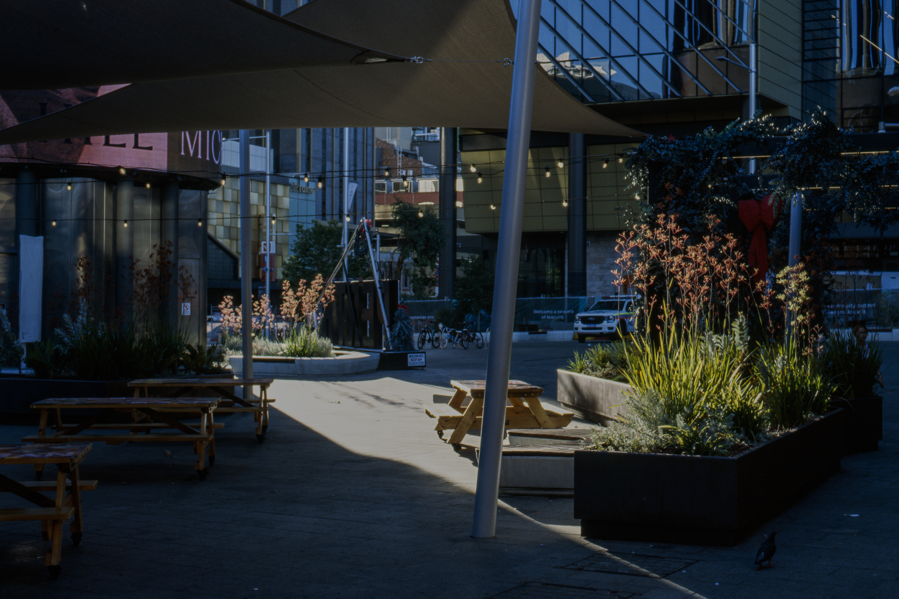
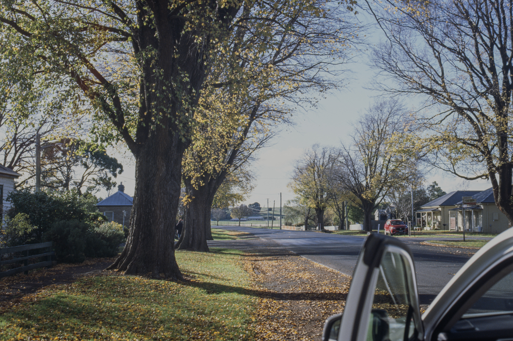
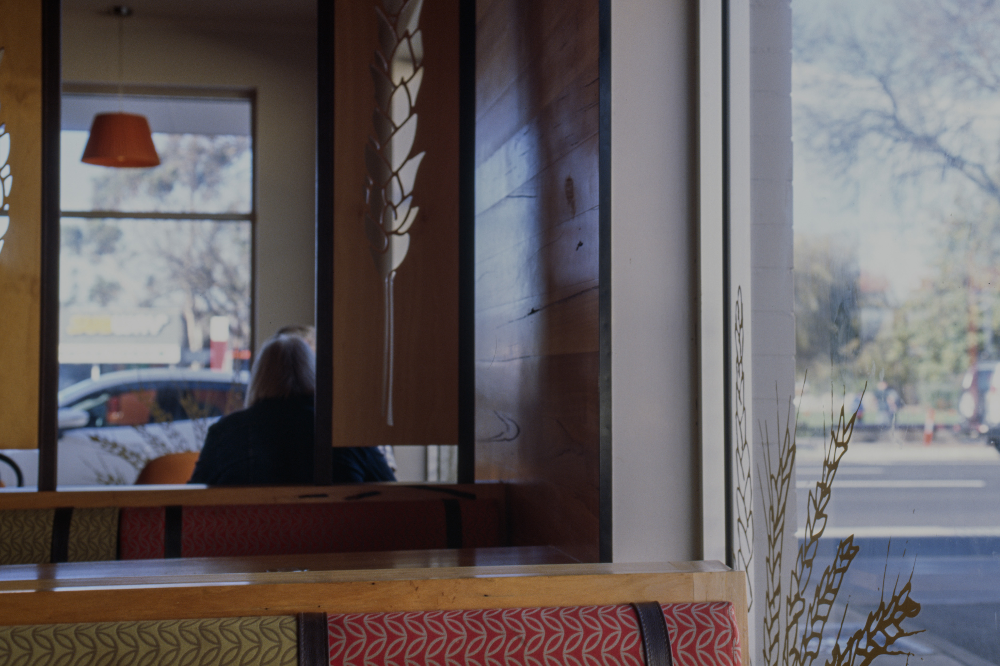
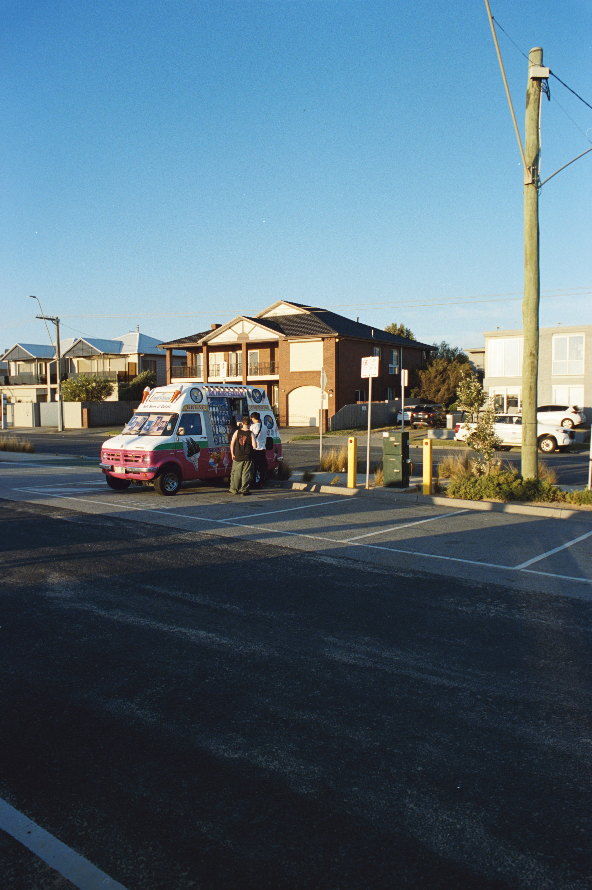
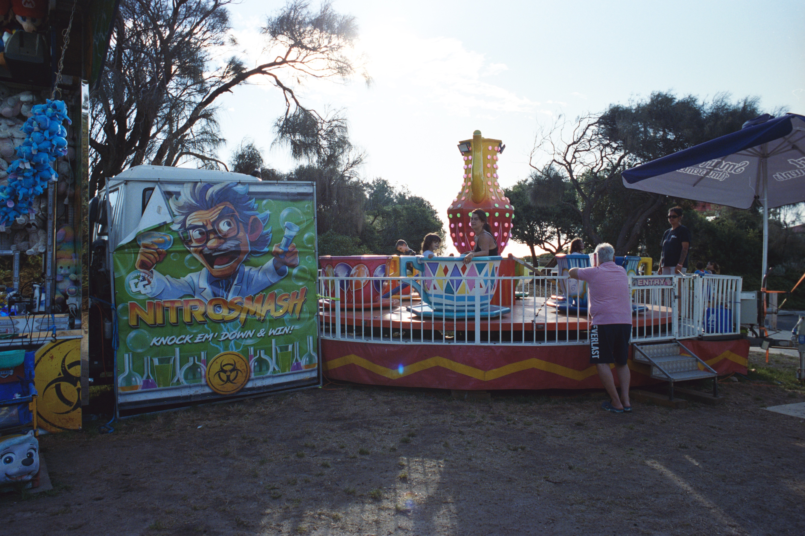
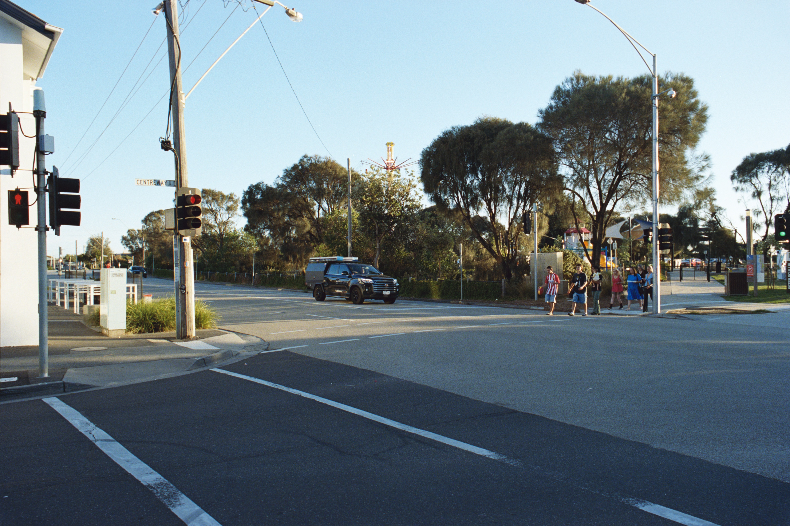
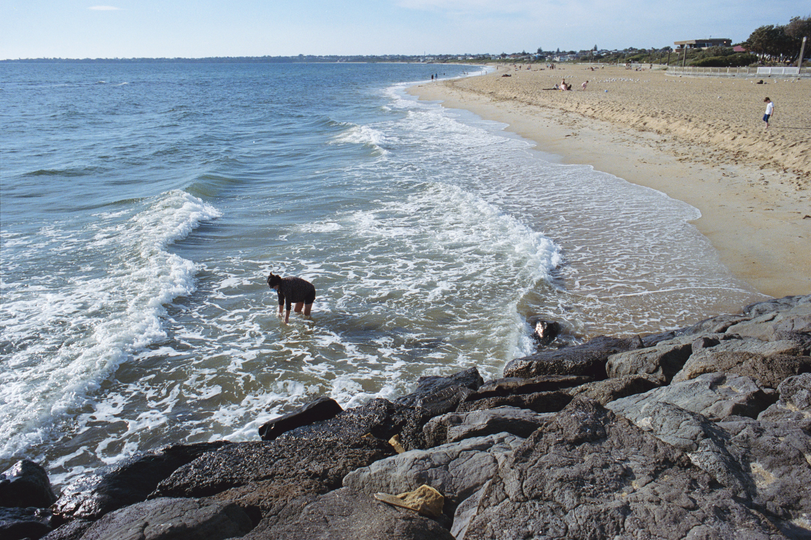
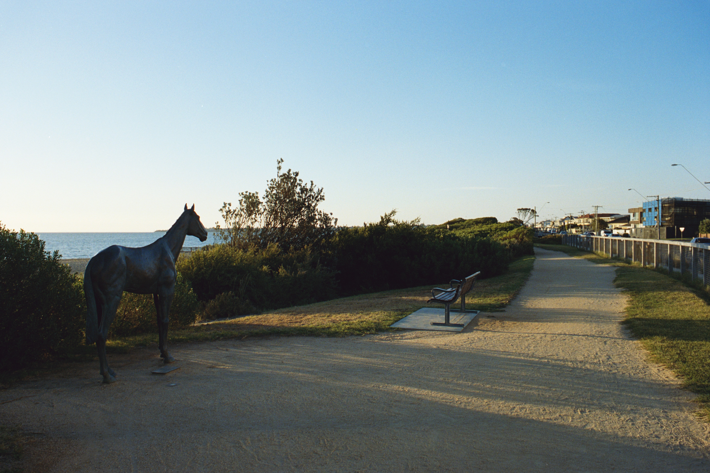
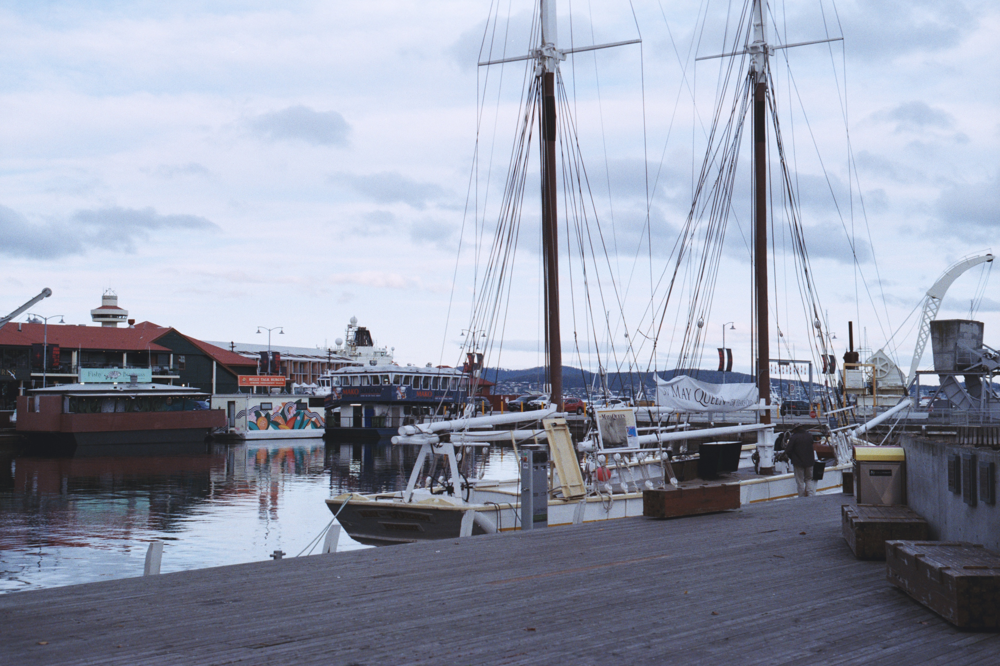
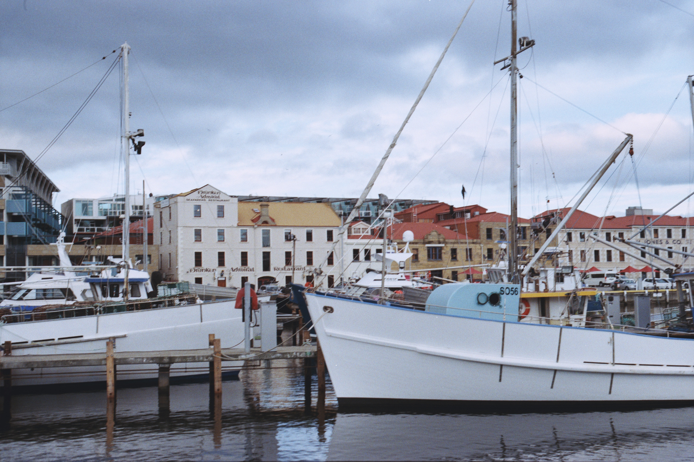

# Film Scan Calibration

Colour transforms for camera-scanned film, derived from manufacturer datasheets
rather than from curves adjusted by eye.

[Sample results](#sample-results) · [What this does](#what-this-does) · [How it works](#how-it-works) · [What is provided](#what-is-provided) · [Using the tables](#using-the-tables) · [Scanning a roll](#scanning-a-roll) · [Regenerating the tables](#regenerating-the-tables) · [Building for another apparatus](#building-for-another-apparatus) · [Limitations](#limitations) · [Documentation](#documentation) · [Related projects](#related-projects) · [Licence](#licence) · [Credits](#credits)

## What this does

Camera scanning produces a raw file whose colour depends on the light source,
the sensor and, for colour negative film, the orange colouration inherent to
the film itself. The prevailing remedy is a set of per-channel curves adjusted
until a known grey renders as grey. This project instead models the optical
behaviour of the film from published spectral data and lands the result on a
defined colorimetric standard. Every transform is generated by script from
manufacturer datasheet measurements, and no stage inspects the content of the
photograph.

> [!IMPORTANT]
> This is a research pipeline. It was developed on one apparatus, a Sony a7R III
> with a narrowband LED light source, and none of its output has been checked
> against a physical reference measurement. Please read
> [Limitations](#limitations) before relying on any figure quoted here.

### Common questions

<details>
<summary><b>What is being published?</b></summary>

A method, an implementation of it, and one worked
instantiation. The method derives a transform from the film's published
spectral behaviour and the measured spectrum of the apparatus reading it; the
engines in `engine/` do that and emit lookup tables; the forty-five `.cube`
files are what one particular light source produces. Anyone holding the two
apparatus measurements can build the equivalent for their own rig from the
same engines and the same film data.

</details>

<details>
<summary><b>How does this differ from adjusting curves until a grey renders grey?</b></summary>

Neutral alignment solves for whatever transform makes one reference patch
neutral, and that solution is not unique: many transforms neutralise the same
patch while disagreeing everywhere else. Here the transform is fixed by
published spectral data before any frame is examined, and lands on Status M
density, CIE XYZ under D50 or, for motion picture negative, the scene exposure
that the stock's own characteristic curves record. The cost is rigidity: a
neutral alignment adapts to any apparatus, where these tables are built for
one.

</details>

<details>
<summary><b>Why does no stage inspect the photograph?</b></summary>

A stage that reads image content
cannot distinguish a colour cast from a coloured scene. Nothing here samples a
patch or estimates an illuminant, so the light a frame was shot in survives
into the output and every frame on a roll receives an identical transform.

</details>

<details>
<summary><b>Why take the film's behaviour from published data rather than from the roll?</b></summary>

This project measures the apparatus and takes the film from published
spectra. Reading a known target through the whole chain is more adaptive and
needs no literature, but yields one fused number with no way to attribute an
error. Separating the two is what allows a systematic to be named and bounded
rather than absorbed.

</details>

<details>
<summary><b>Is narrowband illumination a requirement?</b></summary>

Yes, and it is the only
constraint the method places on an apparatus. Each exposure must interrogate
the film at close to a single wavelength, which keeps channel crosstalk small
at the point of measurement rather than leaving it to be unmixed afterwards.
The wavelengths themselves are not prescribed, since the engines integrate
whatever spectrum is supplied. A broadband source is outside the design and no
part of this pipeline models one.

</details>

<details>
<summary><b>What does it take to build these for a different apparatus?</b></summary>

Two
measurements, of which one is usually free: the illuminant spectrum and, for a
Bayer camera, its sensitivity. A monochrome sensor of constant response cancels out of a density
measurement, and `data/cameras/` holds measured sensitivities for forty-four
Bayer bodies. Of the forty-six tables only the twenty-one that convert a scan
into a standard or into the scene are rebuilt; the twenty-four print tables
take Status M density as their input and are valid on any apparatus.
[Building for another apparatus](#building-for-another-apparatus) gives the
formats and the metrics to read afterwards.

</details>

<details>
<summary><b>Does a different camera change the result?</b></summary>

By a bounded amount, mostly in
dense tones: under 0.007 D in a light tone, rising to 0.17 D at a dense
saturated colour across the forty-four measured sensitivities, read through a
colour negative's orange mask as the tables are. Below roughly a third of
maximum density the sensor is a second-order term. Naming a camera at build
time removes the approximation rather than bounding it.

</details>

<details>
<summary><b>Has any of this been checked against a physical measurement?</b></summary>

No. The
single external comparison available is qualitative, and every quantitative
figure in this repository is otherwise the model reporting on itself. The
missing test is a grey-ramp exposure series, a ColorChecker frame and
colour-separation wedges, exposed on film and read on a spectrophotometer.

</details>

<details>
<summary><b>Can these tables tell one colour negative stock from another?</b></summary>

Partly. The
modelled dyes cannot, three curves being inferred from one aggregate published
curve, which cannot determine three components. The orange masks do differ,
read directly from the datasheets with no inference, but that difference
reaches the print tables away from the neutral axis only.
[Limitations](#limitations) gives both figures.

</details>

<details>
<summary><b>May these tables be used commercially?</b></summary>

Yes, with attribution on the data.
[Licence](#licence) gives the terms, which differ between the code, the tables
and the imported camera sensitivities.

</details>

## Sample results

Frames from the author's own rolls, published unmodified at their exported
resolution. Every image carries an embedded Display P3 profile, so a
colour-managed browser renders it as intended.

### Reversal, through `E100_XYZ_D50.cube`



 

*Ektachrome E100 at the top, Ektachrome 100D (5294) in the pair beneath it. One
table serves both: `EktachromeE100_dye_density.json` covers E100 and
100D/5294–7294 together, the two sharing an emulsion and their dye curves
agreeing to 0.006–0.011 D.*

> [!NOTE]
> These three frames are **high dynamic range**. They were exported from
> Lightroom as JPEG carrying an ISO 21496-1 gain map, and are published here
> unmodified. On a display and browser that support gain maps they render with
> highlights above diffuse white; elsewhere they fall back to their standard
> dynamic range base rendition and appear as ordinary images. Any resize
> discards the gain map, so no reduced version of these three can exist.

### Colour negative, through RA-4 print emulation

  <br clear="all">

 

 

*The first five frames are Portra 400 printed onto Endura Premier, the final
pair Fujicolor 100 onto Fujicolor Pro Laser. Each stock is paired with the paper
of its own manufacturer.*

The print rendering is a deliberate choice rather than a measurement, as
[Limitations](#limitations) sets out: the print stage has no verified
reference. These frames are shown as delivered rather than as the print table
alone returns them, so they carry the author's own `Print Adjustment` trim,
the gamma about the pivot lowered to soften contrast. That node is optional,
and its defaults leave the image untouched.

## How it works

A scan enters as linear data and leaves ready to grade, by way of a defined
density standard or, for Vision3, of a decode through the stock's own
characteristic curves to the scene. The only measurement the chain takes from
the roll is the density of its own clear film base.


*The same frame after each node of the colour negative chain.*

The image is still a negative in panels 1 and 2. The logarithm taken in panel 3
is what produces a positive, and no stage performs a tone flip.
[docs/resolve.md](docs/resolve.md#what-each-node-does) reads the sequence node
by node, and [docs/method.md](docs/method.md) sets out why each stage exists.

## What is provided

Forty-six lookup tables in DaVinci Resolve `.cube` format, on a 65³ grid,
covering three processes: forty-five from the engines in `engine/`, and one
scene-referred Status M to DaVinci Wide Gamut table for Portra 400 produced by
an unpublished engine and retained for comparison.

- **Colour negative (C-41)**, twelve stocks: Portra 400, Portra 160, Ektar 100,
  Gold 200, Ultra Max 400, Pro Image 100, Portra 800, Fujifilm 400, Fujifilm
  200, Fujicolor 100, Superia Premium 400 and Pro 400H. Each lands on Status M
  density, and on an RA-4 print emulation in both standard and high dynamic
  range.
- **Reversal (E-6)**: Velvia 100, Velvia 50, Provia 100F and Ektachrome
  E100/100D, landing on colorimetric D50 XYZ.
- **Motion picture (ECN-2)**: the Kodak Vision3 family, 50D, 250D, 200T and
  500T. The family lands on ADX16 code values (SMPTE ST 2065-3) over Academy
  Printing Density, from one shared table, as an entry into an ACES timeline:
  once the printer-light trims are dialled on a known neutral, the ACES
  rendering delivers a faithful, pleasing image with no further grading. A
  secondary, scene-referred route lands each stock on scene-linear DaVinci
  Wide Gamut through its own characteristic curves and spectral
  sensitivities, the accuracy reference for graded work.

Accompanying the tables are a per-roll anchoring tool with a graphical
interface, two raw-to-EXR converters (one for colour sensors, accepting
single-shot raw files from any Bayer-sensor camera and Sony pixel-shift
composites, and one for sensors with no colour filter array), and the DCTL
nodes that form the Resolve chain.

Of the forty-six, the **twenty-four print tables depend on neither the camera
nor the light source**: their input is normalised Status M density, a
published standard, so they are valid on any apparatus without qualification.
The twenty-one tables that convert a scan into a standard or into the scene
are the ones built for a monochrome sensor.

> [!NOTE]
> Every table is regenerated by a script in `engine/` from data in `data/`. No
> table has been adjusted by hand.

## Using the tables

Only DaVinci Resolve is required to grade material that has already been
scanned and measured.

1. Download the `.cube` files for the stock being graded from the
   [latest release](../../releases/latest).
2. Copy them, and the contents of `dctl/`, into Resolve's LUT folder, then set
   **3D Lookup Table Interpolation** to **Tetrahedral**.
3. Build the node chain for the film process concerned, following
   [docs/resolve.md](docs/resolve.md).

## Scanning a roll

A frame is captured as three exposures rather than one: the light source's
red, green and blue channels are fired one at a time, producing three raw
files per frame in that order. Aperture, ISO and the LED drive level are fixed
once for the roll, and each channel keeps one exposure time throughout, chosen
so that the clear film base stays below sensor clipping. One further frame set
feeds the measurement step, the roll's own clear film reference; plain light
with no film in the gate is optional.
[docs/resolve.md](docs/resolve.md#scanning-a-roll) gives the capture procedure
in full.

Two programs then run before Resolve, and the tables assume both:

```
raw captures  →  raw_to_exr.py       →  linear EXRs      ─┐
                                                          ├→  Resolve
              →  roll_anchor_gui.py  →  Dmin R/G/B       ─┘
```

**`engine/scan/raw_to_exr.py`** merges the three narrowband exposures of each
frame into one ZIP-compressed half-float linear EXR, which Resolve imports
unmodified. Run it with no arguments for an interactive session, or drive it
directly:

```bash
python3 engine/scan/raw_to_exr.py --in-dir /path/to/roll --mode superpixel --no-flats
```

`--mode superpixel` serves ordinary single-shot captures and
`--mode pixelshift` a pixel-shift composite. The reader routes on what the
file contains rather than on its extension, and refuses a file whose structure
does not match the mode requested. `--flats R G B` names three captures made
with no film in the gate, one per channel in that order, from which a
vignetting-only correction is fitted; `--no-flats` omits it. The three flat
frames are also merged and written as `plain.exr` beside the numbered frames,
which is the plain-light set the anchor tool measures against.

**`engine/scan/mono_to_exr.py`** is the companion for a sensor with no colour
filter array, whether built that way or converted by having the array
stripped. It is a separate program because the two cases decode by different
rules and a stripped array cannot be told from an intact one by anything
recorded in the file: choosing the engine is how the operator declares which
sensor took the frames. A monochrome frame measures one quantity per site, so
nothing is binned and the mode distinction does not apply; frames are read at
full resolution, and a pixel-shift composite is averaged across its planes.
The colour engine contains no monochrome path: passing a monochrome file to it
either fails, the file carrying no pattern to bin, or, for a converted body
still reporting its original Bayer metadata, silently halves the resolution
and draws the three channels from different sites.

```bash
python3 engine/scan/mono_to_exr.py --in-dir /path/to/roll --no-flats
```

Both converters refuse a triplet whose captures differ in size rather than
cropping to the smallest, since a mixed capture would otherwise merge into a
plausible but misregistered frame. They and the anchor tool's numeric core are
guarded by `engine/scan/decode_selftest.py`, which runs with no arguments and
no sample files, stubbing what LibRaw would report, and exits non-zero on any
failure.

**`engine/scan/roll_anchor_gui.py`** then measures the roll from its clear film
reference, the developed clear leader for reversal and the unexposed rebate
for a negative, and writes `builds/anchors/<roll-id>.json`. A plain-light set
adds a datasheet-comparable density scale and the measured LED crosstalk,
neither of which Resolve needs. Run with no arguments it collects the frames
through file dialogues, opens a picker for the measured region of each, and
copies the three values Resolve needs to the clipboard.

```bash
python3 engine/scan/roll_anchor_gui.py
```

Neither program is tied to a particular body. Exposure time is read from the
file and divided out, so the frames of a set may be exposed differently from
one another, and a D-max patch is reached by lengthening its exposure.
Sensitivity is not read: density is a ratio between two frames, in which a
sensor gain common to both cancels, so any camera's base ISO is accepted.
Aperture and ISO must stay fixed across a frame set, since a change in either
breaks that cancellation; the anchor program refuses an aperture that drifts
and warns, naming the frames, on an ISO that does.

> [!WARNING]
> The anchor file reports D-min against two zero points when a plain-light
> set is supplied. Enter **`dmin_exr_scale`** into `RollAnchor_ScanPrep.dctl`,
> not the plain-light `dmin`. On this apparatus the two differ by
> approximately +0.24, +0.58 and +0.93 D in R, G and B, and the plain-light
> values drive green and blue past the pre-shaper's clamp, returning a
> strongly yellow-green frame.

[PROJECT.md](PROJECT.md) documents every option of both programs and the
portions of the decode path that remain untested.

## Regenerating the tables

Everything the engines require is in `data/`, so a fresh clone reproduces every
table without the datasheet PDFs:

```bash
python3 engine/c41/c41_statusm_engine.py --stock portra400
```

Each engine reports its own accuracy as it finishes, and no table is committed
that its script does not reproduce. Building requires `numpy`, `scipy` and
`colour-science`; the scanning programs additionally require `rawpy`,
`OpenEXR`, `tifffile` and `matplotlib`. Re-running the datasheet tracers,
necessary only to add a stock, requires `pdfminer.six`, `pdfplumber` and
`PyMuPDF`. [BUILDING.md](BUILDING.md) records the command behind every table.

## Building for another apparatus

Each engine integrates the product of the illuminant spectrum and the sensor's
spectral response. Of the four inputs to that integral, the dye curves, the
target responsivity and, on the print path, the paper are properties of the
film and of published standards and need no change. Only the two apparatus
terms do. Physically, an apparatus comprises a light source whose red, green
and blue channels are narrowband and can be fired one at a time, a camera
focused on the film, a means of holding the film flat between them, and a
one-time measurement of each channel's spectrum; the engines see the apparatus
only through that measurement and, where one is named, the sensor's response.

### The sensor, and why the tables assume none

A monochrome sensor has no colour filter, so one response curve serves all
three exposures. Its overall level cancels out of a density measurement, which
is a ratio of two integrals, and a constant response moves no modelled density
by more than 2 × 10⁻¹⁶ D. Its spectral shape does not cancel: the curve stays
inside both integrals, weighted by each LED's emission, so its variation
across the band each LED actually emits, tails included, survives into the
density. Sharing one curve across three exposures does not make it flat. The
engines default to `--sensor none`, which assumes a unity response, no curve
at all and nothing synthesised in its place, and that is the build the
published tables come from; a response tilting by 1% per 10 nm is a scenario
rather than a measured bound on any sensor, and costs under 0.008 D up to a
dye density of 1.8.

### A Bayer camera

A colour filter breaks the cancellation, because the three channels no longer
share one curve. `data/cameras/` holds measured sensitivities for forty-four
interchangeable-lens bodies from Canon, Nikon, Sony, Fujifilm and Panasonic,
imported from the Academy Software Foundation's `rawtoaces-data` library;
`data/cameras/index.json` lists them with the EXIF model strings that identify
each and the alternative names the same body carries in different markets, and
[BUILDING.md](BUILDING.md#per-camera-builds) lists every body as `--sensor`
expects it. Naming one is the whole change:

```bash
python3 engine/c41/c41_statusm_engine.py --stock portra400 --sensor Nikon_Z_f
python3 engine/reversal/reversal_transform.py velvia50-narrowband-d50 --sensor Canon_EOS_R6
```

A named build writes to `builds/sensor-<Body>/` and cannot overwrite the
canonical tables; every cube records in its header which response built it.

`--sensor` accepts a path as readily as a name, so a curve measured or obtained
elsewhere needs no code change. The file is JSON with four keys: `ssf_bands`
holds the wavelengths in nanometres, and `red_ssf`, `green_ssf` and `blue_ssf`
the three responses at those wavelengths, as equal-length arrays on any
spacing over any range, each resampled onto the integration grid. Units do not
matter: each channel is normalised to unit sum, so a relative curve serves as
well as a calibrated one, and the three channels need not share a scale. What
must be right is the shape of each curve and the wavelength axis they share. A
**monochrome sensor with a measured quantum efficiency** is written the same
way, that one curve repeated into all three keys; that is exact, where the
`--sensor none` default is exact only to the extent the response is flat
across each LED's band.

**The reversal path needs its corridor chosen with the camera.** A colour
filter band-limits the light source's spectral tails, which changes how much
scanner density a dense transparency produces, and the cube's input domain
must cover it. The engine measures the requirement and prints it on every
build:

```
velvia50-narrowband-d50: corridor 5.00 D; this stock needs 4.75 D at dye 4.0
```

The published monochrome tables use **5.00**, and this project's own a7R III
build uses **5.25**, which covers Provia 100F's 5.08 D requirement. **5.25 is
not a general Bayer constant.** Determine it for the body in question by
building once and reading the line above, then rebuild with `--corridor` and
pair the cubes with the matching shaper DCTLs
([BUILDING.md](BUILDING.md#the-reversal-corridor)). The colour-negative and
motion-picture paths need none of this: their 3.30 corridor is unaffected by
the sensor.

### The light source

A different set of LEDs requires its own measured spectrum, in the form of
`data/equipment/film_scanner_SPD_combined.csv`: a `wavelength_nm` column
running 380 to 780 nm at 1 nm, and one column per measured channel, of which
the engines read `R100_G0_B0`, `R0_G100_B0` and `R0_G0_B100`, the red, green
and blue channels at full drive. Absolute calibration is unnecessary, for the
same reason a monochrome sensor's efficiency is: each channel is normalised to
unit sum, so a per-channel scale factor cancels. Any spectrometer covering 380
to 780 nm at nanometre-scale resolution serves, calibrated or not; measure
each channel alone at full drive and interpolate onto the file's 1 nm grid.

The centre wavelengths need not match 640, 544 and 450 nm exactly, since the
integral is general, but each should fall near the absorption peak of one dye.
`portra_decompose.py` reports the condition number of the resulting crosstalk
matrix, which for this light source runs 1.34 to 1.64 across the twelve C-41
stocks. A value near 1.0 indicates that the three channels separate the dyes
cleanly, and a markedly larger one a light source whose channels do not
resolve them, from which no later stage recovers.

The illuminant measurement is the one irreducible piece of new work, no public
dataset supplying an equivalent for another rig, and it is the reason these
tables are described throughout as belonging to a single apparatus even though
they name no camera.

### Then rebuild and read the metrics

Every engine self-reports its node-solve residual, its interpolation error and
its serialised round trip as it finishes. The figures under **Current state by
stock** in [PROJECT.md](PROJECT.md) are what this apparatus produces, so a
materially worse residual after a substitution points at the new inputs rather
than at the engines. The per-roll anchoring step is unchanged and required in
either case.

## Limitations

> [!WARNING]
> Please read this section before relying on anything above.

- **No figure has been checked against a reference measurement.** The
  transforms behave as intended qualitatively on real scans, but every figure
  quoted in this repository is the model reporting on itself. The missing test
  is a grey-ramp exposure series, a ColorChecker frame and colour-separation
  wedges, read on a spectrophotometer. On the reversal side a transmissive IT8
  target, which ships with per-batch reference colorimetry in the tables' own
  output space, would supply the same check from a single scan.
- **The C-41 stocks cannot be reliably distinguished by their modelled dyes.**
  No manufacturer publishes per-layer dye spectra for still film, so three dye
  curves are inferred from one aggregate published curve, and a single
  spectrum cannot determine three components.
- **Their orange masks do differ**, by 0.346 D across the twelve stocks, read
  directly from the datasheets without any dye inference. That difference
  reaches the print tables away from neutral only: greys render essentially
  identically between stocks by construction, while saturated colours differ
  by up to 5.5 ΔE2000. The print tables are metrically sound prints carrying
  a per-stock signature in saturated colour, not fingerprints distinguishable
  on a grey card.
- **Interimage effects are not modelled.** They arise during development, so a
  film that has been developed and scanned already carries them in its
  measured densities; the limitation is an inability to predict them from
  datasheet data rather than an error in the tables. Reversal film relies on
  them more heavily, a transparency having no orange mask to carry the same
  correction.
- **The print branch renders an idealised print, by design.** It reproduces
  the paper's colour treatment, dye set, per-layer characteristic curves and
  gray-axis lock, with no enlarger veiling flare, surface glare or viewing
  surround, none of which has a measured value. A physically viewed print sits
  softer than the render, and the adjustment node ahead of the print cube is
  the intended place to set final contrast. No physical print has been
  measured against the path, and the enlarger and viewing illuminants are
  nominal.
- **The tables embed this light source**, and that, rather than the camera, is
  what ties them to one apparatus. They name no camera: they are built for a
  monochrome sensor of constant spectral response, which cancels out of a
  density measurement. A response that varies across an LED's band does not
  cancel, and no monochrome sensor has been measured, so the sensor-free
  build is an approximation with no established bound; the error budget
  carries a labelled scenario in its place. Their illuminant is a measurement of one particular set
  of LEDs, and no public dataset supplies the equivalent for another rig.
- **A Bayer camera departs from them by an amount that grows with density.**
  Substituting each of forty-four measured camera sensitivity curves in turn,
  reading a colour negative through its orange mask as the tables do,
  displaces scan-space density by under 0.007 D in a light tone, rising to
  0.12 D at a dense neutral and 0.17 D at a dense saturated colour, the
  largest figures in the green channel because that LED is twice the width of
  the other two, and the mask, which passes red far better than blue, raises
  the weight of every LED's long-wavelength tail. Below roughly a third of
  maximum density the sensor is a second-order term; above it the
  displacement exceeds the project's own surrogate-basis uncertainty of
  0.034–0.063 D. No second physical camera has been used to scan film through
  the chain.
- **The reversal tables lose accuracy in the deepest shadows.** Sampled against
  the full chain, they hold to a maximum error of 0.002 D up to a dye density
  of 2.0 and 0.012 D up to 2.5, then degrade to 0.29 D by 3.4. A monochrome
  sensor, lacking a colour filter to band-limit the light source's spectral
  tails, cannot resolve the densest and most saturated states a transparency
  reaches, so the table holds the nearest colour the film can produce
  instead. Lowering the corridor from 6.0 to 5.0 D recovers part of it; the
  remainder is not recoverable by any corridor. A build named to a specific
  camera does not have this limitation, holding to 0.0009 D throughout. The
  colour-negative and ADX16 tables are unaffected, their round trip staying
  within 0.004 D across the range those films occupy.
- **The Vision3 scene tables lose precision at the top of a layer's
  published curve.** Their output is linear exposure, stored on a lattice
  that is uniform in density, so interpolation departs from the exact chain,
  under the engine's trilinear probe, by 2.2–2.6% on average within each
  stock's published characteristic span; 80–85% of that span lies in
  lattice cells whose corners all converged and sit within the published
  curves, at 2.1–2.5% mean and 10–12% at the 99th percentile, and the cells
  that straddle a curve's shoulder carry the tail, to 53%. Beyond either end
  of a published curve the inverse clamps rather than extrapolates, so no
  exposure the sheet never documented is synthesised. That tail is lattice
  error, reducible by finer sampling, sitting
  on a model that is itself steep at the shoulder, where a small density
  change is a large exposure change and every input error is amplified. The
  build declares an operating region, clean cells below a hundred times
  mid-grey, and reports it separately. The
  colour matrix behind them is fitted on measured reflectances to 2.2–2.8
  ΔE2000 mean, worst on saturated red, and no frame has been checked against
  a known scene.

[PROJECT.md](PROJECT.md) gives the evidence for each of these under **Known
limitations**, alongside the bounded systematics register that quantifies every
effect currently known to be present.

## Documentation

- **[docs/resolve.md](docs/resolve.md)**: using the tables; capturing and
  measuring a roll, and the node chain for each of the three processes.
- **[docs/method.md](docs/method.md)**: how the transforms are derived, and
  where their numbers come from.
- **[docs/explainer.html](docs/explainer.html)**: a visual walkthrough of the
  dye curves, the printable window and the stock-separation data, plotted
  from the repository's own files.
- **[BUILDING.md](BUILDING.md)**: the build runbook; the command behind every
  table, per-camera builds, and how the reversal corridor is determined for a
  new body.
- **[PROJECT.md](PROJECT.md)**: the full technical reference; engine
  documentation, every known systematic error, a glossary, and the invariants
  and known limitations of the pipeline.
- **[DATASHEETS.md](DATASHEETS.md)**: every source datasheet, with the
  publication code required to locate it.
- **[knowledge/](knowledge/)**: literature notes underlying the modelling
  decisions, each rating its sources for reliability.

## Related projects

Two open-source projects are named in this repository. Neither contributes
code or data to it, and both are cited because the boundary against them is
load-bearing.

**[NamiColor](https://github.com/Wavechaser/NamiColor)** (GPL-3.0) is a generic
film-scan lineariser, applying a logarithm followed by a per-channel gain and
offset aligned by eye against a neutral reference. The nodes here perform that
same channel-alignment step, differing in being spectrally derived and
metrically anchored, and one substitution fails: its negatives mode takes the
logarithm of a quantity that is already a density, which is not the inverse
that `Density to Linear.dctl` supplies. Nothing is taken, and the reciprocal
obligations of GPL-3.0 are not engaged.

**[spektrafilm](https://github.com/andreavolpato/spektrafilm)** (CC BY-SA 4.0)
is a forward film simulator that arrives independently at the same
datasheet-spectral principles. Two architectural ideas are adopted from it,
the DIR matrix as an interimage stage and grey-ramp pre-compensation; both are
implemented independently here, and neither gates a shipped table, the
interimage stage standing at identity throughout. Its measured quantities are
deliberately not used, on evidential grounds (its per-stock dye densities
originate in an unpublished refinement of a generic seed) and on licensing
grounds (its terms treat a lookup table as a direct encoding of the profiles
behind it, so a `.cube` derived from that data would carry share-alike terms
the tables here do not). [PROJECT.md](PROJECT.md) sets out both boundaries in
full, including the evidence for treating the spektrafilm representation as
crosstalk unmixing conflated with the orange mask.

## Licence

The code in `engine/` and `dctl/`, and the documentation, are [MIT](LICENSE).
The released `.cube` files and the digitised data in `data/` are
[CC BY 4.0](LICENSE-DATA), with attribution required on redistribution. The
one exception is `data/cameras/`, the measured camera sensitivity curves,
imported from the Academy Software Foundation's `rawtoaces-data` library and
remaining under its Apache-2.0 licence.

The manufacturer datasheets are copyright Kodak, Kodak Alaris and Fujifilm,
and are **not** distributed here. They are freely available published product
literature, and [DATASHEETS.md](DATASHEETS.md) gives the publication code for
each. The digitised curves in `data/` are this project's own tracing of those
documents, and the pipeline builds from `data/` alone, so the PDF files are
required only to re-run the digitisers.

## Credits

Built by [OwlMightyCh](https://github.com/OwlMightyCh) with
[Claude](https://claude.com/claude-code) (Anthropic), specifically Opus 5,
Opus 4.8, Fable 5 and Fable 5.1, which contributed to the engines, the
datasheet digitisers, the methodology reviews and the documentation.
Individual commits carry `Co-Authored-By` trailers naming the model that
worked on them. GPT-6 Astra (external methodology reviewer) audited the
methodology: it reproduced the error budget, the artifact probes and the
Academy comparison independently and identified the defects in the budget's
sign symmetry, patch reachability and basis propagation, the scene tables'
operating-region test, and the monochrome-cancellation wording, each of which
is now corrected.

Direction, the physical apparatus, every measurement decision and the
determination of what counts as evidence are the author's.
