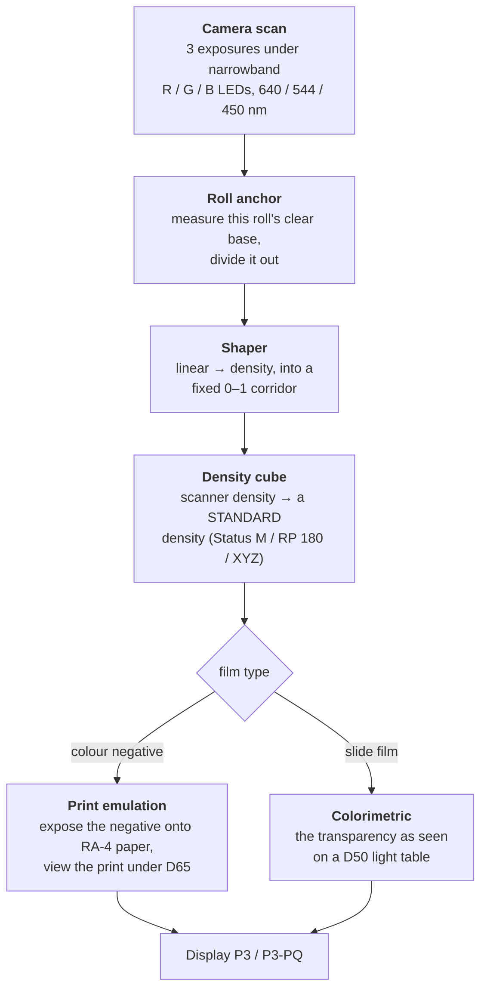
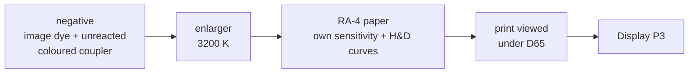

# Film Scan Calibration

**Colour transforms for camera-scanned film, derived from manufacturer
datasheets instead of eyeballed curves.**

If you scan film with a digital camera, you end up with a raw file whose colours
depend on your light source, your sensor, and — for negatives — a strong orange
cast that is not a filter you can simply take back off. The usual fix is
per-channel curves, nudged by eye until a grey card looks grey.

That works, but it bakes your rig's idiosyncrasies into every frame, and it
gives you no way to say what the numbers *mean*. This project takes the other
route: model the physics end to end, and land on a defined, published metric.

The output is a set of `.cube` LUTs you drop into DaVinci Resolve.

---

## The idea in one picture



Three things make this different from a curves-and-vibes workflow:

**Narrowband light.** Three sequential exposures under narrow R/G/B LEDs instead
of one white-light shot. Each LED lands on one dye layer, so the channels barely
contaminate each other — the crosstalk you'd otherwise have to unmix by eye
mostly never happens.

**A defined destination.** Each transform targets a published standard, not a
look: Status M density for colour negatives (the space their datasheets are
printed in), SMPTE RP 180 printing density for motion-picture negative, and CIE
XYZ for slides. Your grade then starts from a number that means something.

**Nothing here looks at your picture.** Every step is either a fixed physical
constant or a measurement taken off the roll itself — the anchor reads unexposed
film base, light that never formed an image. No stage inspects image content, so
there is no auto-neutralising, no auto-exposure, nothing that decides what your
photograph should look like.

That has a payoff worth stating plainly: **the light you shot in survives**. A
tungsten-lit frame stays warm. A roll shot as the light changed comes back with
the change intact, rather than with every frame independently neutralised and the
sequence flattened. You can always take a cast out later in the grade; you cannot
put back one that an automatic estimator removed. (What survives is the light as
this film and this paper render it — not a colorimetric measurement of the
illuminant.)

---

## Why a negative goes to *paper*, not to "a positive"

A colour negative is not a picture with the colours backwards. It is an
intermediate, engineered to be printed onto a specific paper.

**And the orange is not a layer.** There is no sheet of orange in the film. Real
image dyes absorb light they aren't supposed to — the cyan dye soaks up some
green and blue, the magenta some blue — and colour negative film corrects that
with *coloured couplers*: the chemistry that forms magenta and cyan dye is
itself coloured (yellow and pink respectively) before it reacts. Where the
image develops, that coupler is consumed and its colour goes with it. What you
see as orange is the coupler that *didn't* react.

That makes it self-adjusting rather than a fixed tint. Wherever image dye is
missing its unwanted absorption, the leftover coupler supplies exactly that
much — so dye plus surviving coupler add up to a near-constant unwanted
absorption at every exposure level, and the printing step removes a constant.
It also means the orange is a **positive** image: densest where the least
image dye formed, thinning out as exposure rises.

So the mask isn't a defect to subtract. It's half of a correction whose other
half is the print — and inverting a negative in log space throws the design
away. (Sourcing: `knowledge/orange-mask-and-the-scanning-workflow.md`, after
Hanson's 1950 paper on colour correction with coloured couplers.)
This project instead simulates the darkroom: reconstruct the negative's dye
amounts, shine an enlarger through it, expose real RA-4 paper, develop it, and
look at the resulting print under D65.



Papers are paired the way a lab would pair them: **Kodak negatives print to Kodak
Endura Premier, Fujifilm negatives to Fujicolor Pro Laser.** And because the
paper — not the film — sets how much you can print, the usable exposure window
is a property of the paper: about 0.93 OD on Endura, 1.13 OD on the
lower-contrast Fuji.

There are darkroom controls where a darkroom actually has them: enlarger
exposure, printer-light colour balance, and veiling flare. All default to
no-ops.

---

## What's in the box

| | |
|---|---|
| **Colour negative (C-41)** | 10 still stocks — Portra 400/160, Ektar 100, Gold 200, Ultra Max 400, Fujifilm 400/200, Fujicolor 100, Superia Premium 400, Pro 400H. Each with a Status M cube and an RA-4 print emulation (SDR + HDR) |
| **Slide film (E-6)** | Velvia 100, Velvia 50, Provia 100F, Ektachrome E100/100D — colorimetric D50 XYZ |
| **Motion picture (ECN-2)** | Kodak Vision3 → Cineon / RP 180 printing density |
| **Also** | per-roll anchor tool with a GUI, raw→EXR converter, and the DCTLs for the Resolve node chain |

Everything is regenerated by scripts in `engine/`, from data in `data/`. No cube
is hand-tweaked.

---

## Where the numbers come from

Manufacturers publish characteristic curves and spectral dye-density charts as
*vector artwork* inside their PDF datasheets. This project extracts the actual
path geometry — the drawn lines themselves — rather than sampling pixels off a
rendered image. Axis calibration lands around 0.001 log-exposure and 0.02 nm.

That precision is easy to fool, though, so tracing is only step one of four:

1. **Forensics** — report how every chart is drawn and what its axes really say
2. **Render it and LOOK** — some facts are written on the chart in words
3. **Extract** the path geometry
4. **Overlay the result back onto the printed ink** — if the curve lands on the
   line, the frame detection, axis origin, axis step and sampling are all right
   at once

Step 4 matters more than any goodness-of-fit number. Evenly spaced gridlines fit
*any* origin and *any* step with zero residual, so a clean fit proves nothing —
which is exactly how three separate axis errors slipped through unnoticed before
the overlay existed.

One rule sits above all of this: **a value nobody measured never enters a fit.**
Where a datasheet's data ends, the model stops. Extrapolating a plausible tail is
how you get a confident wrong answer.

---

## Honest limitations

Please read this part before trusting anything above.

- **It works in practice, but none of the numbers have been measured against a
  reference.** The transforms are in real use on real scans and behave as
  intended qualitatively. What's missing is the quantitative half: a grey-ramp
  exposure series, a ColorChecker frame, and colour-separation wedges read on a
  spectrophotometer. Until that roll is shot and measured, every figure quoted
  here is the model reporting on itself — however good the output looks.
- **The C-41 stocks are not reliably distinguishable from each other.** No
  manufacturer publishes per-layer dye spectra for still film, so each stock's
  three dye curves are *inferred* from one aggregate published curve. One
  spectrum cannot determine three components. The resulting stocks land close
  enough together that, for most pairs, the pipeline cannot separate a real
  difference from an artifact of that inference. Treat the print cubes as
  metrically sound prints, not as stock fingerprints.
- **Interimage effects are not modelled** — the layer-to-layer inhibition that
  manufacturers deliberately design in, and one likely reason stocks look
  different in ways this model can't reproduce.
- **The print path has not been compared with a physical print**, and the
  enlarger and viewing illuminants are nominal rather than measured.

- **The LUTs are camera-specific — but less than you might expect.** Every cube
  is built by integrating the film's dyes against `LED spectrum × this camera's
  colour filter array`, so the sensor's spectral sensitivity is formally baked
  in, and a different camera should be given its own rebuild with its own
  sensitivity curves (the scripts take those as data, so it's cheap).

  Narrowband illumination keeps that dependence small, though. The LEDs are
  15 / 32 / 15 nm wide, so each one samples the film at nearly a single
  wavelength and the sensor's sensitivity enters as close to a per-channel
  scalar — which then cancels in the density *ratio*. Perturbing the sensitivity
  curves to stand in for a different camera moves scan-space density by mean
  0.006–0.022 D (worst case 0.16 D), i.e. below this project's own
  surrogate-basis uncertainty of 0.030–0.105 D. A broadband white-light scan
  would have no such protection. Caveat: that's a perturbation test, not a
  second real camera, so treat it as indicative.

  (The sensitivity data used here is the a7R II's, applied to an a7R III on the
  grounds of a shared sensor generation. That substitution is unquantified, but
  the figures above suggest it is a small error.)

This is a research pipeline, not a product. It's built for one specific rig
(Sony a7R III, narrowband LED light source) and shared in case the method is
useful.

---

## Getting the LUTs

The built `.cube` files are attached to the latest
[release](../../releases/latest), not carried in the repository — they are
280 MB of the tree, and shipping them separately keeps a clone small and stops
every rebuild from adding another copy to git history.

Download them there, or build them yourself from `data/`, which is all the
engines need:

```
python3 engine/c41/c41_statusm_engine.py --stock portra400
```

## More

- **[PROJECT.md](PROJECT.md)** — the full technical reference: engine docs, the
  Resolve node chains, every known systematic, a glossary, and the invariants
  and known limitations of the pipeline
- **[DATASHEETS.md](DATASHEETS.md)** — every source datasheet, with the
  publication code needed to find it
- `knowledge/` — literature notes behind the modelling choices

## Licence

- **Code** — `engine/`, `dctl/`, documentation: [MIT](LICENSE)
- **LUTs and data** — the released `.cube` files and `data/`:
  [CC BY 4.0](LICENSE-DATA), so credit the project if you redistribute them

The manufacturer datasheets themselves are copyright Kodak, Kodak Alaris and
Fujifilm, and are **not** distributed here. They are freely available published
product literature; [DATASHEETS.md](DATASHEETS.md) gives the publication code
for each one. The digitised curves in `data/` are this project's own tracing of
them, and the pipeline builds from those — you do not need the PDFs unless you
want to re-run the digitisers.

---

*A visual walkthrough of the same material — with the dye curves, the printable
window and the stock-separation data plotted from the repo's own files — is in
[`docs/explainer.html`](docs/explainer.html).*
