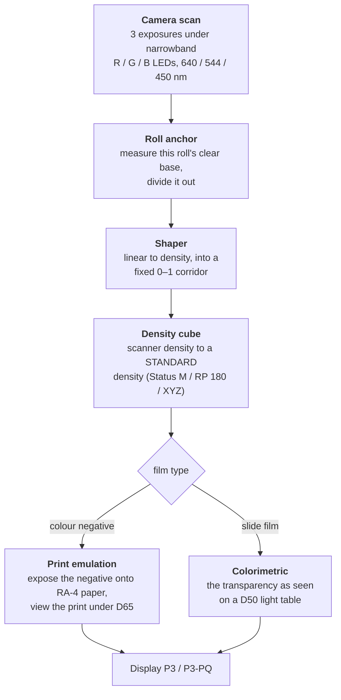
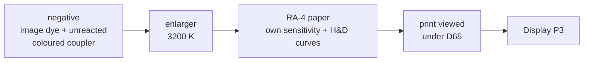

# Method: how the transforms are derived

This document sets out what the pipeline does to a scan and why, and states
where its numbers come from. It is the argument for trusting the tables. The
operational counterpart, covering how to build the node chains in DaVinci
Resolve, is [resolve.md](resolve.md); the exhaustive technical reference is
[PROJECT.md](../PROJECT.md).

---

## Background: how a colour negative forms an image

The remainder of this document assumes some familiarity with the following six
ideas. Readers who already work with film densitometry may proceed to
[the pipeline itself](#the-pipeline-and-what-distinguishes-it).

**Three layers, three dyes.** Colour film carries three light-sensitive
emulsion layers, sensitised to blue, green and red light respectively.
Development converts the invisible latent image in each layer into a
corresponding dye: yellow in the blue-sensitive layer, magenta in the
green-sensitive layer, cyan in the red-sensitive layer. Each dye absorbs the
colour of light its layer recorded, which is what makes the record a negative.

**Density.** The standard measure of how much a developed area absorbs is
optical density, defined as the base-ten logarithm of the reciprocal of
transmittance. A density of 1.0 passes one tenth of the incident light, and 2.0
passes one hundredth. Density is the natural working unit throughout this
project, because dye absorptions add in density and because film manufacturers
publish their measurements in it.

**The characteristic curve.** Plotting density against the logarithm of
exposure gives the characteristic curve, sometimes called the H&D curve after
Hurter and Driffield. It describes how a stock converts light into dye, and
each of the three layers has its own. The curves published in datasheets are
the primary input to this project.

**Spectral dye density.** A given dye does not absorb only the colour it is
meant to. A datasheet's spectral dye density chart records, for each dye, how
strongly it absorbs at every wavelength across the visible spectrum. The
overlap between these curves is central to what follows.

**The orange colouration.** A processed colour negative appears orange even in
regions that received no exposure at all. The cause is a design feature rather
than a defect, and it is explained in
[Why a negative is printed onto paper](#why-a-negative-is-printed-onto-paper)
below. Understanding it correctly is the single most consequential piece of
background for this pipeline.

**Densitometric standards.** A density reading depends on the spectral
sensitivity of the instrument that made it, so densities are quoted against
named standards. **Status M** is the standard for colour negative material and
is what appears on C-41 datasheets. **SMPTE RP 180** printing density describes
what a motion picture printer sees through the negative. **CIE XYZ** describes
colour as a human observer would measure it, and is appropriate for reversal
film, which is viewed directly.

---

## The pipeline, and what distinguishes it

Three properties distinguish this method from a curve-based workflow.

### Narrowband illumination

The film is exposed three times in succession, under red, green and blue
light-emitting diodes of 640, 544 and 450 nm, with spectral widths of 15, 32
and 15 nm at half maximum. A conventional scanner illuminates the frame with
white light and separates the channels at the sensor, which means each sensor
channel integrates light that has passed through all three dye layers. The
resulting channel contamination, or crosstalk, must then be undone.

Under narrowband illumination each exposure interrogates the film at what is
close to a single wavelength, chosen to fall where one dye dominates. The
crosstalk is therefore small at the point of measurement rather than removed
afterwards. A useful consequence is described under
[Limitations](../README.md#limitations): because each exposure samples one
wavelength, the sensor's own spectral sensitivity enters the result nearly as a
per-channel constant, and largely cancels.

### A defined destination

Each transform terminates at a published standard, chosen to match the process:
Status M density for colour negatives, SMPTE RP 180 printing density for motion
picture negatives, and CIE XYZ for reversal film. A grade therefore begins from
a quantity with an external definition, and any intermediate value can be
compared directly against the manufacturer's own published curves.

### No stage inspects the image

Every operation is either a fixed physical constant or a measurement taken from
the roll itself. The per-roll anchor reads unexposed film
base, which is to say light that passed through a region where no image formed. Nothing performs automatic neutralisation, automatic
exposure, or any other estimate derived from picture content.

The consequence is worth stating explicitly: **the illumination under which the
photograph was made survives into the output.** A frame lit by tungsten remains
warm. A roll exposed as the light changed returns with that change intact,
rather than with each frame independently neutralised and the sequence
flattened. A colour cast can be removed later in the grade; a cast that an
automatic estimator has already removed cannot be restored. What survives is
the illumination as this film and this paper render it, which is a
photographic rather than a colorimetric record of the light source.

---

## Why a negative is printed onto paper

A colour negative is an intermediate product, engineered to be printed onto a
specific photographic paper. Treating it as a positive image with inverted
colours discards the design.

### The orange colouration arises from the couplers

The dye in each layer is formed during development by a compound called a
coupler, which reacts with oxidised developer at the sites where the latent
image is present. Real dyes have unwanted absorptions: the cyan dye absorbs
some green and blue light, and the magenta dye absorbs some blue. Left
uncorrected, these absorptions distort every printed colour, and they vary with
the image, so no fixed printing filtration can remove them.

Colour negative film corrects this using **coloured couplers**. The couplers
that form magenta and cyan dye are themselves coloured, yellow and pink
respectively, before they react. Where the image develops, the coupler is
consumed and its own colour disappears along with it. The orange seen on a
processed frame is the coupler that never reacted.

This mechanism is self-adjusting. Wherever image dye is absent, and its unwanted
absorption with it, the surviving coupler supplies exactly the missing amount.
Dye plus surviving coupler therefore sum to a nearly constant unwanted
absorption at every exposure level, and the printing stage removes a constant.
It follows that the orange is a **positive** image, densest where the least
image dye formed and thinning as exposure rises.

The orange colouration is consequently one half of a correction whose other half
is the print. Inverting a negative in logarithmic space performs neither half.
The mechanism is documented in
`knowledge/orange-mask-and-the-scanning-workflow.md`, following Hanson's 1950
paper on colour correction with coloured couplers.

### Simulating the darkroom

This project completes the correction the way a laboratory would. It
reconstructs the dye amounts present in the negative, passes enlarger light
through them, exposes a model of real RA-4 photographic paper, develops it, and
evaluates the resulting print under a D65 viewing illuminant.

Papers are paired with films as a laboratory would pair them: **Kodak negatives
print onto Kodak Endura Premier, Fujifilm negatives onto Fujicolor Pro Laser.**
Because the paper rather than the film determines how much of the negative can
be printed, the usable exposure window is a property of the paper. It measures
approximately 0.93 OD on Endura and 1.13 OD on the lower-contrast Fujifilm
paper.

The controls a darkroom actually provides are exposed as adjustable parameters:
enlarger exposure, printer-light colour balance, and veiling flare. All default
to values that leave the image unchanged.

---

## Provenance of the numbers

Manufacturers publish characteristic curves and spectral dye-density charts as
*vector artwork* within their PDF datasheets. This project extracts the path
geometry of the drawn lines themselves, in preference to sampling pixels from a
rendered image. Axis calibration achieves approximately 0.001 in log exposure
and 0.02 nm in wavelength.

That precision is readily misled, so tracing is only the third of four steps:

1. **Forensics.** Report how each chart is drawn and what its axes actually state.
2. **Render the chart and examine it.** Some facts are stated on the chart in
   words rather than drawn.
3. **Extract** the path geometry.
4. **Overlay the result back onto the printed ink.** If the extracted curve lands
   on the drawn line, then frame detection, axis origin, axis step and sampling
   are simultaneously confirmed.

Step 4 carries more weight than any goodness-of-fit statistic. Evenly spaced
gridlines fit *any* origin and *any* step with zero residual, so a clean fit
demonstrates nothing. The overlay is what catches an axis error, and three
distinct ones in this project are visible to it and to nothing else.

> [!IMPORTANT]
> One rule governs all of the above: **a value that nobody measured never enters
> a fit.** Where the data on a datasheet ends, the model stops. Extrapolating a
> plausible tail is the standard route to a confident wrong answer.

---

The tables these decisions produce are applied in Resolve as described in
[resolve.md](resolve.md). Every parameter, and every systematic error currently
known to be present, is catalogued in [PROJECT.md](../PROJECT.md).
