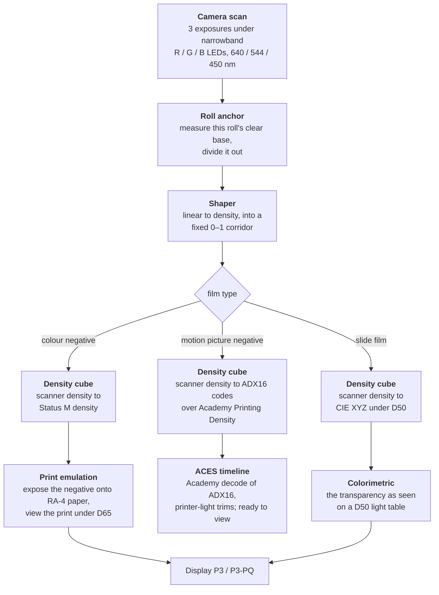
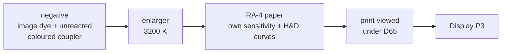
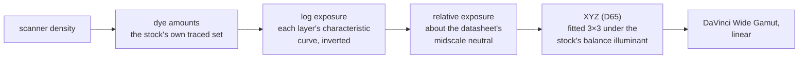

# Method: how the transforms are derived

This document sets out what the pipeline does to a scan and why, and states
where its numbers come from. It is the argument for trusting the tables. The
operational counterpart, the node chains in DaVinci Resolve, is
[resolve.md](resolve.md); the exhaustive technical reference is
[PROJECT.md](../PROJECT.md).

[The pipeline, and what distinguishes it](#the-pipeline-and-what-distinguishes-it) · [Why a negative is printed onto paper](#why-a-negative-is-printed-onto-paper) · [The motion picture negative's two routes](#the-motion-picture-negatives-two-routes) · [Provenance of the numbers](#provenance-of-the-numbers)

---

## Background: how a colour negative forms an image

Six ideas are assumed below. Readers who work with film densitometry may
proceed to [the pipeline itself](#the-pipeline-and-what-distinguishes-it).

<b>Three layers, three dyes · Density · The characteristic curve · Spectral dye density · The orange colouration · Densitometric standards</b>

**Three layers, three dyes.** Colour film carries three light-sensitive
emulsion layers, sensitised to blue, green and red light. Development converts
the latent image in each layer into a dye: yellow in the blue-sensitive layer,
magenta in the green-sensitive, cyan in the red-sensitive. Each dye absorbs the
colour of light its layer recorded, which is what makes the record a negative.

**Density.** Optical density is the base-ten logarithm of the reciprocal of
transmittance: a density of 1.0 passes one tenth of the incident light, 2.0
one hundredth. It is the working unit throughout, because dye absorptions add
in density and manufacturers publish their measurements in it.

**The characteristic curve.** Density against the logarithm of exposure, the
H&D curve after Hurter and Driffield, describes how a stock converts light into
dye; each of the three layers has its own. The curves published in datasheets
are the primary input to this project.

**Spectral dye density.** A dye does not absorb only the colour it is meant
to. A datasheet's spectral dye density chart records, for each dye, how
strongly it absorbs at every visible wavelength; the overlap between the
curves is central to what follows.

**The orange colouration.** A processed colour negative appears orange even
where it received no exposure. The cause is a design feature, explained under
[Why a negative is printed onto paper](#why-a-negative-is-printed-onto-paper),
and understanding it correctly is the single most consequential piece of
background for this pipeline.

**Densitometric standards.** A density reading depends on the spectral
sensitivity of the instrument that made it, so densities are quoted against
named standards. **Status M** is the standard for colour negative material and
appears on C-41 datasheets; **Academy Printing Density** (SMPTE ST 2065-2)
describes what a motion picture printer sees through the negative; **CIE XYZ**
describes colour as a human observer would measure it, appropriate for
reversal film, which is viewed directly.

---

## The pipeline, and what distinguishes it

The secondary route for motion picture negative, not drawn, decodes the same
scan through the stock's own dyes and characteristic curves to the scene,
delivered as scene-linear DaVinci Wide Gamut for graded work; both Vision3
routes are set out under
[The motion picture negative's two routes](#the-motion-picture-negatives-two-routes).
Three properties distinguish this method from a curve-based workflow.

### Narrowband illumination

The film is exposed three times in succession, under red, green and blue
light-emitting diodes of 640, 544 and 450 nm, with spectral widths of 15, 32
and 15 nm at half maximum. A conventional scanner illuminates the frame with
white light and separates the channels at the sensor, so each sensor channel
integrates light that has passed through all three dye layers, and the
resulting crosstalk must be undone afterwards. Under narrowband illumination
each exposure interrogates the film at close to a single wavelength, chosen
where one dye dominates, so the crosstalk is small at the point of
measurement. A consequence described under
[Limitations](../README.md#limitations) follows: because each exposure samples
one wavelength, the sensor's own spectral sensitivity enters the result nearly
as a per-channel constant, and largely cancels.

### A defined destination

Each transform terminates at a destination with an external definition,
chosen to match the process: Status M density for colour negatives, CIE XYZ
for reversal film, ADX16 over Academy Printing Density for motion picture
negatives, which also carry a second, scene-referred destination, the scene
exposure their own characteristic curves record, delivered as scene-linear
DaVinci Wide Gamut. A grade therefore begins from a defined quantity, and any
intermediate value can be compared directly against the manufacturer's own
published curves.

### No stage inspects the image

Every operation is either a fixed physical constant or a measurement taken
from the roll itself; the per-roll anchor reads unexposed film base. Nothing
performs automatic neutralisation, automatic exposure, or any other estimate
derived from picture content. **The illumination under which the photograph
was made therefore survives into the output.** A frame lit by tungsten
remains warm, and a roll exposed as the light changed returns with that change
intact rather than with each frame independently neutralised. A colour cast
can be removed later in the grade; a cast that an automatic estimator has
removed cannot be restored. What survives is the illumination as this film and
this paper render it, a photographic rather than a colorimetric record of the
light source.

---

## Why a negative is printed onto paper

A still colour negative is an intermediate product, engineered to be printed
onto a specific photographic paper; treating it as a positive image with
inverted colours discards the design. A motion picture negative is the
opposite case, treated in the section that follows.

### The orange colouration arises from the couplers

The dye in each layer is formed during development by a coupler, which reacts
with oxidised developer where the latent image is present. Real dyes have
unwanted absorptions: the cyan dye absorbs some green and blue light, the
magenta dye some blue. Left uncorrected these distort every printed colour,
and they vary with the image, so no fixed printing filtration can remove them.
Colour negative film corrects this with **coloured couplers**: the couplers
that form magenta and cyan dye are themselves coloured, yellow and pink
respectively, before they react. Where the image develops, the coupler is
consumed and its colour disappears with it; the orange on a processed frame is
the coupler that never reacted. The mechanism is self-adjusting. Wherever
image dye is absent, and its unwanted absorption with it, the surviving
coupler supplies exactly the missing amount, so dye plus surviving coupler sum
to a nearly constant unwanted absorption at every exposure level, and the
printing stage removes a constant. The orange is therefore a **positive**
image, densest where the least image dye formed and thinning as exposure
rises. It is one half of a correction whose other half is the print, and
inverting a negative in logarithmic space performs neither half. The
mechanism is documented in `knowledge/orange-mask-and-the-scanning-workflow.md`,
following Hanson's 1950 paper on colour correction with coloured couplers.

### Simulating the darkroom

This project completes the correction the way a laboratory would: it
reconstructs the dye amounts present in the negative, passes enlarger light
through them, exposes a model of real RA-4 photographic paper, develops it,
and evaluates the resulting print under a D65 viewing illuminant. Two details
follow from the physics. The scanner reads the negative's dyes through its
orange colouration, because the per-roll anchor divides the unexposed base out
of the frame, so the model's scanner sees the LEDs filtered by the film's own
base spectrum. And the paper's three published characteristic curves are
integral densities of one neutral exposure series, so they are converted on
that series into the amount of dye each layer forms at a given exposure, and
every colour is rendered by looking each layer up on its own exposure;
reading one channel's curve as if it measured one layer would mis-attribute
the other layers' unwanted absorption at every saturated colour while
agreeing on the neutral.

Papers are paired with films as a laboratory would pair them: **Kodak
negatives print onto Kodak Endura Premier, Fujifilm negatives onto Fujicolor
Pro Laser.** The paper rather than the film determines how much of the
negative can be printed, so the usable exposure window is a property of the
paper: approximately 0.88 OD on Endura and 1.08 OD on the lower-contrast
Fujifilm paper. The controls a darkroom provides, enlarger exposure,
printer-light colour balance and veiling flare, are exposed as adjustable
parameters, all defaulting to values that leave the image unchanged.

The target of the simulation is the paper's colour treatment rather than the
appearance of a print viewed in a room. The render is an idealised print: the
enlarger contributes no veiling flare, the paper's curves come from flare-free
densitometry, and no surface glare or viewing surround is added. Each of those
effects softens a physically viewed print, none has a measured value, and all
are omitted by design, their place taken by the adjustment controls. The
rendered contrast consequently sits above that of a print in the hand, and
lowering it at the adjustment node is ordinary use rather than the correction
of a defect. The pairing carries no obligation: print emulation is a look,
and crossing the pairing, substituting a print-emulation LUT of another
design, or omitting the print stage and grading from density are legitimate
choices that forfeit only the claim that the output corresponds to a specific
paper.

---

## The motion picture negative's two routes

Kodak Vision3 is a colour negative carrying the same coloured couplers and
orange colouration as its still-film relatives, but designed to be scanned
rather than printed. Two routes read the scan, forking at one node.

The ADX16 route is the primary path. It lands the scan on ADX16 code values
(SMPTE ST 2065-3) over Academy Printing Density, the quantity a motion picture
printer sees through the negative, from one table shared by the family, and
continues through the Academy decode with per-channel printer-light trims.
Decoded in an ACES timeline, the result is faithful and pleasing with no
further grading. That decode reads the negative against a reference-film
assumption the stock does not meet, so the scene-referred route remains the
accuracy reference; Resolve's built-in "LMT Kodak 2383 Print Film Emulation"
may optionally follow the decode for a print-through look.

The scene-referred route is the secondary path, per stock, for graded work:
it reads the scan back as the scene the camera recorded, as a digital
intermediate does.

The table for each stock unmixes scanner density into amounts of the three
image dyes, using that stock's own traced dye set rather than the family
average, and reading the LEDs through the stock's own traced orange mask, as
the per-roll anchor leaves them; the ADX16 table reads them through the
family-average mask, and its encoding subtracts the mask's printing density
exactly as the standard defines. Each dye amount is then carried back to the
log exposure the layer received, through a table of that layer's dye amount
against exposure. The datasheet's three characteristic curves are integral
densities of one neutral exposure series, each channel carrying the other two
layers' unwanted absorption, so the tables are solved from all three curves at
once: at every exposure the three amounts are those whose dye stack
reproduces all three published densities, and the model's neutral is the
manufacturer's. Exposure is expressed relative to the datasheet's midscale
neutral, so that the grey the manufacturer measured decodes to a reflectance
of 0.18, and a three-by-three matrix, fitted on some 3,300 measured
reflectances illuminated by the stock's balance illuminant, maps the three
layer exposures to CIE XYZ and on to DaVinci Wide Gamut. The balance
illuminant is D55 for the daylight stocks and a 3200 K tungsten source for
the tungsten stocks, so a tungsten stock exposed under tungsten light decodes
neutral with no correction, and a daylight stock exposed under tungsten
returns warm, as the film recorded it.

Two properties of the pipeline as a whole hold here in full. Nothing inspects
the picture: the mid-grey anchor is the datasheet's own midscale neutral, and
the datasheet's camera-stops origin is reported beside it as a cross-check
only, the two differing by a uniform exposure offset per stock and never by a
colour cast. And the film's behaviour is taken from published data: the tables
diverge between stocks through their characteristic curves and spectral
sensitivities, which the datasheets publish separately for each, rather than
through the dyes, whose family-wide agreement is documented in PROJECT.md.

---

## Provenance of the numbers

Manufacturers publish characteristic curves and spectral dye-density charts as
*vector artwork* within their PDF datasheets. This project extracts the path
geometry of the drawn lines themselves, in preference to sampling pixels from
a rendered image; axis calibration achieves approximately 0.001 in log
exposure and 0.02 nm in wavelength. That precision is readily misled, so
tracing is only the third of four steps:

1. **Forensics.** Report how each chart is drawn and what its axes state.
2. **Render the chart and examine it.** Some facts are stated on the chart in
   words rather than drawn.
3. **Extract** the path geometry.
4. **Overlay the result back onto the printed ink.** If the extracted curve
   lands on the drawn line, then frame detection, axis origin, axis step and
   sampling are simultaneously confirmed.

Step 4 carries more weight than any goodness-of-fit statistic. Evenly spaced
gridlines fit *any* origin and *any* step with zero residual, so a clean fit
demonstrates nothing; the overlay is what catches an axis error, and three
distinct ones in this project are visible to it and to nothing else.

> [!IMPORTANT]
> One rule governs all of the above: **a value that nobody measured never
> enters a fit.** Where a spectral curve ends, the model stops; extrapolating
> a plausible tail is the standard route to a confident wrong answer. Tone
> curves are the one deliberate exception, the engines continuing a
> characteristic curve's terminal slope beyond its digitised span rather than
> collapsing the value to zero, and the shipped print cubes engage that
> extension on none of the printable window (PROJECT.md, register entry 16).
> The Vision3 scene tables, which invert a characteristic curve rather than
> integrate it, do not extend it at all: the inverse lookup clamps at both
> ends of each stock's traced span, so no exposure beyond the published curve
> is ever synthesised.

---

The tables these decisions produce are applied in Resolve as described in
[resolve.md](resolve.md). Every parameter, and every systematic error currently
known to be present, is catalogued in [PROJECT.md](../PROJECT.md).
