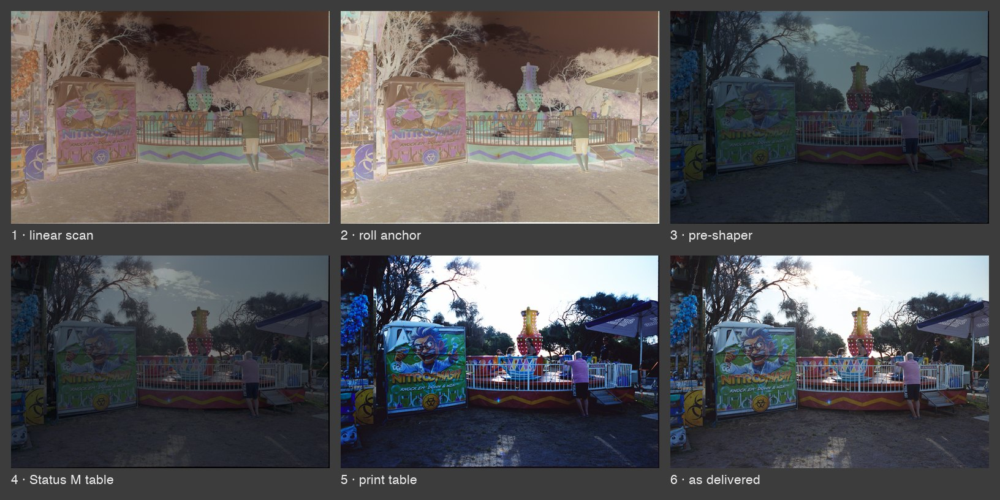

# Using the tables in DaVinci Resolve

This document covers everything between a developed roll and a graded image:
capturing the scan, measuring the roll, and the node chain for each of the
three film processes. The reasoning behind the transforms is in
[method.md](method.md), and every parameter is documented in
[PROJECT.md](../PROJECT.md).

[Installing the tables](#installing-the-tables) · [Scanning a roll](#scanning-a-roll) · [Resolve node chains](#resolve-node-chains) · [The print look is a choice](#the-print-look-is-a-choice)

> [!NOTE]
> **If Resolve is unfamiliar.** Grading in Resolve happens on the Color page,
> where processing is arranged as a chain of **nodes**, each applying one
> operation, connected left to right. Add a node to the end of the chain by
> pressing **Alt+S** (Option+S on macOS), or by right-clicking the node graph
> and choosing **Add Node → Serial**. A `.cube` table is applied to the
> selected node by right-clicking it and choosing the file from the **LUT**
> submenu. A `.dctl` file is applied by adding the **DaVinci CTL** effect to
> the node from the Effects library, then selecting the file from that
> effect's dropdown. The numbered lists below give one node each, in order.

---

## Installing the tables

Download the `.cube` files for the stock being graded from the
[latest release](../../../releases/latest); they are attached to the release
rather than committed because they total roughly 280 MB. Open **Project
Settings → Color Management**, use the **Open LUT Folder** button, copy the
`.cube` files and the contents of this repository's `dctl/` directory into the
folder that opens, return to Resolve and click **Update Lists**. In the same
settings page set **3D Lookup Table Interpolation** to **Tetrahedral**;
trilinear interpolation, the default in some versions, introduces visible
error on tables of this kind.

---

## Scanning a roll

### Capturing the frames

Each frame of the roll is captured as three exposures rather than one: the
light source's red, green and blue channels are fired one at a time, giving
three raw files per frame. The converter groups a roll's files into
consecutive R, G, B triplets sorted by the last number in the filename, the
frame counter, so the three captures of a frame must be made in that channel
order with nothing interleaved between them; flat frames named to the
converter are left out of the sequence wherever they sit.

Aperture, ISO and the LED drive level are fixed once and held for every
exposure of the roll and of its measurement sets: the anchoring step measures
density as a ratio between frames, and a change in any of the three breaks
the cancellation that ratio relies on. Where more or less light is needed,
change the shutter time, which is spectrally free. Each channel keeps one
exposure time for the whole roll, chosen so that the clear film base, the most
transmissive region of the roll, stays below sensor clipping; the three
channels' times need not match one another.

Four further frame sets accompany the roll, the first required:

- **The clear film reference**, for D-min: the developed clear leader for
  reversal film, an unexposed rebate or frame gap for a negative. Capture it
  at the roll's own per-channel exposure times, or the EXR-scale anchor
  values it yields are invalid.
- **Plain light**, optional: the gate empty, at the same LED drive level as
  the roll. It adds a datasheet-comparable density scale and the measured LED
  crosstalk to the anchor file; the values Resolve takes do not depend on it.
- **A D-max patch**, optional and diagnostic only: the unexposed rebate for
  reversal, the light-struck leader tip for a negative. A dense patch
  transmits little light, so lengthen its capture exposure, which the shutter
  normalisation divides out.
- **Flats**, optional: three captures made with no film in the gate, one per
  channel in R, G, B order, from which the converter fits a vignetting-only
  model of the illumination across the gate. Pass them as `--flats R G B`, or
  `--no-flats` to omit the correction. The converter also merges them as
  `plain.exr` in the export folder, ready to serve as the plain-light set.

Exposure time is otherwise free: it is read from each file and divided out,
so the frames of a measurement set may be exposed differently from one
another and from the roll.

### Converting and measuring

Two programs run before Resolve, in this order.

```
raw captures  →  raw_to_exr.py  →  linear EXRs      ─┐
                                                     ├→  Resolve
              →  roll_anchor_gui.py  →  Dmin R/G/B  ─┘
```

`engine/scan/raw_to_exr.py` converts the three narrowband exposures of each
frame into ZIP-compressed half-float linear EXR files, a precision of
approximately 0.0002 D. EXR is preferred to 32-bit float TIFF because Resolve
imports it unmodified, applying no implicit transform on the way in.

```bash
python3 engine/scan/raw_to_exr.py                    # interactive
python3 engine/scan/raw_to_exr.py --in-dir /path/to/roll --mode superpixel --no-flats
```

It accepts `.dng`, `.arw`, `.arq`, `.cr2`, `.cr3`, `.nef`, `.nrw` and `.raf`
(Bayer GFX bodies; X-Trans is refused). `--mode superpixel` serves ordinary
single-shot captures, binned 2×2 to half resolution, and `--mode pixelshift` a
per-site composite such as a Sony `.ARQ`, which retains full resolution. Files
are routed by what they contain rather than by extension, and a file whose
structure does not match the requested mode is refused with an explanation. A
sensor with no colour filter array, native or stripped, uses
`engine/scan/mono_to_exr.py` instead, which takes no mode and reads at full
resolution; everything downstream is identical.

`engine/scan/roll_anchor_gui.py` then measures the roll from the clear film
reference, with the plain-light set if one was captured, writes
`builds/anchors/<roll-id>.json`, and copies the values Resolve requires to the
clipboard.

```bash
python3 engine/scan/roll_anchor_gui.py               # fully graphical
```

Run with no arguments, it asks whether the frames are merged EXRs or raw
captures, collects them one LED channel at a time so that the order cannot be
scrambled, asks whether a plain-light set and a D-max patch are to be
measured, and opens one region-of-interest picker per frame set. Each picker
shows a log-scaled preview, a live histogram of the selected region, and a
warning when that region contains a second population of pixels, which is
what a film box or gate edge inside the box looks like; the measured boxes are
written into the anchor file as an audit record. Its raw-capture input reads
each LED's frame through the matching colour plane of the filter array and is
therefore a colour-sensor path; a monochrome roll is anchored from the merged
EXRs that `mono_to_exr.py` writes, which is the primary input in either case.
No ISO value is tested against a list, so any camera's base ISO is accepted;
ISO has to stay the same across a frame set, and a difference is warned
about. [PROJECT.md](../PROJECT.md) documents both programs under **Per-roll
anchoring** and the engine reference.

> [!WARNING]
> The anchor file reports D-min against two zero points when a plain-light
> set is supplied. Enter **`dmin_exr_scale`** into `RollAnchor_ScanPrep.dctl`
> when grading EXR files from `raw_to_exr.py`. The plain-light `dmin` values
> over-anchor the image: green and blue are driven past the pre-shaper's
> density-zero clamp, and the frame returns strongly yellow-green after
> decoding. On this apparatus the two scales differ by approximately +0.24,
> +0.58 and +0.93 D in R, G and B. The EXR-scale values are valid only if the
> anchor frames were exposed at the roll's own per-channel exposure and at
> the same ISO.

---

## Resolve node chains

Each process has its own chain, Vision3 has two, and the chains are **not
interchangeable**: the shaper pair, the corridor value and the table must all
correspond, and mixing elements between chains produces a plausible-looking
but incorrect image. Every path expects the same two things before node 1,
both from [Scanning a roll](#scanning-a-roll): the **linear EXR files**, and
this roll's **`dmin_exr_scale`** values entered into
`RollAnchor_ScanPrep.dctl`. Load every table on a node of its own, with
**tetrahedral** interpolation.

### C-41, colour negative

```
1  RollAnchor_ScanPrep.dctl        enter this roll's EXR-scale Dmin R/G/B
                                   (for C-41 this also removes the orange colouration)
2  Preshaper 3.3.dctl              VALUE_BOXes remain at 1.0, as anchoring is done upstream
3  <Stock>_StatusM.cube            scanner density to Status M
4  Print Adjustment.dctl           OPTIONAL; the defaults leave the image unchanged
5  <Stock>_to_<Paper>_DisplayP3.cube    Status M to RA-4 print to Display P3
6  grade
```

| Setting | What it means |
|---|---|
| **Corridor** | 3.30. The 3.3 shaper pair and both tables must agree on this value |
| **Paper pairing** | Kodak stocks use the Endura tables, Fujifilm stocks the Pro Laser tables |
| **One stock, both tables** | Mixing stocks between nodes 3 and 5 mis-tones the image without any visible warning, because each table encodes its own D-min and characteristic curve |
| **HDR** | Replace node 5 with the corresponding `…_P3D65_PQ203.cube` and set the timeline to P3-D65 ST2084. Same position, different table |
| **Node 4 placement** | If used, it must precede the print table, so that it drives the print in the manner of an enlarger rather than correcting the print afterwards |
| **Quality-control tap** | Stopping after node 3 and multiplying by 3.30 yields Status M density, directly comparable with the datasheet curves |

The output of node 5 is **Display P3 (D65), sRGB-encoded and clipped to
[0,1]**, as stated in every cube header: a display encoding rather than linear
data, replacing the postshaper and linearisation stages that the reversal
chain requires. Mid-grey arrives encoded: feeding the table a neutral k = 0.22
returns 0.4613, which is 18% grey carried through the sRGB transfer function.
Do not add a colour space transform after this node in the belief that its
output is scene-linear.

#### What each node does

One frame of Portra 400, written out as it arrives and again after each node
in the chain above. Panel 1 is the scan before any node, and panels 2 to 5
follow nodes 1, 2, 3 and 5 respectively; node 4, `Print Adjustment`, has no
panel of its own, because its defaults leave the image unchanged. The D-min
values are read from the roll's anchor measurement rather than from anything
in the picture.



1. **Linear scan.** The EXR as delivered by `raw_to_exr.py`. A negative,
   orange throughout.
2. **Roll anchor**, `RollAnchor_ScanPrep.dctl`. Each channel multiplied by
   10<sup>Dmin</sup>, which for this roll is ×1.799, ×2.006 and ×2.045. The
   film base now reads density 0.
3. **Preshaper**, `Preshaper 3.3.dctl`. Negative base-ten logarithm, divided
   by the 3.30 corridor, clamped to [0,1]. **The positive appears here.**
4. **Status M table**, `Portra400_StatusM.cube`. Scanner density mapped to
   Status M, the standard in which the datasheet curves are measured.
5. **Print table**, `Portra400_to_PortraEndura_DisplayP3.cube`. Status M
   density through RA-4 print emulation to Display P3.
6. **As delivered.** Panel 5 with the photographer's own `Print Adjustment`
   settings and grade applied, the gamma about the pivot lowered to soften
   contrast, as published under
   [Sample results](../README.md#sample-results).

Three things in that sequence are easy to misread from the node list alone.
**The inversion is the logarithm:** panels 1 and 2 are negatives, panel 3 is
a positive, and nothing between them inverts anything; density rises with
exposure, so taking −log₁₀ of transmittance produces a positive by definition,
and no stage in this project performs a tone flip. **The anchor is a
measurement, and it barely looks like anything:** its three gains share a
common factor of roughly 1.8, which is exposure normalisation, and only the
residual differences carry the orange removal, green and blue exceeding red
by 11.6% and 13.7% respectively. That is the entire mask correction for this
roll, and it is visually slight, which is why the sliders must be pasted from
the anchor engine rather than adjusted until the image looks neutral. **A
negative occupies little of the corridor:** this frame runs to a maximum
density of 2.15 against a corridor of 3.30, with a median of 0.53, so panels
3 and 4 are legitimately dark, and a further 0.33% of pixels read below the
roll's D-min and are clamped to zero, which is the pre-shaper behaving as
designed.

> [!NOTE]
> The roll's anchor measurement is committed beside the figure as
> [`figures/portra400-roll-anchor.json`](figures/portra400-roll-anchor.json).
> The 39 MB source EXR is not held in this repository, so the plate cannot be
> rebuilt from a clone alone.

### ECN-2, Kodak Vision3

The **ADX16 route** is the route for Vision3, an entry into an ACES timeline.
It lands the scan on ADX16 code values (SMPTE ST 2065-3) over Academy
Printing Density, the quantity a motion picture printer sees through the
negative, and continues through the Academy decode; once the printer-light
trims are dialled, the ACES rendering delivers a faithful, pleasing image
with no further grading. One table serves all four stocks.

```
1  RollAnchor_ScanPrep.dctl        enter this roll's EXR-scale Dmin R/G/B
2  Preshaper 3.3.dctl              VALUE_BOXes remain at 1.0
3  Vision3 to ADX16.cube           scanner density to ADX16 code values
4  Printer Lights ADX16.dctl       per-channel density trims, dialled on a known neutral
5  ADX decode                      input colour space ADX (16-bit), i.e. CSC.Academy.ADX16_to_ACES, into the ACES timeline
```

| Setting | What it means |
|---|---|
| **Corridor** | 3.30; nodes 1 and 2 are shared with the C-41 path |
| **One table, four stocks** | 50D, 200T, 250D and 500T all use the same table, built on the family-average dye basis. The stock enters only through the printer-light trims |
| **Printer lights** | In practice these are required: the Academy decode reads the negative against a reference-film assumption this stock does not meet, so a raw decode carries a balance offset and a grey-axis channel spread. No datasheet presets exist for this chain; dial once per stock and rig on a known neutral |
| **Accuracy** | Lossy by construction: grey-balanced ColorChecker dE2000 6–7 against the scene-linear route, with effective contrast 0.92–0.99 of the scene's and a grey-axis channel spread of 6–18% at mid-grey, the larger figures on the stocks whose orange mask departs most from the family average the one table carries. The scene-linear route below is the accuracy reference and the choice for graded work; this chain is the route for its finished rendering |
| **Print look** | Optional: Resolve's built-in "LMT Kodak 2383 Print Film Emulation" may be enabled in the ACES timeline after node 5, for a print-through look. It ships with Resolve, not with this repository |

The **scene-linear route** is the secondary, scene-referred path, for graded
work: each stock's own table inverts that stock's characteristic curves and
delivers scene-linear DaVinci Wide Gamut. The two chains fork only at node 3,
and the table must match the film in the scanner.

```
1  RollAnchor_ScanPrep.dctl             enter this roll's EXR-scale Dmin R/G/B
2  Preshaper 3.3.dctl                   VALUE_BOXes remain at 1.0
3  Vision3 <Stock> to Scene DWG.cube    scanner density to scene-linear DaVinci Wide Gamut
4  display transform                    CST (DaVinci Wide Gamut / Linear to timeline), then grade
```

| Setting | What it means |
|---|---|
| **Corridor** | 3.30; nodes 1 and 2 are identical to the ADX16 chain |
| **Per stock** | `Vision3 50D`, `200T`, `250D` and `500T` each have their own table, diverging through their characteristic curves and spectral sensitivities. Another stock's table mis-tones the image without any visible warning |
| **No postshaper, no printer lights** | The table's output is scene-linear, negatives permitted; nothing downstream re-encodes to density. Exposure and balance trims belong after node 3, in linear, or in the graded timeline |
| **Balance illuminant** | Each table renders its stock under the illuminant it is balanced for, D55 for the daylight stocks and 3200 K tungsten for 200T and 500T, Bradford-adapted to D65. A tungsten stock shot under tungsten light therefore decodes neutral with no correction, and a daylight stock shot under tungsten returns warm, as the film recorded it |
| **Mid-grey anchor** | The datasheet's midscale neutral decodes to 0.18 in DWG linear; residual uncertainty in that anchor is a uniform per-stock exposure trim, never a colour cast |
| **HDR** | No separate table. The output is linear, so the CST at node 4 targets whichever timeline is in use, P3-D65 ST2084 included |

### E-6, reversal film

```
1  RollAnchor_ScanPrep.dctl        enter this roll's EXR-scale Dmin R/G/B
2  Preshaper 5.0.dctl              match the pair to the table, see below
3  <Stock>_XYZ_D50.cube            scanner density to white-relative D50 XYZ
4  Postshaper 5.0.dctl             × 5.0, returning to density
5  Density to Linear.dctl          10^-D; leave its trims at their defaults here
6  XYZ D50 to DWG.dctl             an explicit 3×3; do NOT substitute a Resolve CST
7  grade
```

| Setting | What it means |
|---|---|
| **Corridor** | **5.0** for the published tables, which are built for a monochrome sensor, and **5.25** for this project's own a7R III build. The two are not interchangeable, and the pre- and postshaper must match the table: a mismatch rescales density silently. Narrowband scan density exceeds the film's Status A density, so a corridor must never be inferred from physical D-max. A table rebuilt for another camera needs its own value, which `reversal_transform.py` prints on every build |
| **Why not a CST at node 6** | The table's output is *white-relative* XYZ rather than true CIE XYZ, so Resolve's colour space transform cannot convert it correctly whatever its white-adaptation setting reports |
| **Where trims belong** | After node 6, rather than on XYZ channels, which is why the built-in offsets in node 5 remain at their defaults |

> [!NOTE]
> Every node between the pre-shaper and the linearisation node appears inverted
> or negative on the viewer. This is expected: the image is in density space at
> that point and has not yet been rendered.

## The print look is a choice

The pairing rule, Kodak to Endura and Fujifilm to Pro Laser, is what makes the
print *metrically* faithful: it reproduces the paper a laboratory would have
used. It carries no obligation. Crossing the pairing deliberately,
substituting a print-emulation LUT of another design, or omitting the print
stage and grading from density are legitimate choices; the claim that the
output corresponds to a specific paper is forfeited, and nothing upstream is
affected. Within the pairing the cubes render an idealised print, with no
enlarger veiling flare, surface glare or viewing surround
([method.md](method.md#simulating-the-darkroom)), so the rendered contrast
sits above that of a print in the hand, and `Print Adjustment` at node 4 is
the intended place to bring it to taste; a Gamma below 1.0 there is ordinary
use.

Stopping before the print stage yields the following in each process:

| Process | Without print emulation |
|---|---|
| **C-41** | Node 3 multiplied by 3.30 is Status M density, a defined and published metric, though not a viewable image. Grading from it is a deliberate choice, and the inversion and the look then fall to the colourist to supply |
| **ECN-2** | Neither route bakes in a print stage. On the ADX16 route the Academy decode at node 5 lands the negative in ACES, where Resolve's own "LMT Kodak 2383 Print Film Emulation" is the optional print look; the scene-linear route delivers the scene at node 3, ready to grade |
| **E-6** | There is no print stage. Reversal film is viewed directly, so the chain is colorimetric throughout |

---

The reasoning behind each stage is set out in [method.md](method.md), and every
parameter of every node, together with the known systematics of the pipeline,
is documented in [PROJECT.md](../PROJECT.md).
